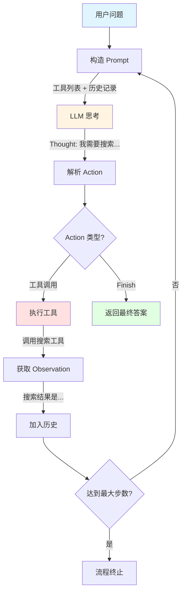
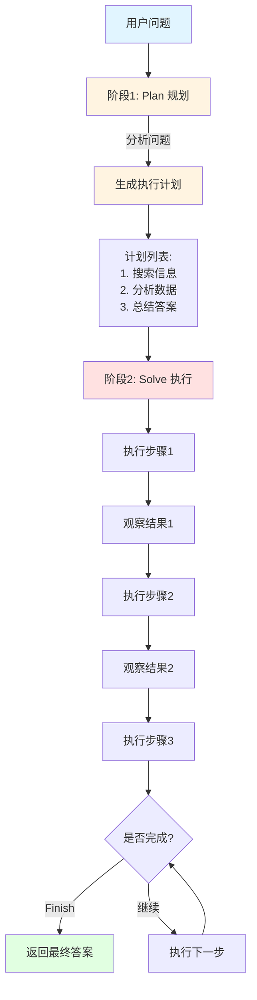
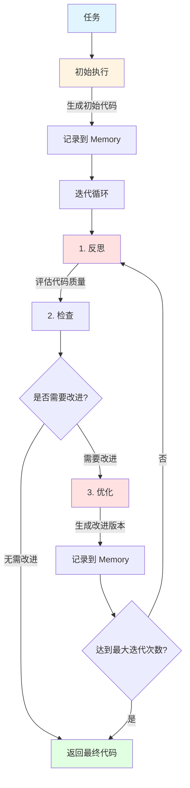
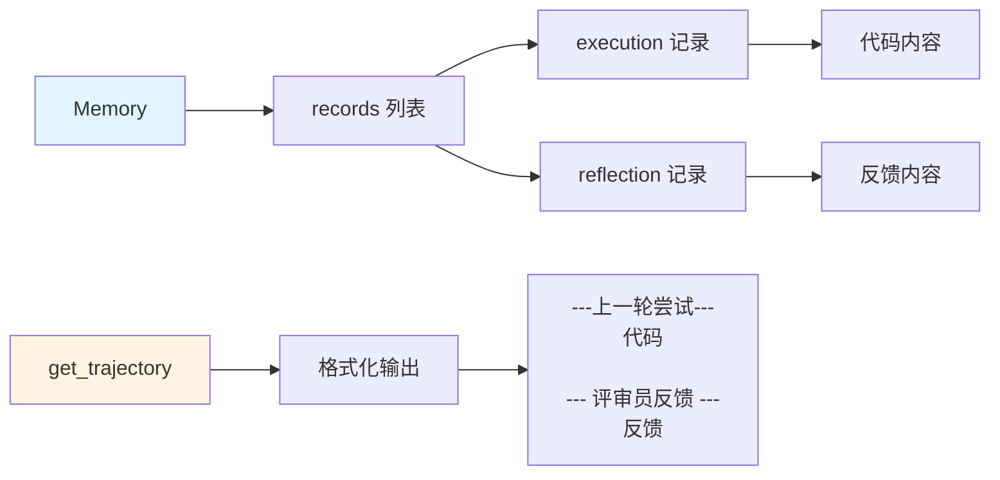
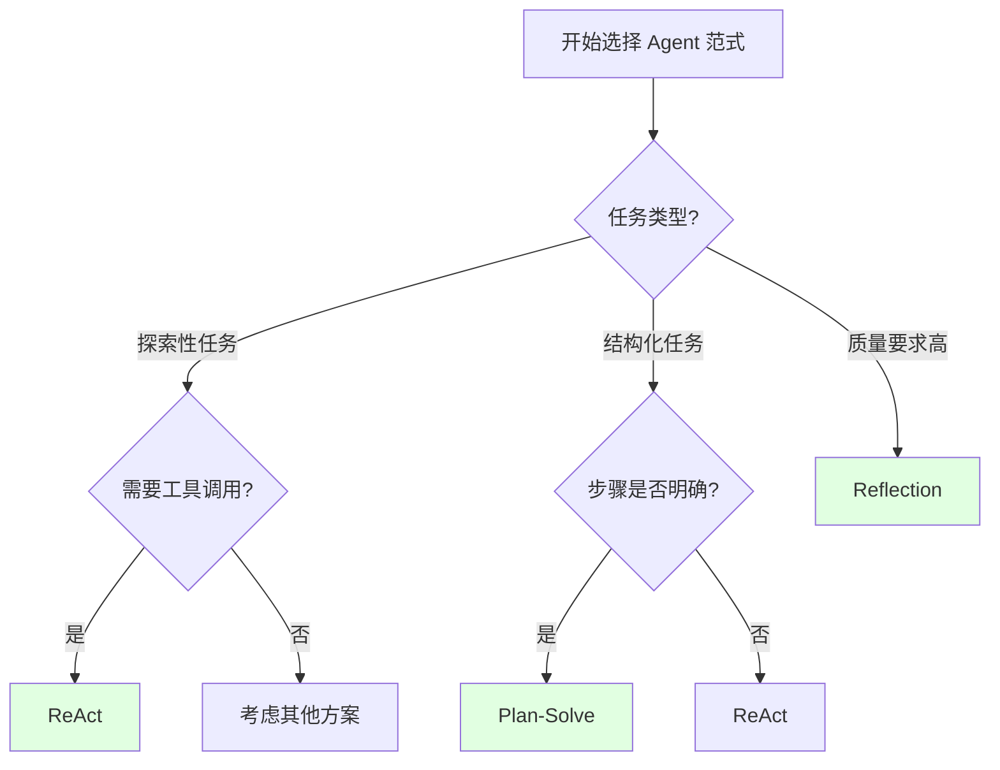

# Agent 经典范式对比

> 本文档总结了三种经典的 Agent 架构范式：ReAct、Plan-Solve、Reflection

## 概览对比

| 范式 | 核心思想 | 工作流程 | 适用场景 | 优点 | 缺点 |
|-----|---------|---------|---------|------|------|
| **ReAct** | 推理+行动交替 | Thought → Action → Observation → 循环 | 需要工具调用的探索性任务 | 灵活、适应性强 | 可能走弯路 |
| **Plan-Solve** | 先规划后执行 | Plan → Execute Step by Step | 结构化、多步骤任务 | 思路清晰、可控 | 计划可能不准确 |
| **Reflection** | 自我反思改进 | Execute → Reflect → Refine → 循环 | 对准确性要求高的任务 | 质量高、自我改进 | 耗时较长 |

## 1. ReAct (Reasoning + Acting)

### 核心思想

**边想边做**：推理（Reasoning）和行动（Acting）交替进行，通过观察结果来指导下一步行动。

### 架构图



### 关键组件

```python
class ReactAgent:
    def __init__(self, llm_client, tool_executor, max_steps=5):
        self.llm_client = llm_client      # 大脑：思考和决策
        self.tool_executor = tool_executor # 手脚：执行工具
        self.max_steps = max_steps         # 防止无限循环
        self.history = []                  # 记忆：历史记录
```

### 工作流程

1. **构造 Prompt**：包含工具列表、问题、历史记录
2. **LLM 思考**：输出 Thought 和 Action
3. **解析 Action**：提取工具名称和参数
4. **执行工具**：调用外部工具获取结果
5. **记录 Observation**：将结果加入历史
6. **循环**：重复 1-5，直到 Finish 或达到最大步数

### 示例输出

```
--- 第 1 步 ---
思考：我需要搜索英伟达最新的GPU信息
行动：Search[英伟达最新GPU]
观察：英伟达最新发布了 RTX 5090...

--- 第 2 步 ---
思考：我已经获得了答案
行动：Finish[RTX 5090]
最终答案：RTX 5090
```

### 适用场景

- 需要多次工具调用的任务
- 探索性问题（不确定需要几步）
- 需要根据中间结果调整策略

### 优缺点

**优点：**
- 灵活性高，能根据实际情况调整
- 适合探索性任务
- 实现相对简单

**缺点：**
- 可能走弯路，效率不高
- 缺乏全局规划
- 依赖 LLM 的即时决策能力

## 2. Plan-Solve (先规划后执行)

### 核心思想

**先想后做**：先制定完整的执行计划，再按计划逐步执行。

### 架构图



### 关键组件

```python
class PlanSolveAgent:
    def __init__(self, llm_client, tool_executor, max_steps=10):
        self.planner = Planner(llm_client)    # 规划器：制定计划
        self.solver = Solver(llm_client, tool_executor)  # 执行器：执行计划
        self.plan = []                        # 计划列表
        self.history = []                     # 执行历史
```

### 工作流程

**阶段1：Plan（规划）**
1. 分析问题
2. 生成步骤列表
3. 输出完整计划

**阶段2：Solve（执行）**
1. 按计划逐步执行
2. 每步可以调用工具
3. 记录执行结果
4. 继续下一步

### 示例输出

```
【阶段1：制定计划】
📋 生成的执行计划：
  1. 使用搜索工具查询英伟达最新GPU信息
  2. 分析搜索结果，提取GPU型号
  3. 总结并返回答案

【阶段2：执行计划】
--- 执行步骤 1/3 ---
📌 当前步骤：使用搜索工具查询英伟达最新GPU信息
💭 思考：需要搜索最新的GPU发布信息
🔧 行动：Search[英伟达最新GPU 2024]
👁️ 观察：英伟达在2024年发布了RTX 5090...

--- 执行步骤 2/3 ---
📌 当前步骤：分析搜索结果，提取GPU型号
💭 思考：从搜索结果中提取型号
🔧 行动：Finish[RTX 5090]
✅ 获得最终答案
```

### 适用场景

- 结构化、多步骤任务
- 需要全局规划的复杂问题
- 步骤相对明确的任务

### 优缺点

**优点：**
- 思路清晰，有全局视角
- 步骤可控，易于调试
- 适合复杂的多步骤任务

**缺点：**
- 计划可能不准确
- 灵活性较差
- 如果计划错误，整个流程可能失败

## 3. Reflection (自我反思)

### 核心思想

**做了再想**：执行 → 反思 → 优化的自我改进循环，通过反馈不断提升质量。

### 架构图（原始论文）


*图片来源：Reflection 论文架构图*

### 流程图（实现版本）



**Memory 结构：**



### 关键组件

```python
class ReflectionAgent:
    def __init__(self, llm_client, max_iterations=3):
        self.llm_client = llm_client      # LLM 客户端
        self.memory = Memory()            # 记忆系统：存储执行和反馈
        self.max_iterations = max_iterations  # 最大迭代次数
```

**Memory 结构：**
```python
class Memory:
    def __init__(self):
        self.records = []  # 存储 execution 和 reflection 记录
    
    def get_trajectory(self):
        """格式化历史记录为 Prompt"""
        # 返回：
        # ---上一轮尝试---
        # [代码]
        # 
        # --- 评审员反馈 ---
        # [反馈]
```

### 工作流程

1. **初始执行**：生成初始代码
2. **反思**：评估代码质量，找出问题
3. **检查**：判断是否需要改进
4. **优化**：基于反馈生成改进版本
5. **循环**：重复 2-4，直到"无需改进"或达到最大迭代次数

### 示例输出

```
--- 开始处理任务 ---
任务: 编写一个函数，判断一个数是否为质数

--- 正在进行初始尝试 ---
初始代码:
def is_prime(n):
    for i in range(2, n):
        if n % i == 0:
            return False
    return True

--- 第 1/3 轮迭代 ---
-> 正在进行反思...
反馈: 算法效率低，时间复杂度O(n)，建议优化到O(√n)

-> 正在进行优化...
优化后代码:
def is_prime(n):
    if n < 2:
        return False
    for i in range(2, int(n**0.5) + 1):
        if n % i == 0:
            return False
    return True

--- 第 2/3 轮迭代 ---
-> 正在进行反思...
反馈: 无需改进

✅ 反思认为代码已无需改进，任务完成。
```

### 适用场景

- 对准确性、质量要求高的任务
- 代码生成、文本优化等需要迭代改进的任务
- 有明确评估标准的任务

### 优缺点

**优点：**
- 输出质量高
- 自我改进能力强
- 适合需要精雕细琢的任务

**缺点：**
- 耗时较长（多次 LLM 调用）
- 需要好的评估标准
- 可能陷入局部最优

## 三种范式的对比总结

### 整体流程对比

```mermaid
graph TB
    subgraph ReAct["ReAct: 边想边做"]
        R1[问题] --> R2[思考]
        R2 --> R3[行动]
        R3 --> R4[观察]
        R4 --> R2
        R4 --> R5[完成]
    end
    
    subgraph PlanSolve["Plan-Solve: 先想后做"]
        P1[问题] --> P2[制定计划]
        P2 --> P3[执行步骤1]
        P3 --> P4[执行步骤2]
        P4 --> P5[执行步骤3]
        P5 --> P6[完成]
    end
    
    subgraph Reflection["Reflection: 做了再想"]
        F1[任务] --> F2[初始执行]
        F2 --> F3[反思]
        F3 --> F4[优化]
        F4 --> F3
        F4 --> F5[完成]
    end
    
    style R2 fill:#fff4e1
    style R3 fill:#ffe1e1
    style P2 fill:#fff4e1
    style P3 fill:#ffe1e1
    style F3 fill:#ffe1e1
    style F4 fill:#fff4e1
```



### 决策方式

| 范式 | 决策方式 | 类比 |
|-----|---------|------|
| ReAct | 即时决策 | 边走边看的探险家 |
| Plan-Solve | 预先规划 | 按地图行走的旅行者 |
| Reflection | 事后反思 | 不断修改的作家 |

### 适用任务类型

```
探索性任务 ────────→ ReAct
    ↓
结构化任务 ────────→ Plan-Solve
    ↓
高质量任务 ────────→ Reflection
```

### 效率 vs 质量

```
效率高 ←──────────────────→ 质量高
  ↑                           ↑
ReAct                    Reflection
  ↑                           ↑
  └────── Plan-Solve ─────────┘
         (平衡点)
```

### 实现复杂度

```
简单 ←──────────────────→ 复杂
  ↑                        ↑
ReAct                 Reflection
  ↑                        ↑
  └──── Plan-Solve ────────┘
```

## 如何选择？

### 决策流程图



### 选择 ReAct 当：
- ✅ 需要多次工具调用
- ✅ 任务步骤不确定
- ✅ 需要根据中间结果调整策略
- ✅ 追求灵活性

### 选择 Plan-Solve 当：
- ✅ 任务步骤相对明确
- ✅ 需要全局规划
- ✅ 多步骤复杂任务
- ✅ 追求可控性

### 选择 Reflection 当：
- ✅ 对质量要求高
- ✅ 需要迭代改进
- ✅ 有明确的评估标准
- ✅ 追求准确性

## 混合使用

实际应用中，可以组合使用：

### ReAct + Reflection
```python
# 用 ReAct 探索解决方案
initial_solution = react_agent.run(question)

# 用 Reflection 优化质量
final_solution = reflection_agent.run(initial_solution)
```

### Plan-Solve + Reflection
```python
# 用 Plan-Solve 执行计划
plan_result = plan_solve_agent.run(question)

# 用 Reflection 检查和改进
final_result = reflection_agent.refine(plan_result)
```

## 核心代码对比

### ReAct 核心循环
```python
while current_step < max_steps:
    # 1. 构造 Prompt（包含历史）
    prompt = build_prompt(tools, question, history)
    
    # 2. LLM 思考
    response = llm(prompt)
    
    # 3. 解析并执行 Action
    action = parse_action(response)
    observation = execute_tool(action)
    
    # 4. 加入历史
    history.append(f"Action: {action}")
    history.append(f"Observation: {observation}")
```

### Plan-Solve 核心流程
```python
# 阶段1：规划
plan = planner.plan(question, tools)

# 阶段2：执行
for step in plan:
    thought, action, observation = solver.solve_step(
        question, plan, step, history
    )
    history.append(observation)
```

### Reflection 核心循环
```python
# 初始执行
code = llm(initial_prompt)
memory.add_record("execution", code)

# 迭代优化
for i in range(max_iterations):
    # 反思
    feedback = llm(reflection_prompt)
    memory.add_record("reflection", feedback)
    
    # 检查
    if "无需改进" in feedback:
        break
    
    # 优化
    trajectory = memory.get_trajectory()
    improved_code = llm(refine_prompt + trajectory)
    memory.add_record("execution", improved_code)
```

## 参考资料

- [ReAct 论文](https://arxiv.org/abs/2210.03629) - Synergizing Reasoning and Acting in Language Models
- [Plan-and-Solve 论文](https://arxiv.org/abs/2305.04091) - Plan-and-Solve Prompting
- [Reflection 论文](https://arxiv.org/abs/2303.11366) - Reflexion: Language Agents with Verbal Reinforcement Learning
- [Hello-Agents 教程](https://github.com/datawhalechina/hello-agents) - Datawhale 智能体学习教程

---

**最后更新：** 2026-01-19

**相关文档：**
- [Agent 本质理解](../../tips/02-Agent本质理解.md)
- [Prompt 工程技巧](../../tips/01-Prompt工程技巧.md)
