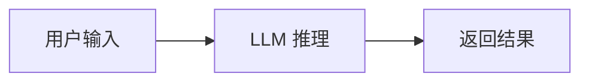
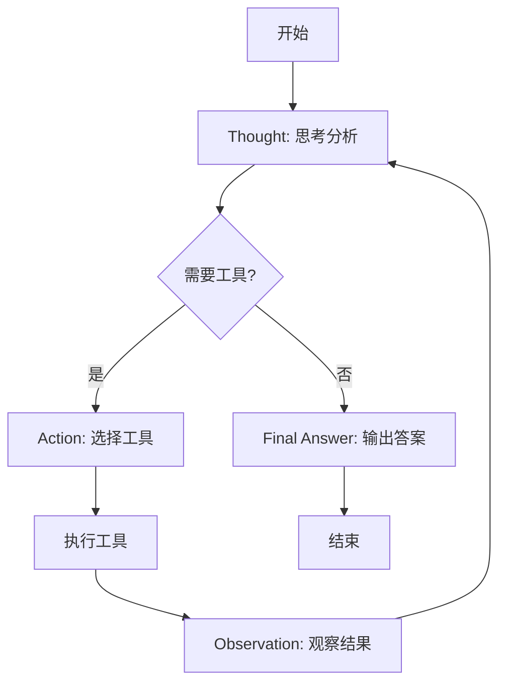
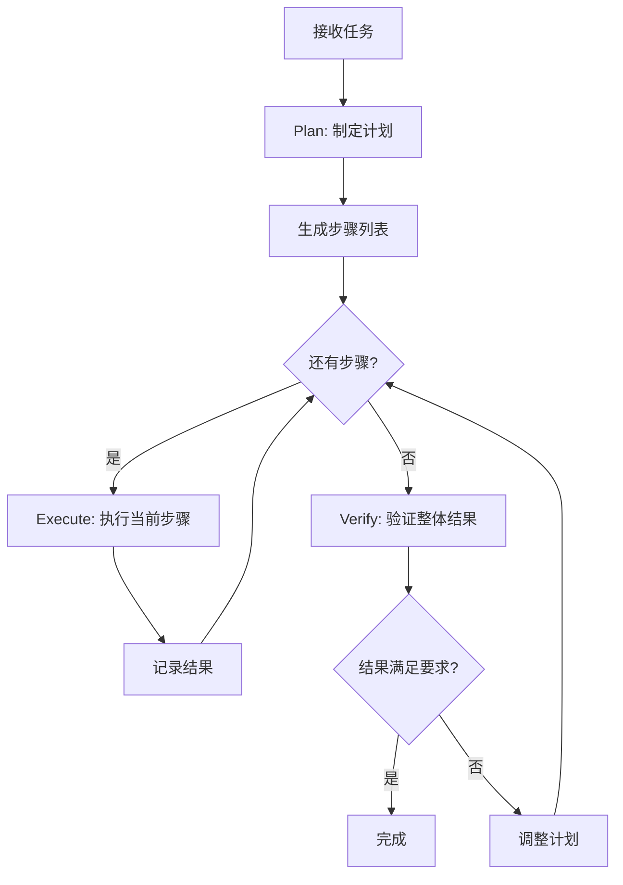
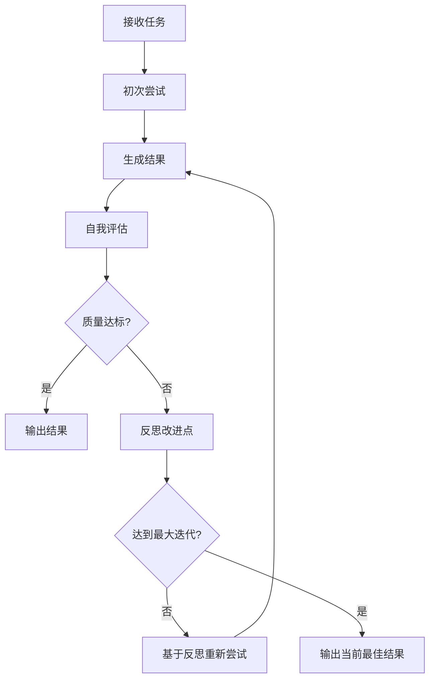
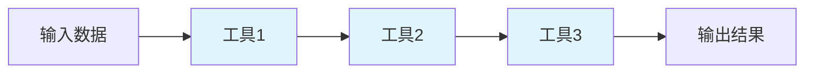

# HelloAgents 学习笔记

> 本笔记用于记录学习 HelloAgents 框架的核心知识点和实践经验

---

## 🎯 详细学习笔记

**已为你创建了详细的代码分析笔记，包含完整的实现细节！**

📁 **详细笔记目录**: [`notes/`](./notes/)

### 核心模块详解
- 📘 [LLM 模块详解](./notes/01_LLM模块详解.md) - OpenAI 兼容接口、多厂商支持、流式响应
- 📘 [消息系统详解](./notes/02_消息系统详解.md) - Message 类、Pydantic 基础、消息管理
- 📘 [Agent 基类详解](./notes/03_Agent基类详解.md) - 抽象基类设计、历史管理、自定义 Agent

### Agent 模式详解
- 📗 [Simple Agent 详解](./notes/04_SimpleAgent详解.md) - 基础实现、工具调用（待完成）
- 📗 [ReAct Agent 详解](./notes/05_ReActAgent详解.md) - ReAct 范式、完整流程（待完成）
- 📗 [工具系统详解](./notes/07_工具系统详解.md) - 工具设计、注册机制（待完成）

### 学习指南
- 📙 [学习路线指南](./notes/08_学习路线指南.md) - 推荐学习路径、实战项目（待完成）

**💡 提示**: 详细笔记包含完整的代码分析、流程图、实战示例和学习检查清单！

---

## 📋 目录

- [项目概览](#项目概览)
- [核心架构](#核心架构)
- [Agent 模式详解](#agent-模式详解)
- [工具系统](#工具系统)
- [实战经验](#实战经验)

---

## 项目概览

### 项目结构
```
hello_agents/
├── core/           # 核心组件
├── agents/         # Agent 实现
├── tools/          # 工具系统
└── examples/       # 示例代码
```

### 技术栈
- **LLM SDK**: OpenAI (兼容多厂商)
- **设计模式**: 策略模式、装饰器模式、注册模式
- **核心能力**: 流式响应、工具调用、多轮对话

---

## 核心架构

### 1. LLM 统一接口 (`core/llm.py`)

#### 核心设计理念
- **参数优先，环境变量兜底**
- **流式响应为默认**
- **支持多厂商自动检测**

#### OpenAI 兼容接口的秘密
```python
# 关键：通过 base_url 切换不同厂商
client = OpenAI(
    api_key=self.api_key,
    base_url=self.base_url,  # 这是关键！
    timeout=self.timeout
)
```

#### 已支持的厂商 ✅
| Provider | base_url | 默认模型 | 状态 |
|----------|----------|----------|------|
| OpenAI | `https://api.openai.com/v1` | gpt-3.5-turbo | ✅ |
| DeepSeek | `https://api.deepseek.com` | deepseek-chat | ✅ |
| 通义千问 | `https://dashscope.aliyuncs.com/compatible-mode/v1` | qwen-plus | ✅ |
| Kimi | `https://api.moonshot.cn/v1` | moonshot-v1-8k | ✅ |
| 智谱GLM | `https://open.bigmodel.cn/api/paas/v4` | glm-4 | ✅ |
| Ollama | `http://localhost:11434/v1` | llama3.2 | ✅ |
| vLLM | `http://localhost:8000/v1` | meta-llama/Llama-2-7b-chat-hf | ✅ |
| ModelScope | `https://api-inference.modelscope.cn/v1/` | Qwen/Qwen2.5-72B-Instruct | ✅ |

#### 待支持的厂商 🚧
| Provider | 接口类型 | 优先级 | 备注 |
|----------|----------|--------|------|
| Anthropic (Claude) | 独立 API | ⭐⭐⭐ | 需要单独实现，消息格式不同 |
| Google (Gemini) | Google AI API | ⭐⭐⭐ | 使用 `google-generativeai` SDK |
| 文心一言 | 百度千帆 | ⭐⭐ | 使用 `qianfan` SDK |
| 讯飞星火 | WebSocket | ⭐ | 协议特殊，实现复杂 |
| 腾讯混元 | 腾讯云 SDK | ⭐ | 需要腾讯云认证 |
| 零一万物 (Yi) | OpenAI 兼容 | ⭐⭐ | 可能已兼容，待测试 |
| 阶跃星辰 (Step) | OpenAI 兼容 | ⭐⭐ | 可能已兼容，待测试 |
| MiniMax | OpenAI 兼容 | ⭐ | 可能已兼容，待测试 |
| 百川 (Baichuan) | OpenAI 兼容 | ⭐ | 可能已兼容，待测试 |

#### 学习要点
- [ ] 理解 OpenAI 接口为何成为行业标准
- [ ] 掌握自动检测 provider 的逻辑
- [ ] 了解流式响应的实现方式
- [ ] 环境变量的优先级设计

#### 代码片段记录
```python
# 流式响应的核心实现
def think(self, messages, temperature=None):
    response = self._client.chat.completions.create(
        model=self.model,
        messages=messages,
        stream=True,  # 开启流式
    )
    for chunk in response:
        content = chunk.choices[0].delta.content or ""
        if content:
            yield content
```

---

### 2. 消息系统 (`core/message.py`)

#### 消息格式
```python
# 标准消息结构
{
    "role": "user" | "assistant" | "system",
    "content": "消息内容"
}
```

#### 学习要点
- [ ] 不同角色的消息作用
- [ ] 消息历史的管理方式
- [ ] System Prompt 的设计技巧

---

### 3. Agent 基类 (`core/agent.py`)

#### 核心职责
- 管理对话历史
- 协调 LLM 调用
- 处理工具执行

#### 学习要点
- [ ] Agent 的生命周期
- [ ] 消息流转机制
- [ ] 状态管理方式

---

## Agent 模式详解

### 1. Simple Agent (`agents/simple_agent.py`)

#### 特点
- 最基础的对话 Agent
- 直接调用 LLM，无工具能力
- 适合简单问答场景

#### 核心流程


#### 学习要点
- [ ] 基础对话循环的实现
- [ ] Prompt 设计基础
- [ ] 流式输出处理

#### 适用场景
- 

#### 实践笔记
```
日期: 
实践内容: 
遇到的问题: 
解决方案: 
```

---

### 2. ReAct Agent (`agents/react_agent.py`)

#### 核心思想
**ReAct = Reasoning (推理) + Acting (行动)**

#### 工作流程


#### Prompt 设计要点
```
你可以使用以下工具：
- tool1: 描述
- tool2: 描述

请按以下格式思考：
Thought: 我需要...
Action: tool_name
Action Input: {"param": "value"}
Observation: [工具返回结果]
... (重复)
Final Answer: 最终答案
```

#### 学习要点
- [ ] ReAct 循环的实现逻辑
- [ ] 如何解析 LLM 输出的 Action
- [ ] 工具调用的错误处理
- [ ] 最大循环次数的控制

#### 适用场景
- 需要多步推理的任务
- 需要调用外部工具的场景
- 复杂问题分解

#### 实践笔记
```
日期: 
实践内容: 
遇到的问题: 
解决方案: 
```

---

### 3. Plan-Solve Agent (`agents/plan_solve_agent.py`)

#### 核心思想
**先规划，再执行**

#### 工作流程


#### 学习要点
- [ ] 如何让 LLM 生成结构化计划
- [ ] 计划的存储与管理
- [ ] 计划执行的监控
- [ ] 计划调整机制

#### 适用场景
- 复杂的多步骤任务
- 需要全局优化的场景
- 任务依赖关系明确

#### 实践笔记
```
日期: 
实践内容: 
遇到的问题: 
解决方案: 
```

---

### 4. Reflection Agent (`agents/reflection_agent.py`)

#### 核心思想
**自我反思与优化**

#### 工作流程


#### 学习要点
- [ ] 如何设计反思 Prompt
- [ ] 评估标准的定义
- [ ] 迭代优化的终止条件
- [ ] 避免无限循环

#### 适用场景
- 需要高质量输出的场景
- 创意类任务
- 代码生成与优化

#### 实践笔记
```
日期: 
实践内容: 
遇到的问题: 
解决方案: 
```

---

### 5. Function Call Agent (`agents/function_call_agent.py`)

#### 核心思想
**使用 LLM 原生的 Function Calling 能力**

#### 与 ReAct 的区别
| 特性 | ReAct | Function Call |
|------|-------|---------------|
| 实现方式 | Prompt 工程 | LLM 原生能力 |
| 可靠性 | 依赖 Prompt | 更稳定 |
| 灵活性 | 更灵活 | 受 LLM 限制 |

#### 学习要点
- [ ] Function Schema 的定义
- [ ] 函数调用的解析
- [ ] 多函数并行调用
- [ ] 函数调用结果的处理

#### 适用场景
- 支持 Function Calling 的 LLM
- 需要高可靠性的场景
- 工具调用频繁的应用

#### 实践笔记
```
日期: 
实践内容: 
遇到的问题: 
解决方案: 
```

---

## 工具系统

### 1. 工具基类 (`tools/base.py`)

#### 核心概念
```python
class Tool:
    name: str           # 工具名称
    description: str    # 工具描述
    parameters: dict    # 参数定义
    
    def execute(self, **kwargs):
        # 执行逻辑
        pass
```

#### 学习要点
- [ ] 工具的标准接口设计
- [ ] 参数验证机制
- [ ] 错误处理规范
- [ ] 工具装饰器的使用

---

### 2. 工具注册 (`tools/registry.py`)

#### 注册模式
```python
# 装饰器注册
@register_tool
def my_tool(param1: str) -> str:
    """工具描述"""
    return result
```

#### 学习要点
- [ ] 注册表模式的实现
- [ ] 工具的动态加载
- [ ] 工具的查找与调用
- [ ] 工具冲突处理

---

### 3. 工具链 (`tools/chain.py`)

#### 核心思想
**将多个工具串联成工作流**



#### 学习要点
- [ ] 工具链的编排方式
- [ ] 数据在工具间的传递
- [ ] 工具链的错误处理
- [ ] 条件分支的实现

---

### 4. 异步执行器 (`tools/async_executor.py`)

#### 核心价值
- 提升工具执行效率
- 支持并发调用
- 超时控制

#### 学习要点
- [ ] 异步执行的实现
- [ ] 并发控制策略
- [ ] 超时处理机制
- [ ] 结果聚合方式

---

## 实战经验

### 常见问题与解决方案

#### 1. LLM 调用失败
**问题**: 
**原因**: 
**解决**: 

#### 2. 工具调用解析错误
**问题**: 
**原因**: 
**解决**: 

#### 3. 流式输出中断
**问题**: 
**原因**: 
**解决**: 

---

### 最佳实践

#### Prompt 设计
- [ ] 明确角色定位
- [ ] 提供清晰的示例
- [ ] 定义输出格式
- [ ] 设置约束条件

#### 工具设计
- [ ] 单一职责原则
- [ ] 清晰的参数定义
- [ ] 完善的错误处理
- [ ] 详细的文档说明

#### 性能优化
- [ ] 使用流式响应
- [ ] 合理设置 max_tokens
- [ ] 工具并行执行
- [ ] 缓存常用结果

---

### 扩展方向

#### 可以尝试的改进
- [ ] 添加更多 LLM 厂商支持 (Anthropic, Google)
- [ ] 实现工具调用的缓存机制
- [ ] 添加 Agent 性能监控
- [ ] 实现多 Agent 协作
- [ ] 添加记忆系统
- [ ] 实现 Agent 的可视化调试

---

## 学习进度

- [ ] 理解核心架构
- [ ] 掌握 LLM 统一接口
- [ ] 学习 Simple Agent
- [ ] 学习 ReAct Agent
- [ ] 学习 Plan-Solve Agent
- [ ] 学习 Reflection Agent
- [ ] 学习 Function Call Agent
- [ ] 掌握工具系统
- [ ] 完成实战项目

---

## 参考资源

### 论文
- ReAct: Synergizing Reasoning and Acting in Language Models
- Plan-and-Solve Prompting
- Reflexion: Language Agents with Verbal Reinforcement Learning

### 相关项目
- LangChain
- AutoGPT
- BabyAGI

### 学习资料
- OpenAI API 文档
- LangChain 文档

---

## 更新日志

### 2026-01-24
- 创建学习笔记框架
- 完成项目结构梳理
- 添加核心概念说明

---

**持续更新中...**
