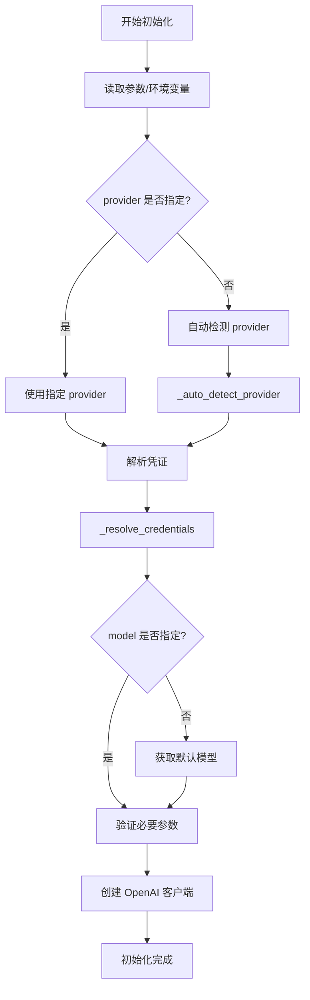
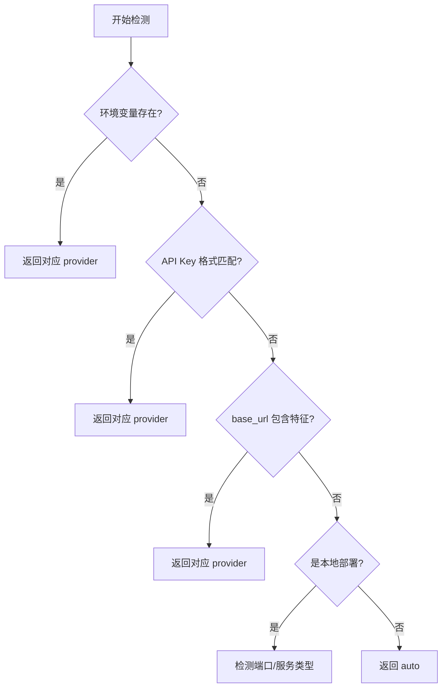
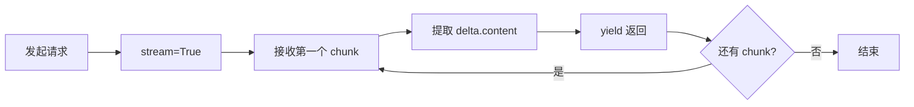

# LLM 模块详解 (`core/llm.py`)

> 深入理解 HelloAgents 的 LLM 统一接口实现

---

## 📚 目录

- [模块概述](#模块概述)
- [核心设计理念](#核心设计理念)
- [类结构分析](#类结构分析)
- [关键方法详解](#关键方法详解)
- [厂商支持机制](#厂商支持机制)
- [实战示例](#实战示例)
- [常见问题](#常见问题)

---

## 模块概述

### 文件位置
`hello_agents/core/llm.py`

### 主要功能
- 提供统一的 LLM 调用接口
- 支持多个 LLM 厂商（通过 OpenAI 兼容接口）
- 自动检测和配置不同的 LLM 提供商
- 支持流式和非流式两种响应模式

### 核心类
- `HelloAgentsLLM` - LLM 客户端封装类

---

## 核心设计理念

### 1. 参数优先，环境变量兜底

```python
# 优先使用传入参数
self.model = model or os.getenv("LLM_MODEL_ID")
self.api_key = api_key or os.getenv("LLM_API_KEY")
self.base_url = base_url or os.getenv("LLM_BASE_URL")
```

**设计意图**：
- 灵活性：允许运行时动态配置
- 便利性：支持环境变量配置，避免硬编码
- 优先级：显式参数 > 环境变量 > 默认值

### 2. 流式响应为默认

```python
def think(self, messages, temperature=None) -> Iterator[str]:
    response = self._client.chat.completions.create(
        model=self.model,
        messages=messages,
        stream=True,  # 默认开启流式
    )
    for chunk in response:
        content = chunk.choices[0].delta.content or ""
        if content:
            yield content
```

**为什么默认流式？**
- ✅ 更好的用户体验（实时反馈）
- ✅ 降低感知延迟
- ✅ 适合长文本生成

### 3. OpenAI 兼容接口的秘密

**核心原理**：通过修改 `base_url` 切换不同厂商

```python
client = OpenAI(
    api_key=self.api_key,
    base_url=self.base_url,  # 这是关键！
    timeout=self.timeout
)
```

**为什么这样设计？**
- 🎯 OpenAI API 格式已成为行业标准
- 🎯 大部分厂商主动兼容 OpenAI 接口
- 🎯 一套代码支持多个厂商

---

## 类结构分析

### 初始化方法 `__init__`

```python
def __init__(
    self,
    model: Optional[str] = None,
    api_key: Optional[str] = None,
    base_url: Optional[str] = None,
    provider: Optional[SUPPORTED_PROVIDERS] = None,
    temperature: float = 0.7,
    max_tokens: Optional[int] = None,
    timeout: Optional[int] = None,
    **kwargs
):
```

#### 参数说明

| 参数 | 类型 | 默认值 | 说明 |
|------|------|--------|------|
| `model` | str | None | 模型名称，未提供则从环境变量读取 |
| `api_key` | str | None | API密钥 |
| `base_url` | str | None | 服务地址 |
| `provider` | str | None | 提供商名称，支持自动检测 |
| `temperature` | float | 0.7 | 温度参数（0-2），控制随机性 |
| `max_tokens` | int | None | 最大生成token数 |
| `timeout` | int | 60 | 请求超时时间（秒） |

#### 初始化流程



---

## 关键方法详解

### 1. 自动检测提供商 `_auto_detect_provider`

这是一个非常智能的方法，通过多种策略自动识别 LLM 提供商。

#### 检测策略（按优先级）

```python
def _auto_detect_provider(self, api_key, base_url) -> str:
    # 策略1: 检查特定提供商的环境变量
    if os.getenv("OPENAI_API_KEY"):
        return "openai"
    if os.getenv("DEEPSEEK_API_KEY"):
        return "deepseek"
    # ... 其他厂商
    
    # 策略2: 根据 API 密钥格式判断
    if actual_api_key.startswith("ms-"):
        return "modelscope"
    elif actual_api_key.startswith("sk-"):
        # 可能是 OpenAI、DeepSeek 或 Kimi
        pass
    
    # 策略3: 根据 base_url 判断
    if "api.deepseek.com" in base_url_lower:
        return "deepseek"
    elif "dashscope.aliyuncs.com" in base_url_lower:
        return "qwen"
    
    # 策略4: 默认返回 auto
    return "auto"
```

#### 检测流程图



#### 学习要点

- [ ] 理解多策略检测的优先级
- [ ] 掌握不同厂商的特征识别方法
- [ ] 了解本地部署的检测逻辑
- [ ] 学习如何扩展支持新厂商

---

### 2. 解析凭证 `_resolve_credentials`

根据检测到的 provider，返回对应的 API 密钥和 base_url。

#### 代码结构

```python
def _resolve_credentials(self, api_key, base_url) -> tuple[str, str]:
    if self.provider == "openai":
        resolved_api_key = api_key or os.getenv("OPENAI_API_KEY") or os.getenv("LLM_API_KEY")
        resolved_base_url = base_url or os.getenv("LLM_BASE_URL") or "https://api.openai.com/v1"
        return resolved_api_key, resolved_base_url
    
    elif self.provider == "deepseek":
        resolved_api_key = api_key or os.getenv("DEEPSEEK_API_KEY") or os.getenv("LLM_API_KEY")
        resolved_base_url = base_url or os.getenv("LLM_BASE_URL") or "https://api.deepseek.com"
        return resolved_api_key, resolved_base_url
    
    # ... 其他厂商
```

#### 厂商配置表

| Provider | 环境变量优先级 | 默认 base_url |
|----------|---------------|---------------|
| openai | OPENAI_API_KEY → LLM_API_KEY | https://api.openai.com/v1 |
| deepseek | DEEPSEEK_API_KEY → LLM_API_KEY | https://api.deepseek.com |
| qwen | DASHSCOPE_API_KEY → LLM_API_KEY | https://dashscope.aliyuncs.com/compatible-mode/v1 |
| kimi | KIMI_API_KEY → MOONSHOT_API_KEY → LLM_API_KEY | https://api.moonshot.cn/v1 |
| zhipu | ZHIPU_API_KEY → GLM_API_KEY → LLM_API_KEY | https://open.bigmodel.cn/api/paas/v4 |
| ollama | OLLAMA_API_KEY → LLM_API_KEY (默认"ollama") | http://localhost:11434/v1 |

#### 学习要点

- [ ] 理解环境变量的回退机制
- [ ] 掌握不同厂商的默认配置
- [ ] 了解本地部署的特殊处理

---

### 3. 获取默认模型 `_get_default_model`

当用户未指定模型时，根据 provider 返回合适的默认模型。

```python
def _get_default_model(self) -> str:
    if self.provider == "openai":
        return "gpt-3.5-turbo"
    elif self.provider == "deepseek":
        return "deepseek-chat"
    elif self.provider == "qwen":
        return "qwen-plus"
    # ... 其他厂商
    else:
        # auto 模式：根据 base_url 智能推断
        base_url = os.getenv("LLM_BASE_URL", "")
        if "deepseek" in base_url.lower():
            return "deepseek-chat"
        # ...
        return "gpt-3.5-turbo"  # 最终默认值
```

#### 默认模型表

| Provider | 默认模型 | 说明 |
|----------|---------|------|
| openai | gpt-3.5-turbo | 性价比高 |
| deepseek | deepseek-chat | 通用对话模型 |
| qwen | qwen-plus | 通义千问增强版 |
| kimi | moonshot-v1-8k | 8K 上下文版本 |
| zhipu | glm-4 | 智谱最新模型 |
| ollama | llama3.2 | 常用开源模型 |

---

### 4. 流式调用 `think`

核心方法，实现流式 LLM 调用。

```python
def think(self, messages: list[dict[str, str]], temperature: Optional[float] = None) -> Iterator[str]:
    print(f"🧠 正在调用 {self.model} 模型...")
    try:
        # 创建流式请求
        response = self._client.chat.completions.create(
            model=self.model,
            messages=messages,
            temperature=temperature if temperature is not None else self.temperature,
            max_tokens=self.max_tokens,
            stream=True,  # 关键：开启流式
        )

        # 处理流式响应
        print("✅ 大语言模型响应成功:")
        for chunk in response:
            content = chunk.choices[0].delta.content or ""
            if content:
                print(content, end="", flush=True)
                yield content  # 生成器模式
        print()  # 换行

    except Exception as e:
        print(f"❌ 调用LLM API时发生错误: {e}")
        raise HelloAgentsException(f"LLM调用失败: {str(e)}")
```

#### 流式响应原理



#### 关键技术点

**1. 生成器模式 (Generator)**
```python
def think(...) -> Iterator[str]:
    for chunk in response:
        yield content  # 使用 yield 而非 return
```

**优势**：
- 内存高效：不需要等待完整响应
- 实时输出：边接收边处理
- 可中断：可以提前停止

**2. 流式数据提取**
```python
content = chunk.choices[0].delta.content or ""
```

**注意**：
- 流式响应使用 `delta.content`（增量）
- 非流式响应使用 `message.content`（完整）
- 需要处理 `None` 的情况

**3. 实时打印**
```python
print(content, end="", flush=True)
```

- `end=""` - 不换行
- `flush=True` - 立即刷新缓冲区

#### 学习要点

- [ ] 理解生成器模式的优势
- [ ] 掌握流式响应的数据结构
- [ ] 了解如何处理流式输出
- [ ] 学习错误处理机制

---

### 5. 非流式调用 `invoke`

适用于不需要流式输出的场景。

```python
def invoke(self, messages: list[dict[str, str]], **kwargs) -> str:
    try:
        response = self._client.chat.completions.create(
            model=self.model,
            messages=messages,
            temperature=kwargs.get('temperature', self.temperature),
            max_tokens=kwargs.get('max_tokens', self.max_tokens),
            **{k: v for k, v in kwargs.items() if k not in ['temperature', 'max_tokens']}
        )
        return response.choices[0].message.content  # 直接返回完整内容
    except Exception as e:
        raise HelloAgentsException(f"LLM调用失败: {str(e)}")
```

#### 与流式调用的区别

| 特性 | 流式 (think) | 非流式 (invoke) |
|------|-------------|----------------|
| 返回类型 | `Iterator[str]` | `str` |
| 响应方式 | 逐块返回 | 一次性返回 |
| 用户体验 | 实时反馈 | 等待完整结果 |
| 内存占用 | 低 | 高（长文本） |
| 适用场景 | 对话、长文本生成 | 短文本、需要完整结果的场景 |

---

## 厂商支持机制

### 已支持的厂商

#### 1. OpenAI
```python
# 配置示例
llm = HelloAgentsLLM(
    provider="openai",
    api_key="sk-...",
    model="gpt-4"
)
```

#### 2. DeepSeek
```python
# 配置示例
llm = HelloAgentsLLM(
    provider="deepseek",
    api_key="sk-...",
    model="deepseek-chat"
)
```

#### 3. 通义千问 (Qwen)
```python
# 配置示例
llm = HelloAgentsLLM(
    provider="qwen",
    api_key=os.getenv("DASHSCOPE_API_KEY"),
    model="qwen-plus"
)
```

#### 4. Ollama (本地部署)
```python
# 配置示例
llm = HelloAgentsLLM(
    provider="ollama",
    api_key="ollama",  # 本地部署通常不需要真实 key
    base_url="http://localhost:11434/v1",
    model="llama3.2"
)
```

### 如何添加新厂商支持？

#### 步骤 1: 添加到 SUPPORTED_PROVIDERS
```python
SUPPORTED_PROVIDERS = Literal[
    "openai",
    "deepseek",
    # ... 现有厂商
    "new_provider",  # 新增
]
```

#### 步骤 2: 在 _auto_detect_provider 添加检测逻辑
```python
def _auto_detect_provider(self, api_key, base_url):
    # 检查环境变量
    if os.getenv("NEW_PROVIDER_API_KEY"):
        return "new_provider"
    
    # 检查 base_url
    if "new-provider.com" in base_url_lower:
        return "new_provider"
```

#### 步骤 3: 在 _resolve_credentials 添加配置
```python
def _resolve_credentials(self, api_key, base_url):
    # ... 现有代码
    elif self.provider == "new_provider":
        resolved_api_key = api_key or os.getenv("NEW_PROVIDER_API_KEY") or os.getenv("LLM_API_KEY")
        resolved_base_url = base_url or "https://api.new-provider.com/v1"
        return resolved_api_key, resolved_base_url
```

#### 步骤 4: 在 _get_default_model 添加默认模型
```python
def _get_default_model(self):
    # ... 现有代码
    elif self.provider == "new_provider":
        return "new-provider-default-model"
```

---

## 实战示例

### 示例 1: 基础使用

```python
from hello_agents.core.llm import HelloAgentsLLM

# 创建 LLM 实例
llm = HelloAgentsLLM(
    provider="deepseek",
    api_key="your-api-key",
    model="deepseek-chat",
    temperature=0.7
)

# 准备消息
messages = [
    {"role": "system", "content": "你是一个有用的助手"},
    {"role": "user", "content": "什么是 Agent？"}
]

# 流式调用
for chunk in llm.think(messages):
    print(chunk, end="", flush=True)

# 非流式调用
response = llm.invoke(messages)
print(response)
```

### 示例 2: 使用环境变量

```bash
# .env 文件
LLM_API_KEY=sk-...
LLM_BASE_URL=https://api.deepseek.com
LLM_MODEL_ID=deepseek-chat
```

```python
# Python 代码
from hello_agents.core.llm import HelloAgentsLLM

# 自动从环境变量读取配置
llm = HelloAgentsLLM()  # 无需传参

messages = [{"role": "user", "content": "Hello"}]
response = llm.invoke(messages)
```

### 示例 3: 本地 Ollama

```python
llm = HelloAgentsLLM(
    provider="ollama",
    base_url="http://localhost:11434/v1",
    model="llama3.2",
    api_key="ollama"  # Ollama 不需要真实 key
)

messages = [{"role": "user", "content": "介绍一下 Python"}]
for chunk in llm.think(messages):
    print(chunk, end="")
```

### 示例 4: 自定义配置

```python
llm = HelloAgentsLLM(
    provider="custom",
    api_key="your-key",
    base_url="https://your-custom-endpoint.com/v1",
    model="your-model",
    temperature=0.9,
    max_tokens=2000,
    timeout=120
)
```

---

## 常见问题

### Q1: 为什么我的 API 调用失败？

**检查清单**：
- [ ] API Key 是否正确
- [ ] base_url 是否正确（注意末尾是否有 `/v1`）
- [ ] 模型名称是否正确
- [ ] 网络连接是否正常
- [ ] 是否有足够的配额

**调试方法**：
```python
# 打印配置信息
print(f"Provider: {llm.provider}")
print(f"Model: {llm.model}")
print(f"Base URL: {llm.base_url}")
print(f"API Key: {llm.api_key[:10]}...")  # 只打印前10位
```

### Q2: 如何切换不同的模型？

```python
# 方法1: 初始化时指定
llm = HelloAgentsLLM(model="gpt-4")

# 方法2: 运行时修改
llm.model = "gpt-4-turbo"
```

### Q3: 流式输出如何收集完整响应？

```python
full_response = ""
for chunk in llm.think(messages):
    full_response += chunk
    print(chunk, end="", flush=True)

print(f"\n完整响应: {full_response}")
```

### Q4: 如何设置超时时间？

```python
llm = HelloAgentsLLM(
    timeout=120  # 120秒超时
)
```

### Q5: 本地模型如何配置？

```python
# Ollama
llm = HelloAgentsLLM(
    provider="ollama",
    base_url="http://localhost:11434/v1",
    model="llama3.2"
)

# vLLM
llm = HelloAgentsLLM(
    provider="vllm",
    base_url="http://localhost:8000/v1",
    model="meta-llama/Llama-2-7b-chat-hf"
)
```

---

## 学习检查清单

### 基础理解
- [ ] 理解 OpenAI 兼容接口的原理
- [ ] 掌握参数优先级机制
- [ ] 了解流式和非流式的区别
- [ ] 理解 provider 自动检测逻辑

### 进阶掌握
- [ ] 能够添加新的 LLM 厂商支持
- [ ] 理解生成器模式的实现
- [ ] 掌握错误处理机制
- [ ] 能够自定义配置和扩展

### 实战应用
- [ ] 完成至少3个不同厂商的配置
- [ ] 实现一个自定义的 LLM 包装类
- [ ] 处理过流式输出的边界情况
- [ ] 优化过 LLM 调用的性能

---

**下一步学习**: [消息系统详解](./02_消息系统详解.md)
