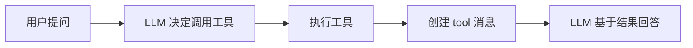

# 消息系统详解 (`core/message.py`)

> 理解 HelloAgents 的消息封装与管理机制

---

## 📚 目录

- [模块概述](#模块概述)
- [Message 类详解](#message-类详解)
- [消息角色说明](#消息角色说明)
- [Pydantic 基础](#pydantic-基础)
- [实战示例](#实战示例)
- [最佳实践](#最佳实践)

---

## 模块概述

### 文件位置
`hello_agents/core/message.py`

### 主要功能
- 封装 LLM 对话中的消息
- 提供类型安全的消息创建
- 支持消息序列化和反序列化
- 管理消息元数据

### 核心组件
- `MessageRole` - 消息角色类型定义
- `Message` - 消息类（继承自 Pydantic BaseModel）

---

## Message 类详解

### 完整代码

```python
from typing import Optional, Dict, Any, Literal
from datetime import datetime
from pydantic import BaseModel

# 定义消息角色的类型，限制其取值为 user/assistant/system/tool 四种
MessageRole = Literal["user", "assistant", "system", "tool"]

class Message(BaseModel):
    """
    消息类 - 用于封装 LLM 对话中的单条消息
    
    继承 Pydantic 的 BaseModel，自动获得类型验证和序列化能力
    """

    content: str                              # 消息内容
    role: MessageRole                         # 消息角色：user/assistant/system/tool
    timestamp: datetime = None                # 消息时间戳
    metadata: Optional[Dict[str, Any]] = None # 额外元数据（可选）

    def __init__(self, content: str, role: MessageRole, **kwargs):
        """初始化消息"""
        super().__init__(
            content=content,
            role=role,
            timestamp=kwargs.get('timestamp', datetime.now()),
            metadata=kwargs.get('metadata', {})
        )

    def to_dict(self) -> Dict[str, Any]:
        """转换为字典格式（OpenAI API 格式）"""
        return {
            "role": self.role,
            "content": self.content
        }
    
    def __str__(self) -> str:
        """返回消息的字符串表示"""
        return f"[{self.role}] {self.content}"
```

### 类属性详解

#### 1. content (消息内容)

```python
content: str  # 必填字段
```

**说明**：
- 消息的文本内容
- 必填字段，不能为空
- 类型：字符串

**示例**：
```python
content = "请帮我分析这段代码"
content = "我是一个有用的AI助手"
content = "搜索结果：找到3条相关信息"
```

#### 2. role (消息角色)

```python
role: MessageRole  # 必填字段，类型受限
```

**类型定义**：
```python
MessageRole = Literal["user", "assistant", "system", "tool"]
```

**说明**：
- 使用 `Literal` 类型限制只能是这4个值之一
- 编译时类型检查，防止错误
- IDE 会提供自动补全

#### 3. timestamp (时间戳)

```python
timestamp: datetime = None  # 可选字段，有默认值
```

**说明**：
- 记录消息创建时间
- 默认使用当前时间 `datetime.now()`
- 可用于消息排序、历史回溯

**用途**：
```python
# 按时间排序消息
messages.sort(key=lambda m: m.timestamp)

# 过滤特定时间段的消息
recent_messages = [m for m in messages if m.timestamp > cutoff_time]
```

#### 4. metadata (元数据)

```python
metadata: Optional[Dict[str, Any]] = None  # 完全可选
```

**说明**：
- 存储额外的自定义信息
- 灵活的键值对结构
- 不影响核心功能

**使用场景**：
```python
# 记录消息来源
metadata = {"source": "web_search", "confidence": 0.95}

# 记录工具调用信息
metadata = {"tool_name": "calculator", "execution_time": 0.5}

# 记录用户信息
metadata = {"user_id": "12345", "session_id": "abc"}
```

---

## 消息角色说明

### 1. user (用户消息)

**用途**：用户的输入或问题

```python
msg = Message(
    content="什么是 ReAct Agent？",
    role="user"
)
```

**特点**：
- 对话的起点
- 包含用户的问题、指令或反馈
- 在对话历史中标识用户的意图

### 2. assistant (助手消息)

**用途**：AI 助手的回复

```python
msg = Message(
    content="ReAct Agent 是一种结合推理和行动的智能体...",
    role="assistant"
)
```

**特点**：
- LLM 生成的响应
- 包含答案、分析或建议
- 在多轮对话中保持上下文

### 3. system (系统消息)

**用途**：定义 AI 的角色和行为

```python
msg = Message(
    content="你是一个专业的 Python 编程助手，擅长代码分析和优化。",
    role="system"
)
```

**特点**：
- 通常放在对话开始
- 设定 AI 的角色、风格、约束
- 不会被用户直接看到
- 对 LLM 的行为有重要影响

**System Prompt 设计技巧**：
```python
# ✅ 好的 system prompt
system_msg = Message(
    content="""你是一个专业的代码审查助手。
    
    你的职责：
    1. 分析代码质量
    2. 指出潜在问题
    3. 提供改进建议
    
    你的风格：
    - 专业但友好
    - 具体且可操作
    - 注重最佳实践
    """,
    role="system"
)

# ❌ 不好的 system prompt
system_msg = Message(
    content="你是助手",  # 太简单，缺乏指导
    role="system"
)
```

### 4. tool (工具消息)

**用途**：工具执行的结果

```python
msg = Message(
    content="搜索结果：找到5篇关于 Agent 的文章...",
    role="tool",
    metadata={"tool_name": "web_search"}
)
```

**特点**：
- 记录工具调用的输出
- 为 LLM 提供外部信息
- 通常配合 ReAct、Function Call 等模式使用

**工具消息流程**：


---

## Pydantic 基础

### 为什么使用 Pydantic？

Message 类继承自 `pydantic.BaseModel`，这带来了很多好处：

#### 1. 自动类型验证

```python
# ✅ 正确：类型匹配
msg = Message(content="Hello", role="user")

# ❌ 错误：role 类型不对
msg = Message(content="Hello", role="invalid_role")
# 抛出 ValidationError: role must be one of ['user', 'assistant', 'system', 'tool']

# ❌ 错误：content 不是字符串
msg = Message(content=123, role="user")
# 抛出 ValidationError: content must be a string
```

#### 2. 自动序列化

```python
msg = Message(content="Hello", role="user")

# 转为字典
msg_dict = msg.dict()
# {'content': 'Hello', 'role': 'user', 'timestamp': ..., 'metadata': {}}

# 转为 JSON
msg_json = msg.json()
# '{"content": "Hello", "role": "user", ...}'
```

#### 3. 从字典创建

```python
data = {
    "content": "Hello",
    "role": "user",
    "timestamp": "2024-01-24T10:00:00"
}

msg = Message(**data)  # 自动解析和验证
```

#### 4. 字段默认值

```python
msg = Message(content="Hello", role="user")
# timestamp 自动设置为当前时间
# metadata 自动设置为空字典 {}
```

### Pydantic 核心特性

```python
from pydantic import BaseModel, Field, validator

class EnhancedMessage(BaseModel):
    content: str = Field(..., min_length=1, max_length=10000)
    role: MessageRole
    importance: float = Field(default=0.5, ge=0.0, le=1.0)
    
    @validator('content')
    def content_not_empty(cls, v):
        if not v.strip():
            raise ValueError('content cannot be empty')
        return v
```

---

## 核心方法详解

### 1. `__init__` 初始化方法

```python
def __init__(self, content: str, role: MessageRole, **kwargs):
    super().__init__(
        content=content,
        role=role,
        timestamp=kwargs.get('timestamp', datetime.now()),
        metadata=kwargs.get('metadata', {})
    )
```

**设计要点**：

1. **简化的参数列表**
   - 只有 `content` 和 `role` 是必填的
   - 其他参数通过 `**kwargs` 传入

2. **智能默认值**
   ```python
   timestamp=kwargs.get('timestamp', datetime.now())  # 未提供则用当前时间
   metadata=kwargs.get('metadata', {})                # 未提供则用空字典
   ```

3. **调用父类初始化**
   ```python
   super().__init__(...)  # 触发 Pydantic 的验证逻辑
   ```

### 2. `to_dict` 转换方法

```python
def to_dict(self) -> Dict[str, Any]:
    """转换为字典格式（OpenAI API 格式）"""
    return {
        "role": self.role,
        "content": self.content
    }
```

**为什么只返回 role 和 content？**

这是为了符合 OpenAI API 的标准格式：

```python
# OpenAI API 期望的消息格式
messages = [
    {"role": "system", "content": "You are a helpful assistant."},
    {"role": "user", "content": "Hello!"},
    {"role": "assistant", "content": "Hi! How can I help you?"}
]

response = client.chat.completions.create(
    model="gpt-3.5-turbo",
    messages=messages  # 直接使用这个格式
)
```

**使用示例**：

```python
# 创建消息列表
history = [
    Message("你是助手", "system"),
    Message("什么是 Python？", "user"),
    Message("Python 是一种编程语言...", "assistant")
]

# 转换为 API 格式
api_messages = [msg.to_dict() for msg in history]

# 调用 LLM
response = llm.invoke(api_messages)
```

### 3. `__str__` 字符串表示

```python
def __str__(self) -> str:
    return f"[{self.role}] {self.content}"
```

**用途**：方便调试和日志输出

```python
msg = Message("Hello", "user")
print(msg)  # 输出: [user] Hello

# 打印对话历史
for msg in history:
    print(msg)
# [system] 你是助手
# [user] 什么是 Python？
# [assistant] Python 是一种编程语言...
```

---

## 实战示例

### 示例 1: 创建基础消息

```python
from hello_agents.core.message import Message

# 用户消息
user_msg = Message(
    content="请帮我分析这段代码",
    role="user"
)

# 系统消息
system_msg = Message(
    content="你是一个专业的代码审查助手",
    role="system"
)

# 助手消息
assistant_msg = Message(
    content="好的，请提供代码",
    role="assistant"
)
```

### 示例 2: 带元数据的消息

```python
# 记录工具调用
tool_msg = Message(
    content="搜索结果：找到3篇相关文章",
    role="tool",
    metadata={
        "tool_name": "web_search",
        "query": "Python Agent",
        "results_count": 3,
        "execution_time": 1.5
    }
)

# 访问元数据
print(tool_msg.metadata["tool_name"])  # web_search
```

### 示例 3: 构建对话历史

```python
from hello_agents.core.message import Message

class ConversationManager:
    def __init__(self, system_prompt: str):
        self.history = []
        # 添加系统消息
        self.add_message(Message(system_prompt, "system"))
    
    def add_user_message(self, content: str):
        self.add_message(Message(content, "user"))
    
    def add_assistant_message(self, content: str):
        self.add_message(Message(content, "assistant"))
    
    def add_message(self, message: Message):
        self.history.append(message)
    
    def get_api_messages(self):
        """获取 API 格式的消息列表"""
        return [msg.to_dict() for msg in self.history]
    
    def print_history(self):
        """打印对话历史"""
        for msg in self.history:
            print(msg)

# 使用
conv = ConversationManager("你是一个有用的助手")
conv.add_user_message("什么是 Agent？")
conv.add_assistant_message("Agent 是一种智能体...")
conv.add_user_message("能举个例子吗？")

conv.print_history()
# [system] 你是一个有用的助手
# [user] 什么是 Agent？
# [assistant] Agent 是一种智能体...
# [user] 能举个例子吗？
```

### 示例 4: 消息过滤和处理

```python
from datetime import datetime, timedelta

# 过滤最近的消息
def get_recent_messages(messages: list[Message], hours: int = 1):
    cutoff = datetime.now() - timedelta(hours=hours)
    return [msg for msg in messages if msg.timestamp > cutoff]

# 只获取用户消息
def get_user_messages(messages: list[Message]):
    return [msg for msg in messages if msg.role == "user"]

# 统计消息数量
def count_by_role(messages: list[Message]):
    counts = {}
    for msg in messages:
        counts[msg.role] = counts.get(msg.role, 0) + 1
    return counts

# 使用
history = [
    Message("系统提示", "system"),
    Message("问题1", "user"),
    Message("回答1", "assistant"),
    Message("问题2", "user"),
]

print(count_by_role(history))
# {'system': 1, 'user': 2, 'assistant': 1}
```

### 示例 5: 消息序列化

```python
import json

# 保存对话历史
def save_conversation(messages: list[Message], filename: str):
    data = [msg.dict() for msg in messages]
    with open(filename, 'w', encoding='utf-8') as f:
        json.dump(data, f, ensure_ascii=False, indent=2, default=str)

# 加载对话历史
def load_conversation(filename: str) -> list[Message]:
    with open(filename, 'r', encoding='utf-8') as f:
        data = json.load(f)
    return [Message(**item) for item in data]

# 使用
history = [
    Message("你好", "user"),
    Message("你好！有什么可以帮你的？", "assistant")
]

save_conversation(history, "conversation.json")
loaded_history = load_conversation("conversation.json")
```

---

## 最佳实践

### 1. System Prompt 设计

```python
# ✅ 推荐：结构化的 system prompt
system_prompt = """你是一个专业的 Python 编程助手。

你的能力：
- 代码分析和审查
- Bug 诊断和修复
- 性能优化建议
- 最佳实践指导

你的风格：
- 专业但易懂
- 提供具体示例
- 解释原理和原因

限制：
- 不编写恶意代码
- 不提供过时的方案
- 承认不确定的地方
"""

msg = Message(system_prompt, "system")
```

### 2. 消息历史管理

```python
class MessageHistory:
    def __init__(self, max_length: int = 100):
        self.messages = []
        self.max_length = max_length
    
    def add(self, message: Message):
        self.messages.append(message)
        # 保持历史长度限制
        if len(self.messages) > self.max_length:
            # 保留 system 消息，删除最旧的对话
            system_msgs = [m for m in self.messages if m.role == "system"]
            other_msgs = [m for m in self.messages if m.role != "system"]
            self.messages = system_msgs + other_msgs[-self.max_length:]
    
    def get_for_api(self):
        return [msg.to_dict() for msg in self.messages]
```

### 3. 元数据的有效使用

```python
# 记录详细的工具调用信息
tool_msg = Message(
    content=search_results,
    role="tool",
    metadata={
        "tool_name": "web_search",
        "query": query,
        "source": "google",
        "results_count": len(results),
        "execution_time": elapsed_time,
        "success": True
    }
)

# 后续可以分析工具使用情况
def analyze_tool_usage(messages: list[Message]):
    tool_msgs = [m for m in messages if m.role == "tool"]
    for msg in tool_msgs:
        print(f"工具: {msg.metadata.get('tool_name')}")
        print(f"耗时: {msg.metadata.get('execution_time')}s")
```

### 4. 类型安全

```python
from typing import List

def process_messages(messages: List[Message]) -> List[dict]:
    """类型注解确保传入的是 Message 对象列表"""
    return [msg.to_dict() for msg in messages]

# IDE 会提供类型检查和自动补全
messages: List[Message] = [
    Message("Hello", "user"),
    Message("Hi", "assistant")
]
```

---

## 学习检查清单

### 基础理解
- [ ] 理解 Message 类的四个核心属性
- [ ] 掌握四种消息角色的用途
- [ ] 了解 Pydantic BaseModel 的优势
- [ ] 能够创建和使用基础消息

### 进阶掌握
- [ ] 理解 to_dict() 方法的设计原因
- [ ] 掌握元数据的使用场景
- [ ] 能够设计有效的 system prompt
- [ ] 理解消息历史的管理策略

### 实战应用
- [ ] 实现一个对话历史管理器
- [ ] 设计针对特定场景的 system prompt
- [ ] 使用元数据记录工具调用信息
- [ ] 实现消息的持久化和加载

---

**下一步学习**: [Agent 基类详解](./03_Agent基类详解.md)
