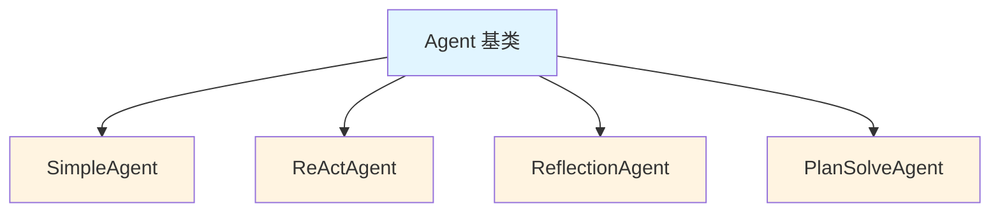
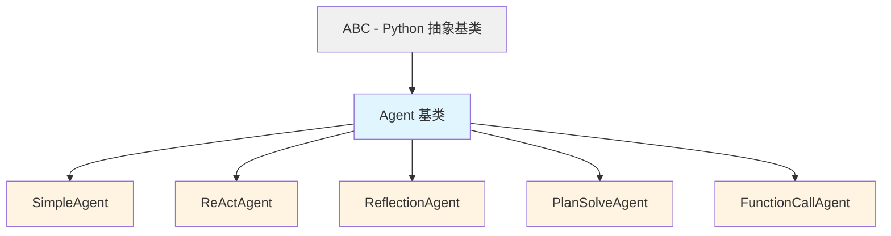

# Agent 基类详解 (`core/agent.py`)

> 理解 HelloAgents 的 Agent 抽象基类设计

---

## 📚 目录

- [模块概述](#模块概述)
- [抽象基类设计](#抽象基类设计)
- [核心属性详解](#核心属性详解)
- [核心方法详解](#核心方法详解)
- [继承与扩展](#继承与扩展)
- [实战示例](#实战示例)

---

## 模块概述

### 文件位置
`hello_agents/core/agent.py`

### 设计目的
- 定义所有 Agent 的统一接口
- 提供通用的历史记录管理
- 强制子类实现核心方法
- 实现代码复用和规范化

### 核心类
- `Agent` - 抽象基类（ABC）

---

## 抽象基类设计

### 什么是抽象基类？

```python
from abc import ABC, abstractmethod

class Agent(ABC):
    """Agent抽象基类"""
    
    @abstractmethod
    def run(self, input_text: str, **kwargs) -> str:
        """必须由子类实现"""
        pass
```

**关键特性**：

1. **不能直接实例化**
```python
# ❌ 错误：抽象基类不能实例化
agent = Agent(name="test", llm=llm)
# TypeError: Can't instantiate abstract class Agent with abstract method run
```

2. **强制子类实现抽象方法**
```python
class MyAgent(Agent):
    # ❌ 错误：没有实现 run 方法
    pass
# TypeError: Can't instantiate abstract class MyAgent with abstract method run

class MyAgent(Agent):
    # ✅ 正确：实现了 run 方法
    def run(self, input_text: str, **kwargs) -> str:
        return "response"
```

3. **统一接口规范**
```python
# 所有 Agent 都有相同的方法签名
def process_with_agent(agent: Agent, text: str):
    return agent.run(text)  # 保证所有 Agent 都有 run 方法
```

### 为什么使用抽象基类？



**优势**：
- ✅ 统一接口：所有 Agent 都有 `run()` 方法
- ✅ 代码复用：历史管理等通用功能只写一次
- ✅ 类型安全：IDE 可以检查方法是否实现
- ✅ 可扩展：新增 Agent 只需继承并实现 `run()`

---

## 核心属性详解

### 完整代码

```python
class Agent(ABC):
    def __init__(
        self,
        name: str,
        llm: HelloAgentsLLM,
        system_prompt: Optional[str] = None,
        config: Optional[Config] = None
    ):
        self.name = name
        self.llm = llm
        self.system_prompt = system_prompt
        self.config = config or Config()
        self._history: list[Message] = []
```

### 1. name (Agent 名称)

```python
self.name = name  # 必填参数
```

**用途**：
- 标识 Agent 身份
- 日志输出
- 调试和追踪

**示例**：
```python
agent = SimpleAgent(
    name="CodeReviewer",  # 描述性名称
    llm=llm
)

print(agent)  # Agent(name=CodeReviewer, provider=deepseek)
```

### 2. llm (LLM 客户端)

```python
self.llm = llm  # HelloAgentsLLM 实例
```

**用途**：
- 调用大语言模型
- 所有 Agent 的核心能力来源

**示例**：
```python
# 在 Agent 内部调用 LLM
response = self.llm.invoke(messages)

# 流式调用
for chunk in self.llm.think(messages):
    print(chunk, end="")
```

### 3. system_prompt (系统提示词)

```python
self.system_prompt = system_prompt  # 可选参数
```

**用途**：
- 定义 Agent 的角色和行为
- 设置 Agent 的能力边界
- 影响 LLM 的输出风格

**示例**：
```python
agent = SimpleAgent(
    name="PythonExpert",
    llm=llm,
    system_prompt="""你是一个专业的 Python 编程专家。
    你擅长代码审查、性能优化和最佳实践指导。
    你的回答应该专业、准确、易懂。"""
)
```

### 4. config (配置对象)

```python
self.config = config or Config()  # 可选，有默认值
```

**用途**：
- 存储 Agent 的配置参数
- 控制 Agent 的行为
- 统一管理配置

**Config 类结构**：
```python
class Config(BaseModel):
    default_model: str = "gpt-3.5-turbo"
    default_provider: str = "openai"
    temperature: float = 0.7
    max_tokens: Optional[int] = None
    debug: bool = False
    log_level: str = "INFO"
    max_history_length: int = 100
```

**使用示例**：
```python
# 自定义配置
config = Config(
    temperature=0.9,
    max_tokens=2000,
    debug=True
)

agent = SimpleAgent(name="test", llm=llm, config=config)
```

### 5. _history (历史记录)

```python
self._history: list[Message] = []  # 私有属性
```

**设计要点**：

1. **使用下划线前缀**
   - `_history` 表示这是私有属性
   - 不应该直接从外部访问
   - 通过方法访问：`get_history()`、`add_message()`

2. **为什么需要历史记录？**
   - 多轮对话需要上下文
   - LLM 需要知道之前的对话内容
   - 用于调试和分析

3. **历史记录的结构**
```python
self._history = [
    Message("你是助手", "system"),
    Message("什么是 Python？", "user"),
    Message("Python 是...", "assistant"),
    Message("能举例吗？", "user"),
]
```

---

## 核心方法详解

### 1. run() - 抽象方法 ⭐

```python
@abstractmethod
def run(self, input_text: str, **kwargs) -> str:
    """
    运行Agent（抽象方法，必须由子类实现）
    
    参数：
        input_text: 用户输入的文本
        **kwargs: 其他可选参数
    
    返回：
        str: Agent的最终响应
    """
    pass
```

**为什么是抽象方法？**

不同类型的 Agent 有完全不同的执行逻辑：

```python
# SimpleAgent: 直接调用 LLM
def run(self, input_text: str, **kwargs) -> str:
    messages = self._build_messages(input_text)
    response = self.llm.invoke(messages)
    return response

# ReActAgent: 循环"推理-行动-观察"
def run(self, input_text: str, **kwargs) -> str:
    for step in range(max_steps):
        thought, action = self._think()
        if action == "Finish":
            return final_answer
        observation = self._execute_tool(action)
        # 继续循环...

# ReflectionAgent: 执行-评估-反思-改进
def run(self, input_text: str, **kwargs) -> str:
    result = self._initial_attempt()
    for iteration in range(max_iterations):
        quality = self._evaluate(result)
        if quality > threshold:
            return result
        reflection = self._reflect(result)
        result = self._improve(result, reflection)
```

**子类实现示例**：

```python
class SimpleAgent(Agent):
    def run(self, input_text: str, **kwargs) -> str:
        # 1. 构建消息
        messages = []
        if self.system_prompt:
            messages.append({"role": "system", "content": self.system_prompt})
        
        for msg in self._history:
            messages.append(msg.to_dict())
        
        messages.append({"role": "user", "content": input_text})
        
        # 2. 调用 LLM
        response = self.llm.invoke(messages, **kwargs)
        
        # 3. 保存历史
        self.add_message(Message(input_text, "user"))
        self.add_message(Message(response, "assistant"))
        
        return response
```

### 2. add_message() - 添加消息

```python
def add_message(self, message: Message):
    """添加消息到历史记录"""
    self._history.append(message)
```

**使用场景**：

```python
# 在 run() 方法中记录对话
def run(self, input_text: str, **kwargs) -> str:
    # 记录用户输入
    self.add_message(Message(input_text, "user"))
    
    # 调用 LLM
    response = self.llm.invoke(messages)
    
    # 记录 AI 回复
    self.add_message(Message(response, "assistant"))
    
    return response
```

**为什么需要这个方法？**
- 封装内部实现（不直接操作 `_history`）
- 未来可以添加验证、日志等逻辑
- 保持接口稳定

### 3. clear_history() - 清空历史

```python
def clear_history(self):
    """清空历史记录"""
    self._history.clear()
```

**使用场景**：

```python
# 场景1: 开始新任务
agent.clear_history()
agent.run("新的问题")

# 场景2: 避免上下文过长
if len(agent.get_history()) > 100:
    agent.clear_history()

# 场景3: 测试时需要干净状态
def test_agent():
    agent.clear_history()  # 确保测试独立
    result = agent.run("test input")
    assert result == expected
```

**注意事项**：
```python
# ⚠️ 清空历史会丢失所有上下文
agent.run("我叫张三")
agent.run("我叫什么？")  # AI: 你叫张三

agent.clear_history()
agent.run("我叫什么？")  # AI: 我不知道你的名字
```

### 4. get_history() - 获取历史

```python
def get_history(self) -> list[Message]:
    """获取历史记录的副本"""
    return self._history.copy()
```

**为什么返回副本？**

```python
# ❌ 如果直接返回原列表
def get_history(self):
    return self._history

# 外部代码可能意外修改
history = agent.get_history()
history.clear()  # 糟糕！清空了 Agent 内部的历史

# ✅ 返回副本则安全
def get_history(self):
    return self._history.copy()

history = agent.get_history()
history.clear()  # 只清空副本，不影响 Agent
```

**使用示例**：

```python
# 查看对话历史
history = agent.get_history()
for msg in history:
    print(msg)

# 统计消息数量
user_count = sum(1 for msg in history if msg.role == "user")
print(f"用户发送了 {user_count} 条消息")

# 导出对话
def export_conversation(agent: Agent, filename: str):
    history = agent.get_history()
    with open(filename, 'w') as f:
        for msg in history:
            f.write(f"{msg}\n")
```

### 5. __str__() - 字符串表示

```python
def __str__(self) -> str:
    return f"Agent(name={self.name}, provider={self.llm.provider})"
```

**用途**：

```python
agent = SimpleAgent(name="Helper", llm=llm)

# 打印 Agent 信息
print(agent)  # Agent(name=Helper, provider=deepseek)

# 日志记录
logger.info(f"正在使用 {agent} 处理请求")

# 调试
print(f"当前 Agent: {agent}")
```

---

## 继承与扩展

### 继承层次结构



### 如何创建自定义 Agent

#### 步骤 1: 继承 Agent 基类

```python
from hello_agents.core.agent import Agent
from hello_agents.core.llm import HelloAgentsLLM
from hello_agents.core.message import Message

class CustomAgent(Agent):
    """自定义 Agent"""
    pass
```

#### 步骤 2: 实现 __init__ 方法

```python
class CustomAgent(Agent):
    def __init__(
        self,
        name: str,
        llm: HelloAgentsLLM,
        system_prompt: str = None,
        config: Config = None,
        # 自定义参数
        custom_param: str = "default"
    ):
        # 调用父类初始化
        super().__init__(name, llm, system_prompt, config)
        
        # 初始化自定义属性
        self.custom_param = custom_param
```

#### 步骤 3: 实现 run 方法

```python
class CustomAgent(Agent):
    def run(self, input_text: str, **kwargs) -> str:
        """实现自定义逻辑"""
        
        # 1. 构建消息
        messages = self._build_messages(input_text)
        
        # 2. 调用 LLM
        response = self.llm.invoke(messages)
        
        # 3. 保存历史
        self.add_message(Message(input_text, "user"))
        self.add_message(Message(response, "assistant"))
        
        return response
    
    def _build_messages(self, input_text: str):
        """辅助方法：构建消息列表"""
        messages = []
        
        if self.system_prompt:
            messages.append({"role": "system", "content": self.system_prompt})
        
        for msg in self._history:
            messages.append(msg.to_dict())
        
        messages.append({"role": "user", "content": input_text})
        
        return messages
```

### 完整示例：创建一个总结 Agent

```python
class SummaryAgent(Agent):
    """专门用于文本总结的 Agent"""
    
    def __init__(
        self,
        name: str,
        llm: HelloAgentsLLM,
        max_length: int = 200,
        config: Config = None
    ):
        system_prompt = f"""你是一个专业的文本总结助手。
        你的任务是将长文本总结为不超过 {max_length} 字的精简版本。
        
        总结要求：
        1. 保留核心信息
        2. 语言简洁清晰
        3. 逻辑连贯
        4. 不超过 {max_length} 字
        """
        
        super().__init__(name, llm, system_prompt, config)
        self.max_length = max_length
    
    def run(self, input_text: str, **kwargs) -> str:
        """总结文本"""
        
        # 构建提示
        prompt = f"请总结以下文本（不超过{self.max_length}字）：\n\n{input_text}"
        
        messages = [
            {"role": "system", "content": self.system_prompt},
            {"role": "user", "content": prompt}
        ]
        
        # 调用 LLM
        summary = self.llm.invoke(messages, **kwargs)
        
        # 验证长度
        if len(summary) > self.max_length * 1.2:  # 允许 20% 误差
            # 如果太长，要求重新总结
            messages.append({"role": "assistant", "content": summary})
            messages.append({"role": "user", "content": f"总结太长了，请精简到 {self.max_length} 字以内"})
            summary = self.llm.invoke(messages)
        
        # 保存历史
        self.add_message(Message(input_text, "user"))
        self.add_message(Message(summary, "assistant"))
        
        return summary

# 使用
agent = SummaryAgent(
    name="Summarizer",
    llm=llm,
    max_length=100
)

long_text = """..."""  # 长文本
summary = agent.run(long_text)
print(summary)
```

---

## 实战示例

### 示例 1: 基础使用

```python
from hello_agents.core.llm import HelloAgentsLLM
from hello_agents.agents.simple_agent import MySimpleAgent

# 创建 LLM
llm = HelloAgentsLLM(
    provider="deepseek",
    model="deepseek-chat"
)

# 创建 Agent
agent = MySimpleAgent(
    name="Assistant",
    llm=llm,
    system_prompt="你是一个有用的助手"
)

# 运行
response = agent.run("什么是 Python？")
print(response)

# 查看历史
for msg in agent.get_history():
    print(msg)
```

### 示例 2: 多轮对话

```python
agent = MySimpleAgent(name="Helper", llm=llm)

# 第一轮
response1 = agent.run("我叫张三")
print(response1)  # "你好，张三！"

# 第二轮（有上下文）
response2 = agent.run("我叫什么？")
print(response2)  # "你叫张三"

# 查看完整历史
history = agent.get_history()
print(f"共 {len(history)} 条消息")
```

### 示例 3: 历史管理

```python
class ManagedAgent(Agent):
    def __init__(self, name, llm, max_history=10):
        super().__init__(name, llm)
        self.max_history = max_history
    
    def run(self, input_text: str, **kwargs) -> str:
        # 限制历史长度
        if len(self._history) > self.max_history:
            # 保留 system 消息和最近的对话
            system_msgs = [m for m in self._history if m.role == "system"]
            recent_msgs = [m for m in self._history if m.role != "system"][-self.max_history:]
            self._history = system_msgs + recent_msgs
        
        # 正常处理
        messages = self._build_messages(input_text)
        response = self.llm.invoke(messages)
        
        self.add_message(Message(input_text, "user"))
        self.add_message(Message(response, "assistant"))
        
        return response
```

### 示例 4: 带日志的 Agent

```python
import logging

class LoggingAgent(Agent):
    def __init__(self, name, llm):
        super().__init__(name, llm)
        self.logger = logging.getLogger(name)
    
    def run(self, input_text: str, **kwargs) -> str:
        self.logger.info(f"收到输入: {input_text[:50]}...")
        
        try:
            messages = self._build_messages(input_text)
            response = self.llm.invoke(messages)
            
            self.logger.info(f"生成响应: {response[:50]}...")
            
            self.add_message(Message(input_text, "user"))
            self.add_message(Message(response, "assistant"))
            
            return response
        
        except Exception as e:
            self.logger.error(f"执行失败: {e}")
            raise
```

---

## 学习检查清单

### 基础理解
- [ ] 理解抽象基类的概念和作用
- [ ] 掌握 Agent 的核心属性
- [ ] 了解历史记录的管理方式
- [ ] 理解为什么 run() 是抽象方法

### 进阶掌握
- [ ] 能够创建自定义 Agent
- [ ] 理解私有属性的设计原因
- [ ] 掌握历史记录的最佳实践
- [ ] 了解如何扩展 Agent 功能

### 实战应用
- [ ] 实现至少一个自定义 Agent
- [ ] 处理历史记录的长度限制
- [ ] 添加日志和监控功能
- [ ] 实现 Agent 的持久化

---

**下一步学习**: [Simple Agent 详解](./04_SimpleAgent详解.md)
