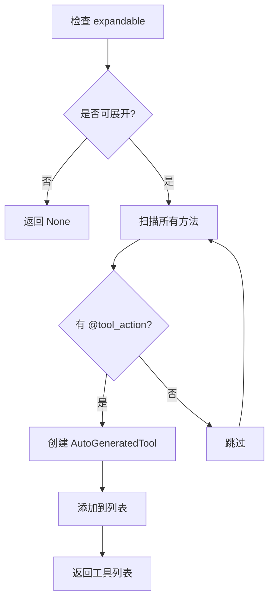
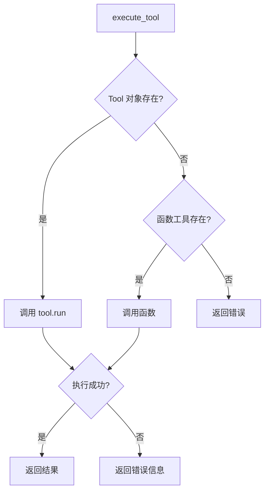
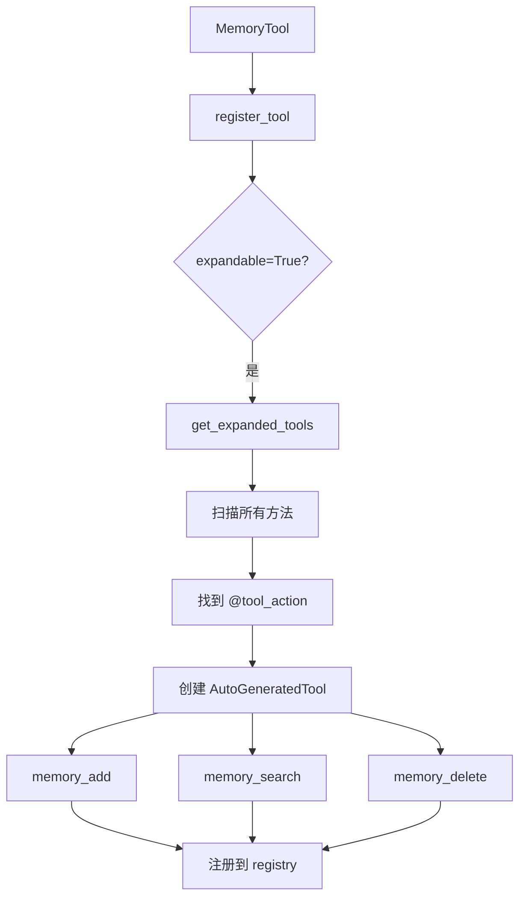
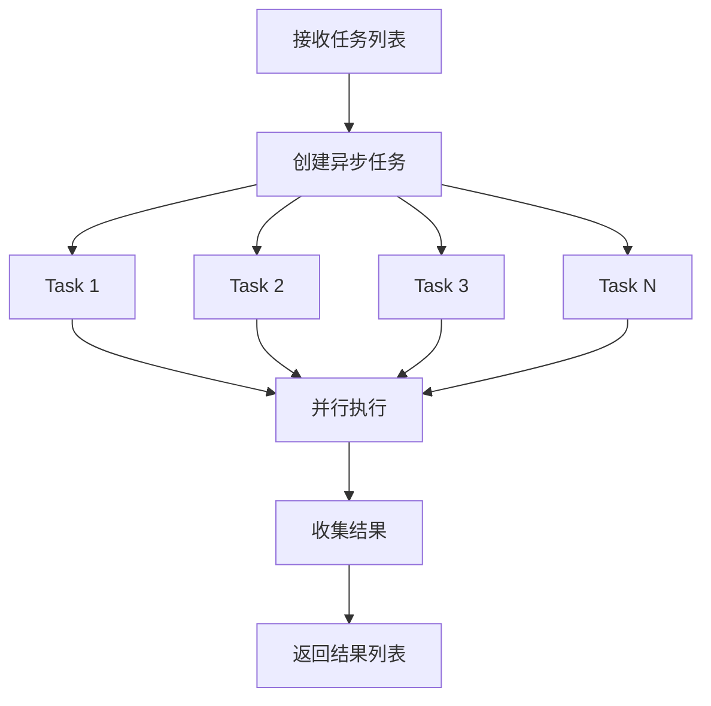

# 工具系统详解 (`tools/`)

> 深入理解 HelloAgents 的工具设计与实现机制

---

## 📚 目录

- [模块概述](#模块概述)
- [Tool 基类详解](#tool-基类详解)
- [工具注册表详解](#工具注册表详解)
- [装饰器模式](#装饰器模式)
- [自动参数解析](#自动参数解析)
- [工具链详解](#工具链详解)
- [异步执行器详解](#异步执行器详解)
- [实战示例](#实战示例)

---

## 模块概述

### 文件结构
```
tools/
├── base.py          # 工具基类和装饰器
├── registry.py      # 工具注册表
├── chain.py         # 工具链编排
└── async_executor.py # 异步执行器
```

### 核心设计理念

**1. 工具即函数**
- 每个工具封装一个特定功能
- 统一的输入输出接口
- 可组合、可复用

**2. 两种使用模式**
```python
# 模式1: 普通工具（单一功能）
class SearchTool(Tool):
    def run(self, parameters):
        return search(parameters['query'])

# 模式2: 可展开工具（多个功能）
class MemoryTool(Tool):
    expandable = True
    
    @tool_action("add", "添加记忆")
    def _add(self, content: str):
        return self.memory.add(content)
    
    @tool_action("search", "搜索记忆")
    def _search(self, query: str):
        return self.memory.search(query)
```

---

## Tool 基类详解

### 完整代码结构

```python
from abc import ABC, abstractmethod
from typing import Dict, Any, List, Optional

class Tool(ABC):
    """工具基类"""
    
    def __init__(self, name: str, description: str, expandable: bool = False):
        self.name = name
        self.description = description
        self.expandable = expandable
    
    @abstractmethod
    def run(self, parameters: Dict[str, Any]) -> str:
        """执行工具"""
        pass
    
    @abstractmethod
    def get_parameters(self) -> List[ToolParameter]:
        """获取工具参数定义"""
        pass
    
    def get_expanded_tools(self) -> Optional[List['Tool']]:
        """获取展开后的子工具列表"""
        pass
```

### 核心属性

#### 1. name (工具名称)

```python
self.name = name  # 必填
```

**用途**：
- 唯一标识工具
- Agent 调用时使用
- 日志和调试

**命名规范**：
```python
# ✅ 好的命名
"web_search"       # 清晰、描述性
"calculator_add"   # 功能明确
"file_read"        # 动词+名词

# ❌ 不好的命名
"tool1"            # 无意义
"search"           # 太宽泛
"doSomething"      # 不清晰
```

#### 2. description (工具描述)

```python
self.description = description  # 必填
```

**用途**：
- 告诉 LLM 工具的功能
- 帮助 LLM 选择合适的工具
- 生成工具文档

**描述规范**：
```python
# ✅ 好的描述
description = "在网络上搜索信息，返回相关的搜索结果摘要"

# ✅ 更详细的描述
description = """搜索工具：在互联网上搜索信息
输入：搜索关键词
输出：搜索结果摘要（包含标题、链接、简介）
适用场景：需要获取最新信息、查找资料时使用"""

# ❌ 不好的描述
description = "搜索"  # 太简单
description = "这是一个工具"  # 无意义
```

#### 3. expandable (是否可展开)

```python
self.expandable = expandable  # 默认 False
```

**用途**：
- 标记工具是否包含多个子功能
- 控制是否自动展开为多个独立工具

**使用场景**：
```python
# 场景1: 单一功能工具
class SearchTool(Tool):
    def __init__(self):
        super().__init__(
            name="search",
            description="搜索工具",
            expandable=False  # 不可展开
        )

# 场景2: 多功能工具
class MemoryTool(Tool):
    def __init__(self):
        super().__init__(
            name="memory",
            description="记忆管理工具",
            expandable=True  # 可展开
        )
    
    @tool_action("add", "添加记忆")
    def _add(self, content: str):
        pass
    
    @tool_action("search", "搜索记忆")
    def _search(self, query: str):
        pass
```

### 核心方法

#### 1. run() - 执行工具 ⭐

```python
@abstractmethod
def run(self, parameters: Dict[str, Any]) -> str:
    """执行工具"""
    pass
```

**参数格式**：
```python
parameters = {
    "query": "Python 教程",
    "limit": 10,
    "language": "zh"
}
```

**返回值**：
- 必须返回字符串
- 包含工具执行结果
- 如果失败，返回错误信息

**实现示例**：
```python
class SearchTool(Tool):
    def run(self, parameters: Dict[str, Any]) -> str:
        query = parameters.get('query', '')
        limit = parameters.get('limit', 5)
        
        try:
            results = self._search(query, limit)
            return f"找到 {len(results)} 条结果：\n" + "\n".join(results)
        except Exception as e:
            return f"搜索失败: {str(e)}"
```

#### 2. get_parameters() - 获取参数定义

```python
@abstractmethod
def get_parameters(self) -> List[ToolParameter]:
    """获取工具参数定义"""
    pass
```

**ToolParameter 结构**：
```python
class ToolParameter(BaseModel):
    name: str           # 参数名
    type: str           # 类型: string/integer/number/boolean/array/object
    description: str    # 参数描述
    required: bool      # 是否必需
    default: Any        # 默认值
```

**实现示例**：
```python
class SearchTool(Tool):
    def get_parameters(self) -> List[ToolParameter]:
        return [
            ToolParameter(
                name="query",
                type="string",
                description="搜索关键词",
                required=True
            ),
            ToolParameter(
                name="limit",
                type="integer",
                description="返回结果数量",
                required=False,
                default=5
            )
        ]
```

#### 3. get_expanded_tools() - 获取子工具

```python
def get_expanded_tools(self) -> Optional[List['Tool']]:
    """获取展开后的子工具列表"""
    if not self.expandable:
        return None
    
    # 自动从 @tool_action 装饰的方法生成工具
    tools = []
    for name, method in inspect.getmembers(self, predicate=inspect.ismethod):
        if hasattr(method, '_is_tool_action'):
            tool = AutoGeneratedTool(
                parent=self,
                method=method,
                name=method._tool_name,
                description=method._tool_description
            )
            tools.append(tool)
    
    return tools if tools else None
```

**工作流程**：



### 辅助方法

#### validate_parameters() - 验证参数

```python
def validate_parameters(self, parameters: Dict[str, Any]) -> bool:
    """验证参数是否满足要求"""
    required_params = [p.name for p in self.get_parameters() if p.required]
    return all(param in parameters for param in required_params)
```

**使用示例**：
```python
tool = SearchTool()
params = {"query": "Python"}

if tool.validate_parameters(params):
    result = tool.run(params)
else:
    print("缺少必需参数")
```

#### to_openai_schema() - 转换为 OpenAI 格式

```python
def to_openai_schema(self) -> Dict[str, Any]:
    """转换为 OpenAI function calling schema 格式"""
    parameters = self.get_parameters()
    
    properties = {}
    required = []
    
    for param in parameters:
        properties[param.name] = {
            "type": param.type,
            "description": param.description
        }
        if param.required:
            required.append(param.name)
    
    return {
        "type": "function",
        "function": {
            "name": self.name,
            "description": self.description,
            "parameters": {
                "type": "object",
                "properties": properties,
                "required": required
            }
        }
    }
```

**用途**：
- 支持 OpenAI 原生 Function Calling
- 用于 FunctionCallAgent

**输出示例**：
```json
{
  "type": "function",
  "function": {
    "name": "search",
    "description": "搜索工具",
    "parameters": {
      "type": "object",
      "properties": {
        "query": {
          "type": "string",
          "description": "搜索关键词"
        },
        "limit": {
          "type": "integer",
          "description": "返回结果数量"
        }
      },
      "required": ["query"]
    }
  }
}
```

---

## 工具注册表详解

### ToolRegistry 类

```python
class ToolRegistry:
    """工具注册表 - 管理所有工具"""
    
    def __init__(self):
        self._tools: dict[str, Tool] = {}           # Tool 对象
        self._functions: dict[str, dict] = {}       # 函数工具
```

### 两种注册方式

#### 方式1: 注册 Tool 对象（推荐）

```python
def register_tool(self, tool: Tool, auto_expand: bool = True):
    """注册 Tool 对象"""
    
    # 检查是否可展开
    if auto_expand and tool.expandable:
        expanded_tools = tool.get_expanded_tools()
        if expanded_tools:
            # 注册所有子工具
            for sub_tool in expanded_tools:
                self._tools[sub_tool.name] = sub_tool
            return
    
    # 注册普通工具
    self._tools[tool.name] = tool
```

**使用示例**：
```python
registry = ToolRegistry()

# 注册普通工具
search_tool = SearchTool()
registry.register_tool(search_tool)

# 注册可展开工具（自动展开）
memory_tool = MemoryTool()  # 包含 add、search 等方法
registry.register_tool(memory_tool)
# 结果：注册了 memory_add、memory_search 等多个工具
```

#### 方式2: 注册函数（简便）

```python
def register_function(self, name: str, description: str, func: Callable[[str], str]):
    """直接注册函数作为工具"""
    self._functions[name] = {
        "description": description,
        "func": func
    }
```

**使用示例**：
```python
def my_search(query: str) -> str:
    return f"搜索结果: {query}"

registry.register_function(
    name="search",
    description="搜索工具",
    func=my_search
)
```

**两种方式对比**：

| 特性 | Tool 对象 | 函数注册 |
|------|----------|---------|
| 参数定义 | ✅ 支持复杂参数 | ❌ 只支持字符串 |
| 类型转换 | ✅ 自动转换 | ❌ 需手动处理 |
| 参数验证 | ✅ 自动验证 | ❌ 无验证 |
| OpenAI 格式 | ✅ 支持 | ❌ 不支持 |
| 使用难度 | 中等 | 简单 |
| 推荐场景 | 复杂工具 | 简单工具 |

### 核心方法

#### execute_tool() - 执行工具

```python
def execute_tool(self, name: str, input_text: str) -> str:
    """执行指定工具"""
    
    # 优先查找 Tool 对象
    if name in self._tools:
        tool = self._tools[name]
        try:
            return tool.run({"input": input_text})
        except Exception as e:
            return f"错误：{str(e)}"
    
    # 查找函数工具
    elif name in self._functions:
        func = self._functions[name]["func"]
        try:
            return func(input_text)
        except Exception as e:
            return f"错误：{str(e)}"
    
    else:
        return f"错误：未找到工具 '{name}'"
```

**执行流程**：



#### get_tools_description() - 获取工具描述

```python
def get_tools_description(self) -> str:
    """获取所有工具的描述"""
    descriptions = []
    
    # Tool 对象
    for tool in self._tools.values():
        descriptions.append(f"- {tool.name}: {tool.description}")
    
    # 函数工具
    for name, info in self._functions.items():
        descriptions.append(f"- {name}: {info['description']}")
    
    return "\n".join(descriptions) if descriptions else "暂无可用工具"
```

**输出示例**：
```
- search: 在网络上搜索信息
- calculator: 执行数学计算
- file_read: 读取文件内容
- memory_add: 添加新记忆
- memory_search: 搜索记忆
```

**用途**：
- 构建 Agent 的 system prompt
- 让 LLM 知道有哪些工具可用

---

## 装饰器模式

### @tool_action 装饰器

```python
def tool_action(name: str = None, description: str = None):
    """标记方法为可展开的工具 action"""
    def decorator(func: Callable):
        func._is_tool_action = True
        func._tool_name = name
        func._tool_description = description
        return func
    return decorator
```

### 使用示例

```python
class MemoryTool(Tool):
    def __init__(self):
        super().__init__(
            name="memory",
            description="记忆管理工具",
            expandable=True  # 关键：标记为可展开
        )
        self.memories = []
    
    @tool_action("add", "添加新记忆")
    def _add_memory(self, content: str, importance: float = 0.5) -> str:
        """添加记忆
        
        Args:
            content: 记忆内容
            importance: 重要性分数 (0-1)
        """
        self.memories.append({
            "content": content,
            "importance": importance
        })
        return f"已添加记忆: {content}"
    
    @tool_action("search", "搜索记忆")
    def _search_memory(self, query: str, limit: int = 5) -> str:
        """搜索记忆
        
        Args:
            query: 搜索关键词
            limit: 返回数量
        """
        results = [m for m in self.memories if query in m["content"]]
        return f"找到 {len(results)} 条记忆"
    
    @tool_action("delete", "删除记忆")
    def _delete_memory(self, index: int) -> str:
        """删除记忆
        
        Args:
            index: 记忆索引
        """
        if 0 <= index < len(self.memories):
            deleted = self.memories.pop(index)
            return f"已删除: {deleted['content']}"
        return "索引无效"
```

### 自动展开过程



**结果**：
```python
# 注册前：1 个工具
memory_tool = MemoryTool()

# 注册后：3 个独立工具
registry.register_tool(memory_tool)
# - memory_add
# - memory_search
# - memory_delete
```

---

## 自动参数解析

### AutoGeneratedTool 类

```python
class AutoGeneratedTool(Tool):
    """从方法自动生成的工具"""
    
    def __init__(self, parent: Tool, method: Callable, name: str, description: str):
        self.parent = parent
        self.method = method
        super().__init__(name=name, description=description)
        self._parameters = self._parse_parameters()
```

### 参数解析流程

#### 1. 从方法签名提取参数

```python
def _parse_parameters(self) -> List[ToolParameter]:
    """从方法签名自动提取参数"""
    sig = inspect.signature(self.method)
    type_hints = get_type_hints(self.method)
    
    parameters = []
    for param_name, param in sig.parameters.items():
        if param_name == 'self':
            continue
        
        # 获取类型
        param_type = type_hints.get(param_name, str)
        tool_type = self._python_type_to_tool_type(param_type)
        
        # 判断是否必需
        required = param.default == inspect.Parameter.empty
        default = None if required else param.default
        
        # 获取描述（从 docstring）
        description = self._get_param_description(param_name)
        
        parameters.append(ToolParameter(
            name=param_name,
            type=tool_type,
            description=description,
            required=required,
            default=default
        ))
    
    return parameters
```

#### 2. 从 docstring 提取描述

```python
def _parse_param_descriptions(self, docstring: str) -> Dict[str, str]:
    """从 docstring 解析参数描述
    
    支持格式:
        Args:
            param_name: 参数描述
            another_param: 另一个参数描述
    """
    descriptions = {}
    
    # 查找 Args: 部分
    args_match = re.search(r'Args:\s*\n(.*?)(?:\n\s*\n|Returns:|$)', 
                          docstring, re.DOTALL)
    if not args_match:
        return descriptions
    
    args_section = args_match.group(1)
    
    # 解析每个参数
    param_pattern = r'^\s*(\w+)(?:\s*\([^)]+\))?\s*:\s*(.+?)(?=^\s*\w+\s*(?:\([^)]+\))?\s*:|$)'
    matches = re.finditer(param_pattern, args_section, re.MULTILINE | re.DOTALL)
    
    for match in matches:
        param_name = match.group(1).strip()
        param_desc = match.group(2).strip()
        param_desc = re.sub(r'\s+', ' ', param_desc)
        descriptions[param_name] = param_desc
    
    return descriptions
```

#### 3. 类型转换

```python
def _python_type_to_tool_type(self, py_type) -> str:
    """将 Python 类型转换为工具类型"""
    
    # 处理泛型类型
    origin = getattr(py_type, '__origin__', None)
    if origin is not None:
        if origin is list:
            return "array"
        elif origin is dict:
            return "object"
    
    # 处理基本类型
    type_map = {
        str: "string",
        int: "integer",
        float: "number",
        bool: "boolean",
        list: "array",
        dict: "object",
    }
    
    return type_map.get(py_type, "string")
```

### 完整示例

```python
@tool_action("calculate", "执行数学计算")
def _calculate(self, expression: str, precision: int = 2) -> str:
    """执行数学计算
    
    Args:
        expression: 数学表达式，如 "2 + 3 * 4"
        precision: 结果精度，保留小数位数
    
    Returns:
        计算结果字符串
    """
    result = eval(expression)
    return f"{result:.{precision}f}"
```

**自动生成的参数定义**：
```python
[
    ToolParameter(
        name="expression",
        type="string",
        description="数学表达式，如 \"2 + 3 * 4\"",
        required=True
    ),
    ToolParameter(
        name="precision",
        type="integer",
        description="结果精度，保留小数位数",
        required=False,
        default=2
    )
]
```

---

## 工具链详解

### ToolChain 类

**核心概念**：将多个工具按顺序组合执行，前一个工具的输出作为后一个工具的输入。

```python
class ToolChain:
    """工具链 - 支持多个工具的顺序执行"""
    
    def __init__(self, name: str, description: str):
        self.name = name
        self.description = description
        self.steps: List[Dict[str, Any]] = []
```

### 核心方法

#### 1. add_step() - 添加执行步骤

```python
def add_step(self, tool_name: str, input_template: str, output_key: str = None):
    """添加工具执行步骤到工具链"""
    step = {
        "tool_name": tool_name,
        "input_template": input_template,
        "output_key": output_key or f"step_{len(self.steps)}_result"
    }
    self.steps.append(step)
```

**参数说明**：
- `tool_name`: 要执行的工具名称
- `input_template`: 输入模板，支持 `{变量名}` 格式
- `output_key`: 输出结果的键名，用于后续步骤引用

**模板变量示例**：
```python
# 使用初始输入
input_template = "{input}"

# 使用前一步骤的输出
input_template = "{search_result}"

# 组合多个变量
input_template = "根据 {search_result} 计算 {formula}"
```

#### 2. execute() - 执行工具链

```python
def execute(self, registry: ToolRegistry, input_data: str, context: Dict[str, Any] = None) -> str:
    """执行工具链中的所有步骤"""
    
    # 初始化上下文
    if context is None:
        context = {}
    context["input"] = input_data
    
    # 顺序执行每个步骤
    for i, step in enumerate(self.steps):
        tool_name = step["tool_name"]
        input_template = step["input_template"]
        output_key = step["output_key"]
        
        # 替换模板变量
        actual_input = input_template.format(**context)
        
        # 执行工具
        result = registry.execute_tool(tool_name, actual_input)
        
        # 保存结果到上下文
        context[output_key] = result
        final_result = result
    
    return final_result
```

**执行流程**：

```mermaid
graph TD
    A[开始执行] --> B[初始化上下文]
    B --> C[context['input'] = input_data]
    C --> D[遍历步骤]
    D --> E[替换模板变量]
    E --> F[执行工具]
    F --> G[保存结果到上下文]
    G --> H{还有步骤?}
    H -->|是| D
    H -->|否| I[返回最终结果]
```

### ToolChainManager 类

**作用**：管理多个工具链的注册和执行。

```python
class ToolChainManager:
    """工具链管理器"""
    
    def __init__(self, registry: ToolRegistry):
        self.registry = registry
        self.chains: Dict[str, ToolChain] = {}
    
    def register_chain(self, chain: ToolChain):
        """注册工具链"""
        self.chains[chain.name] = chain
    
    def execute_chain(self, chain_name: str, input_data: str, context: Dict[str, Any] = None) -> str:
        """执行指定工具链"""
        if chain_name not in self.chains:
            return f"错误：工具链 '{chain_name}' 不存在"
        
        chain = self.chains[chain_name]
        return chain.execute(self.registry, input_data, context)
```

### 实战示例：创建工具链

#### 示例 1: 简单工具链

```python
from hello_agents.tools.chain import ToolChain
from hello_agents.tools.registry import ToolRegistry

# 创建注册表和工具
registry = ToolRegistry()
# ... 注册工具 ...

# 创建工具链
chain = ToolChain(
    name="data_process",
    description="数据处理流程"
)

# 添加步骤
chain.add_step(
    tool_name="fetch_data",
    input_template="{input}",
    output_key="raw_data"
)

chain.add_step(
    tool_name="clean_data",
    input_template="{raw_data}",
    output_key="clean_data"
)

chain.add_step(
    tool_name="analyze_data",
    input_template="{clean_data}",
    output_key="analysis"
)

# 执行工具链
result = chain.execute(registry, "https://api.example.com/data")
print(result)
```

#### 示例 2: 研究工具链

```python
# 创建研究工具链：搜索 -> 总结 -> 保存
research_chain = ToolChain(
    name="research",
    description="研究并保存信息"
)

# 步骤1: 搜索
research_chain.add_step(
    tool_name="web_search",
    input_template="{input}",
    output_key="search_results"
)

# 步骤2: 总结
research_chain.add_step(
    tool_name="summarize",
    input_template="请总结以下内容：{search_results}",
    output_key="summary"
)

# 步骤3: 保存
research_chain.add_step(
    tool_name="save_file",
    input_template="{summary}",
    output_key="file_path"
)

# 执行
result = research_chain.execute(registry, "Python Agent 框架")
```

#### 示例 3: 使用管理器

```python
from hello_agents.tools.chain import ToolChainManager

# 创建管理器
manager = ToolChainManager(registry)

# 注册多个工具链
manager.register_chain(research_chain)
manager.register_chain(data_process_chain)

# 列出所有工具链
print(manager.list_chains())
# ['research', 'data_process']

# 执行工具链
result = manager.execute_chain("research", "AI Agent")

# 获取工具链信息
info = manager.get_chain_info("research")
print(f"工具链: {info['name']}")
print(f"步骤数: {info['steps']}")
```

### 工具链的优势

**1. 复用性**
```python
# 定义一次，多次使用
chain = create_research_chain()
result1 = chain.execute(registry, "主题1")
result2 = chain.execute(registry, "主题2")
```

**2. 可维护性**
```python
# 修改流程只需修改工具链定义
chain.add_step(...)  # 添加新步骤
```

**3. 可组合性**
```python
# 工具链可以嵌套
chain1 = create_data_fetch_chain()
chain2 = create_analysis_chain()
# 可以组合成更大的工具链
```

---

## 异步执行器详解

### AsyncToolExecutor 类

**核心概念**：支持工具的异步和并行执行，提高效率。

```python
class AsyncToolExecutor:
    """异步工具执行器"""
    
    def __init__(self, registry: ToolRegistry, max_workers: int = 4):
        self.registry = registry
        self.executor = concurrent.futures.ThreadPoolExecutor(max_workers=max_workers)
```

**关键参数**：
- `registry`: 工具注册表
- `max_workers`: 最大并发线程数（默认 4）

### 核心方法

#### 1. execute_tool_async() - 异步执行单个工具

```python
async def execute_tool_async(self, tool_name: str, input_data: str) -> str:
    """异步执行单个工具"""
    loop = asyncio.get_event_loop()
    
    def _execute():
        return self.registry.execute_tool(tool_name, input_data)
    
    try:
        result = await loop.run_in_executor(self.executor, _execute)
        return result
    except Exception as e:
        return f"❌ 工具 '{tool_name}' 异步执行失败: {e}"
```

**工作原理**：
- 使用线程池执行器（ThreadPoolExecutor）
- 将同步工具调用包装为异步任务
- 不阻塞事件循环

#### 2. execute_tools_parallel() - 并行执行多个工具

```python
async def execute_tools_parallel(self, tasks: List[Dict[str, str]]) -> List[Dict[str, Any]]:
    """并行执行多个工具"""
    
    # 创建异步任务
    async_tasks = []
    for i, task in enumerate(tasks):
        tool_name = task.get("tool_name")
        input_data = task.get("input_data", "")
        
        async_task = self.execute_tool_async(tool_name, input_data)
        async_tasks.append((i, task, async_task))
    
    # 等待所有任务完成
    results = []
    for i, task, async_task in async_tasks:
        result = await async_task
        results.append({
            "task_id": i,
            "tool_name": task["tool_name"],
            "result": result,
            "status": "success"
        })
    
    return results
```

**并行执行流程**：



#### 3. execute_tools_batch() - 批量执行同一工具

```python
async def execute_tools_batch(self, tool_name: str, input_list: List[str]) -> List[Dict[str, Any]]:
    """批量执行同一个工具"""
    tasks = [
        {"tool_name": tool_name, "input_data": input_data}
        for input_data in input_list
    ]
    return await self.execute_tools_parallel(tasks)
```

**使用场景**：
- 对多个数据执行相同操作
- 批量搜索、批量计算等

### 便捷函数

#### 异步版本

```python
# 并行执行多个工具
async def run_parallel_tools(registry: ToolRegistry, tasks: List[Dict[str, str]], max_workers: int = 4):
    async with AsyncToolExecutor(registry, max_workers) as executor:
        return await executor.execute_tools_parallel(tasks)

# 批量执行同一工具
async def run_batch_tool(registry: ToolRegistry, tool_name: str, input_list: List[str], max_workers: int = 4):
    async with AsyncToolExecutor(registry, max_workers) as executor:
        return await executor.execute_tools_batch(tool_name, input_list)
```

#### 同步版本（兼容性）

```python
# 同步包装
def run_parallel_tools_sync(registry: ToolRegistry, tasks: List[Dict[str, str]], max_workers: int = 4):
    return asyncio.run(run_parallel_tools(registry, tasks, max_workers))

def run_batch_tool_sync(registry: ToolRegistry, tool_name: str, input_list: List[str], max_workers: int = 4):
    return asyncio.run(run_batch_tool(registry, tool_name, input_list, max_workers))
```

### 实战示例：异步执行

#### 示例 1: 并行执行多个不同工具

```python
import asyncio
from hello_agents.tools.async_executor import AsyncToolExecutor

async def main():
    # 创建执行器
    executor = AsyncToolExecutor(registry, max_workers=4)
    
    # 定义任务
    tasks = [
        {"tool_name": "web_search", "input_data": "Python"},
        {"tool_name": "calculator", "input_data": "2 + 2"},
        {"tool_name": "get_weather", "input_data": "北京"},
        {"tool_name": "translate", "input_data": "Hello"}
    ]
    
    # 并行执行
    results = await executor.execute_tools_parallel(tasks)
    
    # 显示结果
    for result in results:
        print(f"✅ {result['tool_name']}: {result['result']}")

# 运行
asyncio.run(main())
```

#### 示例 2: 批量执行同一工具

```python
async def batch_search():
    executor = AsyncToolExecutor(registry, max_workers=8)
    
    # 批量搜索
    queries = [
        "Python Agent",
        "LangChain",
        "OpenAI API",
        "RAG 系统",
        "向量数据库"
    ]
    
    results = await executor.execute_tools_batch("web_search", queries)
    
    # 处理结果
    for result in results:
        print(f"查询: {result['input_data']}")
        print(f"结果: {result['result']}\n")

asyncio.run(batch_search())
```

#### 示例 3: 使用同步版本

```python
from hello_agents.tools.async_executor import run_parallel_tools_sync

# 不需要 async/await
tasks = [
    {"tool_name": "tool1", "input_data": "data1"},
    {"tool_name": "tool2", "input_data": "data2"}
]

results = run_parallel_tools_sync(registry, tasks)
print(results)
```

### 性能对比

**顺序执行 vs 并行执行**：

```python
import time

# 顺序执行
start = time.time()
for task in tasks:
    result = registry.execute_tool(task["tool_name"], task["input_data"])
sequential_time = time.time() - start

# 并行执行
start = time.time()
results = run_parallel_tools_sync(registry, tasks, max_workers=4)
parallel_time = time.time() - start

print(f"顺序执行: {sequential_time:.2f}s")
print(f"并行执行: {parallel_time:.2f}s")
print(f"加速比: {sequential_time / parallel_time:.2f}x")
```

**典型结果**：
```
顺序执行: 10.50s
并行执行: 3.20s
加速比: 3.28x
```

### 使用场景

| 场景 | 推荐方式 | 原因 |
|------|---------|------|
| 单个工具调用 | 同步执行 | 简单直接 |
| 多个独立工具 | 并行执行 | 提高效率 |
| 批量相同操作 | 批量执行 | 代码简洁 |
| 工具有依赖关系 | 工具链 | 保证顺序 |
| 混合场景 | 工具链 + 异步 | 灵活组合 |

### 注意事项

**1. 线程安全**
```python
# ⚠️ 确保工具是线程安全的
class ThreadSafeTool(Tool):
    def __init__(self):
        super().__init__(...)
        self.lock = threading.Lock()
    
    def run(self, parameters):
        with self.lock:
            # 线程安全的操作
            pass
```

**2. 资源限制**
```python
# 控制并发数，避免资源耗尽
executor = AsyncToolExecutor(registry, max_workers=4)  # 不要设置太大
```

**3. 错误处理**
```python
# 并行执行时，单个任务失败不影响其他任务
results = await executor.execute_tools_parallel(tasks)
for result in results:
    if result["status"] == "error":
        print(f"任务失败: {result['tool_name']}")
```

---

## 实战示例

### 示例 1: 创建简单工具

```python
from hello_agents.tools.base import Tool, ToolParameter

class CalculatorTool(Tool):
    """计算器工具"""
    
    def __init__(self):
        super().__init__(
            name="calculator",
            description="执行数学计算"
        )
    
    def run(self, parameters: Dict[str, Any]) -> str:
        expression = parameters.get('expression', '')
        try:
            result = eval(expression)
            return f"计算结果: {result}"
        except Exception as e:
            return f"计算错误: {str(e)}"
    
    def get_parameters(self) -> List[ToolParameter]:
        return [
            ToolParameter(
                name="expression",
                type="string",
                description="数学表达式",
                required=True
            )
        ]

# 使用
tool = CalculatorTool()
result = tool.run({"expression": "2 + 3 * 4"})
print(result)  # 计算结果: 14
```

### 示例 2: 创建可展开工具

```python
class FileSystemTool(Tool):
    """文件系统工具（可展开）"""
    
    def __init__(self):
        super().__init__(
            name="filesystem",
            description="文件系统操作工具",
            expandable=True
        )
    
    @tool_action("read", "读取文件")
    def _read_file(self, path: str) -> str:
        """读取文件内容
        
        Args:
            path: 文件路径
        """
        try:
            with open(path, 'r', encoding='utf-8') as f:
                return f.read()
        except Exception as e:
            return f"读取失败: {str(e)}"
    
    @tool_action("write", "写入文件")
    def _write_file(self, path: str, content: str) -> str:
        """写入文件内容
        
        Args:
            path: 文件路径
            content: 要写入的内容
        """
        try:
            with open(path, 'w', encoding='utf-8') as f:
                f.write(content)
            return f"已写入 {len(content)} 个字符"
        except Exception as e:
            return f"写入失败: {str(e)}"
    
    @tool_action("list", "列出目录")
    def _list_dir(self, path: str = ".") -> str:
        """列出目录内容
        
        Args:
            path: 目录路径，默认当前目录
        """
        import os
        try:
            files = os.listdir(path)
            return "\n".join(files)
        except Exception as e:
            return f"列出失败: {str(e)}"

# 使用
registry = ToolRegistry()
fs_tool = FileSystemTool()
registry.register_tool(fs_tool)

# 自动注册了 3 个工具
print(registry.list_tools())
# ['filesystem_read', 'filesystem_write', 'filesystem_list']
```

### 示例 3: 函数注册方式

```python
registry = ToolRegistry()

# 快速注册简单工具
def get_time(input_text: str) -> str:
    from datetime import datetime
    return datetime.now().strftime("%Y-%m-%d %H:%M:%S")

registry.register_function(
    name="get_time",
    description="获取当前时间",
    func=get_time
)

# 使用
result = registry.execute_tool("get_time", "")
print(result)  # 2024-01-24 14:30:00
```

### 示例 4: 在 Agent 中使用工具

```python
from hello_agents import MySimpleAgent, HelloAgentsLLM, ToolRegistry

# 创建工具
calculator = CalculatorTool()
fs_tool = FileSystemTool()

# 创建注册表
registry = ToolRegistry()
registry.register_tool(calculator)
registry.register_tool(fs_tool)

# 创建 Agent
llm = HelloAgentsLLM(provider="deepseek")
agent = MySimpleAgent(
    name="Assistant",
    llm=llm,
    tool_registry=registry,
    enable_tool_calling=True
)

# 运行
response = agent.run("帮我计算 123 * 456")
print(response)
```

---

## 学习检查清单

### 基础理解
- [ ] 理解 Tool 基类的设计
- [ ] 掌握两种工具注册方式
- [ ] 了解 expandable 的作用
- [ ] 理解参数定义的结构
- [ ] 理解工具链的概念
- [ ] 了解异步执行的优势

### 进阶掌握
- [ ] 掌握 @tool_action 装饰器
- [ ] 理解自动参数解析机制
- [ ] 能够创建可展开工具
- [ ] 理解 OpenAI schema 转换
- [ ] 掌握工具链的模板变量机制
- [ ] 理解异步执行的工作原理

### 实战应用
- [ ] 创建至少 3 个自定义工具
- [ ] 实现一个可展开工具
- [ ] 在 Agent 中集成工具
- [ ] 处理工具执行的错误
- [ ] 创建一个多步骤工具链
- [ ] 使用异步执行器并行执行工具
- [ ] 对比顺序执行和并行执行的性能

### 高级应用
- [ ] 设计复杂的工具链流程
- [ ] 实现线程安全的工具
- [ ] 组合工具链和异步执行
- [ ] 优化工具执行性能

---

**下一步学习**: [ReAct Agent 详解](./05_ReActAgent详解.md)
