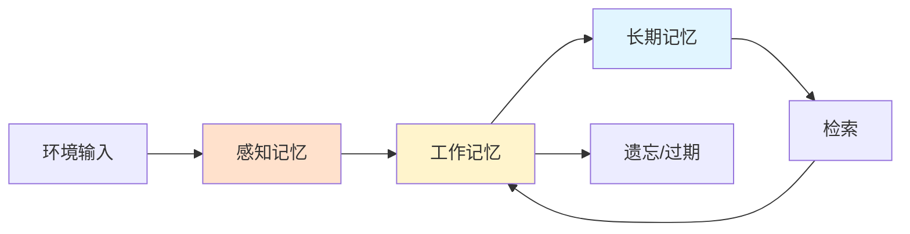
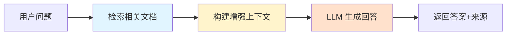
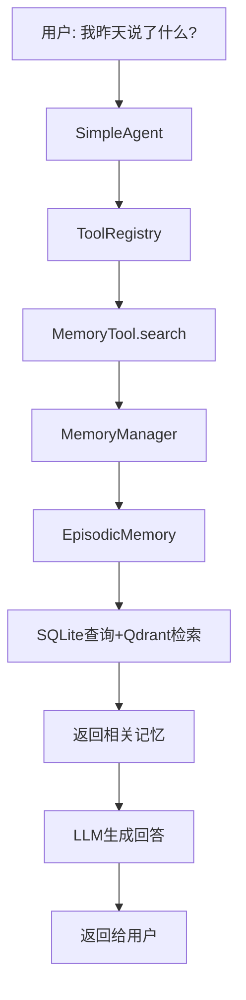
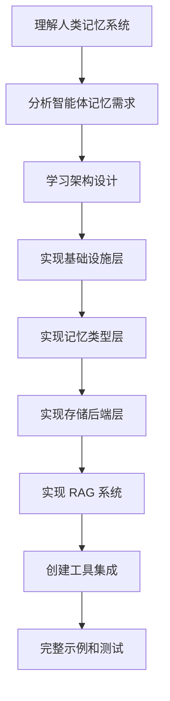
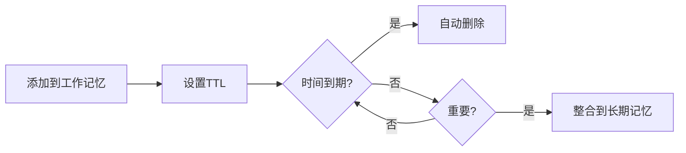

# 第八章：记忆与检索系统详解

> 为 HelloAgents 添加记忆能力和 RAG（检索增强生成）系统

---

## 📚 目录

- [章节概述](#章节概述)
- [从认知科学到智能体记忆](#从认知科学到智能体记忆)
- [为何智能体需要记忆与RAG](#为何智能体需要记忆与rag)
- [记忆与RAG系统架构设计](#记忆与rag系统架构设计)
- [核心学习目标](#核心学习目标)

---

## 章节概述

### 背景与动机

在前面的章节中，我们构建了 HelloAgents 框架的基础架构，实现了多种智能体范式和工具系统。但是，我们的框架还缺少一个关键能力：**记忆**。

**当前问题**：
- ❌ 智能体无法记住之前的交互内容
- ❌ 无法从历史经验中学习
- ❌ 在连续对话或复杂任务中，其表现将受到极大限制

### 本章目标

本章将在第七章构建的框架基础上，为 HelloAgents 增加两个核心能力：

1. **记忆系统（Memory System）**
   - 存储和管理对话历史
   - 支持多种记忆类型
   - 实现智能检索和召回

2. **检索增强生成（RAG, Retrieval-Augmented Generation）**
   - 从外部知识库检索信息
   - 增强 LLM 的知识边界
   - 提供准确、时效性强的答案

### 实现方式

我们将采用"**框架扩展 + 知识科普**"的方式：
- 在构建过程中深入理解 Memory 和 RAG 的理论基础
- 最终实现一个具有完整记忆和识检索能力的智能体系统

---

## 从认知科学到智能体记忆

### 8.1.1 人类记忆系统的启发

在构建智能体的记忆系统之前，让我们从认知科学的角度理解人类是如何处理和存储信息的。

#### 人类记忆的层次结构

人类记忆是一个多层级的认知系统，它不仅能存储信息，还能根据重要性、时间和上下文对信息进行分类和整理。


**认知心理学为理解记忆的结构和过程提供了经典的理论框架**，如图 8.1 所示。

#### 记忆的三个层次

根据认知心理学的研究，人类记忆可以分为以下几个层次：

##### 1. 感觉记忆（Sensory Memory）

**特点**：
- 持续时间极短（0.5-3秒）
- 容量巨大
- 负责暂时保存感觉接收到的所有信息

**组成部分**：
- **视觉记忆（Vision）** - 视觉信息的短暂存储
- **听觉记忆（Hearing）** - 声音信息的短暂存储
- **触觉记忆（Touch）** - 触觉信息的短暂存储
- **其他感官记忆** - 嗅觉、味觉等

**遗忘机制**：
- 大部分信息会被直接遗忘（Forgotten）
- 只有被注意到的信息才会进入短期记忆

**在智能体中的对应**：
```
感觉记忆 → 感知记忆（Perceptual Memory）
- 存储多模态输入（文本、图像、音频）
- 快速过滤和预处理
```

##### 2. 工作记忆（Working Memory）

**特点**：
- 持续时间短（15-30秒）
- 容量有限（7±2个项目）
- 负责当前任务的信息处理

**功能**：
- 临时存储和操作信息
- 支持推理、决策和问题解决
- 通过复述（Rehearsal）可以延长保持时间

**遗忘机制**：
- 由于衰退（decay）而遗忘
- 由于新信息替换（displacement）而遗忘

**在智能体中的对应**：
```
工作记忆 → WorkingMemory
- 存储当前对话上下文
- 支持 TTL（Time To Live）管理
- 纯内存存储，快速访问
```

##### 3. 长期记忆（Long-term Memory）

**特点**：
- 持续时间长（可达终生）
- 容量几乎无限
- 进一步分为多种类型

**子类型**：

**a) 程序性记忆（Procedural Memory）**
- 技能和习惯（如骑自行车）
- 隐性知识，难以用语言描述

**b) 陈述性记忆（Declarative Memory）**
- 可以用语言表达的知识
- 又分为：
  - **语义记忆（Semantic Memory）** - 一般知识和概念（如"巴黎是法国首都"）
  - **情景记忆（Episodic Memory）** - 个人经历和事件（如"昨天的会议内容"）

**遗忘机制**：
- 由于干扰（interference）而遗忘
- 由于检索失败（retrieval failure）而遗忘

**在智能体中的对应**：
```
长期记忆 → 多种记忆类型
├── 语义记忆 → SemanticMemory（知识图谱）
├── 情景记忆 → EpisodicMemory（事件序列）
└── 程序性记忆 → （可以通过工具和技能来实现）
```

#### 记忆系统的关键机制

**1. 存储（Storage）**
- 短期记忆 → 长期记忆的转换
- 需要重复和强化

**2. 检索（Retrieval）**
- 从长期记忆中提取信息
- 可能失败导致"遗忘"

**3. 遗忘（Forgetting）**
- 感觉记忆：大部分信息直接遗忘
- 短期记忆：衰退或被替换
- 长期记忆：干扰或检索失败

### 人类记忆系统对智能体设计的启示

基于人类记忆系统的研究，我们可以为智能体设计类似的分层记忆架构：



**设计原则**：

1. **分层存储**
   - 不同类型的信息存储在不同层次
   - 根据重要性和时效性分配存储策略

2. **智能遗忘**
   - 不是所有信息都需要永久保存
   - 实现 TTL、优先级等遗忘机制

3. **高效检索**
   - 支持语义检索、时间检索、关联检索
   - 使用向量数据库、图数据库等技术

4. **上下文感知**
   - 记忆的检索应该考虑当前上下文
   - 相关性排序和过滤

---

## 为何智能体需要记忆与RAG

### 8.1.2 智能体的记忆需求

借鉴人类记忆系统的设计，我们可以理解为什么智能体也需要类似的记忆能力。

#### 局限一：无状态导致的对话遗忘

**问题描述**：

当前的大语言模型是**无状态**的。这意味着，每一次用户请求（或API调用）都是一次独立的、无关联的计算。模型本身不会自动"记住"上一次对话的内容。这带来了几个问题：

##### 1. 上下文丢失

在长对话中，早期的重要信息可能会因为上下文窗口限制而丢失。

**示例场景**：
```
用户: "我叫张三，今年25岁，是一名软件工程师"
AI:   "你好张三！很高兴认识你"

[经过多轮对话后...]

用户: "我叫什么名字？"
AI:   "抱歉，我不知道你的名字"  ❌ 上下文已丢失
```

##### 2. 个性化缺失

Agent 无法记住用户的偏好、习惯或特定需求。

**示例场景**：
```
用户: "我喜欢简洁的代码风格，不要太多注释"
AI:   "好的，我会注意"

[下次对话]
用户: "帮我写一个函数"
AI:   [生成了大量注释的代码]  ❌ 忘记了用户偏好
```

##### 3. 学习能力受限

无法从过去的成功或失败中学习改进。

**示例场景**：
```
用户: "这个方案不行，我们之前试过了"
AI:   "那我们试试这个方案"
用户: "这个也试过了！"  ❌ 无法从历史中学习
```

##### 4. 一致性问题

在多轮对话中可能出现前后矛盾的回答。

**示例场景**：
```
用户: "Python 和 Java 哪个更好？"
AI:   "Python 更适合快速开发"

[稍后]
用户: "所以你推荐 Java？"
AI:   "是的，Java 更适合企业级应用"  ❌ 前后矛盾
```

**解决方案**：引入记忆系统

```python
# 使用记忆系统
memory_manager.add_to_working_memory("用户名: 张三")
memory_manager.add_to_working_memory("偏好: 简洁代码风格")

# 后续对话可以检索
user_name = memory_manager.search("用户名")
preferences = memory_manager.search("偏好")
```

#### 局限二：模型内置知识的局限性

除了遗忘对话历史，LLM 的另一个核心局限在于其知识的**静态性、有限性**。这些知识完全来自于它的训练数据，并因此带来一系列问题：

##### 1. 知识时效性

大模型的训练数据截止于某个时间点，无法获取最新信息。

**问题示例**：
```
用户: "2024年的奥运会在哪里举办？"
AI:   "我的训练数据截止于2023年，无法回答"  ❌
```

**解决方案**：RAG 从实时数据源检索
```python
# 使用 RAG 检索最新信息
search_results = rag_tool.search("2024年奥运会")
# 结果：巴黎
```

##### 2. 专业领域知识

通用模型在特定领域的深度知识可能不足。

**问题示例**：
```
用户: "我们公司的报销流程是什么？"
AI:   "我不知道你们公司的具体流程"  ❌
```

**解决方案**：RAG 从公司知识库检索
```python
# 从公司文档库检索
company_docs = rag_tool.search("报销流程", source="company_kb")
```

##### 3. 事实准确性

通过检索验证，减少模型的幻觉问题。

**问题示例**：
```
用户: "埃菲尔铁塔有多高？"
AI:   "大约350米"  ❌ 实际是330米
```

**解决方案**：RAG 验证事实
```python
# 从可信数据源验证
facts = rag_tool.search("埃菲尔铁塔高度", source="wikipedia")
# 结果：330米（包括天线）
```

##### 4. 可解释性

提供信息来源，增强回答的可信度。

**改进示例**：
```
用户: "Python 的最佳实践是什么？"
AI:   "根据 PEP 8 官方文档，Python 的最佳实践包括..."
      [来源: https://pep8.org]  ✅ 提供来源
```

### RAG 技术的核心思想

为了克服这一局限，**RAG 技术应运而生**。它的核心思想是：

**在模型生成回答之前，先从一个外部知识库（如文档、数据库、API）中检索出最相关的信息，并将这些信息作为上下文一同提供给模型。**



**RAG 的优势**：

1. **知识时效性** ✅
   - 可以随时更新知识库
   - 获取最新信息

2. **专业领域知识** ✅
   - 针对特定领域构建知识库
   - 深度和准确性更高

3. **可验证性** ✅
   - 提供信息来源
   - 增强可信度

4. **成本效益** ✅
   - 不需要重新训练模型
   - 只需更新知识库

---

## 记忆与RAG系统架构设计

### 8.1.3 HelloAgents 的记忆与 RAG 架构

基于第七章构建的框架基础和认知科学的启发，我们设计了一个**分层的记忆与 RAG 系统架构**，如图 8.2 所示。


这个架构不仅借鉴了人类记忆系统的层次结构，还充分考虑了工程实现的可行度。

### 系统架构的四层设计

记忆系统采用了四层架构设计：

```
HelloAgents记忆系统
├── 基础设施层 (Infrastructure Layer)
│   ├── MemoryManager - 记忆管理器（统一调度和协调）
│   ├── MemoryItem - 记忆数据结构（标准化记忆项）
│   ├── MemoryConfig - 配置管理（系统参数设置）
│   └── BaseMemory - 记忆基类（通用接口定义）
├── 记忆类型层 (Memory Types Layer)
│   ├── WorkingMemory - 工作记忆（临时信息，TTL管理）
│   ├── EpisodicMemory - 情景记忆（具体事件，时间序列）
│   ├── SemanticMemory - 语义记忆（抽象知识，图谱关系）
│   └── PerceptualMemory - 感知记忆（多模态数据）
├── 存储后端层 (Storage Backend Layer)
│   ├── QdrantVectorStore - 向量存储（高性能语义检索）
│   ├── Neo4jGraphStore - 图存储（知识图谱管理）
│   └── SQLiteDocumentStore - 文档存储（结构化持久化）
└── 嵌入服务层 (Embedding Service Layer)
    ├── DashScopeEmbedding - 通义千问（云端API）
    ├── LocalTransformerEmbedding - 本地模型（高效部署）
    └── TFIDFEmbedding - TFIDF嵌入（轻量级版本）
```

### RAG 系统的架构

RAG 系统专注于外部知识的获取和利用：

```
HelloAgents RAG系统
├── 文档处理层 (Document Processing Layer)
│   ├── DocumentProcessor - 文档处理器（多格式解析）
│   └── Document - 文档对象（元数据管理）
├── 嵌入表示层 (Embedding Layer)
│   └── 统一嵌入接口 - 复用记忆系统的嵌入服务
├── 向量存储层 (Vector Storage Layer)
│   └── QdrantVectorStore - 向量数据库（金名空间隔离）
└── 智能问答层 (Intelligent Q&A Layer)
    ├── 多策略检索 - 向量检索 + MQE + HyDE
    ├── 上下文构建 - 智能片段合并与裁剪
    └── LLM增强生成 - 基于上下文的准确回答
```

### 架构层次详解

#### 1. 基础设施层（Infrastructure Layer）

**作用**：提供统一的接口和数据结构

**核心组件**：

**MemoryManager - 记忆管理器**
```python
class MemoryManager:
    """统一管理所有类型的记忆"""
    
    def __init__(self):
        self.working_memory = WorkingMemory()
        self.episodic_memory = EpisodicMemory()
        self.semantic_memory = SemanticMemory()
        self.perceptual_memory = PerceptualMemory()
    
    def add(self, content: str, memory_type: str):
        """添加记忆到指定类型"""
        pass
    
    def search(self, query: str, memory_types: List[str] = None):
        """跨类型搜索记忆"""
        pass
```

**MemoryItem - 记忆数据结构**
```python
class MemoryItem(BaseModel):
    """标准化的记忆项"""
    id: str
    content: str
    timestamp: datetime
    memory_type: str
    metadata: Dict[str, Any]
    importance: float  # 重要性评分
    ttl: Optional[int]  # 生存时间
```

**BaseMemory - 记忆基类**
```python
class BaseMemory(ABC):
    """所有记忆类型的基类"""
    
    @abstractmethod
    def add(self, item: MemoryItem):
        """添加记忆"""
        pass
    
    @abstractmethod
    def search(self, query: str, top_k: int = 5):
        """搜索记忆"""
        pass
```

#### 2. 记忆类型层（Memory Types Layer）

**作用**：实现不同类型记忆的具体逻辑

**WorkingMemory - 工作记忆**
```python
class WorkingMemory(BaseMemory):
    """工作记忆：临时信息，TTL管理，纯内存"""
    
    def __init__(self, ttl: int = 3600):
        self.memory: Dict[str, MemoryItem] = {}
        self.default_ttl = ttl
    
    def add(self, item: MemoryItem):
        """添加到内存，设置过期时间"""
        item.ttl = item.ttl or self.default_ttl
        self.memory[item.id] = item
    
    def cleanup_expired(self):
        """清理过期记忆"""
        current_time = datetime.now()
        expired = [
            id for id, item in self.memory.items()
            if (current_time - item.timestamp).seconds > item.ttl
        ]
        for id in expired:
            del self.memory[id]
```

**EpisodicMemory - 情景记忆**
```python
class EpisodicMemory(BaseMemory):
    """情景记忆：具体事件，时间序列，SQLite+Qdrant"""
    
    def __init__(self):
        self.doc_store = SQLiteDocumentStore()
        self.vector_store = QdrantVectorStore(collection="episodic")
    
    def add(self, item: MemoryItem):
        """存储事件到数据库和向量库"""
        # 结构化存储
        self.doc_store.add(item)
        # 向量化存储（用于语义检索）
        embedding = self.embedding_service.embed(item.content)
        self.vector_store.add(item.id, embedding, item.metadata)
```

**SemanticMemory - 语义记忆**
```python
class SemanticMemory(BaseMemory):
    """语义记忆：抽象知识，知识图谱，Qdrant+Neo4j"""
    
    def __init__(self):
        self.vector_store = QdrantVectorStore(collection="semantic")
        self.graph_store = Neo4jGraphStore()
    
    def add_knowledge(self, subject: str, predicate: str, object: str):
        """添加知识三元组到图谱"""
        self.graph_store.add_triple(subject, predicate, object)
    
    def search_related(self, concept: str):
        """搜索相关概念"""
        return self.graph_store.find_related(concept)
```

**PerceptualMemory - 感知记忆**
```python
class PerceptualMemory(BaseMemory):
    """感知记忆：多模态数据，SQLite+Qdrant"""
    
    def __init__(self):
        self.doc_store = SQLiteDocumentStore()
        self.vector_store = QdrantVectorStore(collection="perceptual")
    
    def add_multimodal(self, content: str, modality: str, data: bytes):
        """存储多模态数据"""
        item = MemoryItem(
            content=content,
            metadata={"modality": modality, "data": data}
        )
        self.add(item)
```

#### 3. 存储后端层（Storage Backend Layer）

**作用**：提供持久化存储能力

**QdrantVectorStore - 向量存储**
```python
class QdrantVectorStore:
    """高性能向量检索"""
    
    def __init__(self, collection: str):
        self.client = QdrantClient(...)
        self.collection = collection
    
    def add(self, id: str, vector: List[float], metadata: Dict):
        """添加向量"""
        self.client.upsert(
            collection_name=self.collection,
            points=[PointStruct(id=id, vector=vector, payload=metadata)]
        )
    
    def search(self, query_vector: List[float], top_k: int = 5):
        """语义搜索"""
        return self.client.search(
            collection_name=self.collection,
            query_vector=query_vector,
            limit=top_k
        )
```

**Neo4jGraphStore - 图存储**
```python
class Neo4jGraphStore:
    """知识图谱管理"""
    
    def add_triple(self, subject: str, predicate: str, object: str):
        """添加三元组"""
        query = """
        MERGE (s:Entity {name: $subject})
        MERGE (o:Entity {name: $object})
        MERGE (s)-[r:RELATION {type: $predicate}]->(o)
        """
        self.session.run(query, subject=subject, predicate=predicate, object=object)
```

**SQLiteDocumentStore - 文档存储**
```python
class SQLiteDocumentStore:
    """结构化持久化"""
    
    def add(self, item: MemoryItem):
        """存储记忆项"""
        self.cursor.execute("""
            INSERT INTO memories (id, content, timestamp, metadata)
            VALUES (?, ?, ?, ?)
        """, (item.id, item.content, item.timestamp, json.dumps(item.metadata)))
```

#### 4. 嵌入服务层（Embedding Service Layer）

**作用**：将文本转换为向量表示

```python
class EmbeddingService:
    """统一嵌入服务接口"""
    
    def __init__(self, provider: str = "dashscope"):
        if provider == "dashscope":
            self.embedder = DashScopeEmbedding()
        elif provider == "local":
            self.embedder = LocalTransformerEmbedding()
        else:
            self.embedder = TFIDFEmbedding()
    
    def embed(self, text: str) -> List[float]:
        """生成文本嵌入向量"""
        return self.embedder.embed(text)
```

### 工具层集成

记忆和 RAG 功能通过工具的形式提供给 Agent：

```python
# tools/builtin/memory_tool.py
class MemoryTool(Tool):
    """记忆工具：Agent记忆能力"""
    
    def __init__(self, memory_manager: MemoryManager):
        super().__init__(
            name="memory",
            description="记忆管理工具",
            expandable=True
        )
        self.manager = memory_manager
    
    @tool_action("add", "添加记忆")
    def _add(self, content: str, memory_type: str = "working"):
        """添加记忆"""
        return self.manager.add(content, memory_type)
    
    @tool_action("search", "搜索记忆")
    def _search(self, query: str):
        """搜索记忆"""
        return self.manager.search(query)

# tools/builtin/rag_tool.py
class RAGTool(Tool):
    """RAG工具：智能问答能力"""
    
    def __init__(self, rag_pipeline: RAGPipeline):
        super().__init__(
            name="rag",
            description="检索增强生成工具"
        )
        self.pipeline = rag_pipeline
    
    def run(self, parameters: Dict[str, Any]) -> str:
        """执行 RAG 检索和生成"""
        query = parameters.get("query")
        results = self.pipeline.retrieve_and_generate(query)
        return results
```

### 数据流向示例

**场景：用户询问"我昨天说了什么？"**



---

## 核心学习目标

### 8.1.4 本章学习目标和快速体验

通过本章的学习，你将掌握：

#### 理论层面

1. **认知科学基础**
   - 理解人类记忆系统的层次结构
   - 了解感觉记忆、工作记忆、长期记忆的特点
   - 掌握记忆的存储、检索和遗忘机制

2. **智能体记忆需求**
   - 理解无状态 LLM 的局限性
   - 掌握记忆系统的设计原则
   - 了解 RAG 技术的核心思想

3. **架构设计思想**
   - 理解分层架构的优势
   - 掌握记忆类型的划分逻辑
   - 了解存储后端的选择依据

#### 实践层面

1. **记忆系统实现**
   - 实现 WorkingMemory（工作记忆）
   - 实现 EpisodicMemory（情景记忆）
   - 实现 SemanticMemory（语义记忆）
   - 实现 PerceptualMemory（感知记忆）

2. **RAG 系统实现**
   - 实现文档处理和解析
   - 实现向量检索
   - 实现智能问答流程

3. **工具集成**
   - 创建 MemoryTool
   - 创建 RAGTool
   - 集成到 Agent 中

### 项目结构预览

本章完成后，项目结构将扩展为：

```
hello-agents/
├── hello_agents/
│   ├── memory/                   # 🆕 记忆系统模块
│   │   ├── base.py               # 基础数据结构
│   │   ├── manager.py            # 记忆管理器
│   │   ├── embedding.py          # 统一嵌入服务
│   │   ├── types/                # 记忆类型实现
│   │   │   ├── working.py        # 工作记忆
│   │   │   ├── episodic.py       # 情景记忆
│   │   │   ├── semantic.py       # 语义记忆
│   │   │   └── perceptual.py     # 感知记忆
│   │   ├── storage/              # 存储后端实现
│   │   │   ├── qdrant_store.py   # Qdrant向量存储
│   │   │   ├── neo4j_store.py    # Neo4j图存储
│   │   │   └── document_store.py # SQLite文档存储
│   │   └── rag/                  # RAG系统
│   │       ├── pipeline.py       # RAG管道
│   │       └── document.py       # 文档处理器
│   └── tools/builtin/            # 🆕 扩展内置工具
│       ├── memory_tool.py        # 记忆工具
│       └── rag_tool.py           # RAG工具
```

### 快速体验示例

完成本章学习后，你将能够创建具有记忆能力的 Agent：

```python
from hello_agents import MySimpleAgent, HelloAgentsLLM
from hello_agents.memory import MemoryManager
from hello_agents.tools.builtin import MemoryTool, RAGTool

# 1. 创建记忆管理器
memory_manager = MemoryManager()

# 2. 创建工具
memory_tool = MemoryTool(memory_manager)
rag_tool = RAGTool(rag_pipeline)

# 3. 创建 Agent
llm = HelloAgentsLLM(provider="deepseek")
agent = MySimpleAgent(
    name="MemoryAgent",
    llm=llm,
    tools=[memory_tool, rag_tool]
)

# 4. 使用
agent.run("记住：我叫张三，今年25岁")
agent.run("我叫什么名字？")  # ✅ 从记忆中检索
agent.run("Python 的最佳实践是什么？")  # ✅ 从 RAG 检索
```

---

## 学习路线

### 推荐学习顺序



### 学习检查清单

#### 理论理解
- [ ] 理解人类记忆的三个层次
- [ ] 理解感觉记忆、工作记忆、长期记忆的区别
- [ ] 理解记忆的存储、检索、遗忘机制
- [ ] 理解智能体为何需要记忆
- [ ] 理解 RAG 技术的核心思想
- [ ] 理解分层架构的设计原则

#### 架构掌握
- [ ] 理解四层架构的职责划分
- [ ] 理解不同记忆类型的适用场景
- [ ] 理解存储后端的选择依据
- [ ] 理解嵌入服务的作用

#### 实践能力
- [ ] 能够实现 WorkingMemory
- [ ] 能够实现 EpisodicMemory
- [ ] 能够实现 SemanticMemory
- [ ] 能够实现 RAG 流程
- [ ] 能够创建记忆工具
- [ ] 能够集成到 Agent 中

---

## 8.2 记忆系统：让智能体拥有记忆

### 8.2.1 记忆系统的工作流程

在进入代码实现阶段前，我们需要先定义记忆系统的工作流程。该流程参考了认知科学中的记忆模型，并将每个认知阶段映射为具体的技术组件和操作。理解这一映射关系，有助于我们后续的代码实现。

#### 记忆形成的认知过程


如图 8.3 所示，根据认知科学的研究，人类记忆的形成过程可以分为几个阶段：

##### 1. 编码（Encoding）

**定义**：将感知到的信息转换为可存储的形式

**在智能体中的实现**：
```python
# 外部信息处理
def encode_input(sensory_input: str) -> MemoryItem:
    """将感觉输入编码为记忆项"""
    
    # 1. 文本预处理
    cleaned_text = preprocess(sensory_input)
    
    # 2. 生成向量表示
    embedding = embedding_service.embed(cleaned_text)
    
    # 3. 提取元数据
    metadata = extract_metadata(cleaned_text)
    
    # 4. 创建记忆项
    memory_item = MemoryItem(
        content=cleaned_text,
        embedding=embedding,
        metadata=metadata,
        timestamp=datetime.now()
    )
    
    return memory_item
```

**关键技术**：
- 文本清洗和标准化
- 向量嵌入（Embedding）
- 元数据提取（时间、类型、重要性等）

##### 2. 存储（Storage）

**定义**：将编码后的信息保存在记忆系统中

**在智能体中的实现**：
```python
def store_memory(memory_item: MemoryItem):
    """存储记忆到合适的记忆类型"""
    
    # 决策：存储到哪种记忆类型
    if is_temporary(memory_item):
        # 临时信息 → 工作记忆
        working_memory.add(memory_item)
    elif is_event(memory_item):
        # 事件信息 → 情景记忆
        episodic_memory.add(memory_item)
    elif is_knowledge(memory_item):
        # 知识信息 → 语义记忆
        semantic_memory.add(memory_item)
    elif is_multimodal(memory_item):
        # 多模态 → 感知记忆
        perceptual_memory.add(memory_item)
```

**存储策略**：
- **信息重要性判断** - 决定是否需要长期存储
- **信息类型识别** - 决定存储到哪种记忆类型
- **整合与关联** - 与已有记忆建立联系（Consolidation）

##### 3. 检索（Retrieval）

**定义**：根据需要从记忆中提取相关信息

**在智能体中的实现**：
```python
def retrieve_memory(query: str, memory_types: List[str] = None) -> List[MemoryItem]:
    """从记忆系统中检索相关信息"""
    
    # 1. 编码查询
    query_embedding = embedding_service.embed(query)
    
    # 2. 跨类型搜索
    results = []
    for memory_type in (memory_types or ALL_MEMORY_TYPES):
        memory = get_memory_by_type(memory_type)
        matches = memory.search(query_embedding, top_k=5)
        results.extend(matches)
    
    # 3. 相关性排序
    results = sort_by_relevance(results, query)
    
    # 4. 返回Top-K
    return results[:10]
```

**检索策略**：
- **语义检索** - 基于向量相似度
- **时间检索** - 基于时间范围
- **关联检索** - 基于知识图谱关系
- **混合检索** - 组合多种策略

##### 4. 整合（Consolidation）

**定义**：将短期记忆转化为长期记忆

**在智能体中的实现**：
```python
def consolidate_memories():
    """整合记忆：工作记忆 → 长期记忆"""
    
    # 1. 获取工作记忆中的重要信息
    important_items = working_memory.get_important_items()
    
    # 2. 转移到长期记忆
    for item in important_items:
        if is_event(item):
            episodic_memory.add(item)
        elif is_knowledge(item):
            semantic_memory.add(item)
    
    # 3. 从工作记忆中清除
    working_memory.remove(important_items)
```

**整合时机**：
- 定期整合（如每小时）
- 重要性触发（高重要性立即整合）
- 容量触发（工作记忆满时整合）

##### 5. 遗忘（Forgetting）

**定义**：删除不重要或过时的信息

**在智能体中的实现**：
```python
def forget_memories():
    """遗忘机制：清理过期和低价值记忆"""
    
    # 1. 工作记忆：TTL过期
    working_memory.cleanup_expired()
    
    # 2. 长期记忆：重要性衰减
    for memory_type in [episodic_memory, semantic_memory]:
        low_importance = memory_type.get_low_importance_items()
        memory_type.remove(low_importance)
```

**遗忘策略**：
- **TTL 遗忘** - 工作记忆的时间限制
- **重要性遗忘** - 低重要性的记忆被删除
- **容量遗忘** - 达到容量上限时删除旧记忆
- **干扰遗忘** - 相似记忆之间的干扰

#### 完整工作流程图


如图 8.4 所示，HelloAgents 记忆系统的完整工作流程包括记忆的添加、检索、整合和遗忘等关键环节。

### 四种记忆类型的详细说明

我们的记忆系统由四种不同类型的记忆模块构成，每种模块都针对特定的应用场景和生命周期进行了优化：

#### 1. 工作记忆（Working Memory）

**核心特点**：
- ⏱️ **短期记忆** - 主要用于智能体"短期记忆"的角色
- 🚀 **快速访问** - 纯内存存储，访问速度极快
- ⏰ **TTL 管理** - 自动过期机制（例如，默认 50 秒）
- 📊 **容量限制** - 有容量限制，会自动清理

**适用场景**：
```python
# 场景1: 当前对话上下文
working_memory.add("用户刚才说他叫张三")
working_memory.add("用户想要查询天气")

# 场景2: 临时计算结果
working_memory.add("中间计算结果: 42")

# 场景3: 会话状态
working_memory.add("当前状态: 等待用户确认")
```

**实现要点**：
```python
class WorkingMemory(BaseMemory):
    def __init__(self, ttl: int = 50, max_items: int = 100):
        self.memory: Dict[str, MemoryItem] = {}
        self.default_ttl = ttl
        self.max_items = max_items
    
    def add(self, item: MemoryItem):
        """添加记忆，自动设置过期时间"""
        if len(self.memory) >= self.max_items:
            self._evict_oldest()  # 容量满时清理最旧的
        
        item.ttl = item.ttl or self.default_ttl
        item.expire_at = datetime.now() + timedelta(seconds=item.ttl)
        self.memory[item.id] = item
    
    def cleanup_expired(self):
        """清理过期记忆"""
        current_time = datetime.now()
        expired_ids = [
            id for id, item in self.memory.items()
            if item.expire_at < current_time
        ]
        for id in expired_ids:
            del self.memory[id]
```

**生命周期**：


#### 2. 情景记忆（Episodic Memory）

**核心特点**：
- 📅 **事件序列** - 存储具体的交互事件和智能体的学习经历
- 🔗 **时间关联** - 支持按时间序列主题进行回顾和检索
- 📚 **学习基础** - 是智能体"复盘"和学习过往经验的基础
- 💾 **持久化存储** - SQLite + Qdrant 双重存储

**适用场景**：
```python
# 场景1: 对话历史
episodic_memory.add("2024-01-20 10:30 - 用户询问了Python的最佳实践")
episodic_memory.add("2024-01-20 10:32 - 我推荐了PEP 8规范")

# 场景2: 任务执行记录
episodic_memory.add("任务: 数据分析 - 成功完成，用时30分钟")

# 场景3: 错误和修正
episodic_memory.add("错误: 使用了错误的API - 已修正")
```

**实现要点**：
```python
class EpisodicMemory(BaseMemory):
    def __init__(self):
        self.doc_store = SQLiteDocumentStore()  # 结构化存储
        self.vector_store = QdrantVectorStore(collection="episodic")  # 语义检索
    
    def add(self, item: MemoryItem):
        """存储事件到双重存储"""
        # 1. 结构化存储（支持时间查询）
        self.doc_store.add(item)
        
        # 2. 向量存储（支持语义检索）
        embedding = embedding_service.embed(item.content)
        self.vector_store.add(
            id=item.id,
            vector=embedding,
            payload={
                "content": item.content,
                "timestamp": item.timestamp.isoformat(),
                "metadata": item.metadata
            }
        )
    
    def search_by_time(self, start_time: datetime, end_time: datetime):
        """按时间范围检索"""
        return self.doc_store.query_by_time_range(start_time, end_time)
    
    def search_by_semantic(self, query: str, top_k: int = 5):
        """语义检索"""
        query_embedding = embedding_service.embed(query)
        return self.vector_store.search(query_embedding, top_k)
```

**查询示例**：
```python
# 时间查询
yesterday_events = episodic_memory.search_by_time(
    start_time=datetime.now() - timedelta(days=1),
    end_time=datetime.now()
)

# 语义查询
related_events = episodic_memory.search_by_semantic("Python编程错误")
```

#### 3. 语义记忆（Semantic Memory）

**核心特点**：
- 🧠 **抽象知识** - 存储更抽象的知识、概念和规则
- 🕸️ **知识图谱** - 通过对话学习解到的用户偏好、需要长期遵守的指令或概念
- 🔍 **关系推理** - 支持复杂的关系查询和推理
- 💎 **高价值** - 持久性和重要性最高

**适用场景**：
```python
# 场景1: 用户偏好
semantic_memory.add_knowledge(
    subject="张三",
    predicate="偏好",
    object="简洁的代码风格"
)

# 场景2: 概念关系
semantic_memory.add_knowledge(
    subject="Python",
    predicate="是一种",
    object="编程语言"
)

# 场景3: 规则和约束
semantic_memory.add_knowledge(
    subject="代码审查",
    predicate="必须包含",
    object="单元测试"
)
```

**实现要点**：
```python
class SemanticMemory(BaseMemory):
    def __init__(self):
        self.vector_store = QdrantVectorStore(collection="semantic")  # 语义检索
        self.graph_store = Neo4jGraphStore()  # 知识图谱
    
    def add_knowledge(self, subject: str, predicate: str, object: str):
        """添加知识三元组"""
        # 1. 添加到知识图谱
        self.graph_store.add_triple(subject, predicate, object)
        
        # 2. 向量化存储（支持语义检索）
        knowledge_text = f"{subject} {predicate} {object}"
        embedding = embedding_service.embed(knowledge_text)
        self.vector_store.add(
            id=f"{subject}_{predicate}_{object}",
            vector=embedding,
            payload={
                "subject": subject,
                "predicate": predicate,
                "object": object
            }
        )
    
    def find_related(self, concept: str, max_depth: int = 2):
        """查找相关概念（图谱遍历）"""
        return self.graph_store.find_related(concept, max_depth)
    
    def query_by_pattern(self, subject=None, predicate=None, object=None):
        """模式查询"""
        return self.graph_store.query(subject, predicate, object)
```

**知识图谱示例**：
```
张三 --[偏好]--> 简洁代码
张三 --[职业]--> 软件工程师
Python --[是一种]--> 编程语言
Python --[适用于]--> 快速开发
简洁代码 --[要求]--> 少注释
```

**查询示例**：
```python
# 查询用户偏好
preferences = semantic_memory.query_by_pattern(
    subject="张三",
    predicate="偏好"
)

# 查找相关概念
related = semantic_memory.find_related("Python")
# 结果: [编程语言, 快速开发, ...]
```

#### 4. 感知记忆（Perceptual Memory）

**核心特点**：
- 🎨 **多模态** - 专门处理图像、音频等多模态信息
- 📦 **原始数据** - 保存原始感知数据
- 🔄 **预处理** - 支持多模态数据的预处理和特征提取
- 💾 **混合存储** - SQLite（元数据）+ Qdrant（特征向量）

**适用场景**：
```python
# 场景1: 图像记忆
perceptual_memory.add_multimodal(
    content="用户上传的产品图片",
    modality="image",
    data=image_bytes
)

# 场景2: 音频记忆
perceptual_memory.add_multimodal(
    content="用户的语音指令",
    modality="audio",
    data=audio_bytes
)

# 场景3: 视频记忆
perceptual_memory.add_multimodal(
    content="演示视频",
    modality="video",
    data=video_bytes
)
```

**实现要点**：
```python
class PerceptualMemory(BaseMemory):
    def __init__(self):
        self.doc_store = SQLiteDocumentStore()  # 存储元数据和引用
        self.vector_store = QdrantVectorStore(collection="perceptual")  # 特征向量
        self.file_store = FileStore()  # 存储原始文件
    
    def add_multimodal(self, content: str, modality: str, data: bytes):
        """存储多模态数据"""
        # 1. 保存原始文件
        file_path = self.file_store.save(data, modality)
        
        # 2. 提取特征向量
        if modality == "image":
            features = extract_image_features(data)
        elif modality == "audio":
            features = extract_audio_features(data)
        else:
            features = extract_generic_features(data)
        
        # 3. 存储元数据
        item = MemoryItem(
            content=content,
            metadata={
                "modality": modality,
                "file_path": file_path,
                "size": len(data)
            }
        )
        self.doc_store.add(item)
        
        # 4. 存储特征向量
        self.vector_store.add(
            id=item.id,
            vector=features,
            payload=item.metadata
        )
```

### 记忆类型对比表

| 特性 | 工作记忆 | 情景记忆 | 语义记忆 | 感知记忆 |
|------|---------|---------|---------|---------|
| **生命周期** | 短期（秒-分钟） | 长期 | 长期 | 长期 |
| **存储方式** | 纯内存 | SQLite + Qdrant | Qdrant + Neo4j | SQLite + Qdrant + 文件 |
| **容量限制** | 有限制 | 较大 | 较大 | 较大 |
| **检索方式** | 键值查询 | 时间+语义 | 图谱+语义 | 特征匹配 |
| **典型内容** | 对话上下文 | 事件序列 | 知识概念 | 图像音频 |
| **重要性** | 低-中 | 中 | 高 | 中 |
| **遗忘机制** | TTL自动过期 | 重要性衰减 | 很少遗忘 | 容量限制 |

### 记忆系统的统一管理

所有记忆类型通过 `MemoryManager` 统一管理：

```python
class MemoryManager:
    """记忆管理器：统一协调所有记忆类型"""
    
    def __init__(self):
        self.working = WorkingMemory()
        self.episodic = EpisodicMemory()
        self.semantic = SemanticMemory()
        self.perceptual = PerceptualMemory()
    
    def add(self, content: str, memory_type: str = "auto"):
        """智能添加记忆"""
        if memory_type == "auto":
            memory_type = self._classify_memory_type(content)
        
        memory = self._get_memory(memory_type)
        item = MemoryItem(content=content, memory_type=memory_type)
        memory.add(item)
    
    def search(self, query: str, memory_types: List[str] = None):
        """跨类型搜索"""
        results = []
        for mem_type in (memory_types or ["working", "episodic", "semantic"]):
            memory = self._get_memory(mem_type)
            matches = memory.search(query)
            results.extend(matches)
        
        return self._rank_results(results, query)
    
    def consolidate(self):
        """整合记忆：工作记忆 → 长期记忆"""
        important_items = self.working.get_important_items()
        for item in important_items:
            if self._is_event(item):
                self.episodic.add(item)
            elif self._is_knowledge(item):
                self.semantic.add(item)
```

---

## 下一步

在理解了记忆与 RAG 系统的理论基础和架构设计后，我们将在后续章节中：

1. **详细实现基础设施层**
   - MemoryItem 数据结构
   - BaseMemory 基类
   - MemoryManager 管理器

2. **实现各种记忆类型**
   - WorkingMemory 的 TTL 管理
   - EpisodicMemory 的时间序列存储
   - SemanticMemory 的知识图谱
   - PerceptualMemory 的多模态处理

3. **实现存储后端**
   - Qdrant 向量存储
   - Neo4j 图存储
   - SQLite 文档存储

4. **实现 RAG 系统**
   - 文档处理和解析
   - 向量检索
   - 智能问答流程

5. **创建工具集成**
   - MemoryTool 实现
   - RAGTool 实现
   - Agent 集成示例

让我们开始这个激动人心的旅程！

---

**相关笔记**：
- [工具系统详解](./07_工具系统详解.md) - 了解如何创建和注册工具
- [Agent 基类详解](./03_Agent基类详解.md) - 了解 Agent 的基础架构
