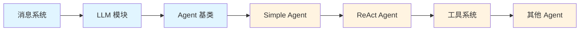

# HelloAgents 详细学习笔记

> 深入理解每个模块的实现细节和设计思想

---

## 📖 笔记索引

### 核心模块

1. **[LLM 模块详解](./01_LLM模块详解.md)** ⭐⭐⭐
   - OpenAI 兼容接口原理
   - 多厂商自动检测机制
   - 流式响应实现
   - 厂商配置详解
   - 实战示例和常见问题

2. **[消息系统详解](./02_消息系统详解.md)** ⭐⭐
   - Message 类设计
   - 四种消息角色详解
   - Pydantic 基础知识
   - 消息序列化和管理
   - System Prompt 设计技巧

3. **[Agent 基类详解](./03_Agent基类详解.md)** ⭐⭐⭐
   - 抽象基类设计模式
   - 核心属性和方法
   - 历史记录管理
   - 如何创建自定义 Agent
   - 继承与扩展实战

### Agent 模式

4. **[Simple Agent 详解](./04_SimpleAgent详解.md)** ⭐⭐
   - 基础对话实现
   - 工具调用机制
   - 参数解析逻辑
   - 多轮工具调用流程

5. **[ReAct Agent 详解](./05_ReActAgent详解.md)** ⭐⭐⭐
   - ReAct 范式原理
   - Thought-Action-Observation 循环
   - Prompt 设计技巧
   - 工具调用解析
   - 完整执行流程

6. **[其他 Agent 模式](./06_其他Agent模式.md)** ⭐⭐
   - Plan-Solve Agent
   - Reflection Agent
   - Function Call Agent
   - 模式对比和选择

### 工具系统

7. **[工具系统详解](./07_工具系统详解.md)** ⭐⭐⭐ ✅
   - Tool 基类设计
   - 工具注册机制（两种方式）
   - @tool_action 装饰器
   - 参数自动解析
   - 工具链编排（ToolChain）
   - 异步执行器（并行执行）

### 实战指南

8. **[学习路线指南](./08_学习路线指南.md)** ⭐⭐⭐
   - 推荐学习顺序
   - 每个阶段的目标
   - 实战项目建议
   - 常见问题汇总

---

## 🎯 如何使用这些笔记

### 初学者路线

**建议顺序**：
1. 先看 **消息系统** - 最简单，理解基础数据结构
2. 再看 **LLM 模块** - 理解如何调用大模型
3. 然后看 **Agent 基类** - 理解 Agent 的通用设计
4. 接着看 **Simple Agent** - 最简单的 Agent 实现
5. 深入学习 **ReAct Agent** - 经典且重要的模式
6. 最后看 **工具系统** - 理解工具的设计和使用

### 进阶学习路线

如果你已经有基础，可以：
1. 直接从 **ReAct Agent** 开始
2. 深入研究 **工具系统**
3. 对比学习 **其他 Agent 模式**
4. 参考 **学习路线指南** 做实战项目

---

## 📝 笔记特色

### 1. 完整的代码分析
每个方法都有详细的代码解析和注释

### 2. 丰富的流程图
使用 Mermaid 图表展示复杂流程

### 3. 实战示例
每个概念都配有可运行的代码示例

### 4. 最佳实践
总结了实际开发中的经验和技巧

### 5. 学习检查清单
帮助你检验学习成果

---

## 🔍 快速查找

### 按主题查找

| 主题 | 相关笔记 |
|------|---------|
| 如何调用 LLM | [01_LLM模块详解](./01_LLM模块详解.md) |
| 如何设计 Prompt | [02_消息系统详解](./02_消息系统详解.md) |
| 如何创建 Agent | [03_Agent基类详解](./03_Agent基类详解.md) |
| 如何使用工具 | [04_SimpleAgent详解](./04_SimpleAgent详解.md) |
| ReAct 原理 | [05_ReActAgent详解](./05_ReActAgent详解.md) |
| 工具开发 | [07_工具系统详解](./07_工具系统详解.md) |

### 按难度查找

| 难度 | 笔记 |
|------|------|
| ⭐ 入门 | 消息系统 |
| ⭐⭐ 基础 | LLM 模块、Simple Agent |
| ⭐⭐⭐ 进阶 | Agent 基类、ReAct Agent、工具系统 |
| ⭐⭐⭐⭐ 高级 | 其他 Agent 模式、自定义扩展 |

---

## 💡 学习建议

### 1. 边学边练
每看完一个笔记，立即动手实践其中的示例代码

### 2. 做好标记
在笔记中勾选学习检查清单，追踪学习进度

### 3. 记录问题
遇到不理解的地方，在笔记中做标记，后续重点学习

### 4. 实战项目
学完基础后，尝试做一个完整的 Agent 项目

### 5. 对比学习
对比不同 Agent 模式的优缺点，理解适用场景

---

## 🚀 实战项目建议

### 初级项目
- [ ] 实现一个简单的问答 Agent
- [ ] 添加一个自定义工具
- [ ] 实现对话历史管理

### 中级项目
- [ ] 实现一个 ReAct Agent
- [ ] 集成多个工具（搜索、计算、文件读写）
- [ ] 实现工具调用的错误处理

### 高级项目
- [ ] 实现一个完整的代码助手
- [ ] 支持多种 Agent 模式切换
- [ ] 实现 Agent 的性能监控
- [ ] 设计一个 Agent 编排系统

---

## 📚 参考资源

### 论文
- **ReAct**: Synergizing Reasoning and Acting in Language Models
- **Plan-and-Solve**: Improving Zero-Shot Chain-of-Thought Reasoning
- **Reflexion**: Language Agents with Verbal Reinforcement Learning

### 开源项目
- **LangChain**: 最流行的 LLM 应用框架
- **AutoGPT**: 自主 Agent 的先驱
- **BabyAGI**: 简洁的任务驱动 Agent

### 学习资料
- OpenAI API 文档
- Anthropic Claude 文档
- LangChain 官方文档

---

## 🔄 更新日志

### 2026-01-24
- ✅ 创建 LLM 模块详解
- ✅ 创建消息系统详解
- ✅ 创建 Agent 基类详解
- 🚧 Simple Agent 详解（进行中）
- 🚧 ReAct Agent 详解（进行中）
- 🚧 工具系统详解（进行中）

---

**开始学习**: 从 [消息系统详解](./02_消息系统详解.md) 开始你的学习之旅！
