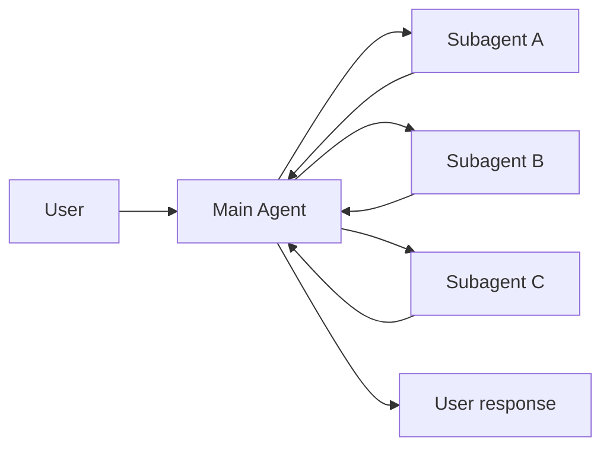
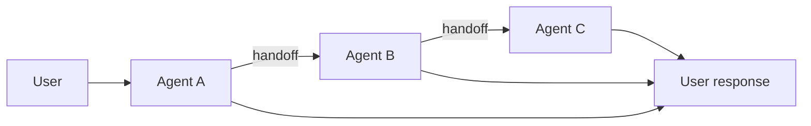
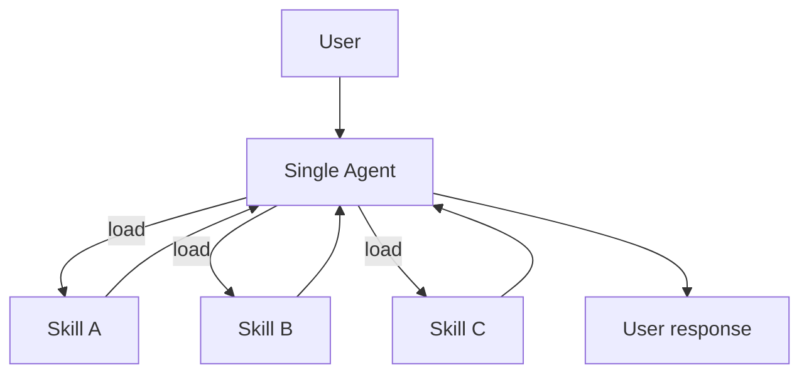
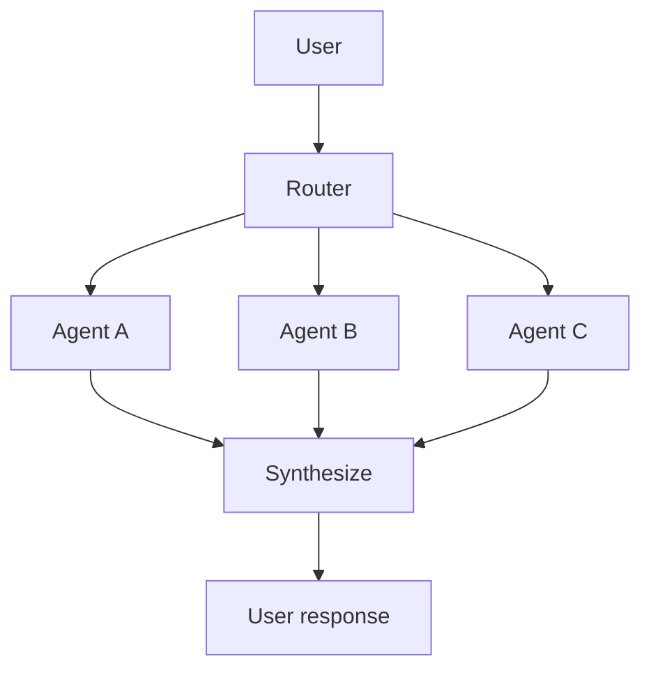

# 多 Agent 概述

多 Agent 系统通过协调多个专门化的组件来处理复杂工作流。但并非所有复杂任务都需要这种方式——单个 Agent 配合合适的工具和提示词通常也能达到类似效果。

## 为什么需要多 Agent？

当开发者说需要"多 Agent"时，通常是在寻找以下能力：

| 需求 | 说明 |
|------|------|
| **上下文管理** | 提供专门知识而不会压垮模型的 context window。如果上下文无限且延迟为零，你可以把所有知识塞进一个 prompt——但现实不是这样，需要模式来选择性地呈现相关信息 |
| **分布式开发** | 允许不同团队独立开发和维护各自的能力，通过清晰的边界组合成更大的系统 |
| **并行化** | 为子任务生成专门的 worker 并发执行，加快结果返回 |

**适用场景：**
- 单个 Agent 工具太多，难以正确选择
- 任务需要专门知识和大量上下文（长 prompt、领域特定工具）
- 需要强制顺序约束，满足条件后才解锁某些能力

> **核心：** 多 Agent 设计的核心是**上下文工程**——决定每个 Agent 看到什么信息。系统质量取决于确保每个 Agent 能访问其任务所需的正确数据。

## 五种模式

| 模式 | 工作方式 |
|------|----------|
| **Subagents** | 主 Agent 把子 Agent 当作工具调用，所有路由都经过主 Agent |
| **Handoffs** | 行为根据状态动态变化，工具调用更新状态变量触发路由或配置变更 |
| **Skills** | 按需加载专门的提示词和知识，单个 Agent 保持控制权 |
| **Router** | 路由步骤分类输入并分发给专门的 Agent，结果合成为统一响应 |
| **Custom workflow** | 用 LangGraph 构建自定义执行流程，混合确定性逻辑和 Agent 行为 |

## 模式选择

| 模式 | 分布式开发 | 并行化 | 多跳 | 直接用户交互 |
|------|:----------:|:------:|:----:|:------------:|
| **Subagents** | ⭐⭐⭐⭐⭐ | ⭐⭐⭐⭐⭐ | ⭐⭐⭐⭐⭐ | ⭐ |
| **Handoffs** | — | — | ⭐⭐⭐⭐⭐ | ⭐⭐⭐⭐⭐ |
| **Skills** | ⭐⭐⭐⭐⭐ | ⭐⭐⭐ | ⭐⭐⭐⭐⭐ | ⭐⭐⭐⭐⭐ |
| **Router** | ⭐⭐⭐ | ⭐⭐⭐⭐⭐ | — | ⭐⭐⭐ |

**指标说明：**
- **分布式开发**：不同团队能否独立维护组件？
- **并行化**：多个 Agent 能否并发执行？
- **多跳**：是否支持串行调用多个子 Agent？
- **直接用户交互**：子 Agent 能否直接与用户对话？

> **提示：** 可以混合使用模式！例如 Subagents 架构可以调用包含自定义工作流或路由 Agent 的工具，Subagents 甚至可以使用 Skills 模式按需加载上下文。

## 模式可视化

### Subagents

主 Agent 协调子 Agent 作为工具，所有路由都经过主 Agent。

### Handoffs

Agent 之间通过工具调用转移控制权，每个 Agent 可以交接给其他 Agent 或直接响应用户。

### Skills

单个 Agent 按需加载专门的提示词和知识，保持控制权。

### Router

路由步骤分类输入并分发给专门的 Agent，结果合成为统一响应。

## 性能对比

不同模式有不同的性能特征：

**关键指标：**
- **模型调用次数**：LLM 调用次数。更多调用 = 更高延迟（尤其是串行）和更高 API 成本
- **处理的 token 数**：所有调用的 context window 总使用量。更多 token = 更高处理成本

### 场景 1：单次请求

> 用户："买咖啡"

| 模式 | 模型调用 | 最佳选择 |
|------|:--------:|:--------:|
| Subagents | 4 | |
| Handoffs | 3 | ✅ |
| Skills | 3 | ✅ |
| Router | 3 | ✅ |

**结论：** Handoffs、Skills、Router 对单次任务最高效（各 3 次调用）。Subagents 多 1 次是因为结果要流回主 Agent——这个开销提供了集中控制。

### 场景 2：重复请求

> 第 1 轮："买咖啡"
> 第 2 轮："再买一杯咖啡"

| 模式 | 第 2 轮调用 | 总计 | 最佳选择 |
|------|:----------:|:----:|:--------:|
| Subagents | 4 | 8 | |
| Handoffs | 2 | 5 | ✅ |
| Skills | 2 | 5 | ✅ |
| Router | 3 | 6 | |

**结论：** 有状态模式（Handoffs、Skills）在重复请求时节省 40-50% 调用。Subagents 设计上是无状态的，提供强上下文隔离但重复完整流程。

### 场景 3：多领域

> 用户："比较 Python、JavaScript 和 Rust 在 Web 开发中的应用"

每个语言 Agent/Skill 包含约 2000 token 的文档。

| 模式 | 模型调用 | 总 token | 最佳选择 |
|------|:--------:|:--------:|:--------:|
| Subagents | 5 | ~9K | ✅ |
| Handoffs | 7+ | ~14K+ | |
| Skills | 3 | ~15K | |
| Router | 5 | ~9K | ✅ |

**结论：** 对于多领域任务，支持并行执行的模式（Subagents、Router）最高效。Skills 调用少但 token 使用高（上下文累积）。Handoffs 在这里效率低——必须串行执行。

### 总结对比

| 模式 | 单次请求 | 重复请求 | 多领域 |
|------|:--------:|:--------:|:------:|
| Subagents | 4 次 | 8 次 (4+4) | 5 次, 9K token |
| Handoffs | 3 次 | 5 次 (3+2) | 7+ 次, 14K+ token |
| Skills | 3 次 | 5 次 (3+2) | 3 次, 15K token |
| Router | 3 次 | 6 次 (3+3) | 5 次, 9K token |

### 选择建议

| 优化目标 | Subagents | Handoffs | Skills | Router |
|----------|:---------:|:--------:|:------:|:------:|
| 单次请求 | | ✅ | ✅ | ✅ |
| 重复请求 | | ✅ | ✅ | |
| 并行执行 | ✅ | | | ✅ |
| 大上下文领域 | ✅ | | | ✅ |
| 简单聚焦任务 | | | ✅ | |

## 总结

| 概念 | 说明 |
|------|------|
| Multi-Agent | 多个专门化 Agent 协调处理复杂任务 |
| Subagents | 子 Agent 作为工具，主 Agent 集中控制 |
| Handoffs | Agent 之间转移控制权 |
| Skills | 单 Agent 按需加载专门知识 |
| Router | 路由分发 + 结果合成 |
| Custom workflow | LangGraph 自定义流程 |
