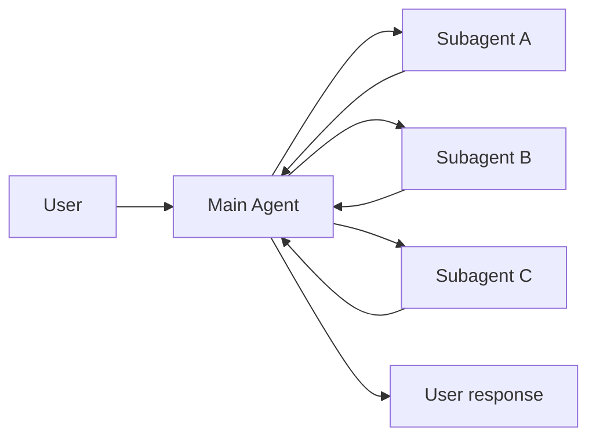
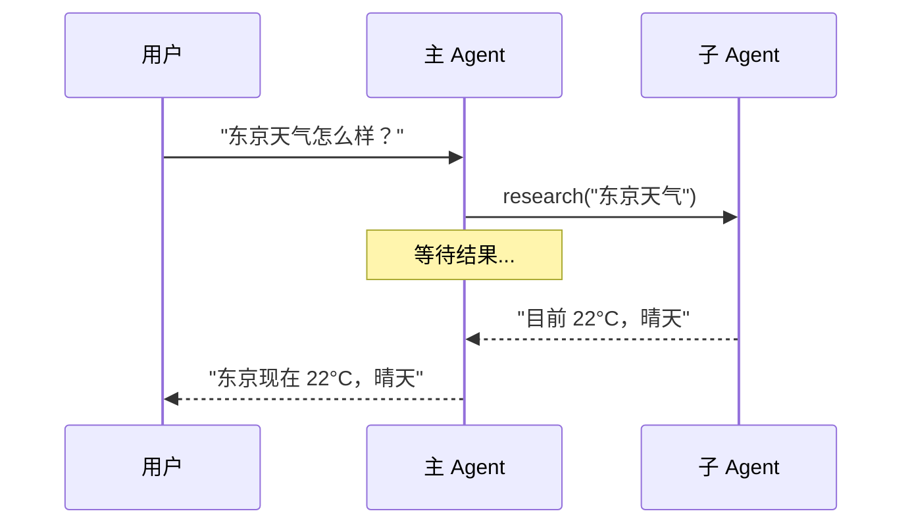
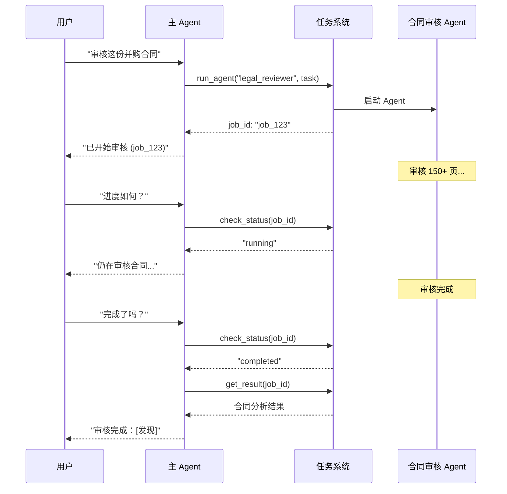
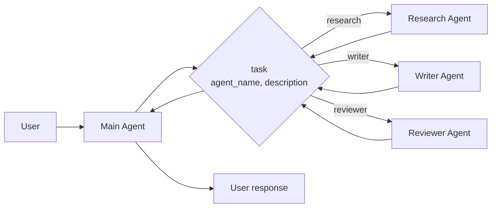

# Subagents 模式

在 Subagents 架构中，一个中央主 Agent（通常称为 **Supervisor**）通过将子 Agent 作为工具调用来协调它们。主 Agent 决定调用哪个子 Agent、提供什么输入、如何组合结果。

子 Agent 是**无状态**的——它们不记住过去的交互，所有对话记忆由主 Agent 维护。这提供了**上下文隔离**：每次子 Agent 调用都在干净的 context window 中工作，防止主对话的上下文膨胀。



## 核心特征

| 特征 | 说明 |
|------|------|
| 集中控制 | 所有路由都经过主 Agent |
| 无直接用户交互 | 子 Agent 返回结果给主 Agent，而非用户 |
| 工具形式调用 | 子 Agent 通过工具被调用 |
| 并行执行 | 主 Agent 可以在单轮中调用多个子 Agent |

> **Supervisor vs Router**：Supervisor Agent（本模式）与 Router 不同。Supervisor 是完整的 Agent，维护对话上下文并动态决定跨多轮调用哪些子 Agent。Router 通常是单次分类步骤，分发给 Agent 但不维护持续的对话状态。

## 适用场景

- 有多个不同领域（如日历、邮件、CRM、数据库）
- 子 Agent 不需要直接与用户对话
- 需要集中的工作流控制

> **提示**：如果子 Agent 需要用户交互，可以在子 Agent 内使用 `interrupt` 暂停执行并收集用户输入。主 Agent 仍是协调者，但子 Agent 可以在任务中途收集用户信息。

## 基本实现

核心机制是将子 Agent 包装为主 Agent 可以调用的工具：

```python
from langchain.tools import tool
from langchain.agents import create_agent

# 创建子 Agent
subagent = create_agent(
    model="gpt-4o",
    tools=[...]
)

# 包装为工具
@tool("research", description="研究某个主题并返回发现")
def call_research_agent(query: str):
    result = subagent.invoke({
        "messages": [{"role": "user", "content": query}]
    })
    return result["messages"][-1].content

# 主 Agent 使用子 Agent 作为工具
main_agent = create_agent(
    model="gpt-4o",
    tools=[call_research_agent]
)
```

## 设计决策

| 决策 | 选项 |
|------|------|
| 同步 vs 异步 | 同步（阻塞）vs 异步（后台） |
| 工具模式 | 每个 Agent 一个工具 vs 单一分发工具 |
| 子 Agent 输入 | 仅查询 vs 完整上下文 |
| 子 Agent 输出 | 子 Agent 结果 vs 完整对话历史 |

## 同步 vs 异步

### 同步（默认）

主 Agent 等待每个子 Agent 完成后再继续。



**适用场景：**
- 主 Agent 的下一步动作依赖子 Agent 的结果
- 任务有顺序依赖（获取数据 → 分析 → 响应）
- 子 Agent 失败应阻止主 Agent 响应

**权衡：**
- 实现简单——调用并等待
- 用户在所有子 Agent 完成前看不到响应
- 长时间运行的任务会冻结对话

### 异步

子 Agent 的工作独立于主对话流——主 Agent 启动后台任务并保持响应。



**适用场景：**
- 子 Agent 工作独立于主对话流
- 用户应该能在工作进行时继续聊天
- 需要并行运行多个独立任务

**三工具模式：**
1. **启动任务**：启动后台任务，返回 job_id
2. **检查状态**：返回当前状态（pending、running、completed、failed）
3. **获取结果**：获取完成的结果

## 工具模式

### 每个 Agent 一个工具

每个子 Agent 包装为独立的工具：

```python
from langchain.tools import tool
from langchain.agents import create_agent

# 创建子 Agent
research_agent = create_agent(model="gpt-4o", tools=[...])
writer_agent = create_agent(model="gpt-4o", tools=[...])

# 每个子 Agent 一个工具
@tool("research", description="研究和事实查找")
def call_research(query: str):
    result = research_agent.invoke({"messages": [{"role": "user", "content": query}]})
    return result["messages"][-1].content

@tool("write", description="内容创作和编辑")
def call_writer(query: str):
    result = writer_agent.invoke({"messages": [{"role": "user", "content": query}]})
    return result["messages"][-1].content

# 主 Agent
main_agent = create_agent(
    model="gpt-4o",
    tools=[call_research, call_writer]
)
```

**优点：** 对每个子 Agent 的输入/输出有细粒度控制
**缺点：** 设置更多，但定制性更强

### 单一分发工具

使用单个参数化工具调用任何注册的子 Agent：



```python
from langchain.tools import tool
from langchain.agents import create_agent

# 子 Agent 注册表
SUBAGENTS = {
    "research": create_agent(model="gpt-4o", prompt="你是研究专家..."),
    "writer": create_agent(model="gpt-4o", prompt="你是写作专家..."),
}

@tool
def task(agent_name: str, description: str) -> str:
    """启动子 Agent 执行任务。
    
    可用 Agent：
    - research: 研究和事实查找
    - writer: 内容创作和编辑
    """
    agent = SUBAGENTS[agent_name]
    result = agent.invoke({
        "messages": [{"role": "user", "content": description}]
    })
    return result["messages"][-1].content

# 主协调 Agent
main_agent = create_agent(
    model="gpt-4o",
    tools=[task],
    prompt="你协调专门的子 Agent。使用 task 工具委派工作。"
)
```

**优点：** 
- 可扩展地添加新 Agent 而无需修改协调器
- 不同团队可以独立开发和部署 Agent
- 强上下文隔离

**缺点：** 每个 Agent 的定制性较少

> **关键洞察**：调用子 Agent 的主要原因是**上下文隔离**——允许复杂的多步骤任务在隔离的 context window 中运行，而不会膨胀主 Agent 的对话历史。

## 上下文工程

控制上下文如何在主 Agent 和子 Agent 之间流动：

| 类别 | 目的 | 影响 |
|------|------|------|
| 子 Agent 规格 | 确保子 Agent 在应该被调用时被调用 | 主 Agent 路由决策 |
| 子 Agent 输入 | 确保子 Agent 能用优化的上下文良好执行 | 子 Agent 性能 |
| 子 Agent 输出 | 确保主 Agent 能根据子 Agent 结果行动 | 主 Agent 性能 |

### 子 Agent 规格

**名称**和**描述**是主 Agent 知道调用哪个子 Agent 的主要方式：

- **名称**：主 Agent 如何引用子 Agent。保持清晰和面向动作（如 `research_agent`、`code_reviewer`）
- **描述**：主 Agent 对子 Agent 能力的了解。具体说明它处理什么任务以及何时使用

### 子 Agent 输入

自定义子 Agent 接收什么上下文来执行任务：

```python
from langchain.agents import AgentState
from langchain.tools import tool, ToolRuntime

class CustomState(AgentState):
    example_state_key: str

@tool("subagent_name", description="子 Agent 描述")
def call_subagent(query: str, runtime: ToolRuntime[None, CustomState]):
    # 应用任何需要的逻辑来转换消息为合适的输入
    subagent_input = some_logic(query, runtime.state["messages"])
    
    result = subagent.invoke({
        "messages": subagent_input,
        # 也可以传递其他状态键
        "example_state_key": runtime.state["example_state_key"]
    })
    return result["messages"][-1].content
```

### 子 Agent 输出

自定义主 Agent 收到什么以便做出好的决策：

**方法 1：提示子 Agent**

指定应该返回什么。常见失败模式是子 Agent 执行工具调用或推理但不在最终消息中包含结果——提醒它 Supervisor 只看到最终输出。

**方法 2：代码中格式化**

在返回前调整或丰富响应：

```python
from typing import Annotated
from langchain.agents import AgentState
from langchain.tools import InjectedToolCallId
from langgraph.types import Command

@tool("subagent_name", description="子 Agent 描述")
def call_subagent(
    query: str,
    tool_call_id: Annotated[str, InjectedToolCallId],
) -> Command:
    result = subagent.invoke({
        "messages": [{"role": "user", "content": query}]
    })
    
    return Command(update={
        # 从子 Agent 传回额外状态
        "example_state_key": result["example_state_key"],
        "messages": [ToolMessage(
            content=result["messages"][-1].content,
            tool_call_id=tool_call_id
        )]
    })
```

## 总结

| 概念 | 说明 |
|------|------|
| Subagents | 子 Agent 作为工具被主 Agent 调用 |
| Supervisor | 主 Agent，协调所有子 Agent |
| 无状态 | 子 Agent 不记住过去交互，上下文隔离 |
| 同步 | 主 Agent 等待子 Agent 完成 |
| 异步 | 主 Agent 启动后台任务，保持响应 |
| 工具模式 | 每个 Agent 一个工具 vs 单一分发工具 |
| 上下文工程 | 控制子 Agent 的输入/输出 |
