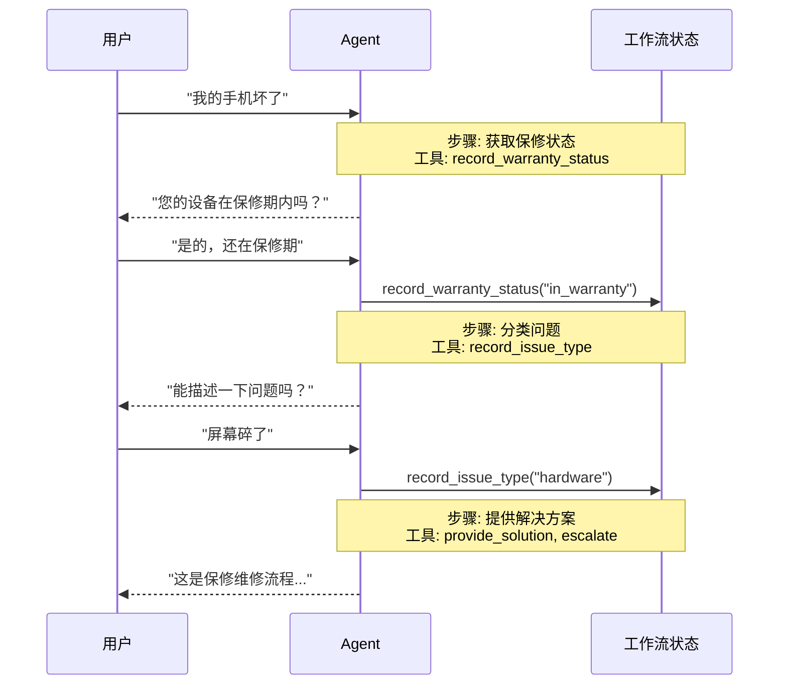
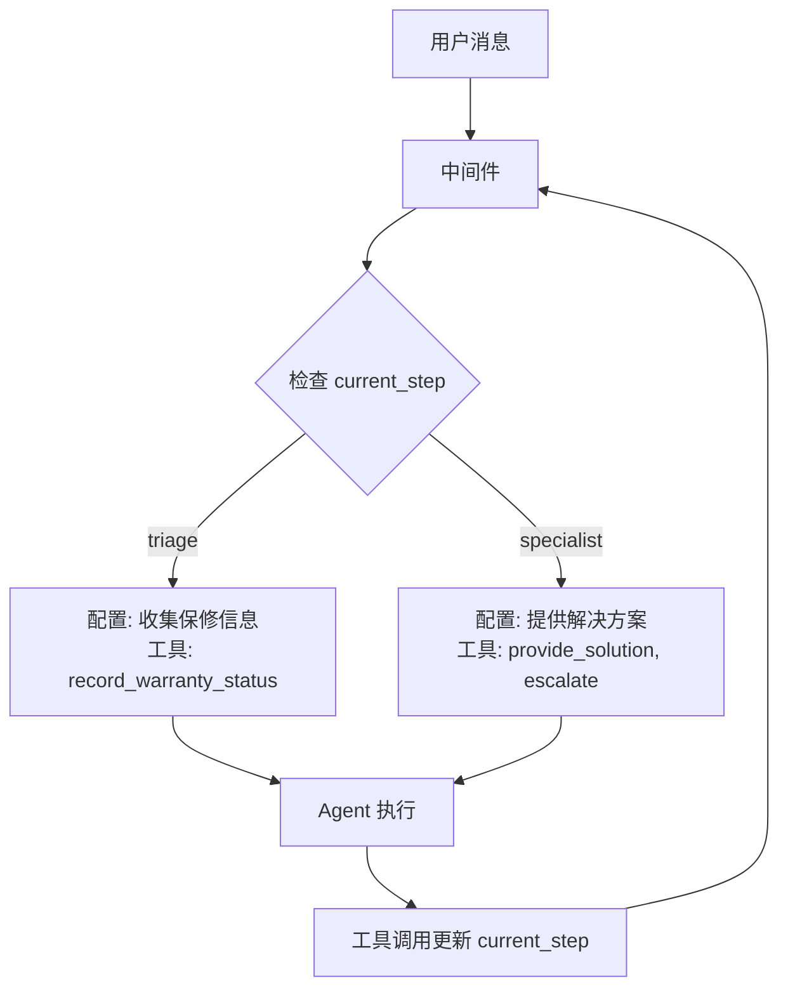
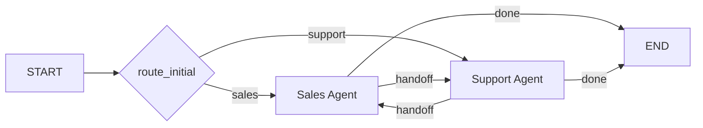

# Handoffs 模式

在 Handoffs 架构中，行为根据状态动态变化。核心机制：工具更新一个状态变量（如 `current_step` 或 `active_agent`），该变量跨轮次持久化，系统读取这个变量来调整行为——要么应用不同的配置（system prompt、工具），要么路由到不同的 Agent。

这种模式支持不同 Agent 之间的交接，也支持单个 Agent 内的动态配置变更。

> **术语来源**：Handoffs 一词由 OpenAI 提出，指使用工具调用（如 `transfer_to_sales_agent`）在 Agent 或状态之间转移控制权。



## 核心特征

| 特征 | 说明 |
|------|------|
| 状态驱动行为 | 行为根据状态变量（如 `current_step`）变化 |
| 工具触发转换 | 工具更新状态变量来切换状态 |
| 直接用户交互 | 每个状态的配置直接处理用户消息 |
| 持久状态 | 状态跨对话轮次保持 |

## 适用场景

- 需要强制顺序约束（满足前置条件后才解锁能力）
- Agent 需要在不同状态下直接与用户对话
- 构建多阶段对话流程

**典型场景**：客服场景中需要按特定顺序收集信息——例如，处理退款前必须先收集保修 ID。

## 基本实现

核心机制是工具返回 `Command` 来更新状态，触发转换到新步骤或 Agent：

```python
from langchain.tools import tool
from langchain.messages import ToolMessage
from langgraph.types import Command

@tool
def transfer_to_specialist(runtime) -> Command:
    """转移到专家 Agent"""
    return Command(update={
        "messages": [ToolMessage(
            content="已转移到专家",
            tool_call_id=runtime.tool_call_id
        )],
        "current_step": "specialist"  # 触发行为变更
    })
```

> **为什么需要 ToolMessage？** 当 LLM 调用工具时，它期望收到响应。带有匹配 `tool_call_id` 的 `ToolMessage` 完成这个请求-响应循环——没有它，对话历史会变得畸形。

## 实现方式

有两种实现 Handoffs 的方式：

| 方式 | 说明 | 适用场景 |
|------|------|----------|
| 单 Agent + 中间件 | 一个 Agent 动态配置 | 大多数场景，更简单 |
| 多 Agent 子图 | 不同 Agent 作为图节点 | 需要复杂 Agent 实现时 |

### 方式一：单 Agent + 中间件

单个 Agent 根据状态改变行为。中间件拦截每次模型调用，动态调整 system prompt 和可用工具。



```python
from langchain.agents import AgentState, create_agent
from langchain.agents.middleware import wrap_model_call, ModelRequest, ModelResponse
from langchain.tools import tool, ToolRuntime
from langchain.messages import ToolMessage
from langgraph.types import Command
from typing import Callable

# 1. 定义状态，包含 current_step 追踪器
class SupportState(AgentState):
    """追踪当前活动的步骤"""
    current_step: str = "triage"
    warranty_status: str | None = None

# 2. 工具通过 Command 更新 current_step
@tool
def record_warranty_status(
    status: str,
    runtime: ToolRuntime[None, SupportState]
) -> Command:
    """记录保修状态并转换到下一步"""
    return Command(update={
        "messages": [ToolMessage(
            content=f"保修状态已记录: {status}",
            tool_call_id=runtime.tool_call_id
        )],
        "warranty_status": status,
        "current_step": "specialist"  # 转换到下一步
    })

@tool
def provide_solution(issue: str, runtime: ToolRuntime) -> str:
    """提供解决方案"""
    return f"针对 {issue} 的解决方案..."

@tool
def escalate(reason: str, runtime: ToolRuntime) -> str:
    """升级到人工"""
    return f"已升级: {reason}"

# 3. 中间件根据 current_step 应用动态配置
@wrap_model_call
def apply_step_config(
    request: ModelRequest,
    handler: Callable[[ModelRequest], ModelResponse]
) -> ModelResponse:
    """根据 current_step 配置 Agent 行为"""
    step = request.state.get("current_step", "triage")
    
    # 步骤到配置的映射
    configs = {
        "triage": {
            "prompt": "收集保修信息...",
            "tools": [record_warranty_status]
        },
        "specialist": {
            "prompt": "根据保修状态 {warranty_status} 提供解决方案",
            "tools": [provide_solution, escalate]
        }
    }
    
    config = configs[step]
    request = request.override(
        system_prompt=config["prompt"].format(**request.state),
        tools=config["tools"]
    )
    return handler(request)

# 4. 创建带中间件的 Agent
agent = create_agent(
    model="gpt-4o",
    tools=[record_warranty_status, provide_solution, escalate],
    state_schema=SupportState,
    middleware=[apply_step_config],
    checkpointer=InMemorySaver()  # 跨轮次持久化状态
)
```

### 方式二：多 Agent 子图

多个不同的 Agent 作为图中的独立节点存在。Handoff 工具使用 `Command.PARENT` 导航到其他 Agent 节点。



> **警告**：子图 Handoffs 需要仔细的**上下文工程**。与单 Agent 中间件（消息历史自然流动）不同，你必须明确决定什么消息在 Agent 之间传递。

```python
from typing import Literal
from langchain.agents import AgentState, create_agent
from langchain.messages import AIMessage, ToolMessage
from langchain.tools import tool, ToolRuntime
from langgraph.graph import StateGraph, START, END
from langgraph.types import Command
from typing_extensions import NotRequired

# 1. 定义状态，包含 active_agent 追踪器
class MultiAgentState(AgentState):
    active_agent: NotRequired[str]

# 2. 创建 Handoff 工具
@tool
def transfer_to_sales(runtime: ToolRuntime) -> Command:
    """转移到销售 Agent"""
    # 获取触发此 handoff 的 AI 消息
    last_ai_message = next(
        msg for msg in reversed(runtime.state["messages"]) 
        if isinstance(msg, AIMessage)
    )
    # 创建人工工具响应来完成配对
    transfer_message = ToolMessage(
        content="已从支持 Agent 转移到销售 Agent",
        tool_call_id=runtime.tool_call_id,
    )
    return Command(
        goto="sales_agent",
        update={
            "active_agent": "sales_agent",
            "messages": [last_ai_message, transfer_message],
        },
        graph=Command.PARENT,
    )

@tool
def transfer_to_support(runtime: ToolRuntime) -> Command:
    """转移到支持 Agent"""
    last_ai_message = next(
        msg for msg in reversed(runtime.state["messages"]) 
        if isinstance(msg, AIMessage)
    )
    transfer_message = ToolMessage(
        content="已从销售 Agent 转移到支持 Agent",
        tool_call_id=runtime.tool_call_id,
    )
    return Command(
        goto="support_agent",
        update={
            "active_agent": "support_agent",
            "messages": [last_ai_message, transfer_message],
        },
        graph=Command.PARENT,
    )

# 3. 创建带 Handoff 工具的 Agent
sales_agent = create_agent(
    model="gpt-4o",
    tools=[transfer_to_support],
    prompt="你是销售 Agent。处理销售咨询。如果被问到技术问题，转移到支持 Agent。",
)

support_agent = create_agent(
    model="gpt-4o",
    tools=[transfer_to_sales],
    prompt="你是支持 Agent。处理技术问题。如果被问到价格或购买，转移到销售 Agent。",
)

# 4. 创建调用 Agent 的节点
def call_sales_agent(state: MultiAgentState) -> Command:
    response = sales_agent.invoke(state)
    return response

def call_support_agent(state: MultiAgentState) -> Command:
    response = support_agent.invoke(state)
    return response

# 5. 创建路由器
def route_after_agent(
    state: MultiAgentState,
) -> Literal["sales_agent", "support_agent", "__end__"]:
    """根据 active_agent 路由，或在 Agent 完成时结束"""
    messages = state.get("messages", [])
    if messages:
        last_msg = messages[-1]
        # 如果最后消息是没有工具调用的 AIMessage，结束
        if isinstance(last_msg, AIMessage) and not last_msg.tool_calls:
            return "__end__"
    # 否则路由到活动 Agent
    active = state.get("active_agent", "sales_agent")
    return active if active else "sales_agent"

def route_initial(
    state: MultiAgentState,
) -> Literal["sales_agent", "support_agent"]:
    """根据状态路由到活动 Agent，默认销售 Agent"""
    return state.get("active_agent") or "sales_agent"

# 6. 构建图
builder = StateGraph(MultiAgentState)
builder.add_node("sales_agent", call_sales_agent)
builder.add_node("support_agent", call_support_agent)

# 基于初始 active_agent 的条件路由
builder.add_conditional_edges(START, route_initial, ["sales_agent", "support_agent"])

# 每个 Agent 后检查是否结束或路由到另一个 Agent
builder.add_conditional_edges(
    "sales_agent", 
    route_after_agent, 
    ["sales_agent", "support_agent", END]
)
builder.add_conditional_edges(
    "support_agent", 
    route_after_agent, 
    ["sales_agent", "support_agent", END]
)

graph = builder.compile()
```

## 上下文工程

使用子图 Handoffs 时，你控制 Agent 之间传递什么消息。这对于维护有效的对话历史和避免上下文膨胀至关重要。

### Handoff 时处理上下文

LLM 期望工具调用与其响应配对。使用 `Command.PARENT` 交接时，必须包含：

1. **包含工具调用的 AIMessage**（触发 handoff 的消息）
2. **确认 handoff 的 ToolMessage**（对该工具调用的人工响应）

```python
@tool
def transfer_to_sales(runtime: ToolRuntime) -> Command:
    # 获取触发此 handoff 的 AI 消息
    last_ai_message = runtime.state["messages"][-1]
    
    # 创建人工工具响应来完成配对
    transfer_message = ToolMessage(
        content="已转移到销售 Agent",
        tool_call_id=runtime.tool_call_id,
    )
    
    return Command(
        goto="sales_agent",
        update={
            "active_agent": "sales_agent",
            # 只传递这两条消息，而非完整子 Agent 历史
            "messages": [last_ai_message, transfer_message],
        },
        graph=Command.PARENT,
    )
```

> **为什么不传递所有子 Agent 消息？** 虽然可以在 handoff 中包含完整的子 Agent 对话，但这通常会造成问题。接收 Agent 可能被无关的内部推理搞混，token 成本也会不必要地增加。只传递 handoff 配对，可以让父图的上下文专注于高层协调。

### 返回控制给用户

当返回控制给用户（结束 Agent 轮次）时，确保最后消息是 `AIMessage`。这维护了有效的对话历史，并向用户界面发出 Agent 已完成工作的信号。

## 实现考虑

| 考虑点 | 说明 |
|--------|------|
| 上下文过滤策略 | 每个 Agent 接收完整对话历史、过滤部分还是摘要？ |
| 工具语义 | Handoff 工具只更新路由状态，还是也执行副作用？ |
| Token 效率 | 平衡上下文完整性和 token 成本 |

## 总结

| 概念 | 说明 |
|------|------|
| Handoffs | 通过工具调用在 Agent/状态之间转移控制权 |
| 状态驱动 | 行为根据状态变量（如 `current_step`）变化 |
| Command | 用于更新状态和触发转换 |
| ToolMessage | 完成工具调用的请求-响应循环 |
| 单 Agent + 中间件 | 简单场景，动态配置 |
| 多 Agent 子图 | 复杂场景，需要仔细的上下文工程 |
| Command.PARENT | 在子图中导航到父图的其他节点 |
