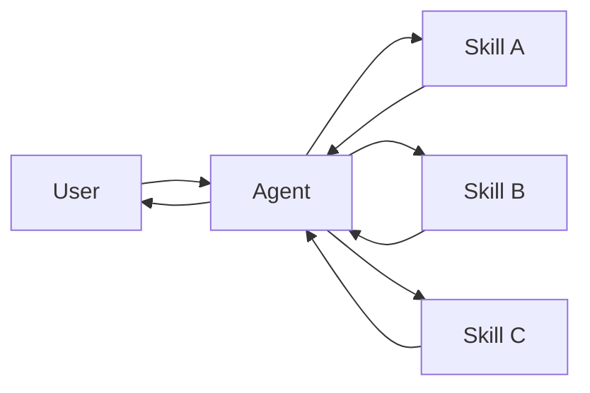
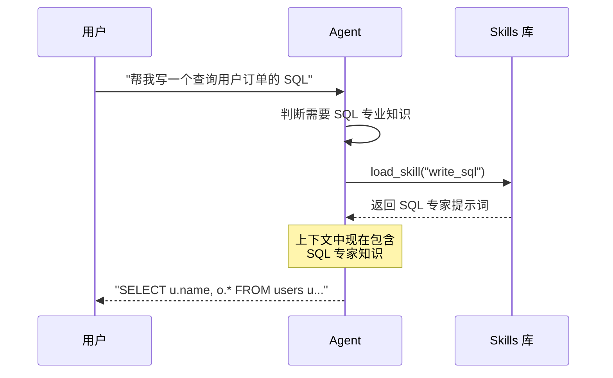
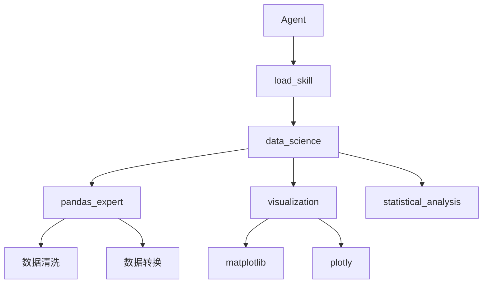

# Skills 模式

在 Skills 架构中，专门化的能力被打包为可调用的"技能"来增强 Agent 的行为。Skills 主要是提示词驱动的专门化，Agent 可以按需调用。

> **概念来源**：这个模式在概念上与 llms.txt（由 Jeremy Howard 提出）相同，使用工具调用来渐进式披露文档。Skills 模式将同样的方法应用于专门的提示词和领域知识，而不仅仅是文档页面。



## 核心特征

| 特征 | 说明 |
|------|------|
| 提示词驱动专门化 | Skills 主要由专门的提示词定义 |
| 渐进式披露 | Skills 根据上下文或用户需求变得可用 |
| 团队分布 | 不同团队可以独立开发和维护 Skills |
| 轻量级组合 | Skills 比完整的子 Agent 更简单 |

## 适用场景

- 单个 Agent 需要多种可能的专门化
- 不需要在 Skills 之间强制特定约束
- 不同团队需要独立开发能力

**常见示例：**
- **编程助手**：不同语言或任务的 Skills
- **知识库**：不同领域的 Skills
- **创意助手**：不同格式的 Skills

## 基本实现

```python
from langchain.tools import tool
from langchain.agents import create_agent

@tool
def load_skill(skill_name: str) -> str:
    """加载专门化的 Skill 提示词。
    
    可用 Skills：
    - write_sql: SQL 查询编写专家
    - review_legal_doc: 法律文档审核员
    
    返回 Skill 的提示词和上下文。
    """
    skills = {
        "write_sql": """
你是 SQL 查询编写专家。
- 始终使用参数化查询防止 SQL 注入
- 优先使用 JOIN 而非子查询
- 为复杂查询添加注释
- 考虑索引优化
        """,
        "review_legal_doc": """
你是法律文档审核专家。
- 识别关键条款和风险点
- 检查合规性问题
- 标注需要律师审核的部分
- 使用清晰的法律术语
        """
    }
    return skills.get(skill_name, "未找到该 Skill")

agent = create_agent(
    model="gpt-4o",
    tools=[load_skill],
    prompt=(
        "你是一个有帮助的助手。"
        "你可以访问两个 Skills：write_sql 和 review_legal_doc。"
        "使用 load_skill 来加载它们。"
    ),
)
```

## 工作流程



## 扩展模式

### 动态工具注册

结合渐进式披露和状态管理，在加载 Skills 时注册新工具：

```python
from langchain.tools import tool, ToolRuntime
from langchain.agents import AgentState
from langgraph.types import Command

class SkillState(AgentState):
    loaded_skills: list[str] = []
    available_tools: list = []

@tool
def load_database_admin_skill(runtime: ToolRuntime[None, SkillState]) -> Command:
    """加载数据库管理 Skill，同时注册相关工具"""
    
    # Skill 提示词
    skill_prompt = """
你现在是数据库管理专家。
- 可以执行备份、恢复、迁移操作
- 监控数据库性能
- 优化查询和索引
    """
    
    # 注册新工具
    new_tools = [backup_database, restore_database, migrate_schema]
    
    return Command(update={
        "messages": [ToolMessage(
            content=skill_prompt,
            tool_call_id=runtime.tool_call_id
        )],
        "loaded_skills": runtime.state["loaded_skills"] + ["database_admin"],
        "available_tools": runtime.state["available_tools"] + new_tools,
    })

@tool
def backup_database(database_name: str) -> str:
    """备份数据库"""
    return f"数据库 {database_name} 备份完成"

@tool
def restore_database(database_name: str, backup_id: str) -> str:
    """恢复数据库"""
    return f"数据库 {database_name} 已从 {backup_id} 恢复"

@tool
def migrate_schema(source: str, target: str) -> str:
    """迁移数据库 schema"""
    return f"Schema 已从 {source} 迁移到 {target}"
```

### 层级 Skills

Skills 可以在树结构中定义其他 Skills，创建嵌套的专门化：



```python
@tool
def load_skill(skill_name: str) -> str:
    """加载 Skill，支持层级结构"""
    
    skills = {
        # 顶级 Skill
        "data_science": """
你是数据科学专家。可用子 Skills：
- pandas_expert: Pandas 数据处理
- visualization: 数据可视化
- statistical_analysis: 统计分析

使用 load_skill 加载子 Skill 获取更详细的知识。
        """,
        
        # 子 Skills
        "pandas_expert": """
你是 Pandas 专家。
- 高效使用 DataFrame 操作
- 数据清洗和转换
- 处理缺失值和异常值
- 性能优化技巧
        """,
        
        "visualization": """
你是数据可视化专家。
- matplotlib 基础图表
- plotly 交互式图表
- seaborn 统计图表
- 选择合适的图表类型
        """,
        
        "statistical_analysis": """
你是统计分析专家。
- 描述性统计
- 假设检验
- 回归分析
- 时间序列分析
        """,
    }
    
    return skills.get(skill_name, "未找到该 Skill")
```

## Skills vs Subagents 对比

| 特性 | Skills | Subagents |
|------|--------|-----------|
| 复杂度 | 轻量级，主要是提示词 | 完整的 Agent，有自己的工具 |
| 上下文 | 加载到当前 Agent 上下文 | 独立的上下文窗口 |
| 控制权 | 始终在主 Agent | 子 Agent 独立执行 |
| 适用场景 | 知识/提示词专门化 | 复杂任务委派 |

## 总结

| 概念 | 说明 |
|------|------|
| Skills | 可调用的专门化能力，主要是提示词驱动 |
| 渐进式披露 | 根据需要加载 Skills，而非预先加载所有 |
| load_skill | 加载 Skill 的工具 |
| 动态工具注册 | 加载 Skill 时同时注册相关工具 |
| 层级 Skills | 树结构组织 Skills，支持嵌套专门化 |
