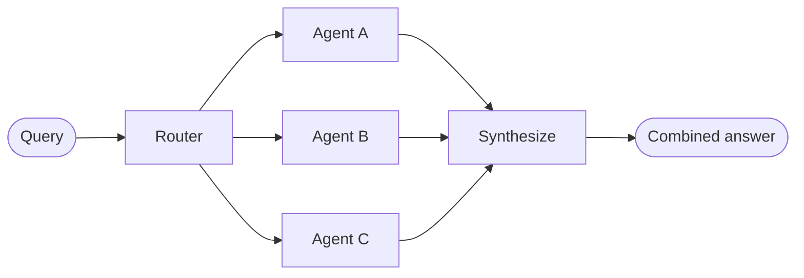
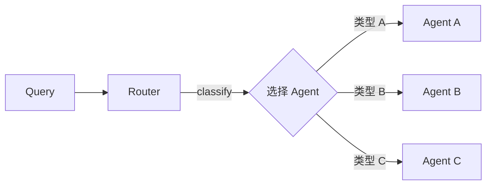
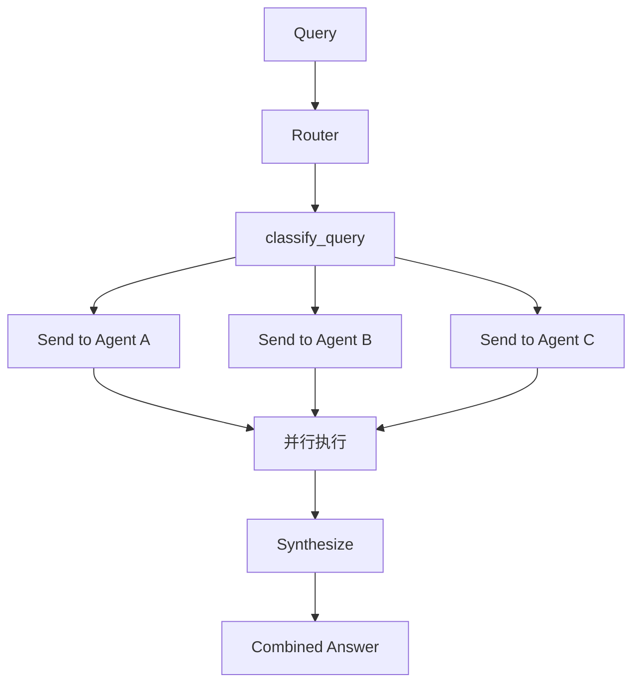
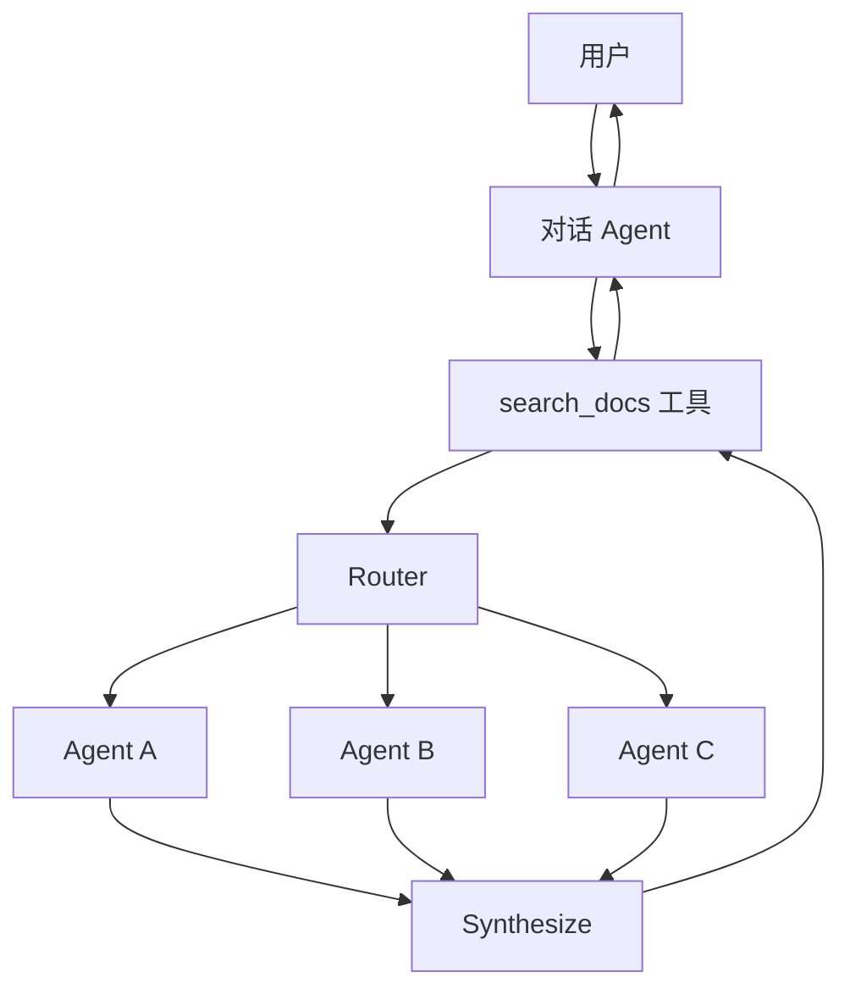

# Router 模式

在 Router 架构中，路由步骤对输入进行分类并将其分发给专门的 Agent。当你有不同的**垂直领域**——每个领域都需要自己的 Agent 的独立知识域时，这种模式非常有用。



## 核心特征

| 特征 | 说明 |
|------|------|
| 查询分解 | Router 分解查询 |
| 并行调用 | 零个或多个专门 Agent 并行调用 |
| 结果合成 | 结果合成为连贯的响应 |

## 适用场景

- 有不同的垂直领域（每个领域需要自己的 Agent）
- 需要并行查询多个来源
- 想要将结果合成为组合响应

## 基本实现

Router 对查询进行分类并将其分发给适当的 Agent。使用 `Command` 进行单 Agent 路由，或使用 `Send` 进行并行扇出到多个 Agent。

### 单 Agent 路由

使用 `Command` 路由到单个专门 Agent：



```python
from langgraph.types import Command

def classify_query(query: str) -> str:
    """使用 LLM 分类查询并确定适当的 Agent"""
    # 分类逻辑...
    pass

def route_query(state: State) -> Command:
    """根据查询分类路由到适当的 Agent"""
    active_agent = classify_query(state["query"])
    # 路由到选定的 Agent
    return Command(goto=active_agent)
```

### 多 Agent 并行路由

使用 `Send` 并行扇出到多个专门 Agent：



```python
from typing import TypedDict
from langgraph.types import Send

class ClassificationResult(TypedDict):
    query: str
    agent: str

def classify_query(query: str) -> list[ClassificationResult]:
    """使用 LLM 分类查询并确定要调用哪些 Agent"""
    # 分类逻辑...
    pass

def route_query(state: State):
    """根据查询分类路由到相关 Agent"""
    classifications = classify_query(state["query"])
    
    # 并行扇出到选定的 Agent
    return [
        Send(c["agent"], {"query": c["query"]})
        for c in classifications
    ]
```

## 完整示例：多源知识库

```python
from typing import TypedDict, Annotated
from langchain.agents import create_agent
from langgraph.graph import StateGraph, START, END
from langgraph.types import Send
import operator

# 1. 定义状态
class RouterState(TypedDict):
    query: str
    results: Annotated[list[str], operator.add]  # 收集所有结果
    final_answer: str

class AgentInput(TypedDict):
    query: str

# 2. 创建专门 Agent
github_agent = create_agent(
    model="gpt-4o",
    tools=[search_github],
    prompt="你是 GitHub 搜索专家。搜索代码和仓库。"
)

notion_agent = create_agent(
    model="gpt-4o",
    tools=[search_notion],
    prompt="你是 Notion 搜索专家。搜索文档和笔记。"
)

slack_agent = create_agent(
    model="gpt-4o",
    tools=[search_slack],
    prompt="你是 Slack 搜索专家。搜索消息和对话。"
)

# 3. 路由函数
def route_query(state: RouterState):
    """分类查询并并行分发到相关 Agent"""
    query = state["query"]
    
    # 简单分类逻辑（实际可用 LLM）
    agents_to_call = []
    
    if "代码" in query or "code" in query.lower():
        agents_to_call.append(("github_agent", query))
    if "文档" in query or "doc" in query.lower():
        agents_to_call.append(("notion_agent", query))
    if "讨论" in query or "消息" in query:
        agents_to_call.append(("slack_agent", query))
    
    # 默认查询所有
    if not agents_to_call:
        agents_to_call = [
            ("github_agent", query),
            ("notion_agent", query),
            ("slack_agent", query),
        ]
    
    # 并行扇出
    return [Send(agent, {"query": q}) for agent, q in agents_to_call]

# 4. Agent 节点
def call_github(state: AgentInput) -> dict:
    result = github_agent.invoke({"messages": [{"role": "user", "content": state["query"]}]})
    return {"results": [f"GitHub: {result['messages'][-1].content}"]}

def call_notion(state: AgentInput) -> dict:
    result = notion_agent.invoke({"messages": [{"role": "user", "content": state["query"]}]})
    return {"results": [f"Notion: {result['messages'][-1].content}"]}

def call_slack(state: AgentInput) -> dict:
    result = slack_agent.invoke({"messages": [{"role": "user", "content": state["query"]}]})
    return {"results": [f"Slack: {result['messages'][-1].content}"]}

# 5. 合成函数
def synthesize(state: RouterState) -> dict:
    """合成所有 Agent 的结果"""
    results = state["results"]
    
    # 使用 LLM 合成结果
    synthesis_prompt = f"""
基于以下来源的搜索结果，提供一个综合答案：

{chr(10).join(results)}

原始问题：{state["query"]}
    """
    
    # 调用 LLM 合成
    final_answer = llm.invoke(synthesis_prompt)
    return {"final_answer": final_answer}

# 6. 构建图
builder = StateGraph(RouterState)

# 添加节点
builder.add_node("github_agent", call_github)
builder.add_node("notion_agent", call_notion)
builder.add_node("slack_agent", call_slack)
builder.add_node("synthesize", synthesize)

# 添加边
builder.add_conditional_edges(START, route_query, ["github_agent", "notion_agent", "slack_agent"])
builder.add_edge("github_agent", "synthesize")
builder.add_edge("notion_agent", "synthesize")
builder.add_edge("slack_agent", "synthesize")
builder.add_edge("synthesize", END)

router = builder.compile()

# 使用
result = router.invoke({"query": "找一下关于用户认证的代码和文档"})
print(result["final_answer"])
```

## 无状态 vs 有状态

| 类型 | 说明 | 适用场景 |
|------|------|----------|
| 无状态 | 每个请求独立路由，无跨调用记忆 | 单次查询 |
| 有状态 | 跨请求维护对话历史 | 多轮对话 |

### 无状态 Router

每个请求独立路由——调用之间没有记忆。

> **Router vs Subagents**：两种模式都可以将工作分发给多个 Agent，但路由决策方式不同：
> - **Router**：专门的路由步骤（通常是单次 LLM 调用或基于规则的逻辑）分类输入并分发给 Agent。Router 本身通常不维护对话历史——它是预处理步骤。
> - **Subagents**：主 Supervisor Agent 动态决定调用哪些子 Agent 作为持续对话的一部分。主 Agent 维护上下文，可以跨轮次调用多个子 Agent。

### 有状态 Router

对于多轮对话，需要跨调用维护上下文。

#### 方式一：工具包装器

最简单的方法：将无状态 Router 包装为对话 Agent 可以调用的工具。对话 Agent 处理记忆和上下文；Router 保持无状态。

```python
from langchain.tools import tool
from langchain.agents import create_agent

@tool
def search_docs(query: str) -> str:
    """跨多个文档源搜索"""
    result = router.invoke({"query": query})
    return result["final_answer"]

# 对话 Agent 使用 Router 作为工具
conversational_agent = create_agent(
    model="gpt-4o",
    tools=[search_docs],
    prompt="你是一个有帮助的助手。使用 search_docs 回答问题。",
    checkpointer=InMemorySaver(),  # 维护对话历史
)
```



#### 方式二：完整持久化

如果需要 Router 本身维护状态，使用持久化存储消息历史。

> **警告**：有状态 Router 需要自定义历史管理。如果 Router 跨轮次在 Agent 之间切换，当 Agent 有不同的语气或提示词时，对话可能对用户感觉不流畅。考虑使用 Handoffs 模式或 Subagents 模式——两者都为多轮对话提供更清晰的语义。

## Router vs 其他模式

| 特性 | Router | Subagents | Handoffs |
|------|--------|-----------|----------|
| 路由决策 | 预处理步骤 | 主 Agent 动态决定 | 状态驱动 |
| 对话历史 | 通常无状态 | 主 Agent 维护 | 跨状态持久化 |
| 并行执行 | ✅ 原生支持 | ✅ 支持 | ❌ 串行 |
| 多轮对话 | 需要包装 | 原生支持 | 原生支持 |
| 适用场景 | 分类 + 并行查询 | 复杂协调 | 顺序工作流 |

## 总结

| 概念 | 说明 |
|------|------|
| Router | 分类输入并分发给专门 Agent |
| Command | 单 Agent 路由 |
| Send | 并行扇出到多个 Agent |
| Synthesize | 合成多个 Agent 的结果 |
| 无状态 | 每个请求独立，无记忆 |
| 有状态 | 维护对话历史，需要额外处理 |
| 工具包装器 | 将 Router 包装为工具，简化有状态场景 |
