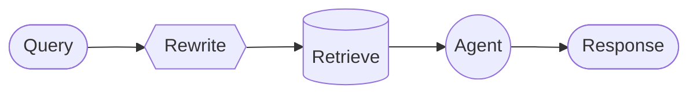

# 自定义工作流

在自定义工作流架构中，你使用 LangGraph 定义自己的执行流程。你对图结构有完全的控制——包括顺序步骤、条件分支、循环和并行执行。


## 核心特征

| 特征 | 说明 |
|------|------|
| 完全控制 | 对图结构有完全控制 |
| 混合逻辑 | 混合确定性逻辑和 Agent 行为 |
| 灵活结构 | 支持顺序步骤、条件分支、循环和并行执行 |
| 可组合 | 可以将其他模式嵌入为工作流中的节点 |

## 适用场景

- 标准模式（Subagents、Skills 等）不符合需求
- 需要混合确定性逻辑和 Agent 行为
- 用例需要复杂路由或多阶段处理

工作流中的每个节点可以是：
- 简单函数
- LLM 调用
- 带工具的完整 Agent
- 其他架构（如多 Agent 系统作为单个节点）

## 基本实现

核心洞察：你可以在任何 LangGraph 节点内直接调用 LangChain Agent，结合自定义工作流的灵活性和预构建 Agent 的便利性。

```python
from langchain.agents import create_agent
from langgraph.graph import StateGraph, START, END

agent = create_agent(model="gpt-4o", tools=[...])

def agent_node(state: State) -> dict:
    """调用 LangChain Agent 的 LangGraph 节点"""
    result = agent.invoke({
        "messages": [{"role": "user", "content": state["query"]}]
    })
    return {"answer": result["messages"][-1].content}

# 构建简单工作流
workflow = (
    StateGraph(State)
    .add_node("agent", agent_node)
    .add_edge(START, "agent")
    .add_edge("agent", END)
    .compile()
)
```

## 节点类型


| 节点类型 | 说明 | 示例 |
|----------|------|------|
| Model 节点 | 直接 LLM 调用 | 查询重写、分类 |
| Deterministic 节点 | 确定性逻辑，无 LLM | 向量检索、数据处理 |
| Agent 节点 | 带工具的完整 Agent | 推理 + 工具调用 |

## 示例：RAG 管道

一个常见用例是将检索与 Agent 结合。这个示例构建一个 WNBA 统计助手，从知识库检索并可以获取实时新闻。



**工作流说明：**
- **Rewrite（Model 节点）**：使用结构化输出重写用户查询以获得更好的检索
- **Retrieve（Deterministic 节点）**：执行向量相似性搜索——不涉及 LLM
- **Agent（Agent 节点）**：对检索到的上下文进行推理，可以通过工具获取额外信息

```python
from typing import TypedDict
from pydantic import BaseModel
from langgraph.graph import StateGraph, START, END
from langchain.agents import create_agent
from langchain.tools import tool
from langchain_openai import ChatOpenAI, OpenAIEmbeddings
from langchain_core.vectorstores import InMemoryVectorStore

# 1. 定义状态
class State(TypedDict):
    question: str
    rewritten_query: str
    documents: list[str]
    answer: str

# 2. 设置知识库
embeddings = OpenAIEmbeddings()
vector_store = InMemoryVectorStore(embeddings)
vector_store.add_texts([
    # 球队阵容
    "纽约自由人 2024 阵容：Breanna Stewart, Sabrina Ionescu, Jonquel Jones",
    "拉斯维加斯王牌 2024 阵容：A'ja Wilson, Kelsey Plum, Jackie Young",
    "印第安纳狂热 2024 阵容：Caitlin Clark, Aliyah Boston, Kelsey Mitchell",
    # 比赛结果
    "2024 WNBA 总决赛：纽约自由人 3-2 击败明尼苏达山猫夺冠",
    "2024年6月15日：印第安纳狂热 85, 芝加哥天空 79。Caitlin Clark 23分8助攻",
    # 球员数据
    "A'ja Wilson 2024 赛季数据：26.9 PPG, 11.9 RPG, 2.6 BPG。获得 MVP",
    "Caitlin Clark 2024 新秀数据：19.2 PPG, 8.4 APG, 5.7 RPG。获得最佳新秀",
])

retriever = vector_store.as_retriever(search_kwargs={"k": 5})

# 3. 定义工具
@tool
def get_latest_news(query: str) -> str:
    """获取最新 WNBA 新闻和更新"""
    # 你的新闻 API
    return "最新：WNBA 宣布 2025 年扩大季后赛赛制..."

# 4. 创建 Agent
agent = create_agent(
    model="gpt-4o",
    tools=[get_latest_news],
)

model = ChatOpenAI(model="gpt-4o")

# 5. 定义结构化输出
class RewrittenQuery(BaseModel):
    query: str

# 6. 定义节点函数
def rewrite_query(state: State) -> dict:
    """重写用户查询以获得更好的检索"""
    system_prompt = """重写此查询以检索相关的 WNBA 信息。
知识库包含：球队阵容、比赛结果和球员统计数据（PPG, RPG, APG）。
关注提到的具体球员名、球队名或统计类别。"""
    
    response = model.with_structured_output(RewrittenQuery).invoke([
        {"role": "system", "content": system_prompt},
        {"role": "user", "content": state["question"]}
    ])
    return {"rewritten_query": response.query}

def retrieve(state: State) -> dict:
    """基于重写的查询检索文档"""
    docs = retriever.invoke(state["rewritten_query"])
    return {"documents": [doc.page_content for doc in docs]}

def call_agent(state: State) -> dict:
    """使用检索到的上下文生成答案"""
    context = "\n\n".join(state["documents"])
    prompt = f"上下文:\n{context}\n\n问题: {state['question']}"
    
    response = agent.invoke({
        "messages": [{"role": "user", "content": prompt}]
    })
    return {"answer": response["messages"][-1].content}

# 7. 构建工作流
workflow = (
    StateGraph(State)
    .add_node("rewrite", rewrite_query)
    .add_node("retrieve", retrieve)
    .add_node("agent", call_agent)
    .add_edge(START, "rewrite")
    .add_edge("rewrite", "retrieve")
    .add_edge("retrieve", "agent")
    .add_edge("agent", END)
    .compile()
)

# 8. 使用
result = workflow.invoke({"question": "谁赢得了 2024 WNBA 总冠军？"})
print(result["answer"])
```

## 高级模式

### 条件分支


```python
def classify_query(state: State) -> str:
    """分类查询复杂度"""
    # 简单分类逻辑
    if len(state["question"]) < 20:
        return "simple"
    return "complex"

def simple_answer(state: State) -> dict:
    """直接回答简单问题"""
    response = model.invoke([
        {"role": "user", "content": state["question"]}
    ])
    return {"answer": response.content}

workflow = (
    StateGraph(State)
    .add_node("simple", simple_answer)
    .add_node("retrieve", retrieve)
    .add_node("agent", call_agent)
    .add_conditional_edges(
        START,
        classify_query,
        {"simple": "simple", "complex": "retrieve"}
    )
    .add_edge("simple", END)
    .add_edge("retrieve", "agent")
    .add_edge("agent", END)
    .compile()
)
```

### 循环（反思）


```python
def quality_check(state: State) -> str:
    """检查答案质量"""
    if "不确定" in state["answer"] or len(state["answer"]) < 50:
        return "retry"
    return "done"

workflow = (
    StateGraph(State)
    .add_node("agent", call_agent)
    .add_conditional_edges(
        "agent",
        quality_check,
        {"retry": "agent", "done": END}
    )
    .add_edge(START, "agent")
    .compile()
)
```

### 嵌入其他模式


```python
# 将 Router 作为子图嵌入
router_subgraph = router.compile()

def call_router(state: State) -> dict:
    """调用 Router 子图"""
    result = router_subgraph.invoke({"query": state["question"]})
    return {"intermediate_result": result["final_answer"]}

workflow = (
    StateGraph(State)
    .add_node("preprocess", preprocess)
    .add_node("router", call_router)
    .add_node("postprocess", postprocess)
    .add_edge(START, "preprocess")
    .add_edge("preprocess", "router")
    .add_edge("router", "postprocess")
    .add_edge("postprocess", END)
    .compile()
)
```

## 总结

| 概念 | 说明 |
|------|------|
| 自定义工作流 | 使用 LangGraph 定义自己的执行流程 |
| StateGraph | LangGraph 的状态图构建器 |
| 节点 | 工作流中的执行单元（函数、LLM、Agent） |
| 边 | 节点之间的连接 |
| 条件边 | 基于条件的动态路由 |
| Model 节点 | 直接 LLM 调用 |
| Deterministic 节点 | 确定性逻辑，无 LLM |
| Agent 节点 | 带工具的完整 Agent |
