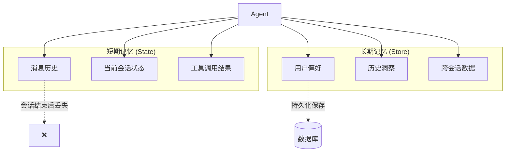
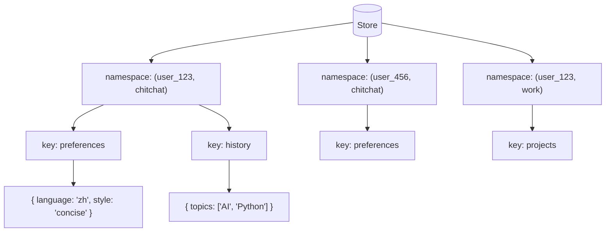
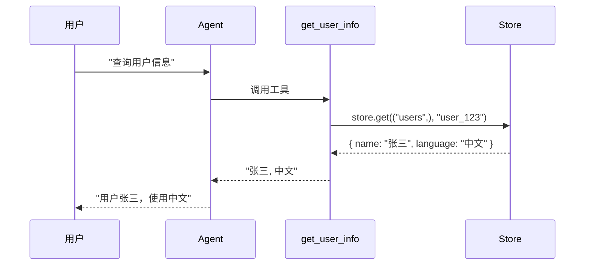
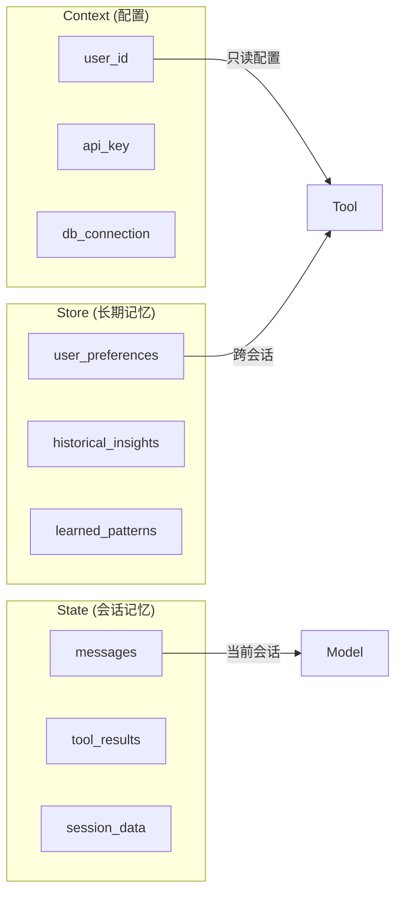

# 长期记忆详解

LangChain Agent 使用 LangGraph 持久化来实现长期记忆。这是一个更高级的主题，需要了解 LangGraph 才能使用。

## 概述

长期记忆与短期记忆（State）的区别：

| 特性 | 短期记忆 (State) | 长期记忆 (Store) |
|------|------------------|------------------|
| 生命周期 | 当前会话 | 跨会话持久化 |
| 存储内容 | 对话消息、临时状态 | 用户偏好、历史数据、洞察 |
| 访问范围 | 单次对话 | 跨多次对话 |
| 典型用途 | 上下文窗口管理 | 用户画像、个性化 |



## 记忆存储结构

LangGraph 将长期记忆存储为 JSON 文档在 Store 中。

每条记忆按以下方式组织：
- **namespace**（命名空间）：类似文件夹，通常包含用户 ID 或组织 ID
- **key**（键）：类似文件名，唯一标识一条记忆



### 基本操作

```python
from langgraph.store.memory import InMemoryStore

def embed(texts: list[str]) -> list[list[float]]:
    # 替换为实际的嵌入函数或 LangChain embeddings 对象
    return [[1.0, 2.0] * len(texts)]

# InMemoryStore 将数据保存到内存字典
# 生产环境使用数据库支持的 Store
store = InMemoryStore(index={"embed": embed, "dims": 2})

user_id = "my-user"
application_context = "chitchat"
namespace = (user_id, application_context)

# 写入记忆
store.put(
    namespace,
    "a-memory",  # key
    {
        "rules": [
            "用户喜欢简短直接的语言",
            "用户只说英语和 Python",
        ],
        "my-key": "my-value",
    },
)

# 通过 ID 获取记忆
item = store.get(namespace, "a-memory")

# 在命名空间内搜索记忆
# 支持内容过滤和向量相似度排序
items = store.search(
    namespace, 
    filter={"my-key": "my-value"}, 
    query="language preferences"
)
```

### Store 操作一览

| 操作 | 方法 | 说明 |
|------|------|------|
| 写入 | `store.put(namespace, key, data)` | 存储或更新一条记忆 |
| 读取 | `store.get(namespace, key)` | 获取指定记忆 |
| 搜索 | `store.search(namespace, filter, query)` | 按条件搜索记忆 |
| 删除 | `store.delete(namespace, key)` | 删除指定记忆 |

## 在工具中读取长期记忆

```python
from dataclasses import dataclass
from langchain.agents import create_agent
from langchain.tools import tool, ToolRuntime
from langgraph.store.memory import InMemoryStore

@dataclass
class Context:
    user_id: str

# 创建 Store（生产环境使用数据库支持的 Store）
store = InMemoryStore()

# 预先写入示例数据
store.put(
    ("users",),           # 命名空间
    "user_123",           # 键（用户 ID）
    {
        "name": "张三",
        "language": "中文",
    }
)

@tool
def get_user_info(runtime: ToolRuntime[Context]) -> str:
    """查询用户信息"""
    # 从 runtime 访问 store
    store = runtime.store
    user_id = runtime.context.user_id
    
    # 从 store 检索数据
    user_info = store.get(("users",), user_id)
    return str(user_info.value) if user_info else "未知用户"

agent = create_agent(
    model="claude-sonnet-4-5-20250929",
    tools=[get_user_info],
    store=store,  # 传递 store 给 agent
    context_schema=Context
)

# 运行 agent
agent.invoke(
    {"messages": [{"role": "user", "content": "查询用户信息"}]},
    context=Context(user_id="user_123")
)
```

### 数据流



## 在工具中写入长期记忆

```python
from dataclasses import dataclass
from typing_extensions import TypedDict
from langchain.agents import create_agent
from langchain.tools import tool, ToolRuntime
from langgraph.store.memory import InMemoryStore

store = InMemoryStore()

@dataclass
class Context:
    user_id: str

# 定义用户信息结构
class UserInfo(TypedDict):
    name: str

@tool
def save_user_info(user_info: UserInfo, runtime: ToolRuntime[Context]) -> str:
    """保存用户信息"""
    store = runtime.store
    user_id = runtime.context.user_id
    
    # 存储数据 (namespace, key, data)
    store.put(("users",), user_id, user_info)
    return "成功保存用户信息"

agent = create_agent(
    model="claude-sonnet-4-5-20250929",
    tools=[save_user_info],
    store=store,
    context_schema=Context
)

# 运行 agent
agent.invoke(
    {"messages": [{"role": "user", "content": "我叫张三"}]},
    context=Context(user_id="user_123")
)

# 直接访问 store 获取值
store.get(("users",), "user_123").value
# 输出: {'name': '张三'}
```

## 完整示例：个性化助手

```python
from dataclasses import dataclass
from typing_extensions import TypedDict
from langchain.agents import create_agent
from langchain.tools import tool, ToolRuntime
from langgraph.store.memory import InMemoryStore

@dataclass
class Context:
    user_id: str

class UserPreferences(TypedDict):
    language: str
    style: str  # concise / detailed
    interests: list[str]

store = InMemoryStore()

@tool
def get_preferences(runtime: ToolRuntime[Context]) -> str:
    """获取用户偏好设置"""
    user_id = runtime.context.user_id
    prefs = runtime.store.get(("preferences",), user_id)
    if prefs:
        return f"语言: {prefs.value['language']}, 风格: {prefs.value['style']}, 兴趣: {prefs.value['interests']}"
    return "未找到用户偏好"

@tool
def save_preferences(
    language: str,
    style: str,
    interests: list[str],
    runtime: ToolRuntime[Context]
) -> str:
    """保存用户偏好设置"""
    user_id = runtime.context.user_id
    runtime.store.put(
        ("preferences",), 
        user_id, 
        {"language": language, "style": style, "interests": interests}
    )
    return "偏好已保存"

@tool
def add_interest(interest: str, runtime: ToolRuntime[Context]) -> str:
    """添加用户兴趣"""
    user_id = runtime.context.user_id
    prefs = runtime.store.get(("preferences",), user_id)
    
    if prefs:
        interests = prefs.value.get("interests", [])
        if interest not in interests:
            interests.append(interest)
            prefs.value["interests"] = interests
            runtime.store.put(("preferences",), user_id, prefs.value)
            return f"已添加兴趣: {interest}"
        return f"兴趣 {interest} 已存在"
    return "请先设置偏好"

agent = create_agent(
    model="claude-sonnet-4-5-20250929",
    tools=[get_preferences, save_preferences, add_interest],
    store=store,
    context_schema=Context,
    prompt="你是一个个性化助手，可以记住用户的偏好设置。"
)
```

## Store vs State vs Context 对比



| 概念 | 生命周期 | 访问方式 | 典型内容 |
|------|----------|----------|----------|
| Context | 单次调用 | `runtime.context` | 用户 ID、API 密钥、配置 |
| State | 当前会话 | `runtime.state` | 消息历史、临时数据 |
| Store | 跨会话 | `runtime.store` | 用户偏好、历史洞察 |

## 总结

| 概念 | 说明 |
|------|------|
| Store | 长期记忆存储，跨会话持久化 |
| namespace | 命名空间，用于组织记忆（如用户 ID） |
| key | 记忆的唯一标识符 |
| `store.put()` | 写入或更新记忆 |
| `store.get()` | 读取指定记忆 |
| `store.search()` | 搜索记忆，支持过滤和向量相似度 |
| `runtime.store` | 在工具中访问 Store |
