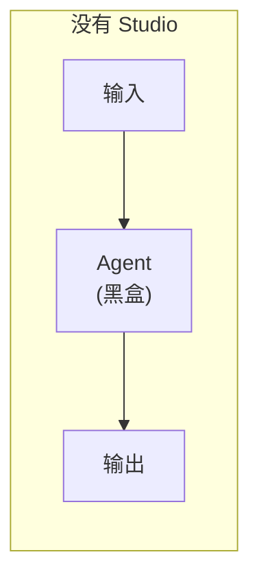
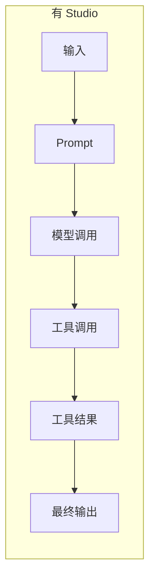
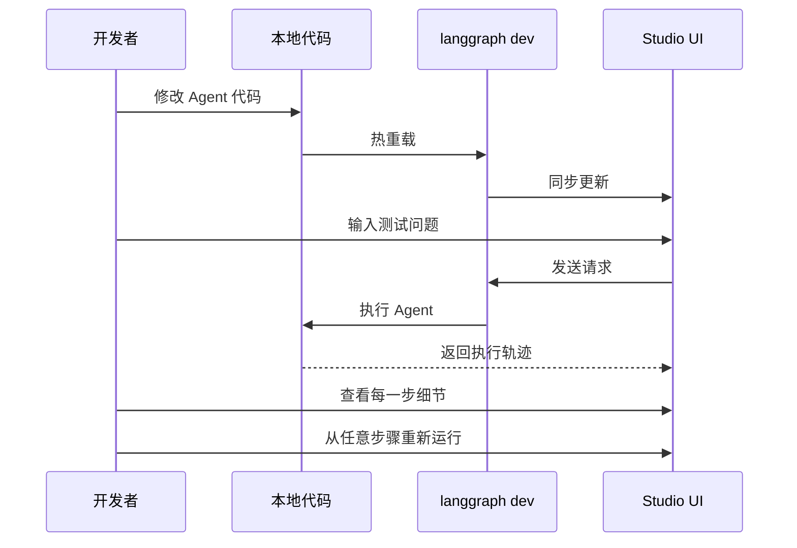

# LangSmith Studio 详解

LangSmith Studio 是一个免费的可视化界面，用于在本地开发和测试 LangChain Agent。它连接到本地运行的 Agent，展示每一步的执行细节。

## 为什么需要 Studio

Agent 执行过程是个黑盒：





**Studio 能看到的信息**：

| 信息 | 说明 |
|------|------|
| Prompt | 发送给模型的完整提示词 |
| 工具调用 | 调用了哪些工具、参数是什么 |
| 工具结果 | 工具返回了什么 |
| 中间状态 | 每一步的状态变化 |
| Token 消耗 | 每次调用的 token 数量 |
| 延迟指标 | 每一步耗时多少 |
| 异常信息 | 哪一步出错、上下文是什么 |

## 前置条件

- Python >= 3.11
- LangSmith 账号（免费）：[smith.langchain.com](https://smith.langchain.com)
- LangSmith API Key

## 设置步骤

### 1. 安装 LangGraph CLI

```bash
pip install --upgrade "langgraph-cli[inmem]"
```

### 2. 准备 Agent 代码

```python
# src/agent.py
from langchain.agents import create_agent

def send_email(to: str, subject: str, body: str):
    """发送邮件"""
    email = {
        "to": to,
        "subject": subject,
        "body": body
    }
    # ... 邮件发送逻辑
    return f"邮件已发送给 {to}"

agent = create_agent(
    "gpt-4o",
    tools=[send_email],
    system_prompt="你是一个邮件助手。始终使用 send_email 工具。",
)
```

### 3. 配置环境变量

创建 `.env` 文件：

```bash
# .env
LANGSMITH_API_KEY=lsv2_your_api_key_here

# 如果不想上传数据到 LangSmith，设置：
# LANGSMITH_TRACING=false
```

> **注意**：确保 `.env` 文件不要提交到 Git。

### 4. 创建配置文件

创建 `langgraph.json`：

```json
{
  "dependencies": ["."],
  "graphs": {
    "agent": "./src/agent.py:agent"
  },
  "env": ".env"
}
```

| 字段 | 说明 |
|------|------|
| `dependencies` | 项目依赖路径 |
| `graphs` | Agent 入口，格式：`文件路径:变量名` |
| `env` | 环境变量文件路径 |

### 5. 项目结构

```
my-app/
├── src/
│   └── agent.py        # Agent 代码
├── .env                # 环境变量（API Key）
└── langgraph.json      # LangGraph 配置
```

### 6. 安装依赖

```bash
pip install langchain langchain-openai
# 或
uv add langchain langchain-openai
```

### 7. 启动 Studio

```bash
langgraph dev
```

启动后：
- API 地址：`http://127.0.0.1:2024`
- Studio UI：`https://smith.langchain.com/studio/?baseUrl=http://127.0.0.1:2024`

> **Safari 用户**：Safari 会阻止 localhost 连接，使用 `langgraph dev --tunnel` 通过安全隧道访问。

## 工作流程



## 核心功能

### 执行轨迹可视化

Studio 展示 Agent 执行的完整轨迹：

```
用户输入: "给张三发一封会议邀请邮件"
    │
    ├─ [1] 模型调用
    │      Prompt: "你是一个邮件助手..."
    │      Token: 150 | 延迟: 1.2s
    │
    ├─ [2] 工具调用: send_email
    │      参数: {to: "zhangsan@...", subject: "会议邀请", body: "..."}
    │
    ├─ [3] 工具结果
    │      返回: "邮件已发送给 zhangsan@..."
    │
    └─ [4] 最终输出
           "我已经给张三发送了会议邀请邮件。"
```

### 热重载

修改代码后自动刷新，无需重启服务：

```python
# 修改 prompt
agent = create_agent(
    "gpt-4o",
    tools=[send_email],
    system_prompt="你是一个专业的邮件助手。请使用正式语气。",  # 改了这里
)
# 保存后 Studio 自动更新
```

### 从任意步骤重新运行

发现问题后，可以从某一步重新执行，而不是从头开始：

```
[1] 模型调用 ✓
[2] 工具调用 ← 从这里重新运行
[3] ...
```

### 异常调试

出错时，Studio 捕获：
- 异常类型和消息
- 出错时的状态
- 调用栈

## 隐私说明

| 设置 | 数据去向 |
|------|----------|
| `LANGSMITH_TRACING=true`（默认） | 执行轨迹上传到 LangSmith |
| `LANGSMITH_TRACING=false` | 数据仅在本地，不上传 |

## 总结

| 概念 | 说明 |
|------|------|
| LangSmith Studio | 免费的 Agent 可视化调试工具 |
| `langgraph dev` | 启动本地开发服务器 |
| `langgraph.json` | 配置文件，指定 Agent 入口 |
| 热重载 | 代码修改后自动刷新 |
| 执行轨迹 | 查看 prompt、工具调用、token、延迟等 |
| 断点重跑 | 从任意步骤重新执行 |
