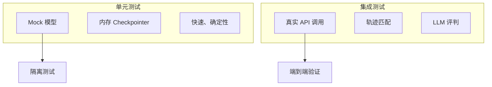
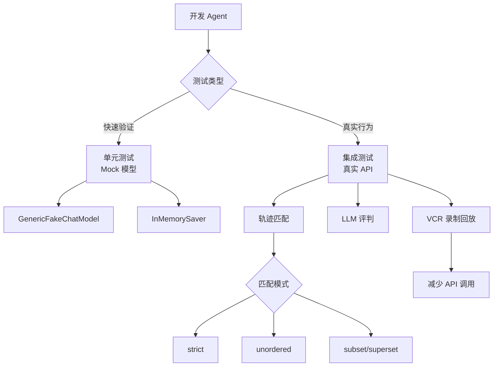

# Agent 测试详解

Agent 应用让 LLM 自主决定下一步行动，这种灵活性很强大，但模型的黑盒特性使得很难预测修改一个部分会如何影响整体。要构建生产级 Agent，全面测试是必不可少的。

## 测试类型



| 测试类型 | 特点 | 适用场景 |
|----------|------|----------|
| 单元测试 | 快速、确定性、使用 Mock | 测试小的、确定性的逻辑片段 |
| 集成测试 | 真实网络调用、验证组件协作 | 验证凭证、schema、延迟 |

> Agent 应用更依赖集成测试，因为它们链接多个组件，且 LLM 的非确定性会导致不稳定。

## 单元测试

### Mock 聊天模型

对于不需要 API 调用的逻辑，使用内存 stub 模拟响应：

```python
from langchain_core.language_models.fake_chat_models import GenericFakeChatModel
from langchain_core.messages import AIMessage

# 创建 Mock 模型，返回预定义的响应序列
model = GenericFakeChatModel(
    messages=iter([
        AIMessage(
            content="", 
            tool_calls=[{
                "name": "foo", 
                "args": {"bar": "baz"}, 
                "id": "call_1"
            }]
        ),
        "bar"
    ])
)

# 第一次调用
result1 = model.invoke("hello")
# AIMessage(content='', tool_calls=[{'name': 'foo', 'args': {'bar': 'baz'}, ...}])

# 第二次调用，返回下一个响应
result2 = model.invoke("hello, again!")
# AIMessage(content='bar', ...)
```

### InMemorySaver Checkpointer

使用内存 Checkpointer 测试状态依赖的行为：

```python
from langgraph.checkpoint.memory import InMemorySaver
from langchain.agents import create_agent
from langchain_core.messages import HumanMessage

agent = create_agent(
    model,
    tools=[],
    checkpointer=InMemorySaver()  # 内存持久化
)

# 第一次调用
agent.invoke(HumanMessage(content="我住在悉尼，澳大利亚。"))

# 第二次调用：第一条消息被持久化（悉尼位置），模型返回 GMT+10 时间
agent.invoke(HumanMessage(content="我的本地时间是多少？"))
```

## 集成测试

很多 Agent 行为只有在使用真实 LLM 时才会出现：
- Agent 决定调用哪个工具
- 如何格式化响应
- 修改 prompt 是否影响整个执行轨迹

### 安装 AgentEvals

```bash
pip install agentevals
```

### 轨迹匹配评估器

`agentevals` 提供 `create_trajectory_match_evaluator` 来匹配 Agent 轨迹：

| 模式 | 说明 | 使用场景 |
|------|------|----------|
| `strict` | 消息和工具调用完全匹配，顺序相同 | 测试特定序列（如先查策略再授权） |
| `unordered` | 相同工具调用，顺序可不同 | 验证信息检索，顺序不重要 |
| `subset` | Agent 只调用参考中的工具（不能多） | 确保 Agent 不超出预期范围 |
| `superset` | Agent 至少调用参考中的工具（可以多） | 验证最低要求的操作被执行 |

#### Strict 模式示例

```python
from langchain.agents import create_agent
from langchain.tools import tool
from langchain.messages import HumanMessage, AIMessage, ToolMessage
from agentevals.trajectory.match import create_trajectory_match_evaluator

@tool
def get_weather(city: str):
    """获取城市天气信息"""
    return f"{city}：25度，晴天。"

agent = create_agent("gpt-4o", tools=[get_weather])

# 创建严格匹配评估器
evaluator = create_trajectory_match_evaluator(
    trajectory_match_mode="strict",
)

def test_weather_tool_called_strict():
    result = agent.invoke({
        "messages": [HumanMessage(content="旧金山天气怎么样？")]
    })
    
    # 参考轨迹
    reference_trajectory = [
        HumanMessage(content="旧金山天气怎么样？"),
        AIMessage(
            content="", 
            tool_calls=[{
                "id": "call_1", 
                "name": "get_weather", 
                "args": {"city": "旧金山"}
            }]
        ),
        ToolMessage(
            content="旧金山：25度，晴天。", 
            tool_call_id="call_1"
        ),
        AIMessage(content="旧金山现在25度，晴天。"),
    ]
    
    evaluation = evaluator(
        outputs=result["messages"],
        reference_outputs=reference_trajectory
    )
    
    # {'key': 'trajectory_strict_match', 'score': True, 'comment': None}
    assert evaluation["score"] is True
```

#### Unordered 模式示例

```python
@tool
def get_weather(city: str):
    """获取天气"""
    return f"{city}：25度，晴天。"

@tool
def get_events(city: str):
    """获取活动"""
    return f"{city}今晚有公园音乐会。"

agent = create_agent("gpt-4o", tools=[get_weather, get_events])

evaluator = create_trajectory_match_evaluator(
    trajectory_match_mode="unordered",  # 顺序可不同
)

def test_multiple_tools_any_order():
    result = agent.invoke({
        "messages": [HumanMessage(content="旧金山今天有什么？")]
    })
    
    # 参考轨迹中工具顺序可能与实际不同
    reference_trajectory = [
        HumanMessage(content="旧金山今天有什么？"),
        AIMessage(content="", tool_calls=[
            {"id": "call_1", "name": "get_events", "args": {"city": "旧金山"}},
            {"id": "call_2", "name": "get_weather", "args": {"city": "旧金山"}},
        ]),
        ToolMessage(content="旧金山今晚有公园音乐会。", tool_call_id="call_1"),
        ToolMessage(content="旧金山：25度，晴天。", tool_call_id="call_2"),
        AIMessage(content="旧金山今天25度晴天，今晚有公园音乐会。"),
    ]
    
    evaluation = evaluator(
        outputs=result["messages"],
        reference_outputs=reference_trajectory,
    )
    
    assert evaluation["score"] is True
```

### LLM-as-Judge 评估器

使用 LLM 来评估 Agent 的执行路径：

```python
from agentevals.trajectory.llm import (
    create_trajectory_llm_as_judge, 
    TRAJECTORY_ACCURACY_PROMPT
)

evaluator = create_trajectory_llm_as_judge(
    model="openai:o3-mini",
    prompt=TRAJECTORY_ACCURACY_PROMPT,
)

def test_trajectory_quality():
    result = agent.invoke({
        "messages": [HumanMessage(content="西雅图天气怎么样？")]
    })
    
    evaluation = evaluator(
        outputs=result["messages"],
    )
    
    # {
    #     'key': 'trajectory_accuracy',
    #     'score': True,
    #     'comment': 'Agent 轨迹合理...'
    # }
    assert evaluation["score"] is True
```

#### 带参考轨迹的 LLM 评判

```python
from agentevals.trajectory.llm import TRAJECTORY_ACCURACY_PROMPT_WITH_REFERENCE

evaluator = create_trajectory_llm_as_judge(
    model="openai:o3-mini",
    prompt=TRAJECTORY_ACCURACY_PROMPT_WITH_REFERENCE,
)

evaluation = evaluator(
    outputs=result["messages"],
    reference_outputs=reference_trajectory,  # 提供参考
)
```

### 轨迹匹配 vs LLM 评判

| 方法 | 优点 | 缺点 |
|------|------|------|
| 轨迹匹配 | 确定性、快速、无额外 LLM 调用 | 需要硬编码参考轨迹 |
| LLM 评判 | 灵活、可评估细微差别 | 需要 LLM 调用、不确定性 |

## 异步支持

所有 `agentevals` 评估器支持 asyncio：

```python
from agentevals.trajectory.llm import create_async_trajectory_llm_as_judge
from agentevals.trajectory.match import create_async_trajectory_match_evaluator

async_judge = create_async_trajectory_llm_as_judge(
    model="openai:o3-mini",
    prompt=TRAJECTORY_ACCURACY_PROMPT,
)

async_evaluator = create_async_trajectory_match_evaluator(
    trajectory_match_mode="strict",
)

async def test_async_evaluation():
    result = await agent.ainvoke({
        "messages": [HumanMessage(content="天气怎么样？")]
    })
    
    evaluation = await async_judge(outputs=result["messages"])
    assert evaluation["score"] is True
```

## LangSmith 集成

将评估结果记录到 LangSmith：

```bash
export LANGSMITH_API_KEY="your_langsmith_api_key"
export LANGSMITH_TRACING="true"
```

### pytest 集成

```python
import pytest
from langsmith import testing as t
from agentevals.trajectory.llm import (
    create_trajectory_llm_as_judge, 
    TRAJECTORY_ACCURACY_PROMPT
)

trajectory_evaluator = create_trajectory_llm_as_judge(
    model="openai:o3-mini",
    prompt=TRAJECTORY_ACCURACY_PROMPT,
)

@pytest.mark.langsmith
def test_trajectory_accuracy():
    result = agent.invoke({
        "messages": [HumanMessage(content="旧金山天气怎么样？")]
    })
    
    reference_trajectory = [...]
    
    # 记录到 LangSmith
    t.log_inputs({})
    t.log_outputs({"messages": result["messages"]})
    t.log_reference_outputs({"messages": reference_trajectory})
    
    trajectory_evaluator(
        outputs=result["messages"],
        reference_outputs=reference_trajectory
    )
```

运行：

```bash
pytest test_trajectory.py --langsmith-output
```

## 录制和回放 HTTP 调用

集成测试调用真实 LLM API 可能很慢且昂贵。使用 `vcrpy` 录制 HTTP 请求/响应，后续运行时回放：

### 安装

```bash
pip install vcrpy pytest-recording
```

### 配置

```python
# conftest.py
import pytest

@pytest.fixture(scope="session")
def vcr_config():
    return {
        "filter_headers": [
            ("authorization", "XXXX"),
            ("x-api-key", "XXXX"),
        ],
        "filter_query_parameters": [
            ("api_key", "XXXX"),
            ("key", "XXXX"),
        ],
    }
```

```ini
# pytest.ini
[pytest]
markers =
    vcr: record/replay HTTP via VCR
addopts = --record-mode=once
```

### 使用

```python
@pytest.mark.vcr()
def test_agent_trajectory():
    # 第一次运行：真实网络调用，生成 cassette 文件
    # 后续运行：使用 cassette 回放
    ...
```

> **注意**：修改 prompt、添加工具或更改预期轨迹后，需要删除 cassette 文件重新录制。

## 测试流程



## 总结

| 概念 | 说明 |
|------|------|
| `GenericFakeChatModel` | Mock 聊天模型，返回预定义响应 |
| `InMemorySaver` | 内存 Checkpointer，测试状态依赖行为 |
| `agentevals` | Agent 轨迹评估库 |
| 轨迹匹配 | 比较实际轨迹与参考轨迹 |
| LLM-as-Judge | 用 LLM 评估轨迹质量 |
| `vcrpy` | 录制/回放 HTTP 调用，加速测试 |
