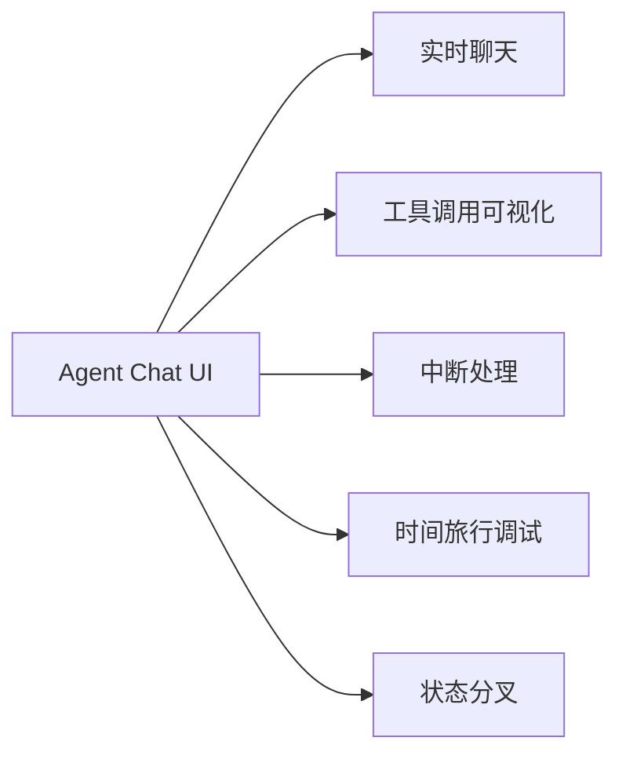
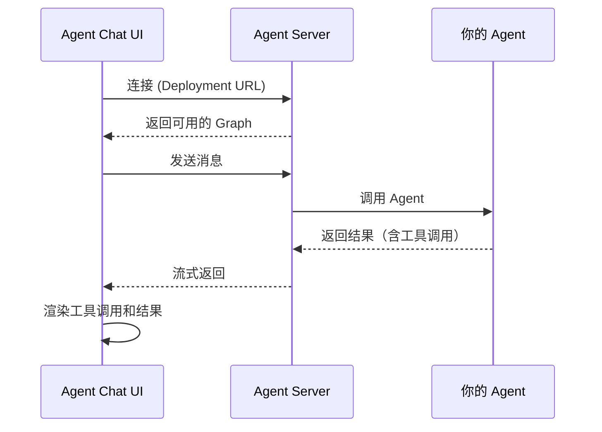
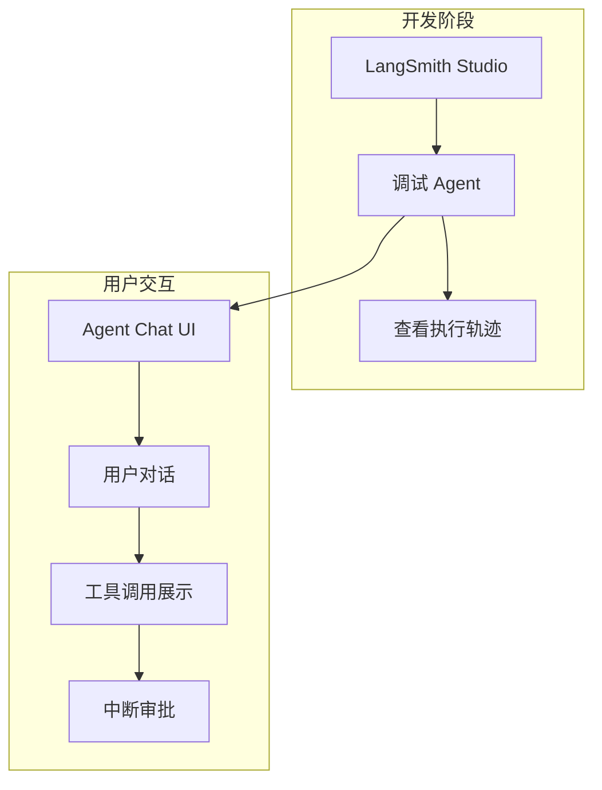

# Agent Chat UI 详解

Agent Chat UI 是一个 Next.js 应用，为任何 LangChain Agent 提供对话界面。它支持实时聊天、工具可视化，以及时间旅行调试和状态分叉等高级功能。

## 核心功能



| 功能 | 说明 |
|------|------|
| 实时聊天 | 与 Agent 进行对话交互 |
| 工具可视化 | 自动渲染工具调用和结果 |
| 中断处理 | 显示和处理 Agent 中断（HITL） |
| 时间旅行 | 回到之前的状态重新执行 |
| 状态分叉 | 从某个状态创建分支探索不同路径 |

## 快速开始

### 方式一：使用托管版本（最快）

1. 访问 [Agent Chat UI](https://agentchat.vercel.app)
2. 输入你的部署 URL 或本地服务器地址
3. 开始聊天

### 方式二：本地运行

```bash
# 使用 npx 创建项目
npx create-agent-chat-app --project-name my-chat-ui
cd my-chat-ui

# 安装依赖并启动
pnpm install
pnpm dev
```

或者克隆仓库：

```bash
git clone https://github.com/langchain-ai/agent-chat-ui.git
cd agent-chat-ui

pnpm install
pnpm dev
```

## 连接 Agent

Agent Chat UI 可以连接本地和已部署的 Agent。

### 配置项

| 配置 | 说明 | 示例 |
|------|------|------|
| Graph ID | 图名称（在 `langgraph.json` 的 `graphs` 中） | `agent` |
| Deployment URL | Agent 服务器地址 | `http://localhost:2024` |
| LangSmith API Key | 可选，本地服务器不需要 | `lsv2_...` |

### 连接流程



## 与 LangSmith Studio 的区别

| 特性 | Agent Chat UI | LangSmith Studio |
|------|---------------|------------------|
| 定位 | 用户交互界面 | 开发调试工具 |
| 主要用途 | 与 Agent 对话 | 查看执行轨迹、调试 |
| 部署 | 可独立部署给用户使用 | 开发时使用 |
| 自定义 | 开源，可完全自定义 | 固定界面 |
| 工具可视化 | ✅ | ✅ |
| 时间旅行 | ✅ | ✅ |

## 典型使用场景



## 工具调用渲染

Agent Chat UI 自动渲染工具调用和结果：

```
用户: 查一下北京天气

Agent: [正在调用工具: get_weather]
       参数: {"city": "北京"}
       
       [工具结果]
       北京：25度，晴天
       
       北京现在25度，天气晴朗。
```

## 中断处理

当 Agent 配置了 HITL（人在回路）时，Chat UI 会显示中断并等待用户操作：

```
Agent: [需要审批]
       工具: delete_file
       参数: {"path": "/important/data.txt"}
       
       [批准] [拒绝] [编辑]
```

## 自定义消息显示

可以配置隐藏某些消息类型，参考 [Hiding Messages in the Chat](https://github.com/langchain-ai/agent-chat-ui?tab=readme-ov-file#hiding-messages-in-the-chat)。

## 生成式 UI

Agent Chat UI 支持生成式 UI，可以让 Agent 返回自定义的 React 组件而不仅仅是文本。

## 总结

| 概念 | 说明 |
|------|------|
| Agent Chat UI | 开源的 Agent 对话界面 |
| Graph ID | Agent 图的名称标识 |
| Deployment URL | Agent 服务器地址 |
| 工具可视化 | 自动渲染工具调用和结果 |
| 时间旅行 | 回到之前状态重新执行 |
| 状态分叉 | 从某个状态创建分支 |
