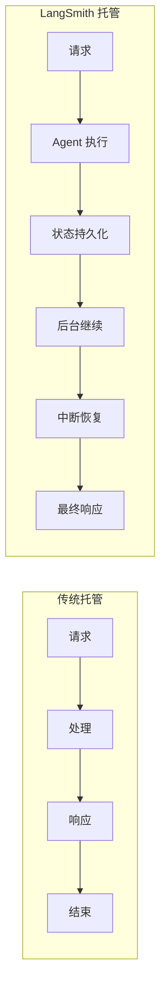
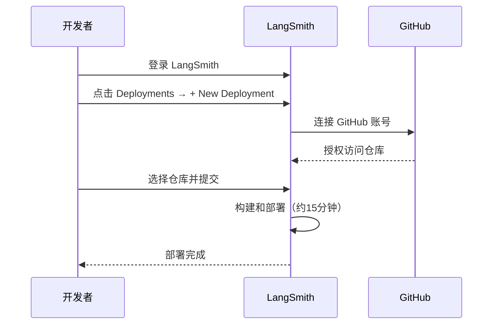
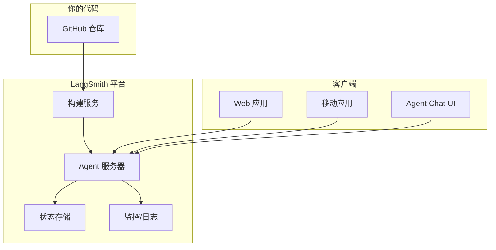
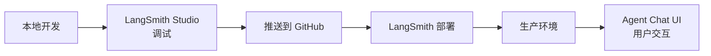

# LangSmith 部署详解

当你准备将 LangChain Agent 部署到生产环境时，LangSmith 提供了专为 Agent 工作负载设计的托管平台。

## 为什么选择 LangSmith 部署

传统托管平台是为无状态、短生命周期的 Web 应用构建的，而 LangGraph 是**专为有状态、长时间运行的 Agent** 设计的，需要持久化状态和后台执行。



| 特性 | 传统托管 | LangSmith 托管 |
|------|----------|----------------|
| 状态管理 | 无状态 | 有状态持久化 |
| 执行时间 | 短（超时限制） | 长时间运行 |
| 中断恢复 | ❌ | ✅ |
| Agent 优化 | ❌ | ✅ |
| 自动扩缩 | 需配置 | 内置 |

## 前置条件

- GitHub 账号
- LangSmith 账号（免费注册）
- 代码已按 [LangSmith Studio 设置](/langchain/25-LangSmith%20Studio详解.md) 配置好

## 部署步骤

### 1. 创建 GitHub 仓库

将你的应用代码推送到 GitHub 仓库（支持公开和私有仓库）。

项目结构：

```
my-agent/
├── src/
│   └── agent.py
├── .env              # 不要提交到 Git！
├── langgraph.json
└── requirements.txt
```

### 2. 在 LangSmith 创建部署



**步骤**：

1. 登录 [LangSmith](https://smith.langchain.com/)
2. 左侧边栏选择 **Deployments**
3. 点击 **+ New Deployment**
4. 首次使用需点击 **Add new account** 连接 GitHub
5. 选择你的仓库
6. 点击 **Submit** 开始部署

> 部署大约需要 15 分钟，可以在 **Deployment details** 查看状态。

### 3. 在 Studio 中测试

部署完成后：

1. 选择刚创建的部署
2. 点击右上角 **Studio** 按钮
3. 在 Studio 中测试你的 Agent

### 4. 获取 API URL

1. 在 **Deployment details** 页面
2. 点击 **API URL** 复制到剪贴板

## 调用已部署的 Agent

### Python SDK

```bash
pip install langgraph-sdk
```

```python
from langgraph_sdk import get_sync_client  # 或 get_client 用于异步

client = get_sync_client(
    url="your-deployment-url",
    api_key="your-langsmith-api-key"
)

for chunk in client.runs.stream(
    None,       # Threadless run
    "agent",    # Agent 名称（在 langgraph.json 中定义）
    input={
        "messages": [
            {
                "role": "human",
                "content": "什么是 LangGraph？",
            }
        ],
    },
    stream_mode="updates",
):
    print(f"收到新事件: {chunk.event}...")
    print(chunk.data)
    print("\n")
```

### REST API

```bash
curl -s --request POST \
  --url <DEPLOYMENT_URL>/runs/stream \
  --header 'Content-Type: application/json' \
  --header "X-Api-Key: <LANGSMITH_API_KEY>" \
  --data '{
    "assistant_id": "agent",
    "input": {
      "messages": [
        {
          "role": "human",
          "content": "什么是 LangGraph？"
        }
      ]
    },
    "stream_mode": "updates"
  }'
```

## 部署架构



## 部署选项

| 选项 | 说明 |
|------|------|
| 托管版 | LangSmith 完全管理，最简单 |
| 自托管 | 在你自己的基础设施上运行 |
| 混合部署 | 部分托管，部分自托管 |

## 环境变量配置

在 LangSmith 部署设置中配置环境变量（不要在代码中硬编码）：

| 变量 | 说明 |
|------|------|
| `OPENAI_API_KEY` | OpenAI API 密钥 |
| `ANTHROPIC_API_KEY` | Anthropic API 密钥 |
| 其他自定义变量 | 数据库连接等 |

## 开发到生产流程



## 总结

| 概念 | 说明 |
|------|------|
| LangSmith 部署 | 专为 Agent 设计的托管平台 |
| 有状态托管 | 支持持久化状态和长时间运行 |
| GitHub 集成 | 从仓库直接部署 |
| `langgraph-sdk` | Python SDK 调用已部署的 Agent |
| API URL | 部署后的 Agent 访问地址 |
