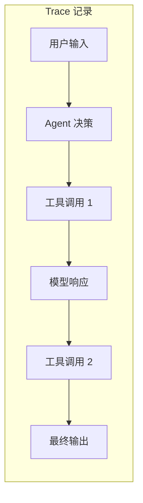
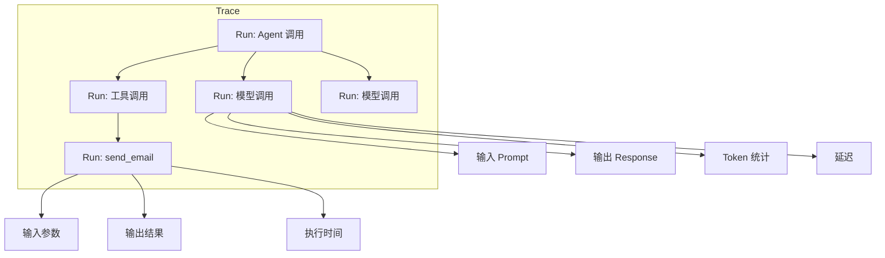
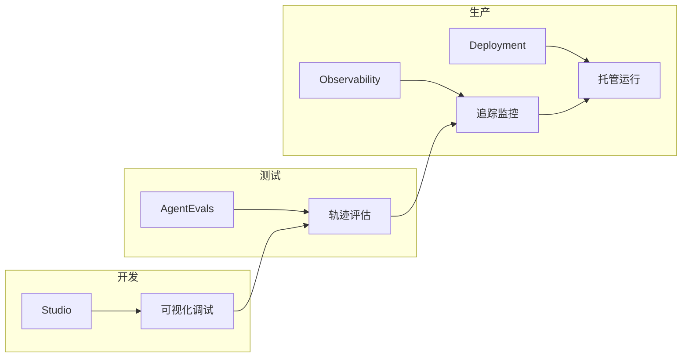

# LangSmith 可观测性详解

在构建和运行 Agent 时，你需要了解它们的行为：调用了哪些工具、生成了什么 prompt、如何做出决策。LangChain Agent 自动支持通过 LangSmith 进行追踪。

## 什么是 Trace

**Trace（追踪）** 记录 Agent 执行的每一步：从初始用户输入到最终响应，包括所有工具调用、模型交互和决策点。



**Trace 的作用**：

| 用途 | 说明 |
|------|------|
| 调试 | 定位问题发生在哪一步 |
| 评估 | 比较不同输入的性能 |
| 监控 | 追踪生产环境的使用模式 |
| 优化 | 分析 token 消耗和延迟 |

## 前置条件

- LangSmith 账号（免费）：[smith.langchain.com](https://smith.langchain.com)
- LangSmith API Key

## 启用追踪

设置环境变量即可自动启用：

```bash
export LANGSMITH_TRACING=true
export LANGSMITH_API_KEY=<your-api-key>
```

或在 `.env` 文件中：

```bash
LANGSMITH_TRACING=true
LANGSMITH_API_KEY=lsv2_your_api_key_here
```

## 快速开始

无需额外代码，正常运行 Agent 即可自动记录 Trace：

```python
from langchain.agents import create_agent

def send_email(to: str, subject: str, body: str):
    """发送邮件"""
    return f"邮件已发送给 {to}"

def search_web(query: str):
    """搜索网页"""
    return f"搜索结果: {query}"

agent = create_agent(
    model="gpt-4o",
    tools=[send_email, search_web],
    system_prompt="你是一个有帮助的助手，可以发送邮件和搜索网页。"
)

# 运行 Agent - 所有步骤自动被追踪
response = agent.invoke({
    "messages": [{
        "role": "user", 
        "content": "搜索最新的 AI 新闻，然后发送摘要到 john@example.com"
    }]
})
```

## 选择性追踪

使用 `tracing_context` 控制哪些调用被追踪：

```python
import langsmith as ls

# 这个会被追踪
with ls.tracing_context(enabled=True):
    agent.invoke({
        "messages": [{"role": "user", "content": "发送测试邮件"}]
    })

# 这个不会被追踪（如果 LANGSMITH_TRACING 未设置）
agent.invoke({
    "messages": [{"role": "user", "content": "发送另一封邮件"}]
})
```

## 项目管理

### 静态设置项目名

```bash
export LANGSMITH_PROJECT=my-agent-project
```

### 动态设置项目名

```python
import langsmith as ls

with ls.tracing_context(project_name="email-agent-test", enabled=True):
    response = agent.invoke({
        "messages": [{"role": "user", "content": "发送欢迎邮件"}]
    })
```

## 添加元数据和标签

为 Trace 添加自定义元数据，便于筛选和分析：

```python
response = agent.invoke(
    {
        "messages": [{"role": "user", "content": "发送欢迎邮件"}]
    },
    config={
        "tags": ["production", "email-assistant", "v1.0"],
        "metadata": {
            "user_id": "user_123",
            "session_id": "session_456",
            "environment": "production"
        }
    }
)
```

或使用 `tracing_context`：

```python
with ls.tracing_context(
    project_name="email-agent-test",
    enabled=True,
    tags=["production", "email-assistant", "v1.0"],
    metadata={
        "user_id": "user_123", 
        "session_id": "session_456", 
        "environment": "production"
    }
):
    response = agent.invoke({
        "messages": [{"role": "user", "content": "发送欢迎邮件"}]
    })
```

## Trace 结构



## 在 LangSmith 中查看

1. 登录 [LangSmith](https://smith.langchain.com/)
2. 选择项目（默认是 `default`）
3. 查看 Trace 列表
4. 点击单个 Trace 查看详情

**可以看到的信息**：

| 信息 | 说明 |
|------|------|
| 输入/输出 | 每一步的输入和输出 |
| Token 统计 | 每次模型调用的 token 数 |
| 延迟 | 每一步的执行时间 |
| 错误 | 如果有异常，显示错误信息 |
| 元数据 | 自定义的 tags 和 metadata |

## 配置汇总

| 环境变量 | 说明 | 默认值 |
|----------|------|--------|
| `LANGSMITH_TRACING` | 是否启用追踪 | `false` |
| `LANGSMITH_API_KEY` | API 密钥 | 无 |
| `LANGSMITH_PROJECT` | 项目名称 | `default` |
| `LANGSMITH_ENDPOINT` | API 端点 | `https://api.smith.langchain.com` |

## LangSmith 工具链



## 总结

| 概念 | 说明 |
|------|------|
| Trace | 记录 Agent 执行的完整轨迹 |
| `LANGSMITH_TRACING` | 环境变量，启用追踪 |
| `tracing_context` | 选择性追踪的上下文管理器 |
| tags | 标签，用于分类和筛选 |
| metadata | 元数据，附加自定义信息 |
| project | 项目，组织 Trace 的容器 |
