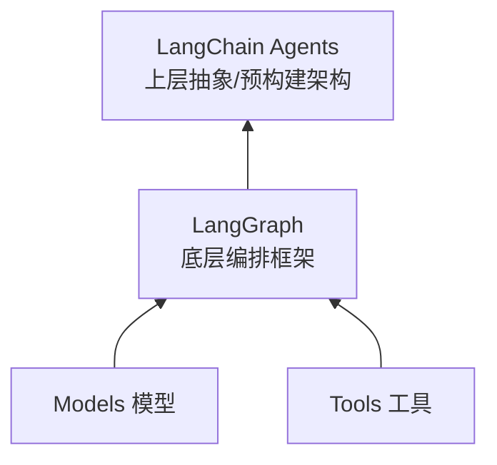
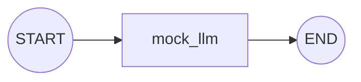
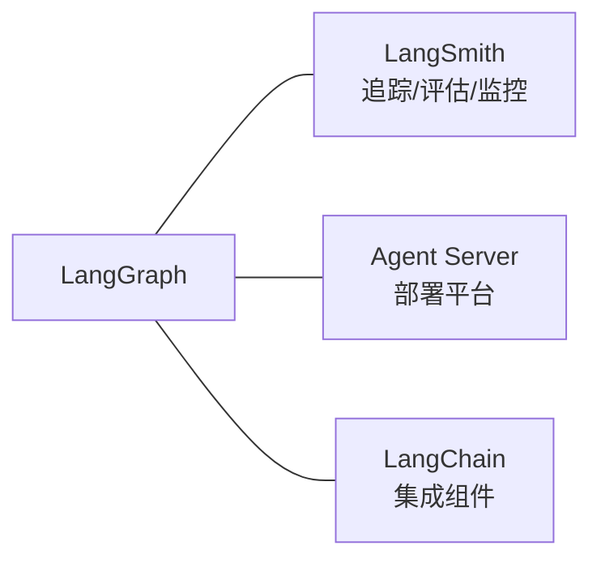

# LangGraph 概述

> 底层编排框架，用于构建长时间运行的有状态 Agent

LangGraph 是一个**底层编排框架 (Orchestration Framework)** 和 **Runtime（运行时）**，用于构建、管理和部署长时间运行的、有状态的 Agent。

- **编排框架**：定义 Agent 的执行流程（节点、边、状态流转）
- **Runtime**：实际执行图，并提供状态持久化、流式输出、中断恢复等运行期能力

被 Klarna、Replit、Elastic 等公司所信赖。

## 定位说明



- **LangGraph 是底层框架**，完全专注于 Agent **编排 (orchestration)**
- **不抽象提示词或架构**，提供最大的控制力和灵活性
- 使用前建议先熟悉 Models 和 Tools
- 如果刚开始接触 Agent 或想要上层抽象，推荐使用 LangChain Agents

## 安装

```bash
# 安装 LangGraph
pip install -U langgraph
# 或
uv add langgraph

# 安装 LangChain（用于集成 LLM 和 Tools，需要 Python 3.10+）
pip install -U langchain
# 或
uv add langchain
```

使用 LangGraph 通常需要访问 LLM 和定义工具，可以通过 LangChain 来实现。

具体 LLM Provider 需要单独安装，例如：

```bash
# OpenAI
pip install langchain-openai

# Anthropic
pip install langchain-anthropic

# 阿里通义千问
pip install langchain-community dashscope
```

## Hello World 示例

```python
from langgraph.graph import StateGraph, MessagesState, START, END

def mock_llm(state: MessagesState):
    return {"messages": [{"role": "ai", "content": "hello world"}]}

graph = StateGraph(MessagesState)
graph.add_node(mock_llm)
graph.add_edge(START, "mock_llm")
graph.add_edge("mock_llm", END)

graph = graph.compile()
graph.invoke({"messages": [{"role": "user", "content": "hi!"}]})
```

对应的图结构：



## 核心优势

| 特性 | 说明 |
|------|------|
| **持久执行 (Durable Execution)** | 构建能够在故障中持久化并长时间运行的 Agent，可从中断处恢复 |
| **人机协作 (Human-in-the-loop)** | 在任意点检查和修改 Agent 状态，纳入人工监督 |
| **全面记忆 (Comprehensive Memory)** | 支持短期工作记忆（当前推理）和长期记忆（跨会话） |
| **LangSmith 调试** | 可视化追踪执行路径、捕获状态转换、提供运行时指标 |
| **生产就绪部署** | 可扩展基础设施，处理有状态长时间运行工作流 |

## 生态系统



| 产品 | 功能 |
|------|------|
| **LangSmith** | 追踪请求、评估输出、监控部署 |
| **Agent Server** | 专为长时间运行的有状态工作流构建的部署平台 |
| **LangChain** | 提供集成和可组合组件，简化 LLM 应用开发 |

## 技术背景

LangGraph 的设计灵感来源：

- **Pregel** - Google 的大规模图处理系统
- **Apache Beam** - 统一的批处理和流处理模型
- **NetworkX** - 公共接口设计参考

由 LangChain Inc 构建，但**可独立于 LangChain 使用**。

## 要点总结

- LangGraph = 底层 Agent 编排框架 + 运行时
- 核心能力：持久执行、人机协作、记忆系统、调试、部署
- 与 LangChain 生态无缝集成，但可独立使用
