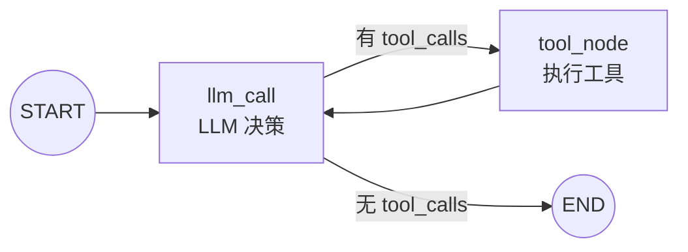
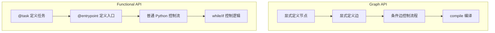

# 快速入门

> 通过构建一个计算器 Agent，学习 LangGraph 的两种 API 风格

LangGraph 提供两种构建 Agent 的方式：

| API | 特点 | 适用场景 |
|-----|------|----------|
| **Graph API** | 显式定义节点和边 | 复杂流程、需要可视化 |
| **Functional API** | 单函数 + 普通控制流 | 简单逻辑、快速原型 |

## Graph API 方式

### 执行流程



### Step 1: 定义工具和模型

```python
from langchain.tools import tool
from langchain.chat_models import init_chat_model

# 初始化模型（示例使用 Claude，可替换为其他模型）
model = init_chat_model("claude-sonnet-4-5-20250929", temperature=0)

# 定义工具
@tool
def multiply(a: int, b: int) -> int:
    """Multiply `a` and `b`."""
    return a * b

@tool
def add(a: int, b: int) -> int:
    """Adds `a` and `b`."""
    return a + b

@tool
def divide(a: int, b: int) -> float:
    """Divide `a` and `b`."""
    return a / b

# 将工具绑定到模型
tools = [add, multiply, divide]
tools_by_name = {tool.name: tool for tool in tools}
model_with_tools = model.bind_tools(tools)
```

### Step 2: 定义状态 (State)

```python
from langchain.messages import AnyMessage
from typing_extensions import TypedDict, Annotated
import operator

class MessagesState(TypedDict):
    # Annotated + operator.add 表示新消息追加到列表，而非替换
    messages: Annotated[list[AnyMessage], operator.add]
    llm_calls: int  # 记录 LLM 调用次数
```

> **关键概念**：State 在整个 Agent 执行过程中持久化，`Annotated` 配合 `operator.add` 实现消息累加。

### Step 3: 定义模型节点 (Model Node)

```python
from langchain.messages import SystemMessage

def llm_call(state: dict):
    """LLM 决定是否调用工具"""
    return {
        "messages": [
            model_with_tools.invoke(
                [SystemMessage(content="You are a helpful assistant tasked with performing arithmetic on a set of inputs.")]
                + state["messages"]
            )
        ],
        "llm_calls": state.get('llm_calls', 0) + 1
    }
```

### Step 4: 定义工具节点 (Tool Node)

```python
from langchain.messages import ToolMessage

def tool_node(state: dict):
    """执行工具调用"""
    result = []
    for tool_call in state["messages"][-1].tool_calls:
        tool = tools_by_name[tool_call["name"]]
        observation = tool.invoke(tool_call["args"])
        result.append(ToolMessage(content=observation, tool_call_id=tool_call["id"]))
    return {"messages": result}
```

### Step 5: 定义条件边 (Conditional Edge)

```python
from typing import Literal
from langgraph.graph import StateGraph, START, END

def should_continue(state: MessagesState) -> Literal["tool_node", END]:
    """根据 LLM 是否调用工具来决定下一步"""
    messages = state["messages"]
    last_message = messages[-1]
    if last_message.tool_calls:
        return "tool_node"  # 继续执行工具
    return END  # 结束，返回给用户
```

### Step 6: 构建并编译 Agent

```python
from langgraph.graph import StateGraph, START, END

# 构建图
agent_builder = StateGraph(MessagesState)

# 添加节点
agent_builder.add_node("llm_call", llm_call)
agent_builder.add_node("tool_node", tool_node)

# 添加边
agent_builder.add_edge(START, "llm_call")
agent_builder.add_conditional_edges(
    "llm_call",
    should_continue,
    ["tool_node", END]
)
agent_builder.add_edge("tool_node", "llm_call")

# 编译
agent = agent_builder.compile()

# 调用
from langchain.messages import HumanMessage
messages = [HumanMessage(content="Add 3 and 4.")]
result = agent.invoke({"messages": messages})
for m in result["messages"]:
    m.pretty_print()
```

---

## Functional API 方式

使用普通 Python 控制流（循环、条件）替代显式的节点和边。

### 核心装饰器

| 装饰器 | 作用 |
|--------|------|
| `@task` | 标记可执行的任务函数 |
| `@entrypoint` | 标记 Agent 入口函数 |

### Step 1: 定义工具和模型

（与 Graph API 相同）

### Step 2: 定义模型任务

```python
from langgraph.func import entrypoint, task
from langchain_core.messages import BaseMessage

@task
def call_llm(messages: list[BaseMessage]):
    """LLM 决定是否调用工具"""
    return model_with_tools.invoke(
        [SystemMessage(content="You are a helpful assistant tasked with performing arithmetic on a set of inputs.")]
        + messages
    )
```

### Step 3: 定义工具任务

```python
from langchain.messages import ToolCall

@task
def call_tool(tool_call: ToolCall):
    """执行工具调用"""
    tool = tools_by_name[tool_call["name"]]
    return tool.invoke(tool_call)
```

### Step 4: 定义 Agent

```python
from langgraph.graph import add_messages
from langchain.messages import HumanMessage

@entrypoint()
def agent(messages: list[BaseMessage]):
    model_response = call_llm(messages).result()
    
    while True:
        if not model_response.tool_calls:
            break
        
        # 执行所有工具调用
        tool_result_futures = [call_tool(tool_call) for tool_call in model_response.tool_calls]
        tool_results = [fut.result() for fut in tool_result_futures]
        
        # 更新消息
        messages = add_messages(messages, [model_response, *tool_results])
        model_response = call_llm(messages).result()
    
    messages = add_messages(messages, model_response)
    return messages

# 调用（流式输出）
messages = [HumanMessage(content="Add 3 and 4.")]
for chunk in agent.stream(messages, stream_mode="updates"):
    print(chunk)
```

## 两种 API 对比



| 维度 | Graph API | Functional API |
|------|-----------|----------------|
| 流程定义 | 节点 + 边 | 普通 Python 代码 |
| 可视化 | 支持 `draw_mermaid_png()` | 不直接支持 |
| 学习曲线 | 需理解图概念 | 更直观 |
| 复杂流程 | 更清晰 | 可能变复杂 |
| 调试 | 节点级别 | 函数级别 |

## 要点总结

- Graph API：`StateGraph` + `add_node` + `add_edge` + `compile`
- Functional API：`@entrypoint` + `@task` + 普通控制流
- 两种方式都支持工具调用循环（ReAct 模式）
- State 用于在节点间传递和持久化数据
