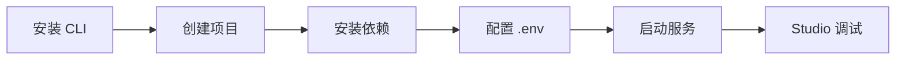

# 本地服务器

> 使用 LangGraph CLI 在本地运行 Agent Server

## 前置条件

- Python >= 3.11
- [LangSmith](https://smith.langchain.com/settings) API Key（免费注册）

## 快速启动流程



## Step 1: 安装 LangGraph CLI

```bash
# pip
pip install -U "langgraph-cli[inmem]"

# uv
uv add "langgraph-cli[inmem]"
```

## Step 2: 创建 LangGraph 应用

```bash
langgraph new path/to/your/app --template new-langgraph-project-python
```

不指定 `--template` 会进入交互式菜单选择模板。

## Step 3: 安装依赖

```bash
cd path/to/your/app

# pip（以可编辑模式安装，本地修改立即生效）
pip install -e .

# uv
uv sync
```

## Step 4: 配置环境变量

复制 `.env.example` 为 `.env`，填入 API Key：

```bash
LANGSMITH_API_KEY=lsv2...
```

## Step 5: 启动 Agent Server

```bash
langgraph dev
```

输出示例：

```text
    LangGraph

-  API: http://127.0.0.1:2024
-  Studio UI: https://smith.langchain.com/studio/?baseUrl=http://127.0.0.1:2024
-  API Docs: http://127.0.0.1:2024/docs
```

> `langgraph dev` 启动的是**内存模式**，适合开发测试。生产环境需要持久化存储后端。

## Step 6: 使用 Studio 调试

访问输出中的 Studio URL 进行可视化调试：

```
https://smith.langchain.com/studio/?baseUrl=http://127.0.0.1:2024
```

自定义端口时修改 `baseUrl` 参数即可。

> Safari 兼容性：使用 `langgraph dev --tunnel` 创建安全隧道。

## Step 7: 测试 API

### Python SDK（异步）

```bash
pip install langgraph-sdk
```

```python
from langgraph_sdk import get_client
import asyncio

client = get_client(url="http://localhost:2024")

async def main():
    async for chunk in client.runs.stream(
        None,      # Threadless run
        "agent",   # Assistant 名称，定义在 langgraph.json
        input={
            "messages": [{"role": "human", "content": "What is LangGraph?"}],
        },
    ):
        print(f"Event: {chunk.event}")
        print(chunk.data)

asyncio.run(main())
```

### Python SDK（同步）

```python
from langgraph_sdk import get_sync_client

client = get_sync_client(url="http://localhost:2024")

for chunk in client.runs.stream(
    None,
    "agent",
    input={"messages": [{"role": "human", "content": "What is LangGraph?"}]},
    stream_mode="messages-tuple",
):
    print(f"Event: {chunk.event}")
    print(chunk.data)
```

### REST API

```bash
curl -s --request POST \
  --url "http://localhost:2024/runs/stream" \
  --header 'Content-Type: application/json' \
  --data '{
    "assistant_id": "agent",
    "input": {
      "messages": [{"role": "human", "content": "What is LangGraph?"}]
    },
    "stream_mode": "messages-tuple"
  }'
```

## 核心概念速查

| 概念 | 说明 |
|------|------|
| `langgraph dev` | 启动本地开发服务器（内存模式） |
| `langgraph.json` | 项目配置文件，定义 assistant |
| Studio | LangSmith 提供的可视化调试 UI |
| Threadless run | 无状态运行，不保存对话历史 |

## 要点总结

- LangGraph CLI 提供本地开发服务器
- `langgraph dev` 启动内存模式，适合开发测试
- Studio 提供可视化调试界面
- 支持 Python SDK 和 REST API 两种调用方式
