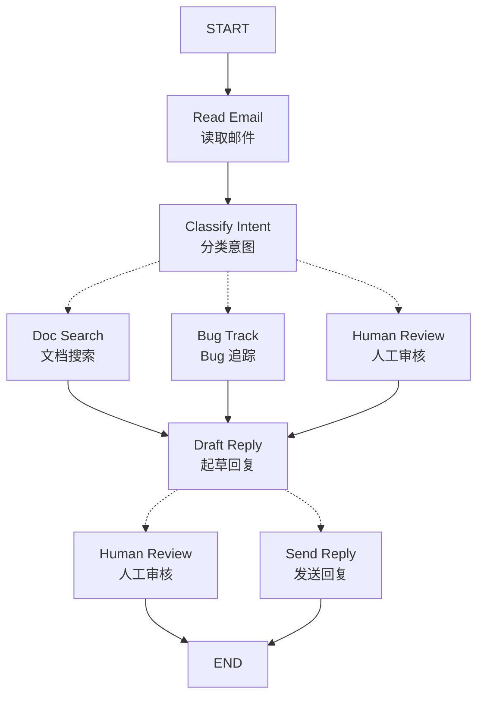
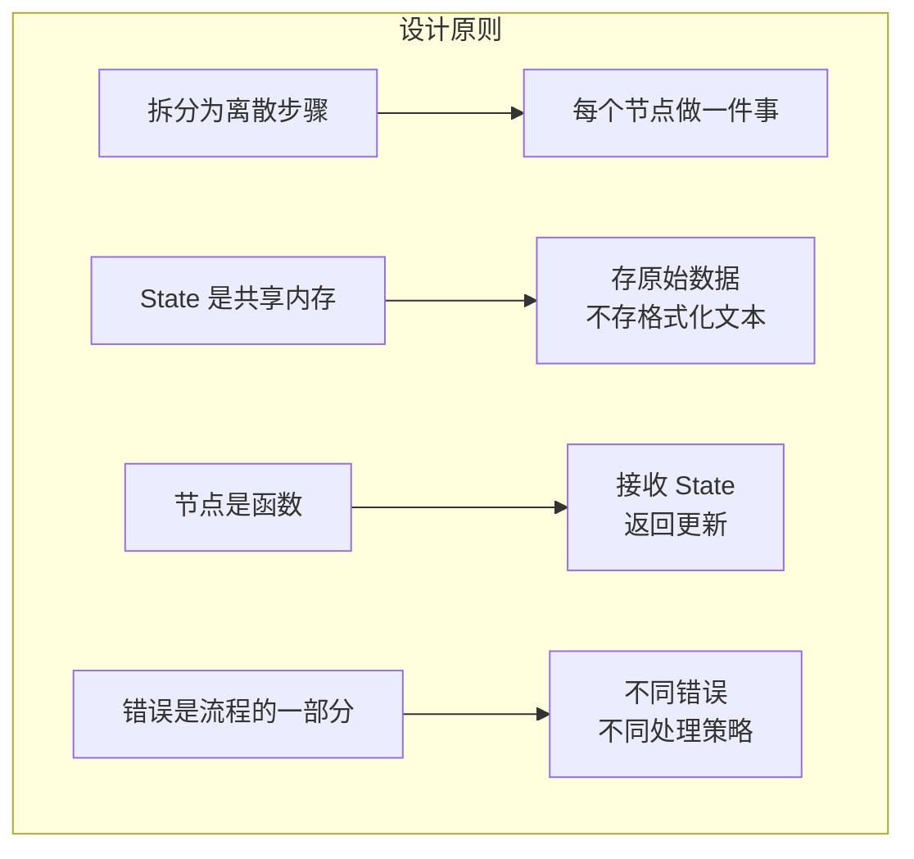

# LangGraph 思维方式

> 学习如何用 LangGraph 的方式思考和构建 Agent

构建 LangGraph Agent 的核心思路：

1. 将流程拆分为离散的步骤（**节点 Node**）
2. 描述每个节点的决策和转换
3. 通过共享的 **状态 State** 连接节点

本文通过一个**客户支持邮件 Agent** 示例来演示这个思维过程。

## 需求示例

```text
Agent 需要：
- 读取客户邮件
- 按紧急程度和主题分类
- 搜索相关文档回答问题
- 起草回复
- 复杂问题升级给人工
- 必要时安排后续跟进

场景示例：
1. 简单问题："如何重置密码？"
2. Bug 报告："导出 PDF 时崩溃"
3. 紧急账单问题："我被重复扣款了！"
4. 功能请求："能加个深色模式吗？"
5. 复杂技术问题："API 集成间歇性 504 错误"
```

## Step 1: 将流程映射为离散步骤

每个步骤成为一个 **Node**（执行特定任务的函数）。



各节点职责：

| 节点 | 职责 | 类型 |
|------|------|------|
| Read Email | 提取解析邮件内容 | 数据处理 |
| Classify Intent | LLM 分类紧急程度和主题，路由到下一步 | LLM 决策 |
| Doc Search | 查询知识库 | 数据检索 |
| Bug Track | 创建/更新 Issue | 外部操作 |
| Draft Reply | 生成回复 | LLM 生成 |
| Human Review | 人工审批 | 人机协作 |
| Send Reply | 发送邮件 | 外部操作 |

> 注意：有些节点会做路由决策（Classify Intent、Draft Reply），有些总是走固定路径（Read Email → Classify Intent）。

## Step 2: 确定每个步骤的类型

| 类型 | 使用场景 | 示例 |
|------|----------|------|
| **LLM 步骤** | 理解、分析、生成文本、推理决策 | 分类意图、起草回复 |
| **数据步骤** | 从外部源检索信息 | 文档搜索、客户历史查询 |
| **操作步骤** | 执行外部操作 | 发送邮件、创建 Bug 工单 |
| **用户输入步骤** | 需要人工介入 | 人工审核 |

### LLM 步骤设计

**分类意图节点：**
- 静态上下文（Prompt）：分类类别、紧急程度定义、响应格式
- 动态上下文（State）：邮件内容、发件人信息
- 期望输出：结构化分类结果，决定路由

**起草回复节点：**
- 静态上下文：语气指南、公司政策、回复模板
- 动态上下文：分类结果、搜索结果、客户历史
- 期望输出：专业的邮件回复

### 数据步骤设计

- 重试策略：指数退避处理瞬时故障
- 缓存策略：常见查询可缓存

### 操作步骤设计

- 发送邮件：审批后执行，需重试策略
- Bug 追踪：intent 为 bug 时执行，返回工单 ID

## Step 3: 设计 State

State 是所有节点共享的**内存**，记录 Agent 执行过程中学到和决定的一切。

### 什么应该放入 State？

| 放入 State | 不放入 State |
|------------|--------------|
| 需要跨步骤持久化的数据 | 可从其他数据派生的内容 |
| 原始邮件、分类结果、搜索结果 | 格式化后的 Prompt 文本 |

### 关键原则：State 存原始数据，Prompt 按需格式化

```python
from typing import TypedDict, Literal

class EmailClassification(TypedDict):
    intent: Literal["question", "bug", "billing", "feature", "complex"]
    urgency: Literal["low", "medium", "high", "critical"]
    topic: str
    summary: str

class EmailAgentState(TypedDict):
    # 原始邮件数据
    email_content: str
    sender_email: str
    email_id: str
    
    # 分类结果
    classification: EmailClassification | None
    
    # 原始搜索/API 结果
    search_results: list[str] | None
    customer_history: dict | None
    
    # 生成内容
    draft_response: str | None
    messages: list[str] | None
```

> State 只存原始数据，不存格式化字符串。不同节点可以用不同方式格式化同一数据。

## Step 4: 构建节点

节点就是 Python 函数：接收 State，执行工作，返回更新。

### 错误处理策略

| 错误类型 | 处理者 | 策略 |
|----------|--------|------|
| 瞬时错误（网络、限流） | 系统自动 | 重试策略 |
| LLM 可恢复错误（工具失败、解析问题） | LLM | 存入 State 让 LLM 重试 |
| 用户可修复错误（缺少信息） | 人工 | `interrupt()` 暂停 |
| 意外错误 | 开发者 | 向上抛出 |

```python
# 瞬时错误：添加重试策略
from langgraph.types import RetryPolicy

workflow.add_node(
    "search_documentation",
    search_documentation,
    retry_policy=RetryPolicy(max_attempts=3, initial_interval=1.0)
)

# LLM 可恢复：存错误让 LLM 重试
from langgraph.types import Command

def execute_tool(state: State) -> Command[Literal["agent", "execute_tool"]]:
    try:
        result = run_tool(state['tool_call'])
        return Command(update={"tool_result": result}, goto="agent")
    except ToolError as e:
        return Command(
            update={"tool_result": f"Tool error: {str(e)}"},
            goto="agent"  # 让 LLM 看到错误并重试
        )

# 用户可修复：interrupt 暂停
from langgraph.types import interrupt

def lookup_customer_history(state: State) -> Command[Literal["draft_response"]]:
    if not state.get('customer_id'):
        user_input = interrupt({
            "message": "需要客户 ID",
            "request": "请提供客户账户 ID"
        })
        return Command(
            update={"customer_id": user_input['customer_id']},
            goto="lookup_customer_history"
        )
    # 继续查询...
```

### 节点实现示例

```python
from typing import Literal
from langgraph.graph import StateGraph, START, END
from langgraph.types import interrupt, Command
from langchain_openai import ChatOpenAI
from langchain.messages import HumanMessage, SystemMessage, ToolMessage

llm = ChatOpenAI(model="gpt-4")

# 读取邮件
def read_email(state: EmailAgentState) -> dict:
    return {
        "messages": [HumanMessage(content=f"Processing email: {state['email_content']}")]
    }

# 分类意图并路由
def classify_intent(state: EmailAgentState) -> Command[Literal["search_documentation", "human_review", "draft_response", "bug_tracking"]]:
    structured_llm = llm.with_structured_output(EmailClassification)
    
    # 按需格式化 Prompt，不存入 State
    classification_prompt = f"""分析这封客户邮件并分类：
    邮件：{state['email_content']}
    发件人：{state['sender_email']}
    """
    
    classification = structured_llm.invoke(classification_prompt)
    
    # 根据分类决定下一个节点
    if classification['intent'] == 'billing' or classification['urgency'] == 'critical':
        goto = "human_review"
    elif classification['intent'] in ['question', 'feature']:
        goto = "search_documentation"
    elif classification['intent'] == 'bug':
        goto = "bug_tracking"
    else:
        goto = "draft_response"
    
    return Command(update={"classification": classification}, goto=goto)

# 文档搜索
def search_documentation(state: EmailAgentState) -> Command[Literal["draft_response"]]:
    classification = state.get('classification', {})
    query = f"{classification.get('intent', '')} {classification.get('topic', '')}"
    
    # 实现搜索逻辑，存储原始结果
    search_results = ["重置密码：设置 > 安全 > 修改密码", "密码至少 12 位"]
    
    return Command(update={"search_results": search_results}, goto="draft_response")

# 起草回复
def draft_response(state: EmailAgentState) -> Command[Literal["human_review", "send_reply"]]:
    classification = state.get('classification', {})
    
    # 按需格式化上下文
    context_sections = []
    if state.get('search_results'):
        formatted_docs = "\n".join([f"- {doc}" for doc in state['search_results']])
        context_sections.append(f"相关文档：\n{formatted_docs}")
    
    draft_prompt = f"""起草回复：
    邮件：{state['email_content']}
    意图：{classification.get('intent', 'unknown')}
    紧急程度：{classification.get('urgency', 'medium')}
    {chr(10).join(context_sections)}
    """
    
    response = llm.invoke(draft_prompt)
    
    # 决定是否需要人工审核
    needs_review = classification.get('urgency') in ['high', 'critical']
    goto = "human_review" if needs_review else "send_reply"
    
    return Command(update={"draft_response": response.content}, goto=goto)

# 人工审核（使用 interrupt）
def human_review(state: EmailAgentState) -> Command[Literal["send_reply", END]]:
    classification = state.get('classification', {})
    
    # interrupt() 必须放在最前面
    human_decision = interrupt({
        "email_id": state.get('email_id', ''),
        "original_email": state.get('email_content', ''),
        "draft_response": state.get('draft_response', ''),
        "urgency": classification.get('urgency'),
        "action": "请审核并批准/编辑此回复"
    })
    
    if human_decision.get("approved"):
        return Command(
            update={"draft_response": human_decision.get("edited_response", state.get('draft_response', ''))},
            goto="send_reply"
        )
    else:
        return Command(update={}, goto=END)

# 发送回复
def send_reply(state: EmailAgentState) -> dict:
    print(f"发送回复: {state['draft_response'][:100]}...")
    return {}
```

## Step 5: 连接节点

```python
from langgraph.checkpoint.memory import MemorySaver
from langgraph.types import RetryPolicy

# 创建图
workflow = StateGraph(EmailAgentState)

# 添加节点
workflow.add_node("read_email", read_email)
workflow.add_node("classify_intent", classify_intent)
workflow.add_node("search_documentation", search_documentation, 
                  retry_policy=RetryPolicy(max_attempts=3))
workflow.add_node("bug_tracking", bug_tracking)
workflow.add_node("draft_response", draft_response)
workflow.add_node("human_review", human_review)
workflow.add_node("send_reply", send_reply)

# 添加边（只需定义必要的边，路由在节点内通过 Command 处理）
workflow.add_edge(START, "read_email")
workflow.add_edge("read_email", "classify_intent")
workflow.add_edge("send_reply", END)

# 编译（需要 checkpointer 支持 interrupt）
memory = MemorySaver()
app = workflow.compile(checkpointer=memory)
```

### 测试 Agent

```python
initial_state = {
    "email_content": "我被重复扣款了！这很紧急！",
    "sender_email": "customer@example.com",
    "email_id": "email_123",
    "messages": []
}

config = {"configurable": {"thread_id": "customer_123"}}
result = app.invoke(initial_state, config)

# 图会在 human_review 暂停
print(f"等待人工审核: {result['__interrupt__']}")

# 提供人工输入恢复执行
from langgraph.types import Command
human_response = Command(resume={
    "approved": True,
    "edited_response": "非常抱歉重复扣款，已发起退款..."
})

final_result = app.invoke(human_response, config)
```

## 核心洞察



| 原则 | 说明 |
|------|------|
| **拆分为离散步骤** | 每个节点做一件事，便于流式更新、持久执行、调试 |
| **State 是共享内存** | 存原始数据，不同节点可以不同方式使用 |
| **节点是函数** | 接收 State，执行工作，返回更新和路由决策 |
| **错误是流程的一部分** | 瞬时错误重试，LLM 错误循环，用户错误暂停 |
| **人工输入是一等公民** | `interrupt()` 暂停执行，保存状态，恢复时继续 |
| **图结构自然涌现** | 定义必要连接，节点处理自己的路由逻辑 |

## 节点粒度权衡

为什么不把 Read Email 和 Classify Intent 合并？

**持久执行考虑：** LangGraph 在节点边界创建检查点。更小的节点 = 更频繁的检查点 = 失败时重做的工作更少。

**本示例的设计理由：**
- **隔离外部服务**：Doc Search 和 Bug Track 分开，因为调用外部 API
- **中间可见性**：Classify Intent 单独，便于检查 LLM 决策
- **不同失败模式**：LLM 调用、数据库查询、邮件发送有不同重试策略
- **可复用和测试**：小节点更容易单独测试和复用

## 要点总结

- 5 步构建法：映射流程 → 确定类型 → 设计 State → 构建节点 → 连接
- State 存原始数据，Prompt 按需格式化
- 使用 `Command` 在节点内处理路由决策
- 不同错误类型用不同策略处理
- `interrupt()` 实现人机协作，必须放在节点最前面
