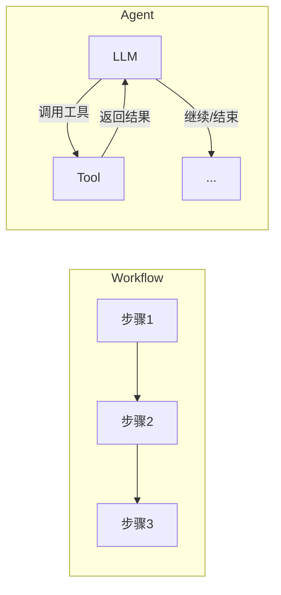
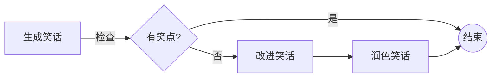
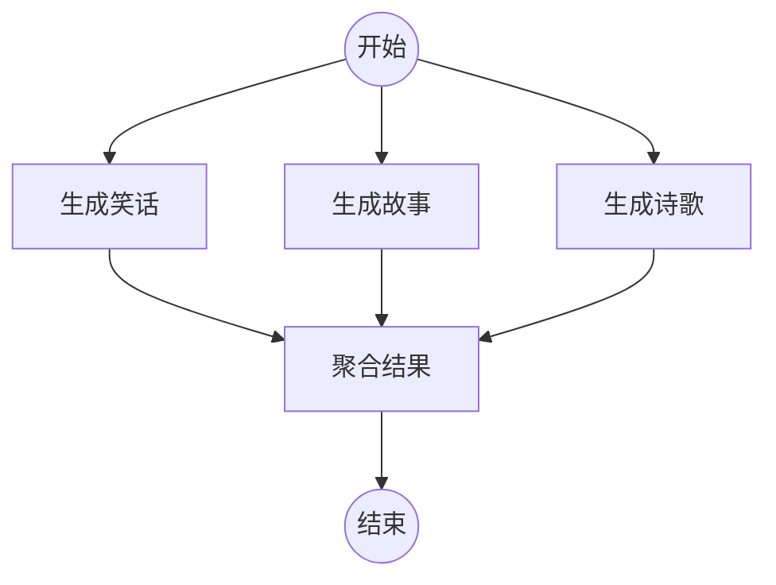
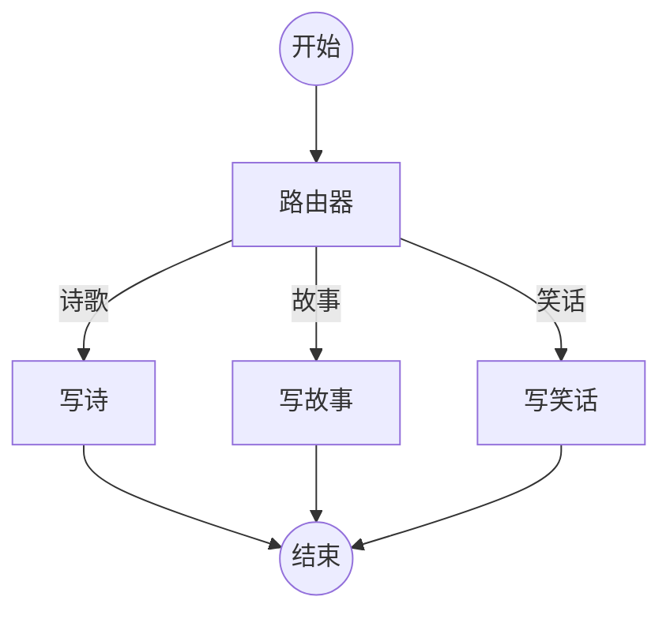
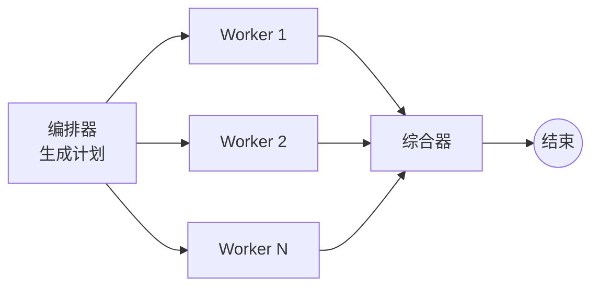
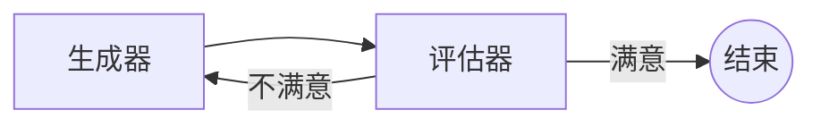
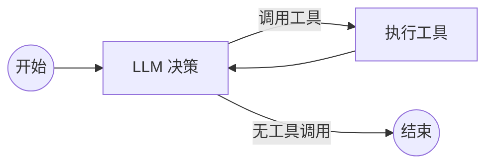

# 工作流与 Agent 模式

> 常见的 Workflow 和 Agent 设计模式

## Workflow vs Agent

| 类型 | 特点 | 适用场景 |
|------|------|----------|
| **Workflow** | 预定义的代码路径，按特定顺序执行 | 流程确定、步骤可预测 |
| **Agent** | 动态的，自主决定流程和工具使用 | 问题和解决方案不可预测 |



## LLM 增强方式

| 增强方式 | 说明 | 示例 |
|----------|------|------|
| **Tool Calling** | 让 LLM 调用外部工具 | `llm.bind_tools([multiply])` |
| **Structured Output** | 让 LLM 输出结构化数据 | `llm.with_structured_output(Schema)` |
| **Short-term Memory** | 对话历史记忆 | Messages 列表 |

```python
from pydantic import BaseModel, Field

# 结构化输出
class SearchQuery(BaseModel):
    search_query: str = Field(description="优化后的搜索查询")
    justification: str = Field(description="为什么这个查询相关")

structured_llm = llm.with_structured_output(SearchQuery)

# 工具调用
def multiply(a: int, b: int) -> int:
    return a * b

llm_with_tools = llm.bind_tools([multiply])
msg = llm_with_tools.invoke("2 乘以 3 等于多少？")
msg.tool_calls  # 获取工具调用
```

---

## 模式 1: Prompt Chaining（提示链）

每个 LLM 调用处理上一个调用的输出。

**应用场景：** 文档翻译、内容一致性验证



```python
# Graph API
workflow.add_edge(START, "generate_joke")
workflow.add_conditional_edges("generate_joke", check_punchline, {"Fail": "improve_joke", "Pass": END})
workflow.add_edge("improve_joke", "polish_joke")
workflow.add_edge("polish_joke", END)

# Functional API
@entrypoint()
def prompt_chaining_workflow(topic: str):
    joke = generate_joke(topic).result()
    if check_punchline(joke) == "Pass":
        return joke
    improved = improve_joke(joke).result()
    return polish_joke(improved).result()
```

---

## 模式 2: Parallelization（并行化）

多个 LLM 同时处理任务。

**应用场景：** 同时处理独立子任务、多标准评估



```python
# Graph API - 从 START 同时连接多个节点
parallel_builder.add_edge(START, "call_llm_1")
parallel_builder.add_edge(START, "call_llm_2")
parallel_builder.add_edge(START, "call_llm_3")

# Functional API - 同时启动多个任务
@entrypoint()
def parallel_workflow(topic: str):
    joke_fut = call_llm_1(topic)
    story_fut = call_llm_2(topic)
    poem_fut = call_llm_3(topic)
    return aggregator(joke_fut.result(), story_fut.result(), poem_fut.result()).result()
```

---

## 模式 3: Routing（路由）

处理输入后路由到特定任务。

**应用场景：** 产品问题分类、客服意图识别



```python
from typing_extensions import Literal
from pydantic import BaseModel, Field

# 路由 Schema
class Route(BaseModel):
    step: Literal["poem", "story", "joke"]

router = llm.with_structured_output(Route)

def llm_call_router(state: State):
    decision = router.invoke([
        SystemMessage(content="根据用户请求路由到 story、joke 或 poem"),
        HumanMessage(content=state["input"]),
    ])
    return {"decision": decision.step}

def route_decision(state: State):
    if state["decision"] == "story":
        return "llm_call_1"
    elif state["decision"] == "joke":
        return "llm_call_2"
    elif state["decision"] == "poem":
        return "llm_call_3"

# 条件边
router_builder.add_conditional_edges("llm_call_router", route_decision, {
    "llm_call_1": "llm_call_1",
    "llm_call_2": "llm_call_2",
    "llm_call_3": "llm_call_3",
})
```

---

## 模式 4: Orchestrator-Worker（编排器-工作者）

编排器分解任务，分配给工作者，综合结果。

**应用场景：** 子任务无法预定义（如代码生成、多文件更新）



```python
from langgraph.types import Send

# 使用 Send API 动态创建 Worker
def assign_workers(state: State):
    """为计划中的每个章节分配一个 Worker"""
    return [Send("llm_call", {"section": s}) for s in state["sections"]]

orchestrator_worker_builder.add_conditional_edges("orchestrator", assign_workers, ["llm_call"])
```

### Worker State 设计

```python
# 主图 State
class State(TypedDict):
    topic: str
    sections: list[Section]
    completed_sections: Annotated[list, operator.add]  # Worker 并行写入
    final_report: str

# Worker State
class WorkerState(TypedDict):
    section: Section
    completed_sections: Annotated[list, operator.add]
```

---

## 模式 5: Evaluator-Optimizer（评估器-优化器）

一个 LLM 生成，另一个评估，循环直到满足标准。

**应用场景：** 有明确成功标准但需迭代的任务（如翻译）



```python
class Feedback(BaseModel):
    grade: Literal["funny", "not funny"]
    feedback: str

evaluator = llm.with_structured_output(Feedback)

def route_joke(state: State):
    if state["funny_or_not"] == "funny":
        return "Accepted"
    return "Rejected + Feedback"

optimizer_builder.add_conditional_edges("llm_call_evaluator", route_joke, {
    "Accepted": END,
    "Rejected + Feedback": "llm_call_generator",
})
```

---

## 模式 6: Agent（智能体）

LLM 在持续反馈循环中使用工具，自主决策。

**应用场景：** 问题和解决方案不可预测



```python
from langchain.tools import tool

@tool
def multiply(a: int, b: int) -> int:
    """乘法"""
    return a * b

@tool
def add(a: int, b: int) -> int:
    """加法"""
    return a + b

tools = [add, multiply]
llm_with_tools = llm.bind_tools(tools)

def should_continue(state: MessagesState) -> Literal["tool_node", END]:
    last_message = state["messages"][-1]
    if last_message.tool_calls:
        return "tool_node"
    return END

# Agent 循环
agent_builder.add_edge(START, "llm_call")
agent_builder.add_conditional_edges("llm_call", should_continue, ["tool_node", END])
agent_builder.add_edge("tool_node", "llm_call")
```

---

## 模式速查表

| 模式 | 特点 | 适用场景 |
|------|------|----------|
| **Prompt Chaining** | 串行，每步处理上一步输出 | 可分解的确定性任务 |
| **Parallelization** | 并行，同时执行多个任务 | 独立子任务、多标准评估 |
| **Routing** | 分类后路由到专门处理 | 意图识别、问题分类 |
| **Orchestrator-Worker** | 动态分解任务，分配 Worker | 子任务无法预定义 |
| **Evaluator-Optimizer** | 生成-评估循环 | 有明确标准需迭代 |
| **Agent** | 自主决策，工具调用循环 | 问题不可预测 |

## 要点总结

- Workflow = 预定义路径，Agent = 动态决策
- LLM 增强：Tool Calling、Structured Output、Memory
- 6 种常见模式覆盖大部分场景
- Graph API 显式定义节点边，Functional API 用普通控制流
- `Send` API 支持动态创建 Worker 节点
