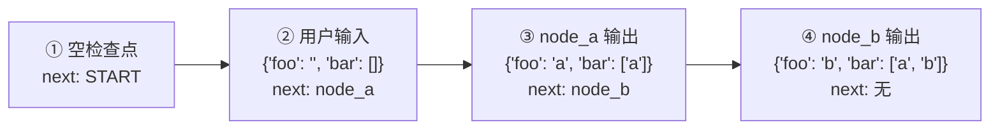
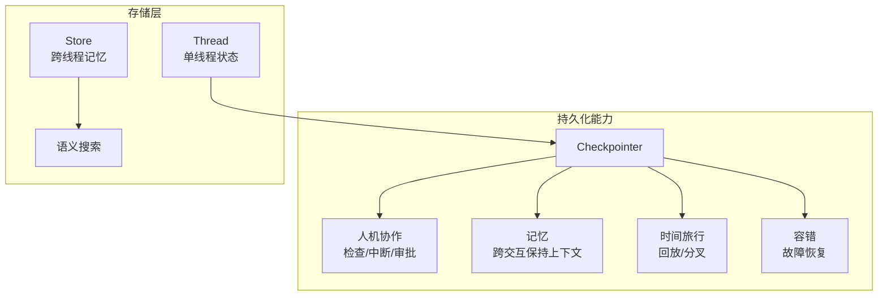

# 持久化详解

> LangGraph 内置持久化层，通过 Checkpointer 在每个超级步骤保存状态快照


LangGraph 内置持久化层，通过 **Checkpointer（检查点器）** 实现。当使用 Checkpointer 编译图时，它会在每个 **超级步骤 (super-step)** 保存图状态的 **检查点 (checkpoint)**。这些检查点保存到 **线程 (thread)** 中，可在图执行后访问。

基于线程的状态访问能力，实现了以下强大功能：

| 能力 | 说明 |
|------|------|
| **人机协作 (HITL)** | 人工检查、中断、审批图步骤 |
| **记忆 (Memory)** | 跨交互保持对话上下文 |
| **时间旅行 (Time Travel)** | 回放历史执行、分叉状态 |
| **容错 (Fault-tolerance)** | 从失败点恢复执行 |


> **Agent Server 自动处理检查点**：使用 Agent Server 时，无需手动实现或配置 Checkpointer，服务器会自动处理所有持久化基础设施。

## 线程 (Thread)

**线程** 是分配给 Checkpointer 保存的每个检查点的唯一 ID。它包含一系列运行 (run) 的累积状态。

调用带 Checkpointer 的图时，**必须** 在 config 的 `configurable` 部分指定 `thread_id`：

```python
{"configurable": {"thread_id": "1"}}
```

线程的当前和历史状态都可以检索。要持久化状态，必须在执行运行之前创建线程。

Checkpointer 使用 `thread_id` 作为存储和检索检查点的主键。没有它，Checkpointer 无法保存状态或在中断后恢复执行。

## 检查点 (Checkpoint)

**检查点** 是线程在特定时间点的状态快照，由 `StateSnapshot` 对象表示：

| 属性 | 说明 |
|------|------|
| `config` | 与此检查点关联的配置 |
| `metadata` | 检查点的元数据 |
| `values` | 此时间点的状态通道值 |
| `next` | 接下来要执行的节点名称元组 |
| `tasks` | `PregelTask` 对象元组，包含下一步任务信息 |

### 完整示例

```python
from langgraph.graph import StateGraph, START, END
from langgraph.checkpoint.memory import InMemorySaver
from langchain_core.runnables import RunnableConfig
from typing import Annotated
from typing_extensions import TypedDict
from operator import add

class State(TypedDict):
    foo: str
    bar: Annotated[list[str], add]

def node_a(state: State):
    return {"foo": "a", "bar": ["a"]}

def node_b(state: State):
    return {"foo": "b", "bar": ["b"]}

workflow = StateGraph(State)
workflow.add_node(node_a)
workflow.add_node(node_b)
workflow.add_edge(START, "node_a")
workflow.add_edge("node_a", "node_b")
workflow.add_edge("node_b", END)

checkpointer = InMemorySaver()
graph = workflow.compile(checkpointer=checkpointer)

config: RunnableConfig = {"configurable": {"thread_id": "1"}}
graph.invoke({"foo": "", "bar": []}, config)
```

执行后会产生 **4 个检查点**：



> 注意 `bar` 通道使用了 reducer (`operator.add`)，所以值会累加而非替换。

### 获取状态 (get_state)

获取图的**最新状态**：

```python
# 获取最新状态快照
config = {"configurable": {"thread_id": "1"}}
graph.get_state(config)

# 获取特定检查点的状态
config = {"configurable": {
    "thread_id": "1",
    "checkpoint_id": "1ef663ba-28fe-6528-8002-5a559208592c"
}}
graph.get_state(config)
```

返回示例：

```python
StateSnapshot(
    values={'foo': 'b', 'bar': ['a', 'b']},
    next=(),
    config={'configurable': {
        'thread_id': '1',
        'checkpoint_ns': '',
        'checkpoint_id': '1ef663ba-28fe-6528-8002-5a559208592c'
    }},
    metadata={'source': 'loop', 'writes': {'node_b': {'foo': 'b', 'bar': ['b']}}, 'step': 2},
    created_at='2024-08-29T19:19:38.821749+00:00',
    parent_config={'configurable': {...}},
    tasks=()
)
```


### 获取状态历史 (get_state_history)

获取线程的**完整执行历史**：

```python
config = {"configurable": {"thread_id": "1"}}
history = list(graph.get_state_history(config))
# 按时间倒序排列，最新的在前
```

### 回放 (Replay)

使用 `thread_id` 和 `checkpoint_id` 调用图，可以**回放**之前的执行：

```python
config = {"configurable": {
    "thread_id": "1",
    "checkpoint_id": "0c62ca34-ac19-445d-bbb0-5b4984975b2a"
}}
graph.invoke(None, config=config)
```

**回放机制**：
- `checkpoint_id` **之前**的步骤：重放（不重新执行）
- `checkpoint_id` **之后**的步骤：重新执行（创建新分叉）


### 更新状态 (update_state)

除了回放，还可以**编辑**图状态：

```python
graph.update_state(config, values, as_node=None)
```

#### 参数说明

| 参数 | 说明 |
|------|------|
| `config` | 包含 `thread_id`，可选 `checkpoint_id`（指定则分叉该检查点） |
| `values` | 更新值，会经过 reducer 处理 |
| `as_node` | 指定更新来源节点，影响下一步执行哪个节点 |

#### 更新示例

假设当前状态：
```python
{"foo": 1, "bar": ["a"]}
```

执行更新：
```python
graph.update_state(config, {"foo": 2, "bar": ["b"]})
```

新状态：
```python
{"foo": 2, "bar": ["a", "b"]}
# foo: 直接覆盖（无 reducer）
# bar: 追加 "b"（有 reducer: operator.add）
```


## 记忆存储 (Memory Store)

**问题**：Checkpointer 只能在单个线程内持久化状态，无法跨线程共享信息。

**场景**：聊天机器人需要在所有对话（不同线程）中记住用户偏好。

**解决方案**：`Store` 接口，实现跨线程的记忆共享。


### 基本用法

```python
from langgraph.store.memory import InMemoryStore
import uuid

in_memory_store = InMemoryStore()

# 记忆按命名空间组织：(user_id, "memories")
user_id = "1"
namespace = (user_id, "memories")

# 存储记忆
memory_id = str(uuid.uuid4())
memory = {"food_preference": "I like pizza"}
in_memory_store.put(namespace, memory_id, memory)

# 检索记忆
memories = in_memory_store.search(namespace)
memories[-1].dict()
# {
#     'value': {'food_preference': 'I like pizza'},
#     'key': '07e0caf4-1631-47b7-b15f-65515d4c1843',
#     'namespace': ['1', 'memories'],
#     'created_at': '2024-10-02T17:22:31.590602+00:00',
#     'updated_at': '2024-10-02T17:22:31.590605+00:00'
# }
```

### 记忆对象属性

| 属性 | 说明 |
|------|------|
| `value` | 记忆内容（字典） |
| `key` | 命名空间内的唯一键 |
| `namespace` | 命名空间（字符串列表） |
| `created_at` | 创建时间戳 |
| `updated_at` | 更新时间戳 |

### 语义搜索

配置嵌入模型后，支持基于语义的记忆搜索：

```python
from langchain.embeddings import init_embeddings

store = InMemoryStore(
    index={
        "embed": init_embeddings("openai:text-embedding-3-small"),
        "dims": 1536,
        "fields": ["food_preference", "$"]  # 要嵌入的字段
    }
)

# 语义搜索
memories = store.search(
    namespace,
    query="What does the user like to eat?",
    limit=3
)
```

#### 控制嵌入字段

```python
# 只嵌入特定字段
store.put(namespace, str(uuid.uuid4()), {
    "food_preference": "I love Italian cuisine",
    "context": "Discussing dinner plans"
}, index=["food_preference"])

# 不嵌入（仍可检索，但不可语义搜索）
store.put(namespace, str(uuid.uuid4()), {
    "system_info": "Last updated: 2024-01-01"
}, index=False)
```

### 在 LangGraph 中使用

```python
from langgraph.checkpoint.memory import InMemorySaver

checkpointer = InMemorySaver()
graph = graph.compile(checkpointer=checkpointer, store=in_memory_store)

# 调用时指定 user_id
config = {"configurable": {"thread_id": "1", "user_id": "1"}}
graph.invoke({"messages": [{"role": "user", "content": "hi"}]}, config)
```

#### 在节点中访问 Store

```python
from langgraph.store.base import BaseStore

def update_memory(state: MessagesState, config: RunnableConfig, *, store: BaseStore):
    user_id = config["configurable"]["user_id"]
    namespace = (user_id, "memories")
    
    # 创建新记忆
    memory_id = str(uuid.uuid4())
    store.put(namespace, memory_id, {"memory": "用户喜欢披萨"})

def call_model(state: MessagesState, config: RunnableConfig, *, store: BaseStore):
    user_id = config["configurable"]["user_id"]
    namespace = (user_id, "memories")
    
    # 语义搜索相关记忆
    memories = store.search(
        namespace,
        query=state["messages"][-1].content,
        limit=3
    )
    info = "\n".join([d.value["memory"] for d in memories])
    # 在模型调用中使用记忆...
```

> **跨线程共享**：只要 `user_id` 相同，不同 `thread_id` 的对话可以访问相同的记忆。

## Checkpointer 库

LangGraph 提供多种 Checkpointer 实现：

| 库 | 说明 | 适用场景 |
|----|------|----------|
| `langgraph-checkpoint` | 基础接口 + `InMemorySaver` | 实验、开发 |
| `langgraph-checkpoint-sqlite` | SQLite 实现 | 本地工作流 |
| `langgraph-checkpoint-postgres` | PostgreSQL 实现 | 生产环境 |

### Checkpointer 接口

所有 Checkpointer 实现 `BaseCheckpointSaver` 接口：

| 方法 | 说明 |
|------|------|
| `.put` | 存储检查点及其配置和元数据 |
| `.put_writes` | 存储与检查点关联的中间写入 |
| `.get_tuple` | 根据配置获取检查点元组 |
| `.list` | 列出匹配条件的检查点 |

> 异步执行时使用异步版本：`.aput`、`.aput_writes`、`.aget_tuple`、`.alist`

### 序列化器

Checkpointer 使用序列化器保存状态。默认 `JsonPlusSerializer` 支持多种类型。

#### Pickle 回退

对于不支持的类型（如 Pandas DataFrame）：

```python
from langgraph.checkpoint.memory import InMemorySaver
from langgraph.checkpoint.serde.jsonplus import JsonPlusSerializer

graph.compile(checkpointer=InMemorySaver(
    serde=JsonPlusSerializer(pickle_fallback=True)
))
```

#### 加密

可选加密所有持久化状态：

```python
from langgraph.checkpoint.serde.encrypted import EncryptedSerializer
from langgraph.checkpoint.sqlite import SqliteSaver
import sqlite3

serde = EncryptedSerializer.from_pycryptodome_aes()  # 读取 LANGGRAPH_AES_KEY 环境变量
checkpointer = SqliteSaver(sqlite3.connect("checkpoint.db"), serde=serde)
```

## 核心能力总结



| 能力 | 实现方式 |
|------|----------|
| **人机协作** | 中断执行、检查状态、人工审批后继续 |
| **记忆** | 同一 `thread_id` 的后续消息保持上下文 |
| **时间旅行** | `get_state_history` + `checkpoint_id` 回放/分叉 |
| **容错** | 从最后成功步骤恢复，保留 pending writes |

## 要点总结

- **Checkpointer**：每个超级步骤保存状态快照到线程
- **Thread**：通过 `thread_id` 标识，存储执行历史
- **Checkpoint**：`StateSnapshot` 对象，包含 values、next、tasks 等
- **Store**：跨线程共享记忆，支持语义搜索
- **核心能力**：HITL、记忆、时间旅行、容错
