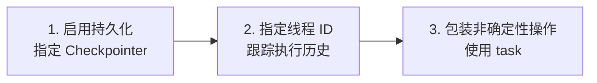
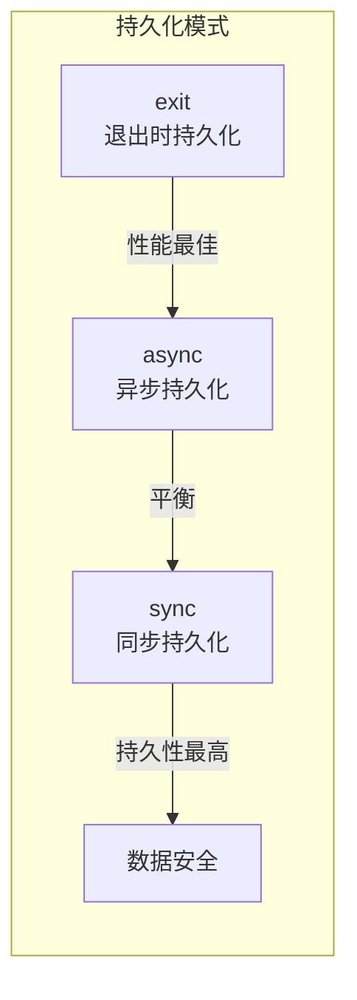

# 持久执行详解

> 工作流在关键点保存进度，支持暂停后从中断处精确恢复


**持久执行 (Durable Execution)** 是一种技术，进程或工作流在关键点保存进度，允许暂停并在稍后从中断处精确恢复。

## 适用场景

| 场景 | 说明 |
|------|------|
| **人机协作 (HITL)** | 用户在继续前检查、验证或修改流程 |
| **长时间运行任务** | 可能遇到中断或错误（如 LLM 调用超时） |
| **延迟恢复** | 即使延迟很长时间（如一周后）也能恢复 |

LangGraph 内置的 [持久化层](/oss/python/langgraph/persistence) 为工作流提供持久执行能力，确保每个执行步骤的状态都保存到持久存储中。

> **提示**：如果你使用带 Checkpointer 的 LangGraph，就已经启用了持久执行。可以在任意点暂停和恢复工作流。
> 
> 为充分利用持久执行，确保工作流是**确定性的**和**幂等的**，并将副作用或非确定性操作包装在 **task** 中。

## 启用要求

启用持久执行需要满足以下条件：



| 步骤 | 说明 |
|------|------|
| **启用持久化** | 指定 Checkpointer 保存工作流进度 |
| **指定线程 ID** | 跟踪特定工作流实例的执行历史 |
| **包装操作** | 将非确定性操作和副作用包装在 `task` 中 |

## 确定性与一致性回放

**关键理解**：恢复工作流时，代码**不会**从停止的**同一行代码**恢复；而是从适当的**起始点**重新开始，回放所有步骤直到停止点。

### 起始点规则

| API 类型 | 恢复起始点 |
|----------|------------|
| **StateGraph (Graph API)** | 执行停止的**节点**开头 |
| **子图调用** | 调用子图的**父节点**开头 |
| **Functional API** | 执行停止的 **entrypoint** 开头 |

### 编写指南

为确保工作流确定性且可一致回放：

| 原则 | 说明 |
|------|------|
| **避免重复工作** | 节点中的多个副作用操作，每个包装在单独的 **task** 中 |
| **封装非确定性操作** | 随机数生成等操作包装在 **task** 或 **node** 中 |
| **使用幂等操作** | API 调用、文件写入等确保幂等，重试时效果相同 |

> **幂等性**：如果 task 开始但未成功完成，恢复时会重新运行。使用幂等键或验证现有结果，避免意外重复。

## 持久化模式

LangGraph 支持三种持久化模式，平衡性能和数据一致性：

```python
graph.stream(
    {"input": "test"},
    durability="sync"  # 指定持久化模式
)
```

| 模式 | 持久化时机 | 性能 | 适用场景 |
|------|------------|------|----------|
| `"exit"` | 仅在图执行退出时（成功/错误/中断） | 最佳 | 长时间运行图，可接受中途崩溃丢失 |
| `"async"` | 异步持久化，下一步执行时进行 | 良好 | 平衡性能和持久性 |
| `"sync"` | 同步持久化，下一步开始前完成 | 较慢 | 高持久性要求 |



## 在节点中使用 Task

如果节点包含多个操作，可以将每个操作转换为 **task**，而不是重构为单独的节点。

### 原始写法（不推荐）

```python
from typing import NotRequired
from typing_extensions import TypedDict
import uuid
from langgraph.checkpoint.memory import InMemorySaver
from langgraph.graph import StateGraph, START, END
import requests

class State(TypedDict):
    url: str
    result: NotRequired[str]

def call_api(state: State):
    """直接在节点中执行副作用操作"""
    result = requests.get(state['url']).text[:100]  # 副作用，恢复时会重复执行！
    return {"result": result}

builder = StateGraph(State)
builder.add_node("call_api", call_api)
builder.add_edge(START, "call_api")
builder.add_edge("call_api", END)

checkpointer = InMemorySaver()
graph = builder.compile(checkpointer=checkpointer)

thread_id = uuid.uuid4()
config = {"configurable": {"thread_id": thread_id}}
graph.invoke({"url": "https://www.example.com"}, config)
```

### 使用 Task（推荐）

```python
from typing import NotRequired
from typing_extensions import TypedDict
import uuid
from langgraph.checkpoint.memory import InMemorySaver
from langgraph.func import task
from langgraph.graph import StateGraph, START, END
import requests

class State(TypedDict):
    urls: list[str]
    result: NotRequired[list[str]]

@task
def _make_request(url: str):
    """包装为 task，恢复时从持久化层获取结果"""
    return requests.get(url).text[:100]

def call_api(state: State):
    """节点中调用 task"""
    requests = [_make_request(url) for url in state['urls']]
    results = [request.result() for request in requests]
    return {"results": results}

builder = StateGraph(State)
builder.add_node("call_api", call_api)
builder.add_edge(START, "call_api")
builder.add_edge("call_api", END)

checkpointer = InMemorySaver()
graph = builder.compile(checkpointer=checkpointer)

thread_id = uuid.uuid4()
config = {"configurable": {"thread_id": thread_id}}
graph.invoke({"urls": ["https://www.example.com"]}, config)
```

### 对比

| 方面 | 原始写法 | 使用 Task |
|------|----------|-----------|
| 恢复时行为 | 重复执行 API 调用 | 从持久化层获取结果 |
| 并发支持 | 需要手动处理 | 自动支持 |
| 代码改动 | - | 添加 `@task` 装饰器 |

## 恢复工作流

启用持久执行后，可以在以下场景恢复执行：

### 暂停和恢复

使用 `interrupt` 函数暂停，使用 `Command` 原语恢复：

```python
from langgraph.types import interrupt, Command

def human_review_node(state: State):
    # 暂停等待人工审核
    result = interrupt("请审核以下内容...")
    return {"reviewed": result}

# 恢复执行
graph.invoke(Command(resume="approved"), config)
```

### 从失败恢复

发生异常后（如 LLM 提供商中断），使用相同的 `thread_id` 和 `None` 输入恢复：

```python
# 原始执行（可能失败）
try:
    graph.invoke({"input": "test"}, config)
except Exception:
    pass

# 从最后成功的检查点恢复
graph.invoke(None, config)  # 传入 None 作为输入
```

## 常见陷阱

| 陷阱 | 问题 | 解决方案 |
|------|------|----------|
| 节点内直接调用 API | 恢复时重复调用 | 包装在 `@task` 中 |
| 使用随机数 | 恢复时结果不一致 | 包装在 `@task` 中 |
| 非幂等写操作 | 重试时数据重复 | 使用幂等键 |
| 依赖外部状态 | 恢复时状态可能已变 | 将状态保存到 State 中 |

## 要点总结

- **持久执行**：在关键点保存进度，支持暂停后精确恢复
- **恢复机制**：从起始点回放，不是从同一行代码恢复
- **Task 包装**：非确定性操作和副作用必须包装在 `@task` 中
- **持久化模式**：`exit` / `async` / `sync`，按需选择
- **恢复方式**：`interrupt` + `Command` 或传入 `None` 从失败恢复
