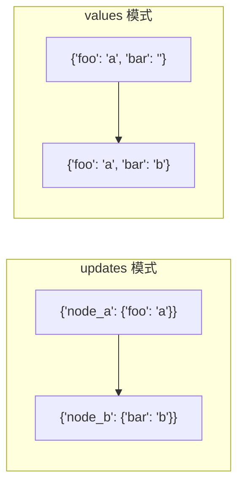
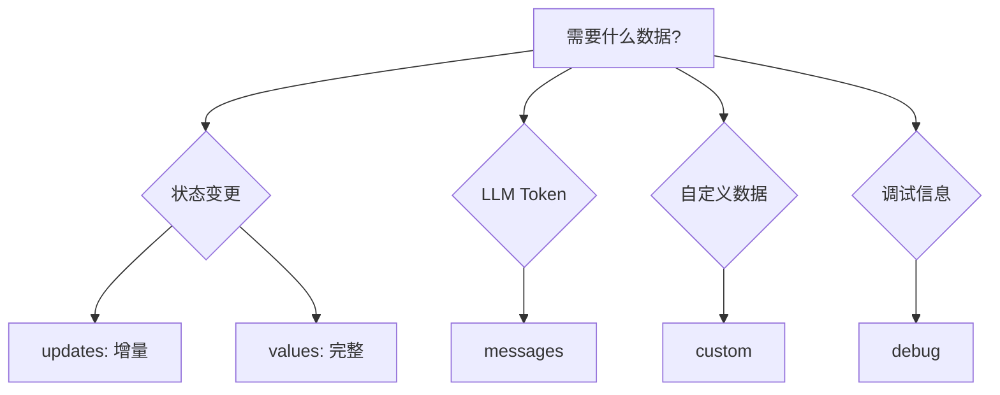

# 流式输出详解

> 实时展示 LLM 输出，显著提升用户体验

LangGraph 实现了流式系统来实时展示更新。流式输出对于提升 LLM 应用的响应性至关重要——在完整响应准备好之前就逐步显示输出，显著改善用户体验。

## 流式能力概览

| 能力 | 说明 |
|------|------|
| **流式图状态** | 通过 `updates` 和 `values` 模式获取状态更新 |
| **流式子图输出** | 包含父图和嵌套子图的输出 |
| **流式 LLM Token** | 从节点、子图、工具中捕获 token 流 |
| **流式自定义数据** | 从工具函数发送自定义更新或进度信号 |
| **多模式组合** | 同时使用多种流式模式 |

## 支持的流式模式

通过 `stream_mode` 参数指定一个或多个模式：

| 模式 | 说明 |
|------|------|
| `values` | 每步后流式输出**完整状态** |
| `updates` | 每步后流式输出**状态增量** |
| `messages` | 流式输出 LLM token 和元数据的二元组 |
| `custom` | 从节点内部流式输出自定义数据 |
| `debug` | 流式输出尽可能多的调试信息 |

## 基本用法

```python
# 同步流式
for chunk in graph.stream(inputs, stream_mode="updates"):
    print(chunk)

# 异步流式
async for chunk in graph.astream(inputs, stream_mode="updates"):
    print(chunk)
```

### 完整示例

```python
from typing import TypedDict
from langgraph.graph import StateGraph, START, END

class State(TypedDict):
    topic: str
    joke: str

def refine_topic(state: State):
    return {"topic": state["topic"] + " and cats"}

def generate_joke(state: State):
    return {"joke": f"This is a joke about {state['topic']}"}

graph = (
    StateGraph(State)
    .add_node(refine_topic)
    .add_node(generate_joke)
    .add_edge(START, "refine_topic")
    .add_edge("refine_topic", "generate_joke")
    .add_edge("generate_joke", END)
    .compile()
)

for chunk in graph.stream(
    {"topic": "ice cream"},
    stream_mode="updates",
):
    print(chunk)
```

输出：
```python
{'refine_topic': {'topic': 'ice cream and cats'}}
{'generate_joke': {'joke': 'This is a joke about ice cream and cats'}}
```

## 多模式组合

传入列表同时使用多种模式，输出为 `(mode, chunk)` 元组：

```python
for mode, chunk in graph.stream(inputs, stream_mode=["updates", "custom"]):
    print(f"[{mode}] {chunk}")
```

## 流式图状态

### updates vs values



| 模式 | 输出内容 | 适用场景 |
|------|----------|----------|
| `updates` | 节点名 + 状态增量 | 追踪每个节点的变更 |
| `values` | 完整状态快照 | 需要完整状态视图 |

```python
# updates 模式：只输出变更
for chunk in graph.stream({"topic": "ice cream"}, stream_mode="updates"):
    print(chunk)
# {'refine_topic': {'topic': 'ice cream and cats'}}
# {'generate_joke': {'joke': 'This is a joke about ice cream and cats'}}

# values 模式：输出完整状态
for chunk in graph.stream({"topic": "ice cream"}, stream_mode="values"):
    print(chunk)
# {'topic': 'ice cream', 'joke': ''}
# {'topic': 'ice cream and cats', 'joke': ''}
# {'topic': 'ice cream and cats', 'joke': 'This is a joke about ice cream and cats'}
```

## 流式子图输出

设置 `subgraphs=True` 包含子图输出，输出格式为 `(namespace, data)` 元组：

```python
for chunk in graph.stream(
    {"foo": "foo"},
    subgraphs=True,  # 包含子图输出
    stream_mode="updates",
):
    print(chunk)
```

输出示例：
```python
((), {'node_1': {'foo': 'hi! foo'}})  # 父图
(('node_2:dfddc4ba-...',), {'subgraph_node_1': {'bar': 'bar'}})  # 子图
(('node_2:dfddc4ba-...',), {'subgraph_node_2': {'foo': 'hi! foobar'}})  # 子图
((), {'node_2': {'foo': 'hi! foobar'}})  # 父图
```

> `namespace` 是元组，表示子图调用路径，如 `("parent_node:<task_id>", "child_node:<task_id>")`

### 调试模式

使用 `debug` 模式获取最详细的执行信息：

```python
for chunk in graph.stream({"topic": "ice cream"}, stream_mode="debug"):
    print(chunk)
```

## 流式 LLM Token

使用 `messages` 模式逐 token 流式输出 LLM 响应：

```python
from dataclasses import dataclass
from langchain.chat_models import init_chat_model
from langgraph.graph import StateGraph, START

@dataclass
class MyState:
    topic: str
    joke: str = ""

model = init_chat_model(model="gpt-4o-mini")

def call_model(state: MyState):
    # 即使使用 .invoke() 也会触发 token 流式输出
    model_response = model.invoke(
        [{"role": "user", "content": f"Generate a joke about {state.topic}"}]
    )
    return {"joke": model_response.content}

graph = (
    StateGraph(MyState)
    .add_node(call_model)
    .add_edge(START, "call_model")
    .compile()
)

# messages 模式返回 (message_chunk, metadata) 元组
for message_chunk, metadata in graph.stream(
    {"topic": "ice cream"},
    stream_mode="messages",
):
    if message_chunk.content:
        print(message_chunk.content, end="|", flush=True)
```

### 按 LLM 调用过滤

使用 `tags` 标记不同的 LLM 调用：

```python
from langchain.chat_models import init_chat_model

# 为不同模型设置不同 tag
joke_model = init_chat_model(model="gpt-4o-mini", tags=["joke"])
poem_model = init_chat_model(model="gpt-4o-mini", tags=["poem"])

# 流式输出时按 tag 过滤
async for msg, metadata in graph.astream(
    {"topic": "cats"},
    stream_mode="messages",
):
    # 只输出 joke 模型的 token
    if metadata["tags"] == ["joke"]:
        print(msg.content, end="|", flush=True)
```

### 按节点过滤

使用 `langgraph_node` 字段过滤特定节点的输出：

```python
for msg, metadata in graph.stream(inputs, stream_mode="messages"):
    # 只输出 write_poem 节点的 token
    if msg.content and metadata["langgraph_node"] == "write_poem":
        print(msg.content, end="|", flush=True)
```

## 流式自定义数据

使用 `get_stream_writer` 从节点或工具内部发送自定义数据：

### 在节点中使用

```python
from typing import TypedDict
from langgraph.config import get_stream_writer
from langgraph.graph import StateGraph, START

class State(TypedDict):
    query: str
    answer: str

def node(state: State):
    # 获取 stream writer
    writer = get_stream_writer()
    
    # 发送自定义数据
    writer({"custom_key": "Generating custom data inside node"})
    
    return {"answer": "some data"}

graph = (
    StateGraph(State)
    .add_node(node)
    .add_edge(START, "node")
    .compile()
)

# 使用 custom 模式接收自定义数据
for chunk in graph.stream({"query": "example"}, stream_mode="custom"):
    print(chunk)
```

### 在工具中使用

```python
from langchain.tools import tool
from langgraph.config import get_stream_writer

@tool
def query_database(query: str) -> str:
    """Query the database."""
    writer = get_stream_writer()
    
    # 发送进度更新
    writer({"data": "Retrieved 0/100 records", "type": "progress"})
    
    # 执行查询...
    
    writer({"data": "Retrieved 100/100 records", "type": "progress"})
    
    return "some-answer"
```

## 集成任意 LLM

使用 `custom` 模式可以流式输出任意 LLM API 的响应（不限于 LangChain 集成）：

```python
from langgraph.config import get_stream_writer

def call_arbitrary_model(state):
    """调用任意模型并流式输出"""
    writer = get_stream_writer()
    
    # 使用自定义流式客户端
    for chunk in your_custom_streaming_client(state["topic"]):
        writer({"custom_llm_chunk": chunk})
    
    return {"result": "completed"}

# 使用 custom 模式接收
for chunk in graph.stream({"topic": "cats"}, stream_mode="custom"):
    print(chunk)
```

## 禁用特定模型的流式输出

如果某些模型不支持流式输出，显式禁用：

```python
from langchain.chat_models import init_chat_model

# 方式 1：streaming=False
model = init_chat_model("claude-sonnet-4-5-20250929", streaming=False)

# 方式 2：disable_streaming=True（所有模型都支持）
from langchain_openai import ChatOpenAI
model = ChatOpenAI(model="o1-preview", disable_streaming=True)
```

## Python < 3.11 异步注意事项

Python < 3.11 的 asyncio 不支持 `context` 参数，影响流式机制：

| 限制 | 解决方案 |
|------|----------|
| 回调不自动传播 | 手动传递 `config` 给 `ainvoke()` |
| `get_stream_writer` 不可用 | 使用 `writer` 参数 |

### 手动传递 config

```python
from langchain.chat_models import init_chat_model

model = init_chat_model(model="gpt-4o-mini")

async def call_model(state, config):  # 接收 config 参数
    joke_response = await model.ainvoke(
        [{"role": "user", "content": f"Write a joke about {state['topic']}"}],
        config,  # 手动传递 config
    )
    return {"joke": joke_response.content}
```

### 使用 writer 参数

```python
from langgraph.types import StreamWriter

async def generate_joke(state: State, writer: StreamWriter):  # 使用 writer 参数
    writer({"custom_key": "Streaming custom data"})
    return {"joke": f"This is a joke about {state['topic']}"}
```

## 流式模式选择指南



| 场景 | 推荐模式 |
|------|----------|
| 追踪节点执行 | `updates` |
| 获取完整状态 | `values` |
| 实时显示 LLM 输出 | `messages` |
| 发送进度/自定义数据 | `custom` |
| 调试执行流程 | `debug` |
| 多种需求组合 | `["updates", "messages"]` |

## 要点总结

- **五种模式**：`values`、`updates`、`messages`、`custom`、`debug`
- **子图输出**：`subgraphs=True` 包含嵌套子图
- **Token 过滤**：通过 `tags` 或 `langgraph_node` 过滤
- **自定义数据**：`get_stream_writer()` 发送任意数据
- **任意 LLM**：`custom` 模式支持非 LangChain 集成
- **Python < 3.11**：异步需手动传递 `config` 和 `writer`
