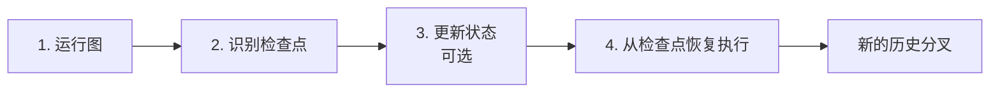
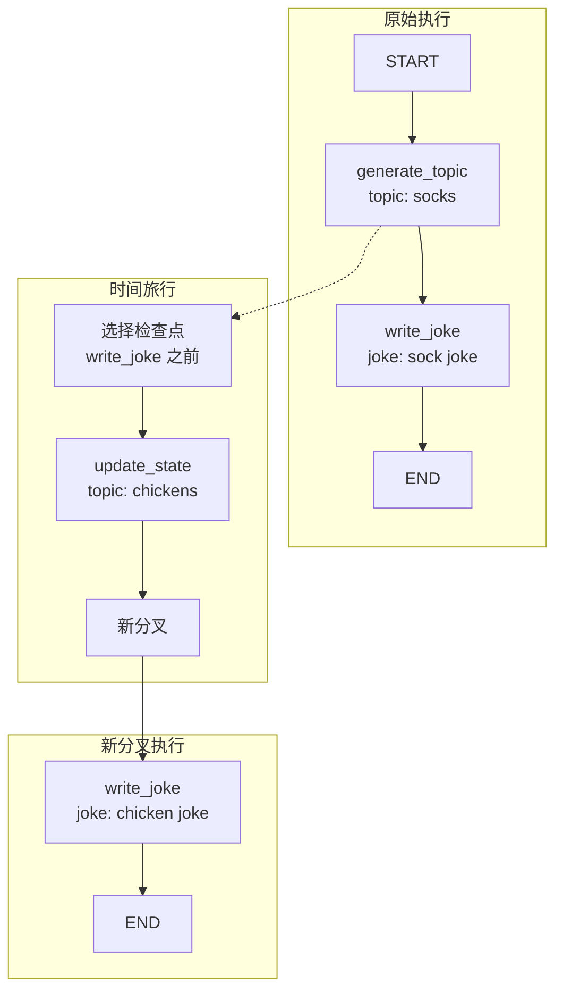

# Time travel(时间旅行)详解

> 从历史检查点恢复执行，回放或修改状态以探索不同路径

在处理基于模型决策的非确定性系统（如 LLM 驱动的 Agent）时，详细检查其决策过程非常有用：

| 用途 | 说明 |
|------|------|
| **理解推理** | 分析导致成功结果的步骤 |
| **调试错误** | 识别错误发生的位置和原因 |
| **探索替代方案** | 测试不同路径以发现更好的解决方案 |

LangGraph 提供**时间旅行 (Time Travel)** 功能支持这些用例。你可以从先前的检查点恢复执行——回放相同状态或修改状态以探索替代方案。恢复过去的执行会在历史中产生**新的分叉**。

## 使用流程



| 步骤 | 方法 | 说明 |
|------|------|------|
| **运行图** | `invoke` / `stream` | 使用初始输入执行图 |
| **识别检查点** | `get_state_history` | 获取执行历史，定位目标 `checkpoint_id` |
| **更新状态** | `update_state` | （可选）修改检查点的状态 |
| **恢复执行** | `invoke(None, config)` | 从检查点继续执行 |

## 完整示例

构建一个简单的工作流：生成笑话主题 → 写笑话，演示时间旅行的完整流程。

### 定义图

```python
import uuid
from typing_extensions import TypedDict, NotRequired
from langgraph.graph import StateGraph, START, END
from langchain.chat_models import init_chat_model
from langgraph.checkpoint.memory import InMemorySaver

class State(TypedDict):
    topic: NotRequired[str]
    joke: NotRequired[str]

model = init_chat_model("claude-sonnet-4-5-20250929", temperature=0)

def generate_topic(state: State):
    """LLM 生成笑话主题"""
    msg = model.invoke("Give me a funny topic for a joke")
    return {"topic": msg.content}

def write_joke(state: State):
    """LLM 根据主题写笑话"""
    msg = model.invoke(f"Write a short joke about {state['topic']}")
    return {"joke": msg.content}

# 构建工作流
workflow = StateGraph(State)
workflow.add_node("generate_topic", generate_topic)
workflow.add_node("write_joke", write_joke)
workflow.add_edge(START, "generate_topic")
workflow.add_edge("generate_topic", "write_joke")
workflow.add_edge("write_joke", END)

# 编译（需要 checkpointer）
checkpointer = InMemorySaver()
graph = workflow.compile(checkpointer=checkpointer)
```

### Step 1: 运行图

```python
config = {"configurable": {"thread_id": uuid.uuid4()}}

state = graph.invoke({}, config)
print(state["topic"])
print(state["joke"])
```

输出：
```
How about "The Secret Life of Socks in the Dryer"? ...

Why did the sock go to therapy? Because it had too many issues 
with separation anxiety from its pair!
```

### Step 2: 识别检查点

使用 `get_state_history` 获取执行历史（按时间**倒序**排列）：

```python
# 状态按时间倒序返回
states = list(graph.get_state_history(config))

for state in states:
    print(state.next)  # 下一步要执行的节点
    print(state.config["configurable"]["checkpoint_id"])
    print()
```

输出：
```
()                          # 执行完成，无下一步
1f02ac4a-ec9f-6524-8002-8f7b0bbeed0e

('write_joke',)             # 下一步执行 write_joke
1f02ac4a-ce2a-6494-8001-cb2e2d651227

('generate_topic',)         # 下一步执行 generate_topic
1f02ac4a-a4e0-630d-8000-b73c254ba748

('__start__',)              # 初始状态
1f02ac4a-a4dd-665e-bfff-e6c8c44315d9
```

选择要恢复的检查点：

```python
# 选择 write_joke 之前的检查点（索引 1）
selected_state = states[1]

print(selected_state.next)    # ('write_joke',)
print(selected_state.values)  # {'topic': 'The Secret Life of Socks...'}
```

### Step 3: 更新状态（可选）

使用 `update_state` 修改状态，会创建**新的检查点**：

```python
new_config = graph.update_state(
    selected_state.config,
    values={"topic": "chickens"}  # 修改主题
)

print(new_config)
# {'configurable': {
#     'thread_id': 'c62e2e03-...',
#     'checkpoint_ns': '',
#     'checkpoint_id': '1f02ac4a-ecee-600b-8002-a1d21df32e4c'  # 新的检查点 ID
# }}
```

### Step 4: 从检查点恢复执行

传入 `None` 作为输入，使用新配置恢复执行：

```python
result = graph.invoke(None, new_config)
print(result)
```

输出：
```python
{
    'topic': 'chickens',
    'joke': 'Why did the chicken join a band?\n\nBecause it had excellent drumsticks!'
}
```

## 时间旅行流程图



## 关键 API

| 方法 | 说明 |
|------|------|
| `get_state_history(config)` | 获取线程的完整执行历史 |
| `get_state(config)` | 获取当前/指定检查点的状态 |
| `update_state(config, values)` | 修改状态并创建新检查点 |
| `invoke(None, config)` | 从检查点恢复执行 |

## 使用场景

| 场景 | 操作 |
|------|------|
| **回放执行** | 使用原始 `checkpoint_id` 恢复，不修改状态 |
| **探索替代方案** | `update_state` 修改状态后恢复 |
| **调试错误** | 定位错误前的检查点，检查状态 |
| **A/B 测试** | 从同一检查点分叉，测试不同输入 |

## 要点总结

- **时间旅行**：从历史检查点恢复执行，产生新的历史分叉
- **get_state_history**：获取执行历史，按时间倒序排列
- **update_state**：修改状态并创建新检查点
- **恢复执行**：`invoke(None, config)` 从检查点继续
- **前提条件**：必须配置 Checkpointer 才能使用时间旅行
