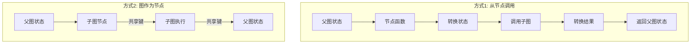

# 子图详解

> 将一个图作为另一个图的节点使用，实现模块化和复用

**子图 (Subgraph)** 是作为另一个图的节点使用的图。

## 使用场景

| 场景 | 说明 |
|------|------|
| **多 Agent 系统** | 每个 Agent 作为独立子图 |
| **节点复用** | 在多个图中复用同一组节点 |
| **分布式开发** | 不同团队独立开发不同部分，只需约定接口 |

## 两种通信方式

| 方式 | 说明 | 适用场景 |
|------|------|----------|
| **从节点调用图** | 子图在节点函数内部调用 | 父子图状态**完全不同** |
| **将图作为节点添加** | 子图直接作为节点添加 | 父子图**共享状态键** |



## 方式一：从节点调用图

当父图和子图状态**完全不同**时使用。需要在节点函数中手动转换状态。

```python
from typing_extensions import TypedDict
from langgraph.graph.state import StateGraph, START

# 子图状态（与父图不同）
class SubgraphState(TypedDict):
    bar: str

def subgraph_node_1(state: SubgraphState):
    return {"bar": "hi! " + state["bar"]}

subgraph_builder = StateGraph(SubgraphState)
subgraph_builder.add_node(subgraph_node_1)
subgraph_builder.add_edge(START, "subgraph_node_1")
subgraph = subgraph_builder.compile()

# 父图状态
class State(TypedDict):
    foo: str

def call_subgraph(state: State):
    # 1. 转换为子图状态
    subgraph_output = subgraph.invoke({"bar": state["foo"]})
    # 2. 转换回父图状态
    return {"foo": subgraph_output["bar"]}

builder = StateGraph(State)
builder.add_node("node_1", call_subgraph)
builder.add_edge(START, "node_1")
graph = builder.compile()
```

### 完整示例

```python
from typing_extensions import TypedDict
from langgraph.graph.state import StateGraph, START

# 子图
class SubgraphState(TypedDict):
    bar: str  # 与父图不共享
    baz: str

def subgraph_node_1(state: SubgraphState):
    return {"baz": "baz"}

def subgraph_node_2(state: SubgraphState):
    return {"bar": state["bar"] + state["baz"]}

subgraph_builder = StateGraph(SubgraphState)
subgraph_builder.add_node(subgraph_node_1)
subgraph_builder.add_node(subgraph_node_2)
subgraph_builder.add_edge(START, "subgraph_node_1")
subgraph_builder.add_edge("subgraph_node_1", "subgraph_node_2")
subgraph = subgraph_builder.compile()

# 父图
class ParentState(TypedDict):
    foo: str

def node_1(state: ParentState):
    return {"foo": "hi! " + state["foo"]}

def node_2(state: ParentState):
    # 状态转换
    response = subgraph.invoke({"bar": state["foo"]})
    return {"foo": response["bar"]}

builder = StateGraph(ParentState)
builder.add_node("node_1", node_1)
builder.add_node("node_2", node_2)
builder.add_edge(START, "node_1")
builder.add_edge("node_1", "node_2")
graph = builder.compile()

for chunk in graph.stream({"foo": "foo"}, subgraphs=True):
    print(chunk)
```

输出：
```
((), {'node_1': {'foo': 'hi! foo'}})
(('node_2:577b710b-...'), {'subgraph_node_1': {'baz': 'baz'}})
(('node_2:577b710b-...'), {'subgraph_node_2': {'bar': 'hi! foobaz'}})
((), {'node_2': {'foo': 'hi! foobaz'}})
```

## 方式二：将图作为节点添加

当父图和子图**共享状态键**时使用。子图直接作为节点添加。


```python
from typing_extensions import TypedDict
from langgraph.graph.state import StateGraph, START

class State(TypedDict):
    foo: str  # 共享键

# 子图
def subgraph_node_1(state: State):
    return {"foo": "hi! " + state["foo"]}

subgraph_builder = StateGraph(State)
subgraph_builder.add_node(subgraph_node_1)
subgraph_builder.add_edge(START, "subgraph_node_1")
subgraph = subgraph_builder.compile()

# 父图：直接将子图作为节点添加
builder = StateGraph(State)
builder.add_node("node_1", subgraph)  # 直接传入编译后的子图
builder.add_edge(START, "node_1")
graph = builder.compile()
```

### 完整示例

```python
from typing_extensions import TypedDict
from langgraph.graph.state import StateGraph, START

# 子图（有私有键和共享键）
class SubgraphState(TypedDict):
    foo: str  # 与父图共享
    bar: str  # 子图私有

def subgraph_node_1(state: SubgraphState):
    return {"bar": "bar"}

def subgraph_node_2(state: SubgraphState):
    # 使用私有键 bar，更新共享键 foo
    return {"foo": state["foo"] + state["bar"]}

subgraph_builder = StateGraph(SubgraphState)
subgraph_builder.add_node(subgraph_node_1)
subgraph_builder.add_node(subgraph_node_2)
subgraph_builder.add_edge(START, "subgraph_node_1")
subgraph_builder.add_edge("subgraph_node_1", "subgraph_node_2")
subgraph = subgraph_builder.compile()

# 父图
class ParentState(TypedDict):
    foo: str

def node_1(state: ParentState):
    return {"foo": "hi! " + state["foo"]}

builder = StateGraph(ParentState)
builder.add_node("node_1", node_1)
builder.add_node("node_2", subgraph)  # 直接添加子图
builder.add_edge(START, "node_1")
builder.add_edge("node_1", "node_2")
graph = builder.compile()

for chunk in graph.stream({"foo": "foo"}):
    print(chunk)
```

输出：
```
{'node_1': {'foo': 'hi! foo'}}
{'node_2': {'foo': 'hi! foobar'}}
```

## 添加持久化

只需在**父图**编译时提供 Checkpointer，LangGraph 会自动传播到子图：

```python
from langgraph.graph import START, StateGraph
from langgraph.checkpoint.memory import MemorySaver

# 子图
subgraph_builder = StateGraph(State)
subgraph_builder.add_node(subgraph_node_1)
subgraph_builder.add_edge(START, "subgraph_node_1")
subgraph = subgraph_builder.compile()  # 不需要指定 checkpointer

# 父图
builder = StateGraph(State)
builder.add_node("node_1", subgraph)
builder.add_edge(START, "node_1")

checkpointer = MemorySaver()
graph = builder.compile(checkpointer=checkpointer)  # 只在父图指定
```

### 子图独立记忆

如果希望子图有**独立的记忆**（如多 Agent 系统中各 Agent 保持独立消息历史）：

```python
subgraph = subgraph_builder.compile(checkpointer=True)  # 子图独立记忆
```

## 查看子图状态

使用 `subgraphs=True` 参数查看子图状态：

```python
# 获取父图状态
parent_state = graph.get_state(config)

# 获取包含子图的状态（仅在子图中断时可用）
state_with_subgraph = graph.get_state(config, subgraphs=True)
subgraph_state = state_with_subgraph.tasks[0].state
```

> **注意**：子图状态**仅在子图中断时**可用。恢复执行后无法访问子图状态。

### 示例：查看中断的子图状态

```python
from langgraph.graph import START, StateGraph
from langgraph.checkpoint.memory import MemorySaver
from langgraph.types import interrupt, Command

class State(TypedDict):
    foo: str

# 子图（包含中断）
def subgraph_node_1(state: State):
    value = interrupt("Provide value:")
    return {"foo": state["foo"] + value}

subgraph_builder = StateGraph(State)
subgraph_builder.add_node(subgraph_node_1)
subgraph_builder.add_edge(START, "subgraph_node_1")
subgraph = subgraph_builder.compile()

# 父图
builder = StateGraph(State)
builder.add_node("node_1", subgraph)
builder.add_edge(START, "node_1")

checkpointer = MemorySaver()
graph = builder.compile(checkpointer=checkpointer)

config = {"configurable": {"thread_id": "1"}}
graph.invoke({"foo": ""}, config)

# 获取父图状态
parent_state = graph.get_state(config)

# 获取子图状态（仅在中断时可用）
subgraph_state = graph.get_state(config, subgraphs=True).tasks[0].state

# 恢复子图
graph.invoke(Command(resume="bar"), config)
```

## 流式输出子图

设置 `subgraphs=True` 包含子图输出：

```python
for chunk in graph.stream(
    {"foo": "foo"},
    subgraphs=True,  # 包含子图输出
    stream_mode="updates",
):
    print(chunk)
```

输出格式为 `(namespace, data)` 元组：
```
((), {'node_1': {'foo': 'hi! foo'}})                           # 父图
(('node_2:e58e5673-...'), {'subgraph_node_1': {'bar': 'bar'}}) # 子图
(('node_2:e58e5673-...'), {'subgraph_node_2': {'foo': 'hi! foobar'}}) # 子图
((), {'node_2': {'foo': 'hi! foobar'}})                        # 父图
```

> `namespace` 为空元组 `()` 表示父图，非空表示子图路径。

## 两种方式对比

| 维度 | 从节点调用 | 图作为节点 |
|------|------------|------------|
| **状态关系** | 完全不同 | 共享键 |
| **状态转换** | 手动转换 | 自动传递 |
| **代码量** | 较多 | 较少 |
| **灵活性** | 更高 | 较低 |
| **适用场景** | 私有状态 | 共享消息 |

## 多级子图

支持多级嵌套：父图 → 子图 → 孙图

```python
# 孙图
grandchild_graph = grandchild_builder.compile()

# 子图（调用孙图）
def call_grandchild(state):
    output = grandchild_graph.invoke({"key": state["key"]})
    return {"key": output["key"]}

child_builder.add_node("child_1", call_grandchild)
child_graph = child_builder.compile()

# 父图（调用子图）
def call_child(state):
    output = child_graph.invoke({"key": state["key"]})
    return {"key": output["key"]}

parent_builder.add_node("child", call_child)
parent_graph = parent_builder.compile()
```

## 要点总结

- **两种方式**：从节点调用（不同状态）、图作为节点（共享状态）
- **持久化**：只需在父图指定 Checkpointer，自动传播
- **独立记忆**：子图编译时 `checkpointer=True`
- **查看状态**：`get_state(config, subgraphs=True)`，仅中断时可用
- **流式输出**：`stream(..., subgraphs=True)` 包含子图输