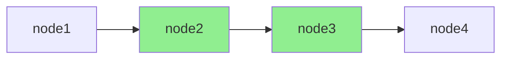

# 测试详解

> 为 LangGraph Agent 编写单元测试的实用模式

完成 Agent 原型开发后，下一步是添加测试。本指南介绍编写单元测试时的实用模式。

## 准备工作

安装 pytest：

```bash
pip install -U pytest
```

## 基本测试模式

由于 LangGraph Agent 依赖状态，推荐的模式是：
1. 在每个测试前创建图
2. 在测试中使用新的 Checkpointer 实例编译图

### 基本示例

```python
import pytest
from typing_extensions import TypedDict
from langgraph.graph import StateGraph, START, END
from langgraph.checkpoint.memory import MemorySaver

def create_graph() -> StateGraph:
    """创建图的工厂函数"""
    class MyState(TypedDict):
        my_key: str
    
    graph = StateGraph(MyState)
    graph.add_node("node1", lambda state: {"my_key": "hello from node1"})
    graph.add_node("node2", lambda state: {"my_key": "hello from node2"})
    graph.add_edge(START, "node1")
    graph.add_edge("node1", "node2")
    graph.add_edge("node2", END)
    
    return graph

def test_basic_agent_execution() -> None:
    """测试完整执行流程"""
    checkpointer = MemorySaver()
    graph = create_graph()
    compiled_graph = graph.compile(checkpointer=checkpointer)
    
    result = compiled_graph.invoke(
        {"my_key": "initial_value"},
        config={"configurable": {"thread_id": "1"}}
    )
    
    assert result["my_key"] == "hello from node2"
```

## 测试单个节点

编译后的图通过 `graph.nodes` 暴露各个节点的引用，可以单独测试某个节点：

```python
import pytest
from typing_extensions import TypedDict
from langgraph.graph import StateGraph, START, END
from langgraph.checkpoint.memory import MemorySaver

def create_graph() -> StateGraph:
    class MyState(TypedDict):
        my_key: str
    
    graph = StateGraph(MyState)
    graph.add_node("node1", lambda state: {"my_key": "hello from node1"})
    graph.add_node("node2", lambda state: {"my_key": "hello from node2"})
    graph.add_edge(START, "node1")
    graph.add_edge("node1", "node2")
    graph.add_edge("node2", END)
    
    return graph

def test_individual_node_execution() -> None:
    """测试单个节点"""
    checkpointer = MemorySaver()  # 在此示例中会被忽略
    graph = create_graph()
    compiled_graph = graph.compile(checkpointer=checkpointer)
    
    # 只调用 node1
    result = compiled_graph.nodes["node1"].invoke(
        {"my_key": "initial_value"},
    )
    
    assert result["my_key"] == "hello from node1"
```

> **注意**：直接调用节点会绕过 Checkpointer。

## 部分执行测试

对于大型图，可能需要测试部分执行路径而非端到端流程。

### 方法一：重构为子图

如果语义上合理，可以将这些部分[重构为子图](/oss/python/langgraph/use-subgraphs)，然后单独调用。

### 方法二：使用持久化机制

如果不想改变图结构，可以使用 LangGraph 的持久化机制模拟部分执行：

1. 使用 Checkpointer 编译图（`InMemorySaver` 足够用于测试）
2. 调用 `update_state` 方法，设置 `as_node` 为目标节点**之前**的节点
3. 使用相同的 `thread_id` 调用图，设置 `interrupt_after` 为目标结束节点



### 部分执行示例

测试只执行 node2 和 node3（跳过 node1 和 node4）：

```python
import pytest
from typing_extensions import TypedDict
from langgraph.graph import StateGraph, START, END
from langgraph.checkpoint.memory import MemorySaver

def create_graph() -> StateGraph:
    class MyState(TypedDict):
        my_key: str
    
    graph = StateGraph(MyState)
    graph.add_node("node1", lambda state: {"my_key": "hello from node1"})
    graph.add_node("node2", lambda state: {"my_key": "hello from node2"})
    graph.add_node("node3", lambda state: {"my_key": "hello from node3"})
    graph.add_node("node4", lambda state: {"my_key": "hello from node4"})
    graph.add_edge(START, "node1")
    graph.add_edge("node1", "node2")
    graph.add_edge("node2", "node3")
    graph.add_edge("node3", "node4")
    graph.add_edge("node4", END)
    
    return graph

def test_partial_execution_from_node2_to_node3() -> None:
    """测试从 node2 到 node3 的部分执行"""
    checkpointer = MemorySaver()
    graph = create_graph()
    compiled_graph = graph.compile(checkpointer=checkpointer)
    
    # Step 1: 更新状态，模拟 node1 执行完成后的状态
    compiled_graph.update_state(
        config={"configurable": {"thread_id": "1"}},
        # 传入 node2 的输入状态（模拟 node1 结束时的状态）
        values={"my_key": "initial_value"},
        # 设置为 node1，执行将从 node2 开始
        as_node="node1",
    )
    
    # Step 2: 恢复执行，在 node3 后中断
    result = compiled_graph.invoke(
        None,  # 传入 None 恢复执行
        config={"configurable": {"thread_id": "1"}},
        # 在 node3 后停止，node4 不会执行
        interrupt_after="node3",
    )
    
    assert result["my_key"] == "hello from node3"
```

## 测试模式总结

| 测试类型 | 方法 | 适用场景 |
|----------|------|----------|
| **完整流程** | `graph.invoke()` | 端到端测试 |
| **单个节点** | `graph.nodes["name"].invoke()` | 节点逻辑测试 |
| **部分执行** | `update_state` + `interrupt_after` | 中间流程测试 |
| **子图测试** | 单独编译子图并调用 | 模块化测试 |

## 测试最佳实践

### 1. 使用工厂函数创建图

```python
def create_graph() -> StateGraph:
    """每次测试创建新的图实例"""
    # ... 构建图
    return graph

def test_something():
    graph = create_graph()
    compiled = graph.compile(checkpointer=MemorySaver())
    # ...
```

### 2. 每个测试使用独立的 thread_id

```python
def test_case_1():
    result = graph.invoke(input, config={"configurable": {"thread_id": "test-1"}})

def test_case_2():
    result = graph.invoke(input, config={"configurable": {"thread_id": "test-2"}})
```

### 3. 使用 pytest fixtures

```python
import pytest

@pytest.fixture
def compiled_graph():
    """创建编译后的图"""
    graph = create_graph()
    checkpointer = MemorySaver()
    return graph.compile(checkpointer=checkpointer)

def test_with_fixture(compiled_graph):
    result = compiled_graph.invoke(
        {"my_key": "value"},
        config={"configurable": {"thread_id": "1"}}
    )
    assert result["my_key"] == "expected"
```

### 4. Mock LLM 调用

```python
from unittest.mock import Mock, patch

def test_with_mocked_llm():
    mock_response = Mock()
    mock_response.content = "mocked response"
    
    with patch("langchain.chat_models.init_chat_model") as mock_model:
        mock_model.return_value.invoke.return_value = mock_response
        
        graph = create_graph()
        compiled = graph.compile()
        result = compiled.invoke({"messages": []})
        
        assert "mocked response" in str(result)
```

## 要点总结

- **工厂函数**：每个测试创建新的图实例
- **单节点测试**：`graph.nodes["name"].invoke()` 绕过 Checkpointer
- **部分执行**：`update_state(as_node=...)` + `interrupt_after` 组合
- **独立 thread_id**：避免测试间状态污染
- **Mock LLM**：隔离外部依赖，提高测试速度和稳定性
