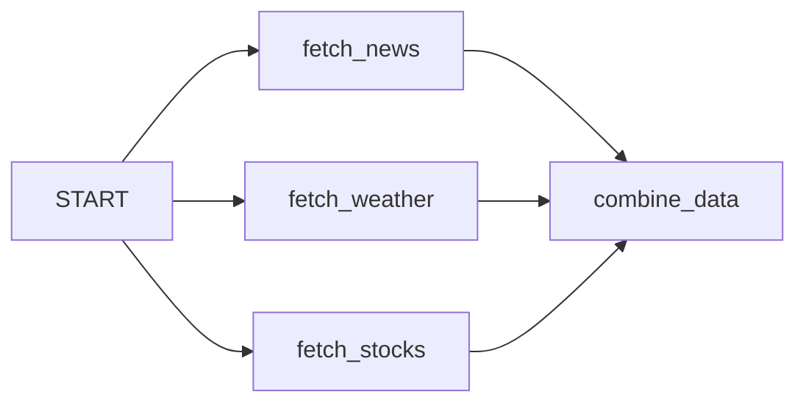
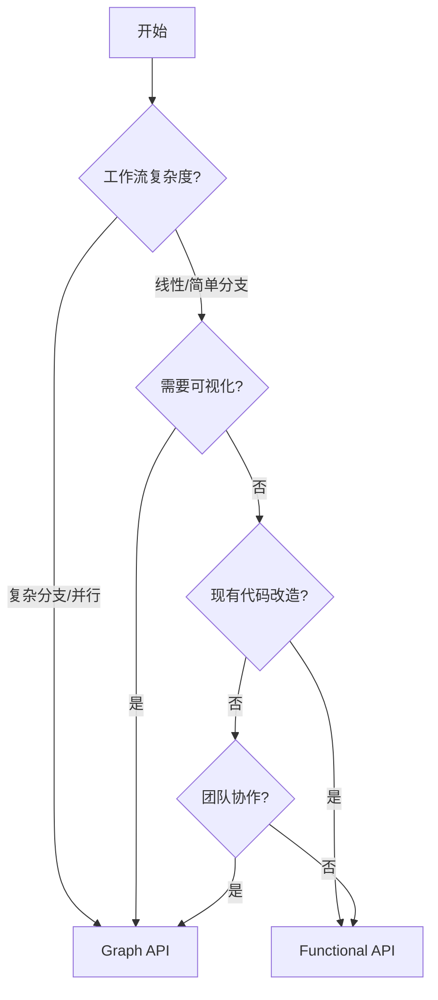

# API 选择指南

> Graph API vs Functional API：根据场景选择合适的 API

LangGraph 提供两种 API 来构建 Agent 工作流：**Graph API** 和 **Functional API**。两者共享相同的底层运行时，可以在同一应用中混合使用。

## 快速决策

### 选择 Graph API

- 需要**复杂工作流可视化**用于调试和文档
- 需要**显式状态管理**，多节点共享数据
- 有**条件分支**和多个决策点
- 需要**并行执行**后合并结果
- **团队协作**，可视化有助于理解

### 选择 Functional API

- 希望对现有代码**最小改动**
- 使用**标准控制流**（if/else、循环、函数调用）
- **函数作用域状态**，无需显式状态管理
- **快速原型**，减少样板代码
- **线性工作流**，简单分支逻辑

## 对比表

| 维度 | Graph API | Functional API |
|------|-----------|----------------|
| **风格** | 声明式 | 命令式 |
| **状态管理** | 显式共享状态 | 函数作用域 |
| **可视化** | 支持图形化 | 不直接支持 |
| **代码量** | 较多 | 较少 |
| **学习曲线** | 需理解图概念 | 更直观 |
| **适用场景** | 复杂分支/并行 | 线性/简单分支 |

## Graph API 适用场景

### 1. 复杂决策树和分支逻辑

多个决策点依赖不同条件时，Graph API 使分支显式且易于可视化：

```python
from langgraph.graph import StateGraph
from typing import TypedDict

class AgentState(TypedDict):
    messages: list
    current_tool: str
    retry_count: int

def should_continue(state):
    if state["retry_count"] > 3:
        return "end"
    elif state["current_tool"] == "search":
        return "process_search"
    else:
        return "call_llm"

workflow = StateGraph(AgentState)
workflow.add_node("call_llm", call_llm_node)
workflow.add_node("process_search", search_node)
workflow.add_conditional_edges("call_llm", should_continue)
```

### 2. 多组件间状态共享

需要在工作流不同部分共享和协调状态：

```python
class WorkflowState(TypedDict):
    user_input: str
    search_results: list
    generated_response: str
    validation_status: str

def search_node(state):
    # 访问共享状态
    results = search(state["user_input"])
    return {"search_results": results}

def validation_node(state):
    # 访问前一节点的结果
    is_valid = validate(state["generated_response"])
    return {"validation_status": "valid" if is_valid else "invalid"}
```

### 3. 并行处理与同步

多个操作并行执行后合并结果：

```python
workflow.add_node("fetch_news", fetch_news)
workflow.add_node("fetch_weather", fetch_weather)
workflow.add_node("fetch_stocks", fetch_stocks)
workflow.add_node("combine_data", combine_all_data)

# 所有 fetch 操作并行执行
workflow.add_edge(START, "fetch_news")
workflow.add_edge(START, "fetch_weather")
workflow.add_edge(START, "fetch_stocks")

# combine 等待所有并行操作完成
workflow.add_edge("fetch_news", "combine_data")
workflow.add_edge("fetch_weather", "combine_data")
workflow.add_edge("fetch_stocks", "combine_data")
```



### 4. 团队开发和文档

可视化特性便于团队理解、文档化和维护：

```python
# 清晰的关注点分离 - 不同团队成员负责不同节点
workflow.add_node("data_ingestion", data_team_function)
workflow.add_node("ml_processing", ml_team_function)
workflow.add_node("business_logic", product_team_function)
workflow.add_node("output_formatting", frontend_team_function)
```

## Functional API 适用场景

### 1. 现有过程式代码

对现有代码最小改动即可添加 LangGraph 特性：

```python
from langgraph.func import entrypoint, task

@task
def process_user_input(user_input: str) -> dict:
    # 现有函数，最小改动
    return {"processed": user_input.lower().strip()}

@entrypoint(checkpointer=checkpointer)
def workflow(user_input: str) -> str:
    # 标准 Python 控制流
    processed = process_user_input(user_input).result()
    
    if "urgent" in processed["processed"]:
        response = handle_urgent_request(processed).result()
    else:
        response = handle_normal_request(processed).result()
    
    return response
```

### 2. 线性工作流和简单逻辑

主要是顺序执行，条件逻辑简单：

```python
@entrypoint(checkpointer=checkpointer)
def essay_workflow(topic: str) -> dict:
    # 线性流程，简单分支
    outline = create_outline(topic).result()
    
    if len(outline["points"]) < 3:
        outline = expand_outline(outline).result()
    
    draft = write_draft(outline).result()
    
    # 人工审核检查点
    feedback = interrupt({"draft": draft, "action": "Please review"})
    
    if feedback == "approve":
        final_essay = draft
    else:
        final_essay = revise_essay(draft, feedback).result()
    
    return {"essay": final_essay}
```

### 3. 快速原型

无需定义状态 schema 和图结构，快速测试想法：

```python
@entrypoint(checkpointer=checkpointer)
def quick_prototype(data: dict) -> dict:
    # 快速迭代 - 无需状态 schema
    step1_result = process_step1(data).result()
    step2_result = process_step2(step1_result).result()
    return {"final_result": step2_result}
```

### 4. 函数作用域状态管理

状态自然限定在单个函数内，无需广泛共享：

```python
@task
def analyze_document(document: str) -> dict:
    # 函数内部的本地状态管理
    sections = extract_sections(document)
    summaries = [summarize(section) for section in sections]
    key_points = extract_key_points(summaries)
    
    return {
        "sections": len(sections),
        "summaries": summaries,
        "key_points": key_points
    }

@entrypoint(checkpointer=checkpointer)
def document_processor(document: str) -> dict:
    analysis = analyze_document(document).result()
    # 状态按需在函数间传递
    return generate_report(analysis).result()
```

## 混合使用

可以在同一应用中同时使用两种 API：

```python
from langgraph.graph import StateGraph
from langgraph.func import entrypoint

# 复杂多 Agent 协调使用 Graph API
coordination_graph = StateGraph(CoordinationState)
coordination_graph.add_node("orchestrator", orchestrator_node)
coordination_graph.add_node("agent_a", agent_a_node)
coordination_graph.add_node("agent_b", agent_b_node)

# 简单数据处理使用 Functional API
@entrypoint()
def data_processor(raw_data: dict) -> dict:
    cleaned = clean_data(raw_data).result()
    transformed = transform_data(cleaned).result()
    return transformed

# 在图中使用 Functional API 的结果
def orchestrator_node(state):
    processed_data = data_processor.invoke(state["raw_data"])
    return {"processed_data": processed_data}
```

## API 迁移

### Functional → Graph API

当 Functional 工作流变得复杂时，迁移到 Graph API：

```python
# 迁移前：Functional API
@entrypoint(checkpointer=checkpointer)
def complex_workflow(input_data: dict) -> dict:
    step1 = process_step1(input_data).result()
    if step1["needs_analysis"]:
        analysis = analyze_data(step1).result()
        if analysis["confidence"] > 0.8:
            result = high_confidence_path(analysis).result()
        else:
            result = low_confidence_path(analysis).result()
    else:
        result = simple_path(step1).result()
    return result

# 迁移后：Graph API
class WorkflowState(TypedDict):
    input_data: dict
    step1_result: dict
    analysis: dict
    final_result: dict

def should_analyze(state):
    return "analyze" if state["step1_result"]["needs_analysis"] else "simple_path"

def confidence_check(state):
    return "high_confidence" if state["analysis"]["confidence"] > 0.8 else "low_confidence"

workflow = StateGraph(WorkflowState)
workflow.add_node("step1", process_step1_node)
workflow.add_conditional_edges("step1", should_analyze)
workflow.add_node("analyze", analyze_data_node)
workflow.add_conditional_edges("analyze", confidence_check)
# ... 添加其余节点和边
```

### Graph → Functional API

当图对于简单线性流程过于复杂时，简化为 Functional API：

```python
# 迁移前：过度工程化的 Graph API
class SimpleState(TypedDict):
    input: str
    step1: str
    step2: str
    result: str

# 迁移后：简化的 Functional API
@entrypoint(checkpointer=checkpointer)
def simple_workflow(input_data: str) -> str:
    step1 = process_step1(input_data).result()
    step2 = process_step2(step1).result()
    return finalize_result(step2).result()
```

## 决策流程图



## 核心特性支持

两种 API 都支持相同的 LangGraph 核心特性：

| 特性 | Graph API | Functional API |
|------|-----------|----------------|
| 持久化 | ✅ | ✅ |
| 流式输出 | ✅ | ✅ |
| 人机协作 | ✅ | ✅ |
| 记忆系统 | ✅ | ✅ |
| 中断/恢复 | ✅ | ✅ |

## 要点总结

- **Graph API**：显式控制工作流结构、复杂分支、并行处理、团队协作
- **Functional API**：最小代码改动、简单线性工作流、快速原型
- **混合使用**：可以在同一应用中结合两种 API
- **核心特性**：两种 API 都支持持久化、流式、HITL、记忆等特性
