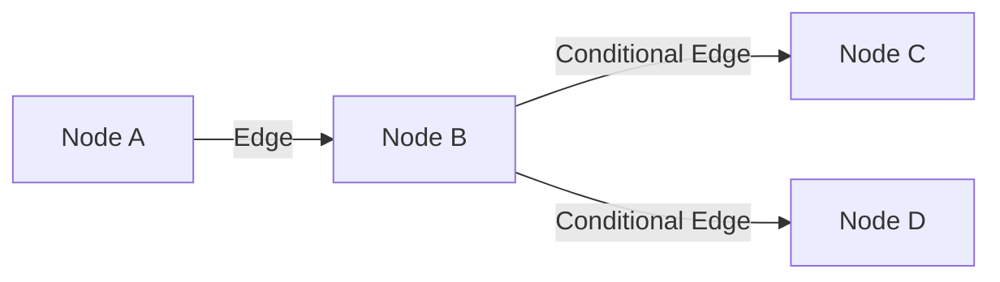
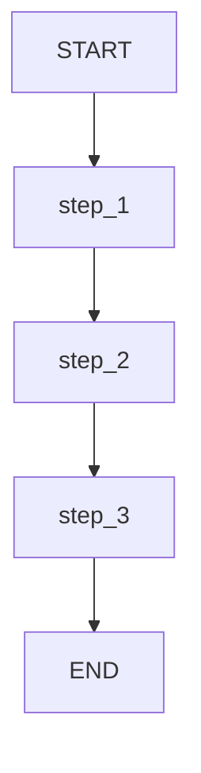
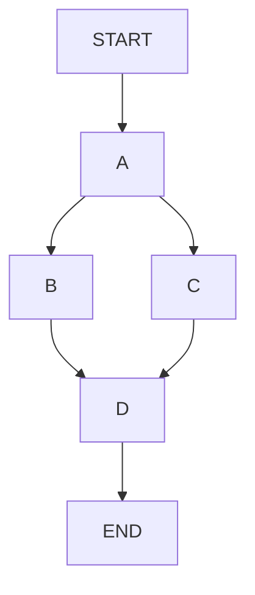
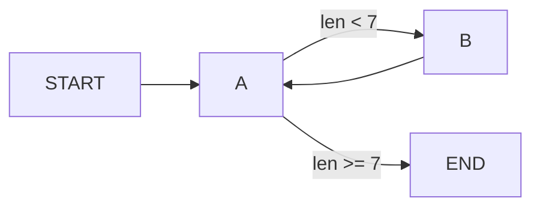
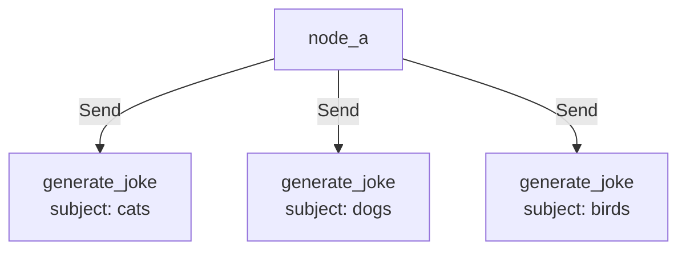
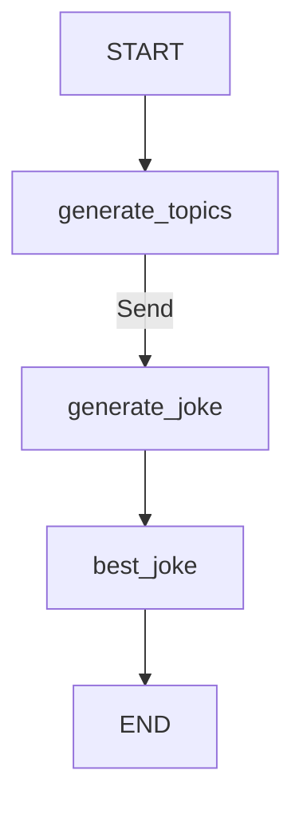

# Graph API 完整指南

> 使用声明式图结构构建 Agent 工作流：从基础概念到实践应用

LangGraph 的 Graph API 使用声明式方法，通过定义节点、边和共享状态来创建可视化的图结构。本文档涵盖从基础概念到高级实践的完整内容。

## 目录

- [核心概念](#核心概念)
- [状态管理](#状态管理)
- [节点与边](#节点与边)
- [控制流](#控制流)
- [高级特性](#高级特性)
- [实践示例](#实践示例)

## 核心概念

LangGraph 将 Agent 工作流建模为图，包含三个关键组件：

| 组件 | 说明 |
|------|------|
| **State** | 共享数据结构，表示应用的当前快照 |
| **Nodes** | 编码 Agent 逻辑的函数，接收状态并返回更新 |
| **Edges** | 决定下一步执行哪个节点的函数 |

**核心原则**：节点做工作，边决定下一步。



### 执行模型：Super-steps

LangGraph 使用**消息传递**算法（受 Google Pregel 启发）：

1. 节点完成操作后，沿边向其他节点发送消息
2. 接收消息的节点执行函数，将结果传递给下一组节点
3. 程序以离散的 **super-step** 进行

| 概念 | 说明 |
|------|------|
| **Super-step** | 图节点的单次迭代 |
| **并行节点** | 属于同一 super-step |
| **顺序节点** | 属于不同 super-step |
| **终止条件** | 所有节点 inactive 且无消息传输 |

## 状态管理

### Schema 定义

状态 schema 是所有节点和边的输入 schema，支持三种定义方式：

```python
# 方式 1：TypedDict（推荐）
from typing_extensions import TypedDict

class State(TypedDict):
    messages: list
    current_tool: str

# 方式 2：dataclass（支持默认值）
from dataclasses import dataclass, field

@dataclass
class State:
    messages: list = field(default_factory=list)
    current_tool: str = ""

# 方式 3：Pydantic BaseModel（递归验证，性能较低）
from pydantic import BaseModel

class State(BaseModel):
    messages: list
    current_tool: str
```

### 多 Schema 模式

可以定义不同的输入/输出 schema 和私有状态：

```python
class InputState(TypedDict):
    question: str

class OutputState(TypedDict):
    answer: str

class OverallState(InputState, OutputState):
    pass

def answer_node(state: InputState):
    return {"answer": "bye", "question": state["question"]}

builder = StateGraph(
    OverallState, 
    input_schema=InputState, 
    output_schema=OutputState
)
builder.add_node(answer_node)
builder.add_edge(START, "answer_node")
builder.add_edge("answer_node", END)
graph = builder.compile()

print(graph.invoke({"question": "hi"}))
# {'answer': 'bye'}  # 只返回 OutputState 中的字段
```

### Reducers（归约器）

Reducer 定义如何将节点更新应用到状态。每个 key 有独立的 reducer：

```python
from typing import Annotated
from operator import add

# 无 reducer：新值覆盖旧值
class State(TypedDict):
    foo: int           # 覆盖模式
    bar: list[str]     # 覆盖模式

# 有 reducer：使用指定函数合并
class State(TypedDict):
    foo: int                              # 覆盖模式
    bar: Annotated[list[str], add]        # 追加模式
```

**示例对比**：

| 初始状态 | 节点返回 | 无 reducer | 有 reducer (add) |
|----------|----------|------------|------------------|
| `{"bar": ["hi"]}` | `{"bar": ["bye"]}` | `["bye"]` | `["hi", "bye"]` |

### Messages 状态

使用 `add_messages` reducer 处理消息列表：

```python
from langchain.messages import AnyMessage
from langgraph.graph.message import add_messages
from typing import Annotated

class GraphState(TypedDict):
    messages: Annotated[list[AnyMessage], add_messages]

# 或使用预置的 MessagesState
from langgraph.graph import MessagesState

class State(MessagesState):
    documents: list[str]  # 扩展其他字段
```

`add_messages` 特性：
- 新消息追加到列表
- 根据 ID 更新已有消息
- 自动反序列化为 LangChain Message 对象
- 支持 OpenAI 格式输入

```python
# 支持多种输入格式
input_message = {"role": "user", "content": "Hi"}  # OpenAI 格式
result = graph.invoke({"messages": [input_message]})
```

### 使用 Overwrite 绕过 Reducer

当需要直接覆盖而非合并时，使用 `Overwrite`：

```python
from langgraph.types import Overwrite
import operator

class State(TypedDict):
    messages: Annotated[list, operator.add]

def replace_messages(state: State):
    # 绕过 reducer，直接替换
    return {"messages": Overwrite(["replacement message"])}

# 或使用 JSON 格式
def replace_messages(state: State):
    return {"messages": {"__overwrite__": ["replacement message"]}}
```

### 节点间传递私有状态

私有状态仅在特定节点间共享，不暴露给图的输入/输出：

```python
class OverallState(TypedDict):
    a: str

class Node1Output(TypedDict):
    private_data: str

class Node2Input(TypedDict):
    private_data: str

def node_1(state: OverallState) -> Node1Output:
    return {"private_data": "set by node_1"}

def node_2(state: Node2Input) -> OverallState:
    return {"a": "set by node_2"}

def node_3(state: OverallState) -> OverallState:
    # node_3 无法访问 private_data
    return {"a": "set by node_3"}

builder = StateGraph(OverallState).add_sequence([node_1, node_2, node_3])
builder.add_edge(START, "node_1")
graph = builder.compile()

graph.invoke({"a": "set at start"})
# Output: {'a': 'set by node_3'}
```

### 使用 Pydantic 模型

Pydantic 提供运行时输入验证：

```python
from pydantic import BaseModel

class OverallState(BaseModel):
    a: str

def node(state: OverallState):
    return {"a": "goodbye"}

builder = StateGraph(OverallState)
builder.add_node(node)
builder.add_edge(START, "node")
builder.add_edge("node", END)
graph = builder.compile()

# 有效输入
graph.invoke({"a": "hello"})

# 无效输入会抛出验证错误
try:
    graph.invoke({"a": 123})  # 应该是字符串
except Exception as e:
    print("验证错误:", e)
```

**注意**：Pydantic 模型提供更强的类型验证，但性能略低于 TypedDict。

## 节点与边

### 节点函数签名

节点是 Python 函数，接收以下参数：

```python
from langchain_core.runnables import RunnableConfig
from langgraph.runtime import Runtime
from dataclasses import dataclass

@dataclass
class Context:
    user_id: str

# 基础节点
def plain_node(state: State):
    return state

# 带 Runtime 的节点
def node_with_runtime(state: State, runtime: Runtime[Context]):
    print("User ID:", runtime.context.user_id)
    return {"results": f"Hello, {state['input']}!"}

# 带 Config 的节点
def node_with_config(state: State, config: RunnableConfig):
    print("Thread ID:", config["configurable"]["thread_id"])
    return {"results": f"Hello, {state['input']}!"}

# 添加节点
builder = StateGraph(State)
builder.add_node("plain_node", plain_node)
builder.add_node("node_with_runtime", node_with_runtime)
builder.add_node(my_node)  # 自动使用函数名作为节点名
```

### 特殊节点

```python
from langgraph.graph import START, END

# START：入口点，接收用户输入
graph.add_edge(START, "node_a")

# END：终止节点
graph.add_edge("node_a", END)
```

### 设置入口点

除了使用 `add_edge(START, ...)`，还可以使用 `set_entry_point`：

```python
builder = StateGraph(State)
builder.add_node(node)
builder.set_entry_point("node")  # 设置 node 为入口点
graph = builder.compile()
```

### 节点缓存

缓存节点结果，避免重复计算：

```python
from langgraph.cache.memory import InMemoryCache
from langgraph.types import CachePolicy
import time

def expensive_node(state: State) -> dict:
    time.sleep(2)  # 模拟耗时计算
    return {"result": state["x"] * 2}

builder.add_node(
    "expensive_node", 
    expensive_node, 
    cache_policy=CachePolicy(ttl=3)  # 3秒过期
)

graph = builder.compile(cache=InMemoryCache())

# 第一次：耗时 2 秒
graph.invoke({"x": 5})

# 第二次：使用缓存，立即返回
graph.invoke({"x": 5})  # 包含 '__metadata__': {'cached': True}
```

### 重试策略

为节点添加重试策略：

```python
from langgraph.types import RetryPolicy

builder.add_node(
    "node_name",
    node_function,
    retry_policy=RetryPolicy(max_attempts=5),
)

# 自定义重试条件
import sqlite3

builder.add_node(
    "query_database",
    query_database,
    retry_policy=RetryPolicy(retry_on=sqlite3.OperationalError),
)
```

### 普通边

固定路由，始终从 A 到 B：

```python
graph.add_edge("node_a", "node_b")
```

### 条件边

根据状态动态路由：

```python
def routing_function(state):
    if state["score"] > 0.8:
        return "high_quality"
    else:
        return "low_quality"

# 方式 1：直接使用返回值作为节点名
graph.add_conditional_edges("node_a", routing_function)

# 方式 2：映射返回值到节点名
graph.add_conditional_edges(
    "node_a", 
    routing_function, 
    {True: "node_b", False: "node_c"}
)
```

### 入口点

```python
# 固定入口
graph.add_edge(START, "node_a")

# 条件入口
graph.add_conditional_edges(START, routing_function)
```

## 控制流

### 顺序执行

#### 方式 1：手动添加边

```python
builder = StateGraph(State)
builder.add_node(step_1)
builder.add_node(step_2)
builder.add_node(step_3)

builder.add_edge(START, "step_1")
builder.add_edge("step_1", "step_2")
builder.add_edge("step_2", "step_3")
```

#### 方式 2：使用 add_sequence

```python
builder = StateGraph(State).add_sequence([step_1, step_2, step_3])
builder.add_edge(START, "step_1")
```



### 并行执行

一个节点有多个出边时，目标节点并行执行：

```python
import operator
from typing import Annotated

class State(TypedDict):
    aggregate: Annotated[list, operator.add]

def a(state: State):
    return {"aggregate": ["A"]}

def b(state: State):
    return {"aggregate": ["B"]}

def c(state: State):
    return {"aggregate": ["C"]}

def d(state: State):
    return {"aggregate": ["D"]}

builder = StateGraph(State)
builder.add_node(a)
builder.add_node(b)
builder.add_node(c)
builder.add_node(d)

builder.add_edge(START, "a")
builder.add_edge("a", "b")  # a -> b
builder.add_edge("a", "c")  # a -> c (并行)
builder.add_edge("b", "d")
builder.add_edge("c", "d")  # b, c -> d (汇合)
builder.add_edge("d", END)

graph = builder.compile()
graph.invoke({"aggregate": []})
# 输出顺序: A -> B, C (并行) -> D
# 结果: ['A', 'B', 'C', 'D']
```



### 延迟节点执行

当分支长度不同时，使用 `defer=True` 等待所有分支完成：

```python
builder.add_node(d, defer=True)  # d 等待所有待处理任务完成
```

**详细示例**：当 b 分支有两步，c 分支只有一步时：

```python
# 示例：b 分支有两步，c 分支只有一步
builder.add_edge("a", "b")
builder.add_edge("a", "c")
builder.add_edge("b", "b_2")
builder.add_edge("b_2", "d")
builder.add_edge("c", "d")

# 设置 defer=True 后，d 会等待 b_2 完成
builder.add_node(d, defer=True)
```

### 条件分支

根据状态动态路由：

```python
from typing import Literal

class State(TypedDict):
    aggregate: Annotated[list, operator.add]
    which: str

def a(state: State):
    return {"aggregate": ["A"], "which": "c"}

def conditional_edge(state: State) -> Literal["b", "c"]:
    return state["which"]

builder.add_conditional_edges("a", conditional_edge)
```

多目标路由：

```python
from typing import Sequence

def route_bc_or_cd(state: State) -> Sequence[str]:
    if state["which"] == "cd":
        return ["c", "d"]  # 同时路由到 c 和 d
    return ["b", "c"]
```

### 循环

使用条件边实现终止条件：

```python
from typing import Literal

class State(TypedDict):
    aggregate: Annotated[list, operator.add]

def a(state: State):
    return {"aggregate": ["A"]}

def b(state: State):
    return {"aggregate": ["B"]}

def route(state: State) -> Literal["b", END]:
    if len(state["aggregate"]) < 7:
        return "b"
    else:
        return END

builder = StateGraph(State)
builder.add_node(a)
builder.add_node(b)

builder.add_edge(START, "a")
builder.add_conditional_edges("a", route)
builder.add_edge("b", "a")

graph = builder.compile()
graph.invoke({"aggregate": []})
# A -> B -> A -> B -> A -> B -> A (终止)
```



### 递归限制

设置最大 super-step 数量：

```python
# 默认 25，可自定义
graph.invoke(inputs, config={"recursion_limit": 5})
```

**错误处理**：当超过递归限制时会抛出 `GraphRecursionError`：

```python
from langgraph.errors import GraphRecursionError

try:
    graph.invoke({"aggregate": []}, config={"recursion_limit": 4})
except GraphRecursionError:
    print("Recursion Error: 超过最大递归限制")
```

### 使用 RemainingSteps 优雅处理

```python
from langgraph.managed.is_last_step import RemainingSteps

class State(TypedDict):
    aggregate: Annotated[list, operator.add]
    remaining_steps: RemainingSteps

def route(state: State) -> Literal["b", END]:
    if state["remaining_steps"] <= 2:
        return END  # 接近限制时优雅退出
    else:
        return "b"

# 不会抛出异常，而是正常返回结果
result = graph.invoke({"aggregate": []}, {"recursion_limit": 4})
```

| 方式 | 检测时机 | 处理位置 | 结果 |
|------|----------|----------|------|
| **主动** (RemainingSteps) | 限制前 | 图内部 | 优雅降级 |
| **被动** (try/catch) | 限制后 | 图外部 | 异常处理 |

## 高级特性

### Send（动态分发）

运行时动态创建边，用于 map-reduce 模式：

**基础示例**：

```python
from langgraph.types import Send
from typing import Annotated
from typing_extensions import TypedDict
import operator

class OverallState(TypedDict):
    subjects: list[str]
    jokes: Annotated[list[str], operator.add]

def continue_to_jokes(state: OverallState):
    # 为每个 subject 创建一个 Send
    return [Send("generate_joke", {"subject": s}) for s in state['subjects']]

graph.add_conditional_edges("node_a", continue_to_jokes)
```



**完整 Map-Reduce 示例**：

```python
from langgraph.types import Send

class OverallState(TypedDict):
    topic: str
    subjects: list[str]
    jokes: Annotated[list[str], operator.add]
    best_selected_joke: str

class JokeInput(TypedDict):
    subject: str

def generate_topics(state: OverallState):
    return {"subjects": ["lions", "elephants", "penguins"]}

def generate_joke(state: JokeInput):
    joke_map = {
        "lions": "Why don't lions like fast food? Because they can't catch it!",
        "elephants": "Why don't elephants use computers? They're afraid of the mouse!",
        "penguins": "Why don't penguins like talking to strangers? They find it hard to break the ice."
    }
    return {"jokes": [joke_map[state["subject"]]]}

def continue_to_jokes(state: OverallState):
    # 为每个 subject 创建一个 Send
    return [Send("generate_joke", {"subject": s}) for s in state["subjects"]]

def best_joke(state: OverallState):
    return {"best_selected_joke": "penguins"}

builder = StateGraph(OverallState)
builder.add_node("generate_topics", generate_topics)
builder.add_node("generate_joke", generate_joke)
builder.add_node("best_joke", best_joke, defer=True)  # 等待并行 jokes 都归约到 state 后再执行

builder.add_edge(START, "generate_topics")
builder.add_conditional_edges("generate_topics", continue_to_jokes, ["generate_joke"])
builder.add_edge("generate_joke", "best_joke")
builder.add_edge("best_joke", END)

graph = builder.compile()
```



### Command（命令）

结合状态更新和控制流：

```python
from langgraph.types import Command
from typing import Literal

def my_node(state: State) -> Command[Literal["my_other_node"]]:
    return Command(
        update={"foo": "bar"},      # 状态更新
        goto="my_other_node"        # 控制流
    )

# 动态路由
def my_node(state: State) -> Command[Literal["node_a", "node_b"]]:
    if state["foo"] == "bar":
        return Command(update={"foo": "baz"}, goto="node_a")
    return Command(goto="node_b")
```

#### Command vs 条件边

| 场景 | 使用 |
|------|------|
| 同时更新状态和路由 | `Command` |
| 仅路由不更新状态 | 条件边 |
| 多 Agent 交接 | `Command` |

#### 导航到父图节点

在子图中导航到父图的节点：

```python
def my_node(state: State) -> Command[Literal["other_subgraph"]]:
    return Command(
        update={"foo": "bar"},
        goto="other_subgraph",
        graph=Command.PARENT  # 导航到父图
    )
```

#### 在工具中使用

从工具内部更新图状态：

```python
from langchain_core.tools import tool
from langchain_core.messages import ToolMessage
from langgraph.prebuilt import InjectedToolCallId

@tool
def lookup_user_info(
    tool_call_id: Annotated[str, InjectedToolCallId], 
    config: RunnableConfig
):
    """查找用户信息"""
    user_info = get_user_info(config.get("configurable", {}).get("user_id"))
    
    return Command(
        update={
            "user_info": user_info,
            # 必须包含 ToolMessage
            "messages": [ToolMessage("Successfully looked up user information", tool_call_id=tool_call_id)]
        }
    )
```

### Runtime 配置

#### Context Schema

传递运行时上下文到节点：

```python
from dataclasses import dataclass
from langgraph.runtime import Runtime

@dataclass
class ContextSchema:
    llm_provider: str = "openai"

graph = StateGraph(State, context_schema=ContextSchema)

# 调用时传入 context
graph.invoke(inputs, context={"llm_provider": "anthropic"})

# 节点中访问
def node_a(state: State, runtime: Runtime[ContextSchema]):
    llm = get_llm(runtime.context.llm_provider)
    # ...
```

#### 访问递归计数器

```python
from langchain_core.runnables import RunnableConfig

def my_node(state: dict, config: RunnableConfig) -> dict:
    current_step = config["metadata"]["langgraph_step"]
    print(f"当前步骤: {current_step}")
    return state
```

### 图编译

```python
# 必须编译后才能使用
graph = graph_builder.compile(
    checkpointer=checkpointer,  # 可选：持久化
    interrupt_before=["node_a"],  # 可选：断点
)
```

### 图迁移

LangGraph 支持图定义的迁移：

| 场景 | 支持情况 |
|------|----------|
| 已完成线程 | 可修改全部拓扑 |
| 中断线程 | 支持除重命名/删除节点外的修改 |
| 添加/删除状态 key | 完全兼容 |
| 重命名状态 key | 丢失已有数据 |

### 可视化

```python
# 生成 Mermaid 图
print(graph.get_graph().draw_mermaid())

# 生成 PNG 图片
from IPython.display import Image, display

# 方式 1：使用 Mermaid.ink API（默认）
display(Image(graph.get_graph().draw_mermaid_png()))

# 方式 2：使用 Pyppeteer
from langchain_core.runnables.graph import CurveStyle, MermaidDrawMethod, NodeStyles

display(Image(graph.get_graph().draw_mermaid_png(
    curve_style=CurveStyle.LINEAR,
    node_colors=NodeStyles(first="#ffdfba", last="#baffc9", default="#fad7de"),
    draw_method=MermaidDrawMethod.PYPPETEER,
)))

# 方式 3：使用 Graphviz
display(Image(graph.get_graph().draw_png()))
```

### 异步执行

将同步图转换为异步：

```python
from langgraph.graph import MessagesState, StateGraph

async def node(state: MessagesState):
    new_message = await llm.ainvoke(state["messages"])
    return {"messages": [new_message]}

builder = StateGraph(MessagesState).add_node(node).set_entry_point("node")
graph = builder.compile()

input_message = {"role": "user", "content": "Hello"}
result = await graph.ainvoke({"messages": [input_message]})
```

## 实践示例

### 完整示例：聊天机器人

```python
from typing import Annotated
from typing_extensions import TypedDict
from langgraph.graph import StateGraph, START, END
from langgraph.graph.message import add_messages
from langchain.chat_models import init_chat_model

class State(TypedDict):
    messages: Annotated[list, add_messages]
    next_action: str

model = init_chat_model("qwen-plus")

def chatbot(state: State):
    response = model.invoke(state["messages"])
    return {"messages": [response]}

def router(state: State):
    last_message = state["messages"][-1].content
    if "搜索" in last_message:
        return "search"
    return "end"

def search(state: State):
    # 模拟搜索
    return {"messages": [{"role": "assistant", "content": "搜索结果..."}]}

# 构建图
builder = StateGraph(State)
builder.add_node("chatbot", chatbot)
builder.add_node("search", search)

builder.add_edge(START, "chatbot")
builder.add_conditional_edges("chatbot", router, {
    "search": "search",
    "end": END
})
builder.add_edge("search", "chatbot")

graph = builder.compile()

# 执行
result = graph.invoke({"messages": [{"role": "user", "content": "你好"}]})
```

## 要点总结

| 主题 | 关键点 |
|------|--------|
| **状态定义** | TypedDict/Pydantic/dataclass，支持多 schema |
| **Reducer** | 控制状态更新方式，`add_messages` 处理消息列表 |
| **Overwrite** | 绕过 reducer 直接覆盖状态 |
| **运行时配置** | `context_schema` + `Runtime` 传递配置 |
| **顺序执行** | `add_edge` 或 `add_sequence` |
| **并行执行** | 多个出边自动并行，`defer=True` 等待汇合 |
| **条件分支** | `add_conditional_edges` 动态路由 |
| **Map-Reduce** | `Send` API 动态创建并行任务 |
| **循环** | 条件边 + 终止条件，`RemainingSteps` 优雅处理 |
| **Command** | 结合状态更新和控制流，支持父图导航 |
| **编译** | 必须调用 `compile()` 后才能使用图 |

## 相关文档

- [API 选择指南](./15-API选择指南.md) - Graph API vs Functional API
- [持久化详解](./06-持久化详解.md) - 状态持久化
- [流式输出详解](./08-流式输出详解.md) - 实时输出
- [中断机制详解](./09-中断机制详解.md) - 人机协作
