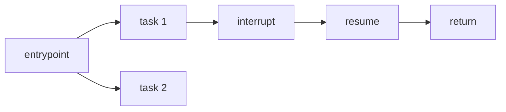
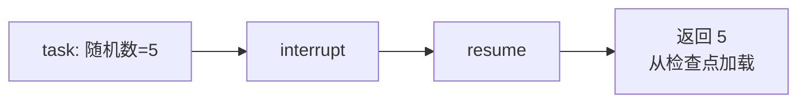
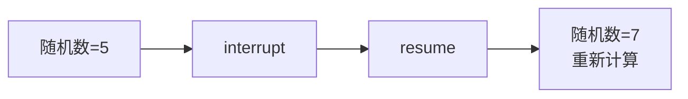

# Functional API 完整指南

> 以最小代码改动为现有应用添加持久化、记忆、人机协作和流式输出：从基础概念到实践应用

Functional API 允许你在几乎不改变现有代码结构的情况下，为应用添加 LangGraph 的核心特性。它使用标准 Python 控制流（if/else、for 循环、函数调用），无需将代码重构为显式的 DAG 或管道。

## 目录

- [核心概念](#核心概念)
- [Entrypoint](#entrypoint)
- [Task](#task)
- [实践应用](#实践应用)
- [高级特性](#高级特性)
- [常见陷阱](#常见陷阱)

## 核心概念

### 核心构建块

| 构建块 | 说明 |
|--------|------|
| **@entrypoint** | 工作流入口点，封装逻辑并管理执行流程，处理长时间任务和中断 |
| **@task** | 离散工作单元（如 API 调用），可异步执行，结果自动保存到检查点 |



### Functional API vs Graph API

| 维度 | Functional API | Graph API |
|------|----------------|-----------|
| **控制流** | 标准 Python 语法 | 图结构（节点+边） |
| **代码量** | 更少 | 更多 |
| **状态管理** | 函数作用域，无需显式管理 | 需要定义 State 和 Reducer |
| **检查点** | task 执行时保存到现有检查点 | 每个 super-step 后创建新检查点 |
| **可视化** | 不支持（运行时动态生成） | 支持图形化展示 |

两种 API 共享相同的底层运行时，可以在同一应用中混合使用。

### 快速示例

一个写文章并请求人工审核的工作流：

```python
import time
import uuid
from langgraph.checkpoint.memory import InMemorySaver
from langgraph.func import entrypoint, task
from langgraph.types import interrupt, Command

@task
def write_essay(topic: str) -> str:
    """写一篇关于指定主题的文章"""
    time.sleep(1)  # 模拟长时间任务
    return f"An essay about topic: {topic}"

@entrypoint(checkpointer=InMemorySaver())
def workflow(topic: str) -> dict:
    """写文章并请求审核的工作流"""
    essay = write_essay(topic).result()
    
    is_approved = interrupt({
        "essay": essay,
        "action": "Please approve/reject the essay",
    })
    
    return {
        "essay": essay,
        "is_approved": is_approved,
    }

# 执行工作流
thread_id = str(uuid.uuid4())
config = {"configurable": {"thread_id": thread_id}}

for item in workflow.stream("cat", config):
    print(item)
# {'write_essay': 'An essay about topic: cat'}
# {'__interrupt__': (Interrupt(value={'essay': '...', 'action': '...'}),)}

# 恢复执行（提供人工审核结果）
human_review = True
for item in workflow.stream(Command(resume=human_review), config):
    print(item)
# {'workflow': {'essay': 'An essay about topic: cat', 'is_approved': True}}
```

**执行流程**：
1. 首次执行：写文章 → 中断等待审核
2. 恢复执行：从头开始，但 `write_essay` 结果从检查点加载（不重新计算）→ 返回结果

## Entrypoint

### 定义

使用 `@entrypoint` 装饰器定义工作流入口：

```python
from langgraph.func import entrypoint

# 同步版本
@entrypoint(checkpointer=checkpointer)
def my_workflow(some_input: dict) -> int:
    # 工作流逻辑
    return result

# 异步版本
@entrypoint(checkpointer=checkpointer)
async def my_workflow(some_input: dict) -> int:
    # 工作流逻辑
    return result
```

**要求**：
- 函数必须接受**单个位置参数**作为输入
- 如需传递多个数据，使用字典作为输入类型
- 输入和输出必须是 **JSON 可序列化**的

### 可注入参数

在 entrypoint 中可以请求自动注入的参数：

| 参数 | 说明 |
|------|------|
| **previous** | 上一次调用的检查点状态（短期记忆） |
| **store** | BaseStore 实例（长期记忆） |
| **writer** | StreamWriter（用于 Async Python < 3.11 的流式输出） |
| **config** | RunnableConfig（运行时配置） |

```python
from langchain_core.runnables import RunnableConfig
from typing import Any
from langgraph.func import entrypoint
from langgraph.store.base import BaseStore
from langgraph.store.memory import InMemoryStore
from langgraph.checkpoint.memory import InMemorySaver
from langgraph.types import StreamWriter

@entrypoint(
    checkpointer=InMemorySaver(),
    store=InMemoryStore()
)
def my_workflow(
    some_input: dict,
    *,
    previous: Any = None,      # 短期记忆
    store: BaseStore,          # 长期记忆
    writer: StreamWriter,      # 流式输出
    config: RunnableConfig     # 运行时配置
) -> Any:
    ...
```

### 执行方式

`@entrypoint` 返回一个 `Pregel` 对象，支持多种执行方式：

```python
config = {"configurable": {"thread_id": "some_thread_id"}}

# 同步调用
result = my_workflow.invoke(some_input, config)

# 异步调用
result = await my_workflow.ainvoke(some_input, config)

# 同步流式
for chunk in my_workflow.stream(some_input, config):
    print(chunk)

# 异步流式
async for chunk in my_workflow.astream(some_input, config):
    print(chunk)
```

### 恢复执行

使用 `Command(resume=...)` 恢复中断的工作流：

```python
from langgraph.types import Command

config = {"configurable": {"thread_id": "some_thread_id"}}

# 恢复执行
my_workflow.invoke(Command(resume=some_resume_value), config)

# 流式恢复
for chunk in my_workflow.stream(Command(resume=some_resume_value), config):
    print(chunk)
```

**错误后恢复**：传入 `None` 并使用相同的 thread_id：

```python
# 假设底层错误已解决
my_workflow.invoke(None, config)
```

### 短期记忆

使用 `previous` 参数访问上一次调用的状态：

```python
@entrypoint(checkpointer=checkpointer)
def my_workflow(number: int, *, previous: Any = None) -> int:
    previous = previous or 0
    return number + previous

config = {"configurable": {"thread_id": "some_thread_id"}}
my_workflow.invoke(1, config)  # 1 (previous 为 None)
my_workflow.invoke(2, config)  # 3 (previous 为 1)
```

### entrypoint.final

分离返回值和保存到检查点的值：

```python
@entrypoint(checkpointer=checkpointer)
def my_workflow(number: int, *, previous: Any = None) -> entrypoint.final[int, int]:
    previous = previous or 0
    # 返回 previous 给调用者，保存 2 * number 到检查点
    return entrypoint.final(value=previous, save=2 * number)

config = {"configurable": {"thread_id": "1"}}
my_workflow.invoke(3, config)  # 0 (previous 为 None)
my_workflow.invoke(1, config)  # 6 (previous 为 3 * 2 = 6)
```

## Task

### 定义

使用 `@task` 装饰器定义任务：

```python
from langgraph.func import task

@task()
def slow_computation(input_value):
    # 模拟长时间操作
    ...
    return result
```

**特性**：
- **异步执行**：多个任务可并发运行
- **检查点**：结果自动保存，支持恢复

**要求**：输出必须是 **JSON 可序列化**的

### 执行

Task 只能在 entrypoint、其他 task 或 StateGraph 节点中调用，不能直接从主程序调用。

调用 task 会立即返回一个 future 对象：

```python
# 同步等待结果
@entrypoint(checkpointer=checkpointer)
def my_workflow(some_input: int) -> int:
    future = slow_computation(some_input)
    return future.result()  # 同步等待

# 异步等待结果
@entrypoint(checkpointer=checkpointer)
async def my_workflow(some_input: int) -> int:
    return await slow_computation(some_input)  # 异步等待
```

### 何时使用 Task

| 场景 | 说明 |
|------|------|
| **检查点** | 保存长时间操作的结果，恢复时无需重新计算 |
| **人机协作** | 封装随机性操作（如 API 调用），确保恢复时行为一致 |
| **并行执行** | I/O 密集型任务并发执行 |
| **可观测性** | 通过 LangSmith 追踪工作流进度 |
| **重试** | 封装需要重试的操作 |

## 实践应用

### 创建简单工作流

entrypoint 的输入限制为函数的第一个参数，如需传递多个值，使用字典：

```python
import uuid
from langgraph.func import entrypoint, task
from langgraph.checkpoint.memory import InMemorySaver

@task
def is_even(number: int) -> bool:
    """检查数字是否为偶数"""
    return number % 2 == 0

@task
def format_message(is_even: bool) -> str:
    """格式化消息"""
    return "数字是偶数" if is_even else "数字是奇数"

checkpointer = InMemorySaver()

@entrypoint(checkpointer=checkpointer)
def workflow(inputs: dict) -> str:
    """判断数字奇偶的工作流"""
    even = is_even(inputs["number"]).result()
    return format_message(even).result()

# 执行
config = {"configurable": {"thread_id": str(uuid.uuid4())}}
result = workflow.invoke({"number": 7}, config=config)
print(result)  # 数字是奇数
```

### 使用 LLM 的示例

```python
import uuid
from langchain.chat_models import init_chat_model
from langgraph.func import entrypoint, task
from langgraph.checkpoint.memory import InMemorySaver

model = init_chat_model("qwen-plus")

@task
def compose_essay(topic: str) -> str:
    """生成关于指定主题的文章"""
    return model.invoke([
        {"role": "system", "content": "你是一个擅长写文章的助手"},
        {"role": "user", "content": f"写一篇关于{topic}的文章"}
    ]).content

checkpointer = InMemorySaver()

@entrypoint(checkpointer=checkpointer)
def workflow(topic: str) -> str:
    """生成文章的工作流"""
    return compose_essay(topic).result()

config = {"configurable": {"thread_id": str(uuid.uuid4())}}
result = workflow.invoke("人工智能的发展", config=config)
print(result)
```

### 并行执行

通过并发调用 task 并等待结果来实现并行执行，适用于 I/O 密集型任务：

```python
@task
def add_one(number: int) -> int:
    return number + 1

@entrypoint(checkpointer=checkpointer)
def graph(numbers: list[int]) -> list[int]:
    # 并发调用所有 task
    futures = [add_one(i) for i in numbers]
    # 等待所有结果
    return [f.result() for f in futures]
```

#### 并行 LLM 调用示例

```python
import uuid
from langchain.chat_models import init_chat_model
from langgraph.func import entrypoint, task
from langgraph.checkpoint.memory import InMemorySaver

model = init_chat_model("qwen-plus")

@task
def generate_paragraph(topic: str) -> str:
    """生成关于指定主题的段落"""
    response = model.invoke([
        {"role": "system", "content": "你是一个擅长写教育性段落的助手"},
        {"role": "user", "content": f"写一段关于{topic}的内容"}
    ])
    return response.content

checkpointer = InMemorySaver()

@entrypoint(checkpointer=checkpointer)
def workflow(topics: list[str]) -> str:
    """并行生成多个段落并合并"""
    futures = [generate_paragraph(topic) for topic in topics]
    paragraphs = [f.result() for f in futures]
    return "\n\n".join(paragraphs)

config = {"configurable": {"thread_id": str(uuid.uuid4())}}
result = workflow.invoke(
    ["量子计算", "气候变化", "航空历史"], 
    config=config
)
print(result)
```

### 调用 Graph API

Functional API 和 Graph API 可以在同一应用中混合使用：

```python
import uuid
from typing import TypedDict
from langgraph.func import entrypoint
from langgraph.checkpoint.memory import InMemorySaver
from langgraph.graph import StateGraph

# 使用 Graph API 定义图
class State(TypedDict):
    foo: int

def double(state: State) -> State:
    return {"foo": state["foo"] * 2}

builder = StateGraph(State)
builder.add_node("double", double)
builder.set_entry_point("double")
graph = builder.compile()

# 使用 Functional API 调用图
checkpointer = InMemorySaver()

@entrypoint(checkpointer=checkpointer)
def workflow(x: int) -> dict:
    result = graph.invoke({"foo": x})
    return {"bar": result["foo"]}

config = {"configurable": {"thread_id": str(uuid.uuid4())}}
print(workflow.invoke(5, config=config))  # {'bar': 10}
```

### 调用其他 Entrypoint

可以在 entrypoint 或 task 中调用其他 entrypoint：

```python
import uuid
from langgraph.func import entrypoint
from langgraph.checkpoint.memory import InMemorySaver

checkpointer = InMemorySaver()

# 可复用的子工作流
@entrypoint()  # 自动使用父 entrypoint 的 checkpointer
def multiply(inputs: dict) -> int:
    return inputs["a"] * inputs["b"]

# 主工作流
@entrypoint(checkpointer=checkpointer)
def main(inputs: dict) -> dict:
    result = multiply.invoke({"a": inputs["x"], "b": inputs["y"]})
    return {"product": result}

config = {"configurable": {"thread_id": str(uuid.uuid4())}}
print(main.invoke({"x": 6, "y": 7}, config=config))  # {'product': 42}
```

## 高级特性

### 流式输出

使用 `get_stream_writer` 发送自定义流式数据：

```python
from langgraph.func import entrypoint
from langgraph.checkpoint.memory import InMemorySaver
from langgraph.config import get_stream_writer

checkpointer = InMemorySaver()

@entrypoint(checkpointer=checkpointer)
def main(inputs: dict) -> int:
    writer = get_stream_writer()
    writer("开始处理")
    
    result = inputs["x"] * 2
    writer(f"结果是 {result}")
    
    return result

config = {"configurable": {"thread_id": "abc"}}

for mode, chunk in main.stream(
    {"x": 5},
    stream_mode=["custom", "updates"],
    config=config
):
    print(f"{mode}: {chunk}")

# 输出:
# custom: 开始处理
# custom: 结果是 10
# updates: {'main': 10}
```

**注意**：Python < 3.11 的异步代码需要使用 `StreamWriter` 参数：

```python
from langgraph.types import StreamWriter

@entrypoint(checkpointer=checkpointer)
async def main(inputs: dict, writer: StreamWriter) -> int:
    writer("开始处理")
    ...
```

### 重试策略

为 task 配置重试策略：

```python
from langgraph.checkpoint.memory import InMemorySaver
from langgraph.func import entrypoint, task
from langgraph.types import RetryPolicy

attempts = 0

# 配置重试策略，遇到 ValueError 时重试
retry_policy = RetryPolicy(retry_on=ValueError)

@task(retry_policy=retry_policy)
def get_info():
    global attempts
    attempts += 1
    if attempts < 2:
        raise ValueError("Failure")
    return "OK"

checkpointer = InMemorySaver()

@entrypoint(checkpointer=checkpointer)
def main(inputs, writer):
    return get_info().result()

config = {"configurable": {"thread_id": "1"}}
result = main.invoke({"any_input": "foobar"}, config=config)
print(result)  # OK
```

### 任务缓存

缓存 task 结果，避免重复计算：

```python
import time
from langgraph.cache.memory import InMemoryCache
from langgraph.func import entrypoint, task
from langgraph.types import CachePolicy

@task(cache_policy=CachePolicy(ttl=120))  # 120秒过期
def slow_add(x: int) -> int:
    time.sleep(1)
    return x * 2

@entrypoint(cache=InMemoryCache())
def main(inputs: dict) -> dict:
    result1 = slow_add(inputs["x"]).result()
    result2 = slow_add(inputs["x"]).result()  # 使用缓存
    return {"result1": result1, "result2": result2}

for chunk in main.stream({"x": 5}, stream_mode="updates"):
    print(chunk)

# 输出:
# {'slow_add': 10}
# {'slow_add': 10, '__metadata__': {'cached': True}}  # 缓存命中
# {'main': {'result1': 10, 'result2': 10}}
```

### 错误后恢复

task 结果保存到检查点，恢复时无需重新执行已完成的 task：

```python
import time
from langgraph.checkpoint.memory import InMemorySaver
from langgraph.func import entrypoint, task

attempts = 0

@task()
def get_info():
    """模拟首次失败的任务"""
    global attempts
    attempts += 1
    if attempts < 2:
        raise ValueError("Failure")
    return "OK"

@task
def slow_task():
    """模拟耗时任务"""
    time.sleep(1)
    return "Ran slow task."

checkpointer = InMemorySaver()

@entrypoint(checkpointer=checkpointer)
def main(inputs):
    slow_task_result = slow_task().result()
    get_info().result()  # 首次会失败
    return slow_task_result

config = {"configurable": {"thread_id": "1"}}

# 首次调用会失败
try:
    main.invoke({"any_input": "foobar"}, config=config)
except ValueError:
    pass

# 恢复执行 - slow_task 不会重新运行
result = main.invoke(None, config=config)
print(result)  # Ran slow task.
```

### 人机协作

#### 基本人机协作工作流

```python
from langgraph.func import entrypoint, task
from langgraph.types import Command, interrupt
from langgraph.checkpoint.memory import InMemorySaver

@task
def step_1(input_query):
    """追加 bar"""
    return f"{input_query} bar"

@task
def human_feedback(input_query):
    """等待人工输入"""
    feedback = interrupt(f"请提供反馈: {input_query}")
    return f"{input_query} {feedback}"

@task
def step_3(input_query):
    """追加 qux"""
    return f"{input_query} qux"

checkpointer = InMemorySaver()

@entrypoint(checkpointer=checkpointer)
def graph(input_query):
    result_1 = step_1(input_query).result()
    result_2 = human_feedback(result_1).result()
    result_3 = step_3(result_2).result()
    return result_3

# 执行
config = {"configurable": {"thread_id": "1"}}

for event in graph.stream("foo", config):
    print(event)
# {'step_1': 'foo bar'}
# {'__interrupt__': (Interrupt(value='请提供反馈: foo bar', ...),)}

# 恢复执行
for event in graph.stream(Command(resume="baz"), config):
    print(event)
# {'human_feedback': 'foo bar baz'}
# {'step_3': 'foo bar baz qux'}
# {'graph': 'foo bar baz qux'}
```

#### 审核工具调用

```python
from typing import Union
from langchain_core.messages import ToolMessage, ToolCall
from langgraph.types import interrupt

def review_tool_call(tool_call: ToolCall) -> Union[ToolCall, ToolMessage]:
    """审核工具调用"""
    human_review = interrupt({
        "question": "这个调用正确吗?",
        "tool_call": tool_call,
    })
    
    review_action = human_review["action"]
    review_data = human_review.get("data")
    
    if review_action == "continue":
        # 接受原始调用
        return tool_call
    elif review_action == "update":
        # 修改调用参数
        return {**tool_call, "args": review_data}
    elif review_action == "feedback":
        # 返回自定义消息
        return ToolMessage(
            content=review_data, 
            name=tool_call["name"], 
            tool_call_id=tool_call["id"]
        )
```

### 短期记忆

#### 查看线程状态

```python
config = {"configurable": {"thread_id": "1"}}

# 查看当前状态
state = graph.get_state(config)
print(state)

# 查看特定检查点
config_with_checkpoint = {
    "configurable": {
        "thread_id": "1",
        "checkpoint_id": "1f029ca3-1f5b-6704-8004-820c16b69a5a"
    }
}
state = graph.get_state(config_with_checkpoint)
```

#### 查看线程历史

```python
config = {"configurable": {"thread_id": "1"}}

# 获取所有历史状态
history = list(graph.get_state_history(config))
for state in history:
    print(state.values)
    print(state.next)
    print("---")
```

#### 聊天机器人示例

```python
from langchain.messages import BaseMessage
from langgraph.graph.message import add_messages
from langgraph.func import entrypoint, task
from langgraph.checkpoint.memory import InMemorySaver
from langchain.chat_models import init_chat_model

model = init_chat_model("qwen-plus")

@task
def call_model(messages: list[BaseMessage]):
    return model.invoke(messages)

checkpointer = InMemorySaver()

@entrypoint(checkpointer=checkpointer)
def workflow(inputs: list[BaseMessage], *, previous: list[BaseMessage]):
    if previous:
        inputs = add_messages(previous, inputs)
    
    response = call_model(inputs).result()
    
    return entrypoint.final(
        value=response, 
        save=add_messages(inputs, response)
    )

config = {"configurable": {"thread_id": "1"}}

# 第一轮对话
input_message = {"role": "user", "content": "你好！我是小明"}
for chunk in workflow.stream([input_message], config, stream_mode="values"):
    chunk.pretty_print()

# 第二轮对话 - 机器人记住了名字
input_message = {"role": "user", "content": "我叫什么名字？"}
for chunk in workflow.stream([input_message], config, stream_mode="values"):
    chunk.pretty_print()
```

### 长期记忆

长期记忆允许跨不同 thread_id 存储信息，适用于在一个对话中学习用户信息并在另一个对话中使用。

```python
from langgraph.func import entrypoint
from langgraph.store.memory import InMemoryStore
from langgraph.store.base import BaseStore
from langgraph.checkpoint.memory import InMemorySaver

store = InMemoryStore()
checkpointer = InMemorySaver()

@entrypoint(checkpointer=checkpointer, store=store)
def workflow(inputs: dict, *, store: BaseStore):
    user_id = inputs["user_id"]
    
    # 从 store 获取用户信息
    namespace = ("users", user_id)
    user_data = store.get(namespace, "profile")
    
    if user_data is None:
        # 首次访问，保存用户信息
        store.put(namespace, "profile", {"name": inputs.get("name", "Unknown")})
        return f"欢迎新用户！"
    else:
        return f"欢迎回来，{user_data.value['name']}！"

# 不同的 thread_id，但共享用户信息
config1 = {"configurable": {"thread_id": "thread-1"}}
config2 = {"configurable": {"thread_id": "thread-2"}}

print(workflow.invoke({"user_id": "user-123", "name": "小明"}, config1))
# 欢迎新用户！

print(workflow.invoke({"user_id": "user-123"}, config2))
# 欢迎回来，小明！
```

## 常见陷阱

### 序列化

| 组件 | 要求 |
|------|------|
| entrypoint 输入/输出 | 必须 JSON 可序列化 |
| task 输出 | 必须 JSON 可序列化 |

使用 Python 原生类型：字典、列表、字符串、数字、布尔值。

### 确定性

为了正确使用人机协作等特性，**随机性操作必须封装在 task 中**。

**原理**：
- 恢复执行时，工作流从头开始
- 但已执行的 task 结果从检查点加载，不重新计算
- 这要求恢复时遵循**相同的执行顺序**



如果随机操作不在 task 中：



### 幂等性

Task 应设计为**幂等**的，即多次执行产生相同结果。

**原因**：如果 task 开始但未成功完成，恢复时会重新执行。

**建议**：
- 使用幂等性 key
- 执行前检查是否已有结果

### 副作用处理

将副作用封装在 task 中，避免恢复时重复执行：

```python
# ❌ 错误：副作用直接在 entrypoint 中
@entrypoint(checkpointer=checkpointer)
def my_workflow(inputs: dict) -> int:
    with open("output.txt", "w") as f:
        f.write("Side effect executed")  # 恢复时会再次执行！
    value = interrupt("question")
    return value

# ✅ 正确：副作用封装在 task 中
@task
def write_to_file():
    with open("output.txt", "w") as f:
        f.write("Side effect executed")

@entrypoint(checkpointer=checkpointer)
def my_workflow(inputs: dict) -> int:
    write_to_file().result()  # 恢复时从检查点加载
    value = interrupt("question")
    return value
```

### 非确定性控制流

将可能产生不同结果的操作封装在 task 中：

```python
# ❌ 错误：时间获取不在 task 中
@entrypoint(checkpointer=checkpointer)
def my_workflow(inputs: dict) -> int:
    t0 = inputs["t0"]
    t1 = time.time()  # 恢复时会得到不同的值！
    delta_t = t1 - t0
    
    if delta_t > 1:
        result = slow_task(1).result()
        value = interrupt("question")
    else:
        result = slow_task(2).result()
        value = interrupt("question")
    
    return {"result": result, "value": value}

# ✅ 正确：时间获取封装在 task 中
@task
def get_time() -> float:
    return time.time()

@entrypoint(checkpointer=checkpointer)
def my_workflow(inputs: dict) -> int:
    t0 = inputs["t0"]
    t1 = get_time().result()  # 恢复时从检查点加载
    delta_t = t1 - t0
    
    if delta_t > 1:
        result = slow_task(1).result()
        value = interrupt("question")
    else:
        result = slow_task(2).result()
        value = interrupt("question")
    
    return {"result": result, "value": value}
```

## 完整示例：带审核的文章生成

```python
import uuid
from langchain.chat_models import init_chat_model
from langgraph.func import entrypoint, task
from langgraph.types import interrupt, Command
from langgraph.checkpoint.memory import InMemorySaver

model = init_chat_model("qwen-plus")

@task
def generate_outline(topic: str) -> str:
    """生成文章大纲"""
    response = model.invoke([
        {"role": "system", "content": "你是一个写作助手"},
        {"role": "user", "content": f"为主题'{topic}'生成一个简短的文章大纲"}
    ])
    return response.content

@task
def write_article(outline: str) -> str:
    """根据大纲写文章"""
    response = model.invoke([
        {"role": "system", "content": "你是一个写作助手"},
        {"role": "user", "content": f"根据以下大纲写一篇文章:\n{outline}"}
    ])
    return response.content

checkpointer = InMemorySaver()

@entrypoint(checkpointer=checkpointer)
def article_workflow(topic: str) -> dict:
    # 生成大纲
    outline = generate_outline(topic).result()
    
    # 人工审核大纲
    outline_approval = interrupt({
        "stage": "outline_review",
        "outline": outline,
        "action": "请审核大纲，回复 'approve' 或提供修改建议"
    })
    
    if outline_approval != "approve":
        outline = outline_approval  # 使用修改后的大纲
    
    # 写文章
    article = write_article(outline).result()
    
    # 人工审核文章
    article_approval = interrupt({
        "stage": "article_review",
        "article": article,
        "action": "请审核文章，回复 'approve' 或 'reject'"
    })
    
    return {
        "topic": topic,
        "outline": outline,
        "article": article,
        "approved": article_approval == "approve"
    }

# 执行
config = {"configurable": {"thread_id": str(uuid.uuid4())}}

# 第一步：生成大纲并等待审核
for event in article_workflow.stream("人工智能的未来", config):
    print(event)

# 审核大纲
for event in article_workflow.stream(Command(resume="approve"), config):
    print(event)

# 审核文章
for event in article_workflow.stream(Command(resume="approve"), config):
    print(event)
```

## 要点总结

| 主题 | 关键点 |
|------|--------|
| **@entrypoint** | 工作流入口，管理执行流程和中断 |
| **@task** | 离散工作单元，结果自动保存到检查点 |
| **序列化** | 输入输出必须 JSON 可序列化 |
| **确定性** | 随机操作必须封装在 task 中 |
| **幂等性** | task 应设计为可重复执行 |
| **副作用** | 封装在 task 中避免重复执行 |
| **短期记忆** | 通过 `previous` 参数访问上次状态 |
| **长期记忆** | `store` 参数跨 thread_id 存储信息 |
| **entrypoint.final** | 分离返回值和检查点保存值 |
| **并行执行** | 并发调用 task，批量等待结果 |
| **混合 API** | 可在 entrypoint 中调用 Graph API 的图 |
| **流式输出** | `get_stream_writer()` 发送自定义数据 |
| **重试策略** | `RetryPolicy` 配置重试条件 |
| **任务缓存** | `CachePolicy` 配置缓存 TTL |
| **错误恢复** | 传入 `None` 恢复，已完成 task 不重新执行 |

## 相关文档

- [API 选择指南](./15-API选择指南.md) - Graph API vs Functional API
- [持久化详解](./06-持久化详解.md) - 状态持久化
- [流式输出详解](./08-流式输出详解.md) - 实时输出
- [中断机制详解](./09-中断机制详解.md) - 人机协作
