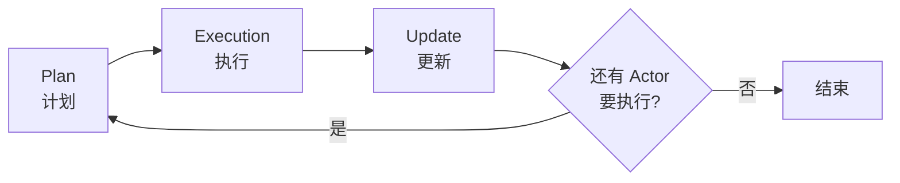
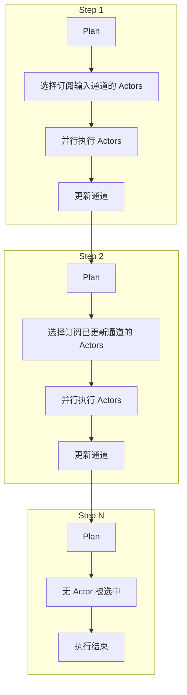

# Runtime 详解

> Pregel 运行时：LangGraph 应用的执行引擎

`Pregel` 实现了 LangGraph 的运行时，管理 LangGraph 应用的执行。编译 `StateGraph` 或创建 `@entrypoint` 都会生成一个 `Pregel` 实例。

> **命名由来**：Pregel 运行时以 [Google 的 Pregel 算法](https://research.google/pubs/pub37252/) 命名，该算法描述了一种使用图进行大规模并行计算的高效方法。

## 概述

在 LangGraph 中，Pregel 将 **Actors（执行者）** 和 **Channels（通道）** 组合成一个应用：

- **Actors**：从通道读取数据，向通道写入数据
- **Channels**：Actors 之间的通信媒介

Pregel 按照 **Pregel 算法 / 批量同步并行（BSP）** 模型组织执行。

## 执行步骤

每个步骤包含三个阶段：



| 阶段 | 说明 |
|------|------|
| **Plan（计划）** | 确定本步骤要执行哪些 Actors。首步选择订阅输入通道的 Actors；后续步骤选择订阅上一步更新的通道的 Actors |
| **Execution（执行）** | 并行执行所有选中的 Actors，直到全部完成、某个失败或超时。此阶段通道更新对其他 Actors 不可见 |
| **Update（更新）** | 用本步骤 Actors 写入的值更新通道 |

重复执行直到没有 Actor 被选中，或达到最大步数。

## Actors

**Actor** 是 `PregelNode`，它：
- 订阅通道
- 从通道读取数据
- 向通道写入数据
- 实现 LangChain 的 Runnable 接口

## Channels（通道）

通道用于 Actors 之间的通信，每个通道有：
- **值类型**：存储的数据类型
- **更新类型**：接收的更新类型
- **更新函数**：接收更新序列并修改存储值

### 内置通道类型

| 通道类型 | 说明 | 用途 |
|----------|------|------|
| **LastValue** | 存储发送到通道的最后一个值（默认） | 输入/输出值，步骤间数据传递 |
| **Topic** | 可配置的 PubSub 主题 | Actors 间发送多个值，累积输出 |
| **BinaryOperatorAggregate** | 使用二元运算符更新持久值 | 多步骤聚合计算 |

## 直接使用 Pregel

虽然大多数用户通过 StateGraph 或 @entrypoint 与 Pregel 交互，但也可以直接使用。

### 单节点示例

```python
from langgraph.channels import EphemeralValue
from langgraph.pregel import Pregel, NodeBuilder

node1 = (
    NodeBuilder()
    .subscribe_only("a")
    .do(lambda x: x + x)
    .write_to("b")
)

app = Pregel(
    nodes={"node1": node1},
    channels={
        "a": EphemeralValue(str),
        "b": EphemeralValue(str),
    },
    input_channels=["a"],
    output_channels=["b"],
)

app.invoke({"a": "foo"})
# {'b': 'foofoo'}
```

### 多节点示例

```python
from langgraph.channels import LastValue, EphemeralValue
from langgraph.pregel import Pregel, NodeBuilder

node1 = (
    NodeBuilder()
    .subscribe_only("a")
    .do(lambda x: x + x)
    .write_to("b")
)

node2 = (
    NodeBuilder()
    .subscribe_only("b")
    .do(lambda x: x + x)
    .write_to("c")
)

app = Pregel(
    nodes={"node1": node1, "node2": node2},
    channels={
        "a": EphemeralValue(str),
        "b": LastValue(str),
        "c": EphemeralValue(str),
    },
    input_channels=["a"],
    output_channels=["b", "c"],
)

app.invoke({"a": "foo"})
# {'b': 'foofoo', 'c': 'foofoofoofoo'}
```

### Topic 通道示例

```python
from langgraph.channels import EphemeralValue, Topic
from langgraph.pregel import Pregel, NodeBuilder

node1 = (
    NodeBuilder()
    .subscribe_only("a")
    .do(lambda x: x + x)
    .write_to("b", "c")
)

node2 = (
    NodeBuilder()
    .subscribe_to("b")
    .do(lambda x: x["b"] + x["b"])
    .write_to("c")
)

app = Pregel(
    nodes={"node1": node1, "node2": node2},
    channels={
        "a": EphemeralValue(str),
        "b": EphemeralValue(str),
        "c": Topic(str, accumulate=True),  # 累积多个值
    },
    input_channels=["a"],
    output_channels=["c"],
)

app.invoke({"a": "foo"})
# {'c': ['foofoo', 'foofoofoofoo']}
```

### BinaryOperatorAggregate 示例

使用二元运算符实现 reducer：

```python
from langgraph.channels import EphemeralValue, BinaryOperatorAggregate
from langgraph.pregel import Pregel, NodeBuilder

node1 = (
    NodeBuilder()
    .subscribe_only("a")
    .do(lambda x: x + x)
    .write_to("b", "c")
)

node2 = (
    NodeBuilder()
    .subscribe_only("b")
    .do(lambda x: x + x)
    .write_to("c")
)

def reducer(current, update):
    if current:
        return current + " | " + update
    else:
        return update

app = Pregel(
    nodes={"node1": node1, "node2": node2},
    channels={
        "a": EphemeralValue(str),
        "b": EphemeralValue(str),
        "c": BinaryOperatorAggregate(str, operator=reducer),
    },
    input_channels=["a"],
    output_channels=["c"],
)

app.invoke({"a": "foo"})
# {'c': 'foofoo | foofoofoofoo'}
```

### 循环示例

通过让节点写入它订阅的通道来创建循环，执行持续到写入 `None` 值：

```python
from langgraph.channels import EphemeralValue
from langgraph.pregel import Pregel, NodeBuilder, ChannelWriteEntry

example_node = (
    NodeBuilder()
    .subscribe_only("value")
    .do(lambda x: x + x if len(x) < 10 else None)
    .write_to(ChannelWriteEntry("value", skip_none=True))
)

app = Pregel(
    nodes={"example_node": example_node},
    channels={
        "value": EphemeralValue(str),
    },
    input_channels=["value"],
    output_channels=["value"],
)

app.invoke({"value": "a"})
# {'value': 'aaaaaaaaaaaaaaaa'}
```

## 高级 API

LangGraph 提供两种高级 API 来创建 Pregel 应用：

### StateGraph (Graph API)

```python
from typing import TypedDict
from langgraph.constants import START
from langgraph.graph import StateGraph

class Essay(TypedDict):
    topic: str
    content: str | None
    score: float | None

def write_essay(essay: Essay):
    return {"content": f"Essay about {essay['topic']}"}

def score_essay(essay: Essay):
    return {"score": 10}

builder = StateGraph(Essay)
builder.add_node(write_essay)
builder.add_node(score_essay)
builder.add_edge(START, "write_essay")
builder.add_edge("write_essay", "score_essay")

# 编译生成 Pregel 实例
graph = builder.compile()

# 查看节点
print(graph.nodes)
# {'__start__': <PregelNode>, 'write_essay': <PregelNode>, 'score_essay': <PregelNode>}

# 查看通道
print(graph.channels)
# {'topic': <LastValue>, 'content': <LastValue>, 'score': <LastValue>, ...}
```

### Functional API

```python
from typing import TypedDict
from langgraph.checkpoint.memory import InMemorySaver
from langgraph.func import entrypoint

class Essay(TypedDict):
    topic: str
    content: str | None
    score: float | None

checkpointer = InMemorySaver()

@entrypoint(checkpointer=checkpointer)
def write_essay(essay: Essay):
    return {"content": f"Essay about {essay['topic']}"}

# 查看节点
print(write_essay.nodes)
# {'write_essay': <PregelNode>}

# 查看通道
print(write_essay.channels)
# {'__start__': <EphemeralValue>, '__end__': <LastValue>, '__previous__': <LastValue>}
```

## 执行流程图



## 通道类型对比

| 通道类型 | 值保留 | 多值支持 | 典型用途 |
|----------|--------|----------|----------|
| **EphemeralValue** | 仅当前步骤 | 否 | 临时数据传递 |
| **LastValue** | 跨步骤 | 否 | 状态存储 |
| **Topic** | 可配置 | 是 | 消息累积 |
| **BinaryOperatorAggregate** | 跨步骤 | 是（聚合） | 计算聚合值 |

## NodeBuilder API

| 方法 | 说明 |
|------|------|
| `subscribe_only(channel)` | 仅订阅单个通道 |
| `subscribe_to(*channels)` | 订阅多个通道 |
| `do(func)` | 设置执行函数 |
| `write_to(*channels)` | 写入到指定通道 |

## 要点总结

- **Pregel**：LangGraph 的底层运行时，基于 Google Pregel 算法
- **执行模型**：Plan → Execution → Update 循环
- **Actors**：PregelNode，订阅通道、读写数据
- **Channels**：通信媒介，支持 LastValue、Topic、BinaryOperatorAggregate
- **高级 API**：StateGraph 和 @entrypoint 都生成 Pregel 实例
- **并行执行**：同一步骤内的 Actors 并行执行
- **通道隔离**：执行阶段的通道更新对其他 Actors 不可见
