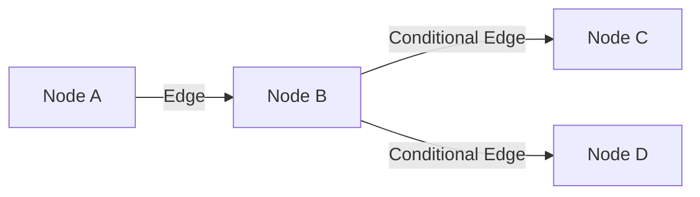
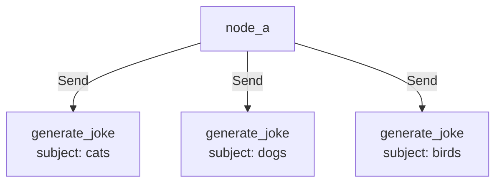

# Graph API 详解

> 使用声明式图结构构建 Agent 工作流

> 注意：本篇内容已合并到 [Graph API 完整指南](../16-Graph%20API完整指南.md)。本文件仅作历史对照，建议以“完整指南”为准。

LangGraph 的 Graph API 使用声明式方法，通过定义节点、边和共享状态来创建可视化的图结构。

## 核心概念

LangGraph 将 Agent 工作流建模为图，包含三个关键组件：

| 组件 | 说明 |
|------|------|
| **State** | 共享数据结构，表示应用的当前快照 |
| **Nodes** | 编码 Agent 逻辑的函数，接收状态并返回更新 |
| **Edges** | 决定下一步执行哪个节点的函数 |

**核心原则**：节点做工作，边决定下一步。



## 执行模型：Super-steps

LangGraph 使用**消息传递**算法（受 Google Pregel 启发）：

1. 节点完成操作后，沿边向其他节点发送消息
2. 接收消息的节点执行函数，将结果传递给下一组节点
3. 程序以离散的 **super-step** 进行

| 概念 | 说明 |
|------|------|
| **Super-step** | 图节点的单次迭代 |
| **并行节点** | 属于同一 super-step |
| **顺序节点** | 属于不同 super-step |
| **终止条件** | 所有节点 inactive 且无消息传输 |

## State（状态）

### Schema 定义

状态 schema 是所有节点和边的输入 schema，支持三种定义方式：

```python
# 方式 1：TypedDict（推荐）
from typing_extensions import TypedDict

class State(TypedDict):
    messages: list
    current_tool: str

# 方式 2：dataclass（支持默认值）
from dataclasses import dataclass, field

@dataclass
class State:
    messages: list = field(default_factory=list)
    current_tool: str = ""

# 方式 3：Pydantic BaseModel（递归验证，性能较低）
from pydantic import BaseModel

class State(BaseModel):
    messages: list
    current_tool: str
```

### 多 Schema 模式

可以定义不同的输入/输出 schema 和私有状态：

```python
class InputState(TypedDict):
    user_input: str

class OutputState(TypedDict):
    graph_output: str

class OverallState(TypedDict):
    foo: str
    user_input: str
    graph_output: str

class PrivateState(TypedDict):
    bar: str  # 内部节点通信用

def node_1(state: InputState) -> OverallState:
    # 从 InputState 读取，写入 OverallState
    return {"foo": state["user_input"] + " name"}

def node_2(state: OverallState) -> PrivateState:
    # 从 OverallState 读取，写入 PrivateState
    return {"bar": state["foo"] + " is"}

def node_3(state: PrivateState) -> OutputState:
    # 从 PrivateState 读取，写入 OutputState
    return {"graph_output": state["bar"] + " Lance"}

builder = StateGraph(
    OverallState,
    input_schema=InputState,
    output_schema=OutputState
)
builder.add_node("node_1", node_1)
builder.add_node("node_2", node_2)
builder.add_node("node_3", node_3)
# ...

graph.invoke({"user_input": "My"})
# {'graph_output': 'My name is Lance'}
```

### Reducers（归约器）

Reducer 定义如何将节点更新应用到状态。每个 key 有独立的 reducer：

```python
from typing import Annotated
from operator import add

# 无 reducer：新值覆盖旧值
class State(TypedDict):
    foo: int           # 覆盖模式
    bar: list[str]     # 覆盖模式

# 有 reducer：使用指定函数合并
class State(TypedDict):
    foo: int                              # 覆盖模式
    bar: Annotated[list[str], add]        # 追加模式
```

**示例对比**：

| 初始状态 | 节点返回 | 无 reducer | 有 reducer (add) |
|----------|----------|------------|------------------|
| `{"bar": ["hi"]}` | `{"bar": ["bye"]}` | `["bye"]` | `["hi", "bye"]` |

### Messages 状态

使用 `add_messages` reducer 处理消息列表：

```python
from langchain.messages import AnyMessage
from langgraph.graph.message import add_messages
from typing import Annotated

class GraphState(TypedDict):
    messages: Annotated[list[AnyMessage], add_messages]

# 或使用预置的 MessagesState
from langgraph.graph import MessagesState

class State(MessagesState):
    documents: list[str]  # 扩展其他字段
```

`add_messages` 特性：
- 新消息追加到列表
- 根据 ID 更新已有消息
- 自动反序列化为 LangChain Message 对象

## Nodes（节点）

### 节点函数签名

节点是 Python 函数，接收以下参数：

```python
from langchain_core.runnables import RunnableConfig
from langgraph.runtime import Runtime
from dataclasses import dataclass

@dataclass
class Context:
    user_id: str

# 基础节点
def plain_node(state: State):
    return state

# 带 Runtime 的节点
def node_with_runtime(state: State, runtime: Runtime[Context]):
    print("User ID:", runtime.context.user_id)
    return {"results": f"Hello, {state['input']}!"}

# 带 Config 的节点
def node_with_config(state: State, config: RunnableConfig):
    print("Thread ID:", config["configurable"]["thread_id"])
    return {"results": f"Hello, {state['input']}!"}

# 添加节点
builder = StateGraph(State)
builder.add_node("plain_node", plain_node)
builder.add_node("node_with_runtime", node_with_runtime)
builder.add_node(my_node)  # 自动使用函数名作为节点名
```

### 特殊节点

```python
from langgraph.graph import START, END

# START：入口点，接收用户输入
graph.add_edge(START, "node_a")

# END：终止节点
graph.add_edge("node_a", END)
```

### 节点缓存

缓存节点结果，避免重复计算：

```python
from langgraph.cache.memory import InMemoryCache
from langgraph.types import CachePolicy

def expensive_node(state: State) -> dict:
    time.sleep(2)  # 模拟耗时计算
    return {"result": state["x"] * 2}

builder.add_node(
    "expensive_node", 
    expensive_node, 
    cache_policy=CachePolicy(ttl=3)  # 3秒过期
)

graph = builder.compile(cache=InMemoryCache())

# 第一次：耗时 2 秒
graph.invoke({"x": 5})  # [{'expensive_node': {'result': 10}}]

# 第二次：使用缓存，立即返回
graph.invoke({"x": 5})  # [{'expensive_node': {'result': 10}, '__metadata__': {'cached': True}}]
```

## Edges（边）

### 普通边

固定路由，始终从 A 到 B：

```python
graph.add_edge("node_a", "node_b")
```

### 条件边

根据状态动态路由：

```python
def routing_function(state):
    if state["score"] > 0.8:
        return "high_quality"
    else:
        return "low_quality"

# 方式 1：直接使用返回值作为节点名
graph.add_conditional_edges("node_a", routing_function)

# 方式 2：映射返回值到节点名
graph.add_conditional_edges(
    "node_a", 
    routing_function, 
    {True: "node_b", False: "node_c"}
)
```

### 入口点

```python
# 固定入口
graph.add_edge(START, "node_a")

# 条件入口
graph.add_conditional_edges(START, routing_function)
```

### 并行执行

一个节点有多个出边时，目标节点并行执行：

```python
graph.add_edge(START, "fetch_news")
graph.add_edge(START, "fetch_weather")
graph.add_edge(START, "fetch_stocks")
# 三个节点并行执行
```

## Send（动态分发）

运行时动态创建边，用于 map-reduce 模式：

```python
from langgraph.types import Send

class OverallState(TypedDict):
    subjects: list[str]
    jokes: list[str]

def continue_to_jokes(state: OverallState):
    # 为每个 subject 创建一个 Send
    return [Send("generate_joke", {"subject": s}) for s in state['subjects']]

graph.add_conditional_edges("node_a", continue_to_jokes)
```



## Command（命令）

结合状态更新和控制流：

```python
from langgraph.types import Command
from typing import Literal

def my_node(state: State) -> Command[Literal["my_other_node"]]:
    return Command(
        update={"foo": "bar"},      # 状态更新
        goto="my_other_node"        # 控制流
    )

# 动态路由
def my_node(state: State) -> Command[Literal["node_a", "node_b"]]:
    if state["foo"] == "bar":
        return Command(update={"foo": "baz"}, goto="node_a")
    return Command(goto="node_b")
```

### Command vs 条件边

| 场景 | 使用 |
|------|------|
| 同时更新状态和路由 | `Command` |
| 仅路由不更新状态 | 条件边 |
| 多 Agent 交接 | `Command` |

### 导航到父图节点

在子图中导航到父图的节点：

```python
def my_node(state: State) -> Command[Literal["other_subgraph"]]:
    return Command(
        update={"foo": "bar"},
        goto="other_subgraph",
        graph=Command.PARENT  # 导航到父图
    )
```

### 在工具中使用

从工具内部更新图状态：

```python
from langgraph.types import Command

def lookup_customer(customer_id: str) -> Command:
    customer_info = db.lookup(customer_id)
    return Command(update={"customer_info": customer_info})
```

## Runtime 配置

### Context Schema

传递运行时上下文到节点：

```python
from dataclasses import dataclass
from langgraph.runtime import Runtime

@dataclass
class ContextSchema:
    llm_provider: str = "openai"

graph = StateGraph(State, context_schema=ContextSchema)

# 调用时传入 context
graph.invoke(inputs, context={"llm_provider": "anthropic"})

# 节点中访问
def node_a(state: State, runtime: Runtime[ContextSchema]):
    llm = get_llm(runtime.context.llm_provider)
    # ...
```

### 递归限制

设置最大 super-step 数量：

```python
# 默认 25，可自定义
graph.invoke(inputs, config={"recursion_limit": 5})
```

### 访问递归计数器

```python
from langchain_core.runnables import RunnableConfig

def my_node(state: dict, config: RunnableConfig) -> dict:
    current_step = config["metadata"]["langgraph_step"]
    print(f"当前步骤: {current_step}")
    return state
```

### 主动递归处理

使用 `RemainingSteps` 优雅处理递归限制：

```python
from langgraph.managed import RemainingSteps

class State(TypedDict):
    messages: Annotated[list, lambda x, y: x + y]
    remaining_steps: RemainingSteps  # 自动追踪剩余步数

def reasoning_node(state: State) -> dict:
    remaining = state["remaining_steps"]
    
    if remaining <= 2:
        return {"messages": ["接近限制，正在收尾..."]}
    
    return {"messages": ["思考中..."]}

def route_decision(state: State) -> Literal["reasoning_node", "fallback_node"]:
    if state["remaining_steps"] <= 2:
        return "fallback_node"
    return "reasoning_node"
```

| 方式 | 检测时机 | 处理位置 | 结果 |
|------|----------|----------|------|
| **主动** (RemainingSteps) | 限制前 | 图内部 | 优雅降级 |
| **被动** (try/catch) | 限制后 | 图外部 | 异常处理 |

## 图编译

```python
# 必须编译后才能使用
graph = graph_builder.compile(
    checkpointer=checkpointer,  # 可选：持久化
    interrupt_before=["node_a"],  # 可选：断点
)
```

## 图迁移

LangGraph 支持图定义的迁移：

| 场景 | 支持情况 |
|------|----------|
| 已完成线程 | 可修改全部拓扑 |
| 中断线程 | 支持除重命名/删除节点外的修改 |
| 添加/删除状态 key | 完全兼容 |
| 重命名状态 key | 丢失已有数据 |

## 可视化

```python
# 生成 Mermaid 图
print(graph.get_graph().draw_mermaid())

# 生成 PNG 图片
graph.get_graph().draw_png("graph.png")
```

## 完整示例

```python
from typing import Annotated
from typing_extensions import TypedDict
from langgraph.graph import StateGraph, START, END
from langgraph.graph.message import add_messages
from langchain.chat_models import init_chat_model

class State(TypedDict):
    messages: Annotated[list, add_messages]
    next_action: str

model = init_chat_model("qwen-plus")

def chatbot(state: State):
    response = model.invoke(state["messages"])
    return {"messages": [response]}

def router(state: State):
    last_message = state["messages"][-1].content
    if "搜索" in last_message:
        return "search"
    return "end"

def search(state: State):
    # 模拟搜索
    return {"messages": [{"role": "assistant", "content": "搜索结果..."}]}

# 构建图
builder = StateGraph(State)
builder.add_node("chatbot", chatbot)
builder.add_node("search", search)

builder.add_edge(START, "chatbot")
builder.add_conditional_edges("chatbot", router, {
    "search": "search",
    "end": END
})
builder.add_edge("search", "chatbot")

graph = builder.compile()

# 执行
result = graph.invoke({"messages": [{"role": "user", "content": "你好"}]})
```

## 要点总结

- **State**：共享数据结构，支持 TypedDict/dataclass/Pydantic
- **Reducers**：定义状态更新方式，默认覆盖，可自定义合并
- **Nodes**：执行逻辑的函数，可访问 state/config/runtime
- **Edges**：控制流，支持普通边、条件边、并行执行
- **Send**：动态创建边，用于 map-reduce 模式
- **Command**：结合状态更新和路由控制
- **编译**：必须调用 `compile()` 后才能使用图
