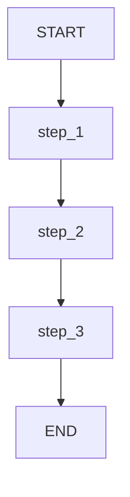
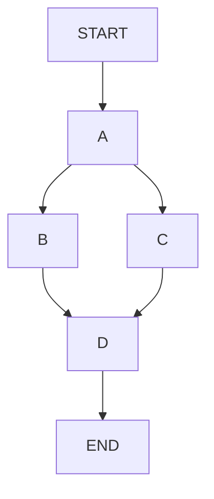
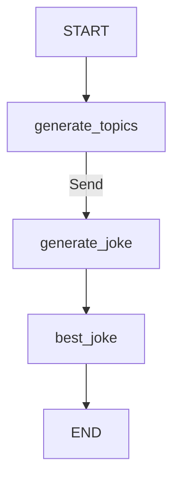
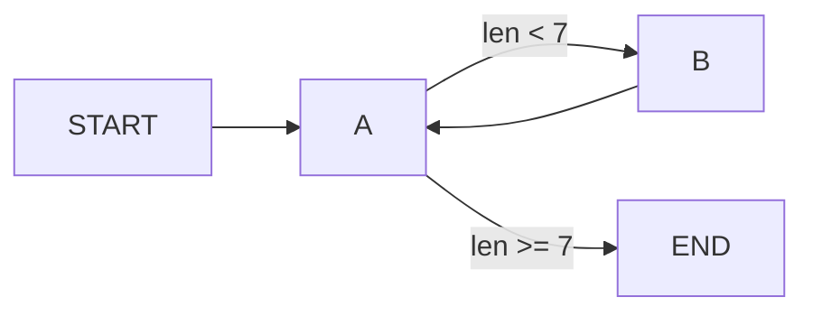

# Graph API 实践指南

> 通过实例学习 Graph API 的状态管理、分支、循环和高级控制流

> 注意：本篇内容已合并到 [Graph API 完整指南](../16-Graph%20API完整指南.md)。本文件仅作历史对照，建议以“完整指南”为准。

本指南通过实际示例演示 Graph API 的核心用法，包括状态定义与更新、顺序执行、分支、循环以及 Send/Command API。

## 状态定义与更新

### 定义状态

状态可以使用 `TypedDict`、`Pydantic` 或 `dataclass` 定义：

```python
from langchain.messages import AnyMessage
from typing_extensions import TypedDict

class State(TypedDict):
    messages: list[AnyMessage]
    extra_field: int
```

### 更新状态

节点是读取和更新状态的 Python 函数：

```python
from langchain.messages import AIMessage

def node(state: State):
    messages = state["messages"]
    new_message = AIMessage("Hello!")
    # 返回状态更新，而非直接修改状态
    return {"messages": messages + [new_message], "extra_field": 10}
```

构建并运行图：

```python
from langgraph.graph import StateGraph, START
from langchain.messages import HumanMessage

builder = StateGraph(State)
builder.add_node(node)
builder.set_entry_point("node")
graph = builder.compile()

result = graph.invoke({"messages": [HumanMessage("Hi")]})
# {'messages': [HumanMessage('Hi'), AIMessage('Hello!')], 'extra_field': 10}
```

### 使用 Reducer 处理状态更新

Reducer 控制状态更新的合并方式：

```python
from typing import Annotated
from operator import add

class State(TypedDict):
    messages: Annotated[list[AnyMessage], add]  # 追加模式
    extra_field: int  # 覆盖模式（默认）

def node(state: State):
    new_message = AIMessage("Hello!")
    return {"messages": [new_message], "extra_field": 10}  # 自动追加
```

### MessagesState

LangGraph 提供预置的 `MessagesState`，使用 `add_messages` reducer：

```python
from langgraph.graph import MessagesState
from langgraph.graph.message import add_messages

# 方式 1：直接使用
class State(MessagesState):
    extra_field: int

# 方式 2：手动定义
class State(TypedDict):
    messages: Annotated[list[AnyMessage], add_messages]
    extra_field: int
```

`add_messages` 特性：
- 新消息追加到列表
- 根据 ID 更新已有消息
- 支持 OpenAI 格式输入

```python
# 支持多种输入格式
input_message = {"role": "user", "content": "Hi"}  # OpenAI 格式
result = graph.invoke({"messages": [input_message]})
```

### 使用 Overwrite 绕过 Reducer

当需要直接覆盖而非合并时，使用 `Overwrite`：

```python
from langgraph.types import Overwrite
import operator

class State(TypedDict):
    messages: Annotated[list, operator.add]

def replace_messages(state: State):
    # 绕过 reducer，直接替换
    return {"messages": Overwrite(["replacement message"])}

# 或使用 JSON 格式
def replace_messages(state: State):
    return {"messages": {"__overwrite__": ["replacement message"]}}
```

### 定义输入/输出 Schema

可以为图定义不同的输入和输出 schema：

```python
from langgraph.graph import StateGraph, START, END

class InputState(TypedDict):
    question: str

class OutputState(TypedDict):
    answer: str

class OverallState(InputState, OutputState):
    pass

def answer_node(state: InputState):
    return {"answer": "bye", "question": state["question"]}

builder = StateGraph(
    OverallState, 
    input_schema=InputState, 
    output_schema=OutputState
)
builder.add_node(answer_node)
builder.add_edge(START, "answer_node")
builder.add_edge("answer_node", END)
graph = builder.compile()

print(graph.invoke({"question": "hi"}))
# {'answer': 'bye'}  # 只返回 OutputState 中的字段
```

### 节点间传递私有状态

私有状态仅在特定节点间共享，不暴露给图的输入/输出：

```python
class OverallState(TypedDict):
    a: str

class Node1Output(TypedDict):
    private_data: str

class Node2Input(TypedDict):
    private_data: str

def node_1(state: OverallState) -> Node1Output:
    return {"private_data": "set by node_1"}

def node_2(state: Node2Input) -> OverallState:
    return {"a": "set by node_2"}

def node_3(state: OverallState) -> OverallState:
    # node_3 无法访问 private_data
    return {"a": "set by node_3"}

builder = StateGraph(OverallState).add_sequence([node_1, node_2, node_3])
builder.add_edge(START, "node_1")
graph = builder.compile()

graph.invoke({"a": "set at start"})
# Output: {'a': 'set by node_3'}
```

### 使用 Pydantic 模型

Pydantic 提供运行时输入验证：

```python
from pydantic import BaseModel

class OverallState(BaseModel):
    a: str

def node(state: OverallState):
    return {"a": "goodbye"}

builder = StateGraph(OverallState)
builder.add_node(node)
builder.add_edge(START, "node")
builder.add_edge("node", END)
graph = builder.compile()

# 有效输入
graph.invoke({"a": "hello"})

# 无效输入会抛出验证错误
try:
    graph.invoke({"a": 123})  # 应该是字符串
except Exception as e:
    print("验证错误:", e)
```

## 运行时配置

使用 `context_schema` 传递运行时配置：

```python
from langgraph.runtime import Runtime

class ContextSchema(TypedDict):
    my_runtime_value: str

class State(TypedDict):
    my_state_value: str

def node(state: State, runtime: Runtime[ContextSchema]):
    if runtime.context["my_runtime_value"] == "a":
        return {"my_state_value": 1}
    elif runtime.context["my_runtime_value"] == "b":
        return {"my_state_value": 2}

builder = StateGraph(State, context_schema=ContextSchema)
builder.add_node(node)
builder.add_edge(START, "node")
builder.add_edge("node", END)
graph = builder.compile()

# 运行时传入配置
print(graph.invoke({}, context={"my_runtime_value": "a"}))  # {'my_state_value': 1}
print(graph.invoke({}, context={"my_runtime_value": "b"}))  # {'my_state_value': 2}
```

## 重试策略

为节点添加重试策略：

```python
from langgraph.types import RetryPolicy

builder.add_node(
    "node_name",
    node_function,
    retry_policy=RetryPolicy(max_attempts=5),
)

# 自定义重试条件
import sqlite3

builder.add_node(
    "query_database",
    query_database,
    retry_policy=RetryPolicy(retry_on=sqlite3.OperationalError),
)
```

## 节点缓存

缓存节点结果，避免重复计算：

```python
from langgraph.types import CachePolicy
from langgraph.cache.memory import InMemoryCache

builder.add_node(
    "expensive_node",
    expensive_function,
    cache_policy=CachePolicy(ttl=120),  # 120秒过期
)

graph = builder.compile(cache=InMemoryCache())
```

## 创建顺序执行

### 方式 1：手动添加边

```python
builder = StateGraph(State)
builder.add_node(step_1)
builder.add_node(step_2)
builder.add_node(step_3)

builder.add_edge(START, "step_1")
builder.add_edge("step_1", "step_2")
builder.add_edge("step_2", "step_3")
```

### 方式 2：使用 add_sequence

```python
builder = StateGraph(State).add_sequence([step_1, step_2, step_3])
builder.add_edge(START, "step_1")
```



## 创建分支

### 并行执行

```python
import operator
from typing import Annotated

class State(TypedDict):
    aggregate: Annotated[list, operator.add]

def a(state: State):
    return {"aggregate": ["A"]}

def b(state: State):
    return {"aggregate": ["B"]}

def c(state: State):
    return {"aggregate": ["C"]}

def d(state: State):
    return {"aggregate": ["D"]}

builder = StateGraph(State)
builder.add_node(a)
builder.add_node(b)
builder.add_node(c)
builder.add_node(d)

builder.add_edge(START, "a")
builder.add_edge("a", "b")  # a -> b
builder.add_edge("a", "c")  # a -> c (并行)
builder.add_edge("b", "d")
builder.add_edge("c", "d")  # b, c -> d (汇合)
builder.add_edge("d", END)

graph = builder.compile()
graph.invoke({"aggregate": []})
# 输出顺序: A -> B, C (并行) -> D
# 结果: ['A', 'B', 'C', 'D']
```



### 延迟节点执行

当分支长度不同时，使用 `defer=True` 等待所有分支完成：

```python
builder.add_node(d, defer=True)  # d 等待所有待处理任务完成
```

```python
# 示例：b 分支有两步，c 分支只有一步
builder.add_edge("a", "b")
builder.add_edge("a", "c")
builder.add_edge("b", "b_2")
builder.add_edge("b_2", "d")
builder.add_edge("c", "d")

# 设置 defer=True 后，d 会等待 b_2 完成
builder.add_node(d, defer=True)
```

### 条件分支

根据状态动态路由：

```python
from typing import Literal

class State(TypedDict):
    aggregate: Annotated[list, operator.add]
    which: str

def a(state: State):
    return {"aggregate": ["A"], "which": "c"}

def conditional_edge(state: State) -> Literal["b", "c"]:
    return state["which"]

builder.add_conditional_edges("a", conditional_edge)
```

多目标路由：

```python
from typing import Sequence

def route_bc_or_cd(state: State) -> Sequence[str]:
    if state["which"] == "cd":
        return ["c", "d"]  # 同时路由到 c 和 d
    return ["b", "c"]
```

## Map-Reduce 与 Send API

动态创建并行任务：

```python
from langgraph.types import Send

class OverallState(TypedDict):
    topic: str
    subjects: list[str]
    jokes: Annotated[list[str], operator.add]
    best_selected_joke: str

def generate_topics(state: OverallState):
    return {"subjects": ["lions", "elephants", "penguins"]}

def generate_joke(state: OverallState):
    joke_map = {
        "lions": "Why don't lions like fast food? Because they can't catch it!",
        "elephants": "Why don't elephants use computers? They're afraid of the mouse!",
        "penguins": "Why don't penguins like talking to strangers? They find it hard to break the ice."
    }
    return {"jokes": [joke_map[state["subject"]]]}

def continue_to_jokes(state: OverallState):
    # 为每个 subject 创建一个 Send
    return [Send("generate_joke", {"subject": s}) for s in state["subjects"]]

def best_joke(state: OverallState):
    return {"best_selected_joke": "penguins"}

builder = StateGraph(OverallState)
builder.add_node("generate_topics", generate_topics)
builder.add_node("generate_joke", generate_joke)
builder.add_node("best_joke", best_joke)

builder.add_edge(START, "generate_topics")
builder.add_conditional_edges("generate_topics", continue_to_jokes, ["generate_joke"])
builder.add_edge("generate_joke", "best_joke")
builder.add_edge("best_joke", END)

graph = builder.compile()

for step in graph.stream({"topic": "animals"}):
    print(step)
```



## 创建循环

### 基本循环

使用条件边实现终止条件：

```python
from typing import Literal

class State(TypedDict):
    aggregate: Annotated[list, operator.add]

def a(state: State):
    return {"aggregate": ["A"]}

def b(state: State):
    return {"aggregate": ["B"]}

def route(state: State) -> Literal["b", END]:
    if len(state["aggregate"]) < 7:
        return "b"
    else:
        return END

builder = StateGraph(State)
builder.add_node(a)
builder.add_node(b)

builder.add_edge(START, "a")
builder.add_conditional_edges("a", route)
builder.add_edge("b", "a")

graph = builder.compile()
graph.invoke({"aggregate": []})
# A -> B -> A -> B -> A -> B -> A (终止)
```



### 递归限制

设置最大 super-step 数量：

```python
from langgraph.errors import GraphRecursionError

try:
    graph.invoke({"aggregate": []}, {"recursion_limit": 4})
except GraphRecursionError:
    print("Recursion Error")
```

### 使用 RemainingSteps 优雅处理

```python
from langgraph.managed.is_last_step import RemainingSteps

class State(TypedDict):
    aggregate: Annotated[list, operator.add]
    remaining_steps: RemainingSteps

def route(state: State) -> Literal["b", END]:
    if state["remaining_steps"] <= 2:
        return END  # 接近限制时优雅退出
    else:
        return "b"

# 不会抛出异常，而是正常返回结果
result = graph.invoke({"aggregate": []}, {"recursion_limit": 4})
```

## Command API

结合状态更新和控制流：

```python
import random
from langgraph.types import Command

class State(TypedDict):
    foo: str

def node_a(state: State) -> Command[Literal["node_b", "node_c"]]:
    value = random.choice(["b", "c"])
    goto = "node_b" if value == "b" else "node_c"
    
    return Command(
        update={"foo": value},  # 状态更新
        goto=goto,              # 控制流
    )

def node_b(state: State):
    return {"foo": state["foo"] + "b"}

def node_c(state: State):
    return {"foo": state["foo"] + "c"}

builder = StateGraph(State)
builder.add_edge(START, "node_a")
builder.add_node(node_a)
builder.add_node(node_b)
builder.add_node(node_c)
# 注意：不需要定义 node_a 到 node_b/node_c 的边！

graph = builder.compile()
graph.invoke({"foo": ""})
```

### 导航到父图节点

在子图中导航到父图：

```python
import operator
from typing import Annotated

class State(TypedDict):
    foo: Annotated[str, operator.add]  # 必须定义 reducer

def node_a(state: State):
    value = random.choice(["a", "b"])
    goto = "node_b" if value == "a" else "node_c"
    
    return Command(
        update={"foo": value},
        goto=goto,
        graph=Command.PARENT,  # 导航到父图
    )

# 子图
subgraph = StateGraph(State).add_node(node_a).add_edge(START, "node_a").compile()

# 父图
builder = StateGraph(State)
builder.add_edge(START, "subgraph")
builder.add_node("subgraph", subgraph)
builder.add_node(node_b)
builder.add_node(node_c)

graph = builder.compile()
```

### 在工具中使用 Command

从工具内部更新图状态：

```python
from langchain_core.tools import tool
from langchain_core.messages import ToolMessage
from langgraph.prebuilt import InjectedToolCallId

@tool
def lookup_user_info(
    tool_call_id: Annotated[str, InjectedToolCallId], 
    config: RunnableConfig
):
    """查找用户信息"""
    user_info = get_user_info(config.get("configurable", {}).get("user_id"))
    
    return Command(
        update={
            "user_info": user_info,
            # 必须包含 ToolMessage
            "messages": [ToolMessage("Successfully looked up user information", tool_call_id=tool_call_id)]
        }
    )
```

## 异步执行

将同步图转换为异步：

```python
from langgraph.graph import MessagesState, StateGraph

async def node(state: MessagesState):
    new_message = await llm.ainvoke(state["messages"])
    return {"messages": [new_message]}

builder = StateGraph(MessagesState).add_node(node).set_entry_point("node")
graph = builder.compile()

input_message = {"role": "user", "content": "Hello"}
result = await graph.ainvoke({"messages": [input_message]})
```

## 可视化

### Mermaid 语法

```python
print(graph.get_graph().draw_mermaid())
```

### PNG 图片

```python
from IPython.display import Image, display

# 方式 1：使用 Mermaid.ink API（默认）
display(Image(graph.get_graph().draw_mermaid_png()))

# 方式 2：使用 Pyppeteer
from langchain_core.runnables.graph import CurveStyle, MermaidDrawMethod, NodeStyles

display(Image(graph.get_graph().draw_mermaid_png(
    curve_style=CurveStyle.LINEAR,
    node_colors=NodeStyles(first="#ffdfba", last="#baffc9", default="#fad7de"),
    draw_method=MermaidDrawMethod.PYPPETEER,
)))

# 方式 3：使用 Graphviz
display(Image(graph.get_graph().draw_png()))
```

## 要点总结

| 主题 | 关键点 |
|------|--------|
| **状态定义** | TypedDict/Pydantic/dataclass，支持多 schema |
| **Reducer** | 控制状态更新方式，`add_messages` 处理消息列表 |
| **Overwrite** | 绕过 reducer 直接覆盖状态 |
| **运行时配置** | `context_schema` + `Runtime` 传递配置 |
| **顺序执行** | `add_edge` 或 `add_sequence` |
| **并行执行** | 多个出边自动并行，`defer=True` 等待汇合 |
| **条件分支** | `add_conditional_edges` 动态路由 |
| **Map-Reduce** | `Send` API 动态创建并行任务 |
| **循环** | 条件边 + 终止条件，`RemainingSteps` 优雅处理 |
| **Command** | 结合状态更新和控制流，支持父图导航 |
