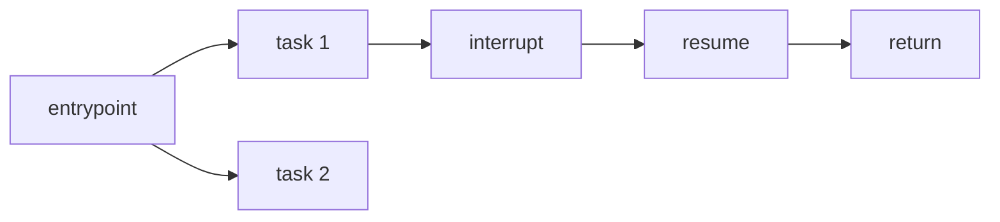
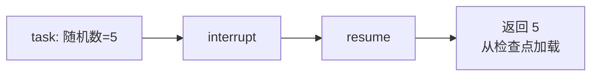
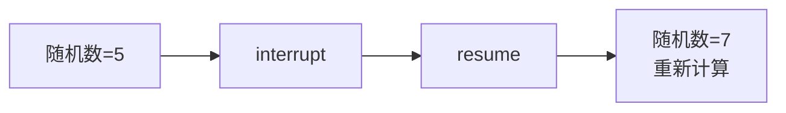

# Functional API 详解

> 以最小代码改动为现有应用添加持久化、记忆、人机协作和流式输出

> 注意：本篇内容已合并到 [Functional API 完整指南](../18-Functional%20API完整指南.md)。本文件仅作历史对照，建议以“完整指南”为准。

Functional API 允许你在几乎不改变现有代码结构的情况下，为应用添加 LangGraph 的核心特性。它使用标准 Python 控制流（if/else、for 循环、函数调用），无需将代码重构为显式的 DAG 或管道。

## 核心构建块

| 构建块 | 说明 |
|--------|------|
| **@entrypoint** | 工作流入口点，封装逻辑并管理执行流程，处理长时间任务和中断 |
| **@task** | 离散工作单元（如 API 调用），可异步执行，结果自动保存到检查点 |



## Functional API vs Graph API

| 维度 | Functional API | Graph API |
|------|----------------|-----------|
| **控制流** | 标准 Python 语法 | 图结构（节点+边） |
| **代码量** | 更少 | 更多 |
| **状态管理** | 函数作用域，无需显式管理 | 需要定义 State 和 Reducer |
| **检查点** | task 执行时保存到现有检查点 | 每个 super-step 后创建新检查点 |
| **可视化** | 不支持（运行时动态生成） | 支持图形化展示 |

两种 API 共享相同的底层运行时，可以在同一应用中混合使用。

## 快速示例

一个写文章并请求人工审核的工作流：

```python
import time
import uuid
from langgraph.checkpoint.memory import InMemorySaver
from langgraph.func import entrypoint, task
from langgraph.types import interrupt, Command

@task
def write_essay(topic: str) -> str:
    """写一篇关于指定主题的文章"""
    time.sleep(1)  # 模拟长时间任务
    return f"An essay about topic: {topic}"

@entrypoint(checkpointer=InMemorySaver())
def workflow(topic: str) -> dict:
    """写文章并请求审核的工作流"""
    essay = write_essay(topic).result()
    
    is_approved = interrupt({
        "essay": essay,
        "action": "Please approve/reject the essay",
    })
    
    return {
        "essay": essay,
        "is_approved": is_approved,
    }

# 执行工作流
thread_id = str(uuid.uuid4())
config = {"configurable": {"thread_id": thread_id}}

for item in workflow.stream("cat", config):
    print(item)
# {'write_essay': 'An essay about topic: cat'}
# {'__interrupt__': (Interrupt(value={'essay': '...', 'action': '...'}),)}

# 恢复执行（提供人工审核结果）
human_review = True
for item in workflow.stream(Command(resume=human_review), config):
    print(item)
# {'workflow': {'essay': 'An essay about topic: cat', 'is_approved': True}}
```

**执行流程**：
1. 首次执行：写文章 → 中断等待审核
2. 恢复执行：从头开始，但 `write_essay` 结果从检查点加载（不重新计算）→ 返回结果

## Entrypoint

### 定义

使用 `@entrypoint` 装饰器定义工作流入口：

```python
from langgraph.func import entrypoint

# 同步版本
@entrypoint(checkpointer=checkpointer)
def my_workflow(some_input: dict) -> int:
    # 工作流逻辑
    return result

# 异步版本
@entrypoint(checkpointer=checkpointer)
async def my_workflow(some_input: dict) -> int:
    # 工作流逻辑
    return result
```

**要求**：
- 函数必须接受**单个位置参数**作为输入
- 如需传递多个数据，使用字典作为输入类型
- 输入和输出必须是 **JSON 可序列化**的

### 可注入参数

在 entrypoint 中可以请求自动注入的参数：

| 参数 | 说明 |
|------|------|
| **previous** | 上一次调用的检查点状态（短期记忆） |
| **store** | BaseStore 实例（长期记忆） |
| **writer** | StreamWriter（用于 Async Python < 3.11 的流式输出） |
| **config** | RunnableConfig（运行时配置） |

```python
from langchain_core.runnables import RunnableConfig
from langgraph.func import entrypoint
from langgraph.store.base import BaseStore
from langgraph.store.memory import InMemoryStore
from langgraph.checkpoint.memory import InMemorySaver
from langgraph.types import StreamWriter

@entrypoint(
    checkpointer=InMemorySaver(),
    store=InMemoryStore()
)
def my_workflow(
    some_input: dict,
    *,
    previous: Any = None,      # 短期记忆
    store: BaseStore,          # 长期记忆
    writer: StreamWriter,      # 流式输出
    config: RunnableConfig     # 运行时配置
) -> ...:
    ...
```

### 执行方式

`@entrypoint` 返回一个 `Pregel` 对象，支持多种执行方式：

```python
config = {"configurable": {"thread_id": "some_thread_id"}}

# 同步调用
result = my_workflow.invoke(some_input, config)

# 异步调用
result = await my_workflow.ainvoke(some_input, config)

# 同步流式
for chunk in my_workflow.stream(some_input, config):
    print(chunk)

# 异步流式
async for chunk in my_workflow.astream(some_input, config):
    print(chunk)
```

### 恢复执行

使用 `Command(resume=...)` 恢复中断的工作流：

```python
from langgraph.types import Command

config = {"configurable": {"thread_id": "some_thread_id"}}

# 恢复执行
my_workflow.invoke(Command(resume=some_resume_value), config)

# 流式恢复
for chunk in my_workflow.stream(Command(resume=some_resume_value), config):
    print(chunk)
```

**错误后恢复**：传入 `None` 并使用相同的 thread_id：

```python
# 假设底层错误已解决
my_workflow.invoke(None, config)
```

### 短期记忆

使用 `previous` 参数访问上一次调用的状态：

```python
@entrypoint(checkpointer=checkpointer)
def my_workflow(number: int, *, previous: Any = None) -> int:
    previous = previous or 0
    return number + previous

config = {"configurable": {"thread_id": "some_thread_id"}}
my_workflow.invoke(1, config)  # 1 (previous 为 None)
my_workflow.invoke(2, config)  # 3 (previous 为 1)
```

### entrypoint.final

分离返回值和保存到检查点的值：

```python
@entrypoint(checkpointer=checkpointer)
def my_workflow(number: int, *, previous: Any = None) -> entrypoint.final[int, int]:
    previous = previous or 0
    # 返回 previous 给调用者，保存 2 * number 到检查点
    return entrypoint.final(value=previous, save=2 * number)

config = {"configurable": {"thread_id": "1"}}
my_workflow.invoke(3, config)  # 0 (previous 为 None)
my_workflow.invoke(1, config)  # 6 (previous 为 3 * 2 = 6)
```

## Task

### 定义

使用 `@task` 装饰器定义任务：

```python
from langgraph.func import task

@task()
def slow_computation(input_value):
    # 模拟长时间操作
    ...
    return result
```

**特性**：
- **异步执行**：多个任务可并发运行
- **检查点**：结果自动保存，支持恢复

**要求**：输出必须是 **JSON 可序列化**的

### 执行

Task 只能在 entrypoint、其他 task 或 StateGraph 节点中调用，不能直接从主程序调用。

调用 task 会立即返回一个 future 对象：

```python
# 同步等待结果
@entrypoint(checkpointer=checkpointer)
def my_workflow(some_input: int) -> int:
    future = slow_computation(some_input)
    return future.result()  # 同步等待

# 异步等待结果
@entrypoint(checkpointer=checkpointer)
async def my_workflow(some_input: int) -> int:
    return await slow_computation(some_input)  # 异步等待
```

### 何时使用 Task

| 场景 | 说明 |
|------|------|
| **检查点** | 保存长时间操作的结果，恢复时无需重新计算 |
| **人机协作** | 封装随机性操作（如 API 调用），确保恢复时行为一致 |
| **并行执行** | I/O 密集型任务并发执行 |
| **可观测性** | 通过 LangSmith 追踪工作流进度 |
| **重试** | 封装需要重试的操作 |

## 序列化

| 组件 | 要求 |
|------|------|
| entrypoint 输入/输出 | 必须 JSON 可序列化 |
| task 输出 | 必须 JSON 可序列化 |

使用 Python 原生类型：字典、列表、字符串、数字、布尔值。

## 确定性

为了正确使用人机协作等特性，**随机性操作必须封装在 task 中**。

**原理**：
- 恢复执行时，工作流从头开始
- 但已执行的 task 结果从检查点加载，不重新计算
- 这要求恢复时遵循**相同的执行顺序**



如果随机操作不在 task 中：



## 幂等性

Task 应设计为**幂等**的，即多次执行产生相同结果。

**原因**：如果 task 开始但未成功完成，恢复时会重新执行。

**建议**：
- 使用幂等性 key
- 执行前检查是否已有结果

## 常见陷阱

### 副作用处理

将副作用封装在 task 中，避免恢复时重复执行：

```python
# ❌ 错误：副作用直接在 entrypoint 中
@entrypoint(checkpointer=checkpointer)
def my_workflow(inputs: dict) -> int:
    with open("output.txt", "w") as f:
        f.write("Side effect executed")  # 恢复时会再次执行！
    value = interrupt("question")
    return value

# ✅ 正确：副作用封装在 task 中
@task
def write_to_file():
    with open("output.txt", "w") as f:
        f.write("Side effect executed")

@entrypoint(checkpointer=checkpointer)
def my_workflow(inputs: dict) -> int:
    write_to_file().result()  # 恢复时从检查点加载
    value = interrupt("question")
    return value
```

### 非确定性控制流

将可能产生不同结果的操作封装在 task 中：

```python
# ❌ 错误：时间获取不在 task 中
@entrypoint(checkpointer=checkpointer)
def my_workflow(inputs: dict) -> int:
    t0 = inputs["t0"]
    t1 = time.time()  # 恢复时会得到不同的值！
    delta_t = t1 - t0
    
    if delta_t > 1:
        result = slow_task(1).result()
        value = interrupt("question")
    else:
        result = slow_task(2).result()
        value = interrupt("question")
    
    return {"result": result, "value": value}

# ✅ 正确：时间获取封装在 task 中
@task
def get_time() -> float:
    return time.time()

@entrypoint(checkpointer=checkpointer)
def my_workflow(inputs: dict) -> int:
    t0 = inputs["t0"]
    t1 = get_time().result()  # 恢复时从检查点加载
    delta_t = t1 - t0
    
    if delta_t > 1:
        result = slow_task(1).result()
        value = interrupt("question")
    else:
        result = slow_task(2).result()
        value = interrupt("question")
    
    return {"result": result, "value": value}
```

## 完整示例

```python
import time
import uuid
from langgraph.checkpoint.memory import InMemorySaver
from langgraph.func import entrypoint, task
from langgraph.types import interrupt, Command

@task
def fetch_data(url: str) -> dict:
    """模拟 API 调用"""
    time.sleep(1)
    return {"data": f"Data from {url}"}

@task
def process_data(data: dict) -> str:
    """处理数据"""
    return f"Processed: {data['data']}"

@entrypoint(checkpointer=InMemorySaver())
def data_pipeline(config: dict) -> dict:
    """数据处理管道"""
    # 并行获取数据
    future1 = fetch_data(config["url1"])
    future2 = fetch_data(config["url2"])
    
    data1 = future1.result()
    data2 = future2.result()
    
    # 处理数据
    result1 = process_data(data1).result()
    result2 = process_data(data2).result()
    
    # 人工审核
    approval = interrupt({
        "results": [result1, result2],
        "action": "Please review the results"
    })
    
    return {
        "results": [result1, result2],
        "approved": approval
    }

# 执行
thread_id = str(uuid.uuid4())
config = {"configurable": {"thread_id": thread_id}}

# 首次执行（会在 interrupt 处暂停）
for item in data_pipeline.stream({"url1": "api/1", "url2": "api/2"}, config):
    print(item)

# 恢复执行
for item in data_pipeline.stream(Command(resume=True), config):
    print(item)
```

## 要点总结

- **@entrypoint**：工作流入口，管理执行流程和中断
- **@task**：离散工作单元，结果自动保存到检查点
- **序列化**：输入输出必须 JSON 可序列化
- **确定性**：随机操作必须封装在 task 中
- **幂等性**：task 应设计为可重复执行
- **副作用**：封装在 task 中避免重复执行
- **短期记忆**：通过 `previous` 参数访问上次状态
- **entrypoint.final**：分离返回值和检查点保存值
