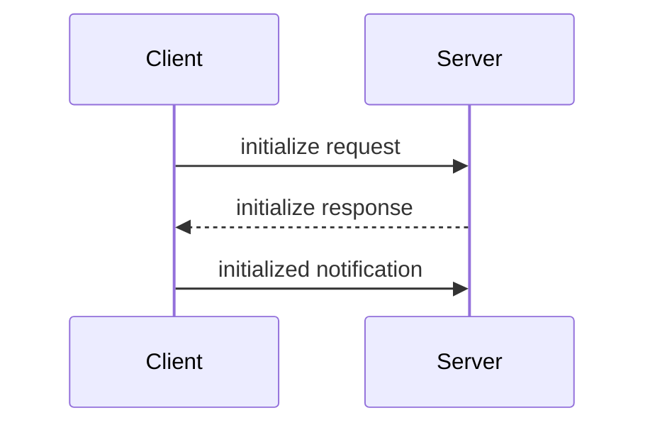

# MCP 架构概述

MCP（Model Context Protocol，模型上下文协议）是一个开放协议，标准化了应用程序向 LLM 提供上下文的方式。本文介绍 MCP 的核心概念和架构设计。

> 本文内容基于 [MCP 官方文档](https://modelcontextprotocol.io) 整理，内容已重新组织以符合许可要求。

## MCP 生态

MCP 包含以下项目：

| 项目 | 说明 |
|------|------|
| MCP Specification | 协议规范，定义客户端和服务器的实现要求 |
| MCP SDKs | 各语言的 SDK 实现 |
| MCP Inspector | 开发调试工具 |
| Reference Servers | 官方参考实现 |

> MCP 只关注上下文交换协议本身，不规定 AI 应用如何使用 LLM 或管理上下文。

## 核心参与者

MCP 采用客户端-服务器架构，包含三个核心角色：


| 角色 | 说明 | 示例 |
|------|------|------|
| MCP Host | AI 应用，协调管理多个 Client | Claude Desktop、VS Code |
| MCP Client | 维护与 Server 的连接，获取上下文 | Host 内部组件 |
| MCP Server | 提供上下文数据的程序 | 文件系统服务器、数据库服务器 |

### 本地 vs 远程服务器

- **本地服务器**：使用 STDIO 传输，运行在同一台机器上
- **远程服务器**：使用 HTTP 传输，可服务多个客户端

## 协议分层

MCP 由两层组成：

```
┌─────────────────────────────────┐
│         数据层 (Data Layer)      │  ← JSON-RPC 协议
├─────────────────────────────────┤
│       传输层 (Transport Layer)   │  ← 通信机制
└─────────────────────────────────┘
```

### 数据层

基于 JSON-RPC 2.0 的消息协议，定义消息结构和语义。

| 功能 | 说明 |
|------|------|
| 生命周期管理 | 连接初始化、能力协商、连接终止 |
| 服务器功能 | Tools、Resources、Prompts |
| 客户端功能 | Sampling、Elicitation、Logging |
| 通用功能 | 通知、进度追踪 |

### 传输层

管理通信通道和认证，支持两种传输机制：

| 传输方式 | 说明 | 适用场景 |
|----------|------|----------|
| STDIO | 标准输入/输出流 | 本地进程，无网络开销 |
| Streamable HTTP | HTTP POST + SSE | 远程服务器，支持 OAuth 认证 |

## 核心原语（Primitives）

原语定义了客户端和服务器能提供什么。这是 MCP 最重要的概念。

### 服务器原语

服务器可以暴露三种核心原语：

| 原语 | 说明 | 发现方法 | 执行方法 |
|------|------|----------|----------|
| Tools | 可执行函数 | `tools/list` | `tools/call` |
| Resources | 数据源 | `resources/list` | `resources/read` |
| Prompts | 提示词模板 | `prompts/list` | `prompts/get` |

#### Tools（工具）

AI 应用可调用的函数，如文件操作、API 调用、数据库查询。

```json
{
  "name": "calculator_arithmetic",
  "title": "Calculator",
  "description": "执行数学计算",
  "inputSchema": {
    "type": "object",
    "properties": {
      "expression": {
        "type": "string",
        "description": "数学表达式，如 '2 + 3 * 4'"
      }
    },
    "required": ["expression"]
  }
}
```

#### Resources（资源）

提供上下文信息的数据源，如文件内容、数据库记录、API 响应。

#### Prompts（提示词）

可复用的交互模板，如系统提示词、few-shot 示例。

### 客户端原语

客户端可以暴露的原语，让服务器构建更丰富的交互：

| 原语 | 说明 |
|------|------|
| Sampling | 请求 LLM 补全，保持模型无关性 |
| Elicitation | 请求用户输入或确认 |
| Logging | 发送日志消息用于调试 |

### 实验性功能

| 功能 | 说明 |
|------|------|
| Tasks | 持久执行包装器，支持延迟结果获取和状态追踪 |

## 生命周期管理

MCP 是有状态协议，需要生命周期管理来协商双方支持的能力。

### 初始化流程



### 初始化请求示例

```json
{
  "jsonrpc": "2.0",
  "id": 1,
  "method": "initialize",
  "params": {
    "protocolVersion": "2025-06-18",
    "capabilities": {
      "elicitation": {}
    },
    "clientInfo": {
      "name": "example-client",
      "version": "1.0.0"
    }
  }
}
```

### 初始化响应示例

```json
{
  "jsonrpc": "2.0",
  "id": 1,
  "result": {
    "protocolVersion": "2025-06-18",
    "capabilities": {
      "tools": {"listChanged": true},
      "resources": {}
    },
    "serverInfo": {
      "name": "example-server",
      "version": "1.0.0"
    }
  }
}
```

### 初始化要点

| 要点 | 说明 |
|------|------|
| 协议版本协商 | 确保双方使用兼容版本 |
| 能力发现 | 声明支持的原语和功能 |
| 身份交换 | 提供调试和兼容性信息 |

## 工具发现与执行

### 发现工具

```json
// 请求
{"jsonrpc": "2.0", "id": 2, "method": "tools/list"}

// 响应
{
  "jsonrpc": "2.0",
  "id": 2,
  "result": {
    "tools": [
      {
        "name": "weather_current",
        "title": "Weather Information",
        "description": "获取指定位置的当前天气",
        "inputSchema": {
          "type": "object",
          "properties": {
            "location": {"type": "string", "description": "城市名或坐标"},
            "units": {"type": "string", "enum": ["metric", "imperial"], "default": "metric"}
          },
          "required": ["location"]
        }
      }
    ]
  }
}
```

### 执行工具

```json
// 请求
{
  "jsonrpc": "2.0",
  "id": 3,
  "method": "tools/call",
  "params": {
    "name": "weather_current",
    "arguments": {"location": "San Francisco", "units": "imperial"}
  }
}

// 响应
{
  "jsonrpc": "2.0",
  "id": 3,
  "result": {
    "content": [
      {"type": "text", "text": "San Francisco 当前天气：68°F，多云"}
    ]
  }
}
```

### 工具响应特点

- `content` 数组支持多种格式（文本、图片、资源等）
- 每个内容对象有 `type` 字段标识类型
- 结构化输出便于 AI 应用集成

## 通知机制

MCP 支持实时通知，服务器可主动通知客户端变化。

### 工具列表变更通知

```json
{
  "jsonrpc": "2.0",
  "method": "notifications/tools/list_changed"
}
```

### 通知特点

| 特点 | 说明 |
|------|------|
| 无需响应 | 没有 `id` 字段，遵循 JSON-RPC 2.0 通知语义 |
| 基于能力 | 只有声明 `listChanged: true` 的服务器才会发送 |
| 事件驱动 | 服务器根据内部状态变化决定何时发送 |

### 通知的价值

- **动态环境**：工具可能随服务器状态、外部依赖或用户权限变化
- **高效**：客户端无需轮询，有变化时才收到通知
- **一致性**：确保客户端始终了解服务器的最新能力
- **实时协作**：AI 应用能适应变化的上下文

## AI 应用集成示例

### 初始化连接

```python
# 伪代码
async with stdio_client(server_config) as (read, write):
    async with ClientSession(read, write) as session:
        init_response = await session.initialize()
        if init_response.capabilities.tools:
            app.register_mcp_server(session, supports_tools=True)
        app.set_server_ready(session)
```

### 工具发现

```python
# 伪代码
available_tools = []
for session in app.mcp_server_sessions():
    tools_response = await session.list_tools()
    available_tools.extend(tools_response.tools)
conversation.register_available_tools(available_tools)
```

### 工具执行

```python
# 伪代码
async def handle_tool_call(conversation, tool_name, arguments):
    session = app.find_mcp_session_for_tool(tool_name)
    result = await session.call_tool(tool_name, arguments)
    conversation.add_tool_result(result.content)
```

### 处理通知

```python
# 伪代码
async def handle_tools_changed_notification(session):
    tools_response = await session.list_tools()
    app.update_available_tools(session, tools_response.tools)
    if app.conversation.is_active():
        app.conversation.notify_llm_of_new_capabilities()
```

## 核心概念速查表

| 概念 | 说明 |
|------|------|
| MCP Host | AI 应用，管理多个 MCP Client |
| MCP Client | 维护与 Server 的连接 |
| MCP Server | 提供上下文数据的程序 |
| 数据层 | JSON-RPC 2.0 协议层 |
| 传输层 | STDIO 或 HTTP 通信层 |
| Tools | 可执行函数 |
| Resources | 数据源 |
| Prompts | 提示词模板 |
| Sampling | 请求 LLM 补全 |
| Elicitation | 请求用户输入 |
| 能力协商 | 初始化时声明支持的功能 |
| 通知 | 服务器主动推送变更 |

## 参考链接

- [MCP 官方文档](https://modelcontextprotocol.io)
- [MCP 规范](https://modelcontextprotocol.io/specification/latest)
- [MCP SDKs](https://modelcontextprotocol.io/docs/sdk)
- [MCP Inspector](https://github.com/modelcontextprotocol/inspector)
- [参考服务器实现](https://github.com/modelcontextprotocol/servers)
