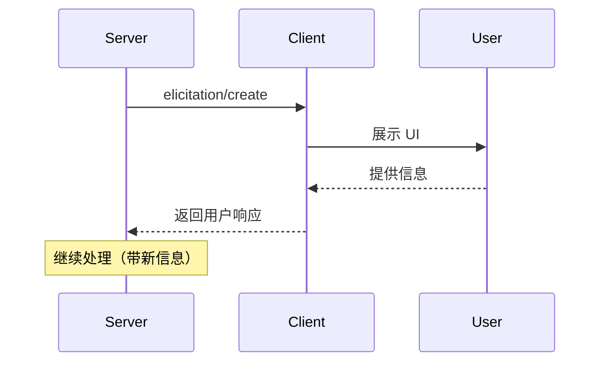
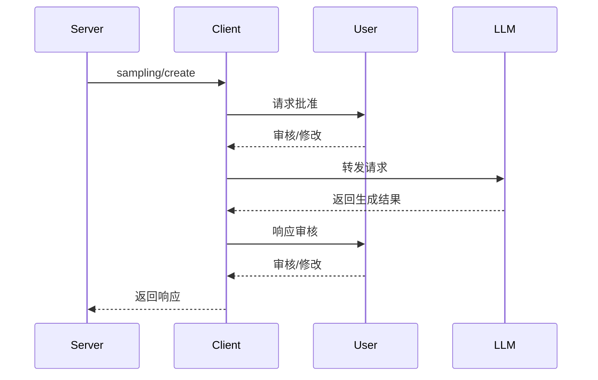

# MCP 客户端详解

MCP 客户端由宿主应用实例化，用于与特定 MCP 服务器通信。宿主应用（如 Claude.ai 或 IDE）管理整体用户体验并协调多个客户端，每个客户端处理与一个服务器的直接通信。

理解这个区别很重要：**宿主（Host）** 是用户交互的应用，**客户端（Client）** 是实现服务器连接的协议级组件。

> 本文内容基于 [MCP 官方文档](https://modelcontextprotocol.io) 整理，内容已重新组织以符合许可要求。

## 客户端核心功能

除了使用服务器提供的上下文，客户端还可以向服务器提供功能，让服务器作者构建更丰富的交互。

| 功能 | 说明 | 示例 |
|------|------|------|
| Elicitation | 服务器在交互过程中请求用户提供特定信息 | 预订旅行时询问座位偏好、房型或联系方式 |
| Roots | 客户端指定服务器应关注的目录范围 | 给旅行服务器访问特定目录读取用户日历 |
| Sampling | 服务器通过客户端请求 LLM 补全，实现代理工作流 | 旅行服务器发送航班列表给 LLM，请求选择最佳航班 |

## Elicitation（信息征询）

Elicitation 让服务器能在交互过程中请求用户提供特定信息，创建更动态和响应式的工作流。

### 工作原理

Elicitation 提供了一种结构化的方式让服务器按需收集必要信息。服务器不需要预先要求所有信息或在数据缺失时失败，而是可以暂停操作来请求特定输入。

### 交互流程



### 请求示例

```typescript
{
  method: "elicitation/requestInput",
  params: {
    message: "请确认您的 Barcelona 假期预订详情：",
    schema: {
      type: "object",
      properties: {
        confirmBooking: {
          type: "boolean",
          description: "确认预订（航班 + 酒店 = $3,000）"
        },
        seatPreference: {
          type: "string",
          enum: ["window", "aisle", "no preference"],
          description: "航班座位偏好"
        },
        roomType: {
          type: "string",
          enum: ["sea view", "city view", "garden view"],
          description: "酒店房型偏好"
        },
        travelInsurance: {
          type: "boolean",
          default: false,
          description: "添加旅行保险（$150）"
        }
      },
      required: ["confirmBooking"]
    }
  }
}
```

### 实际应用：假期预订确认

旅行预订服务器在最终预订确认过程中展示 Elicitation 的能力：

1. 用户选择了理想的 Barcelona 度假套餐
2. 服务器需要收集最终批准和缺失的详情
3. 服务器发起结构化请求，包含行程摘要和额外偏好字段
4. 随着预订进行，服务器可能继续征询旅客详情、特殊请求或紧急联系人

### 用户交互模型

| 方面 | 说明 |
|------|------|
| 请求展示 | 客户端显示哪个服务器在请求、为什么需要信息、如何使用 |
| 响应选项 | 用户可以提供信息、拒绝提供（可附说明）、或取消整个操作 |
| 验证 | 客户端在返回服务器前根据 schema 验证响应 |
| 隐私考虑 | 永不请求密码或 API 密钥，客户端警告可疑请求 |

## Roots（根目录）

Roots 定义服务器操作的文件系统边界，让客户端指定服务器应关注的目录。

### 工作原理

Roots 是客户端向服务器传达文件系统访问边界的机制。它们由文件 URI 组成，指示服务器可以操作的目录。

**重要**：Roots 传达预期边界，但不强制安全限制。实际安全必须在操作系统级别通过文件权限和/或沙箱强制执行。

### 根目录结构

```json
{
  "uri": "file:///Users/agent/travel-planning",
  "name": "Travel Planning Workspace"
}
```

- Roots 专门用于文件系统路径，始终使用 `file://` URI 方案
- 帮助服务器理解项目边界、工作区组织和可访问目录
- 根目录列表可动态更新，服务器通过 `roots/list_changed` 接收通知

### 实际应用：旅行规划工作区

旅行代理处理多个客户行程时，通过 Roots 组织文件系统访问：

```
客户端提供的文件系统根目录：
├── file:///Users/agent/travel-planning     # 主工作区
├── file:///Users/agent/travel-templates    # 可复用行程模板
└── file:///Users/agent/client-documents    # 客户护照和旅行文件
```

当代理创建 Barcelona 行程时，行为良好的服务器会尊重这些边界——访问模板、保存新行程、在指定根目录内引用客户文档。

如果代理打开归档文件夹如 `file:///Users/agent/archive/2023-trips`，客户端通过 `roots/list_changed` 更新根目录列表。

### 设计理念

Roots 作为客户端和服务器之间的协调机制，而非安全边界。规范要求服务器"应该（SHOULD）尊重根目录边界"，而非"必须（MUST）强制执行"。

| 适用场景 | 说明 |
|----------|------|
| 上下文范围 | 告诉服务器关注哪里 |
| 意外预防 | 帮助行为良好的服务器保持在边界内 |
| 工作流组织 | 自动管理项目边界 |

### 用户交互模型

| 模式 | 说明 |
|------|------|
| 自动检测 | 用户打开文件夹时，客户端自动将其暴露为根目录 |
| 手动配置 | 高级用户可通过配置指定根目录，如添加模板目录同时排除财务记录目录 |

## Sampling（采样）

Sampling 允许服务器通过客户端请求语言模型补全，在保持安全和用户控制的同时实现代理行为。

### 工作原理

Sampling 让服务器能执行依赖 AI 的任务，而无需直接集成或支付 AI 模型费用。服务器可以请求客户端（已有 AI 模型访问权限）代为处理这些任务。

这种方法让客户端完全控制用户权限和安全措施。由于采样请求发生在其他操作的上下文中（如工具分析数据），并作为单独的模型调用处理，它们在不同上下文之间保持清晰边界，允许更高效地使用上下文窗口。

### 交互流程



流程通过多个人在回路检查点确保安全。用户在响应返回服务器前可以审核和修改初始请求和生成的响应。

### 请求参数示例

```typescript
{
  messages: [
    {
      role: "user",
      content: "分析这些航班选项并推荐最佳选择：\n" +
        "[47 个航班，包含价格、时间、航空公司和中转信息]\n" +
        "用户偏好：早班出发，最多 1 次中转"
    }
  ],
  modelPreferences: {
    hints: [{ name: "claude-sonnet-4-20250514" }],  // 建议模型
    costPriority: 0.3,           // 较少关注 API 成本
    speedPriority: 0.2,          // 可以等待深入分析
    intelligencePriority: 0.9    // 需要复杂权衡评估
  },
  systemPrompt: "你是一位旅行专家，帮助用户根据偏好找到最佳航班",
  maxTokens: 1500
}
```

### 实际应用：航班分析工具

旅行预订服务器有一个 `findBestFlight` 工具，使用 Sampling 分析可用航班并推荐最佳选择：

1. 用户问："帮我预订下个月去 Barcelona 的最佳航班"
2. 工具查询航空公司 API，收集 47 个航班选项
3. 工具请求 AI 协助分析这些选项
4. 客户端发起采样请求，让 AI 评估权衡（如更便宜的红眼航班 vs 方便的早班）
5. 工具使用分析结果展示前三个推荐

### 用户交互模型

虽然不是强制要求，但 Sampling 设计为允许人在回路控制：

| 控制类型 | 说明 |
|----------|------|
| 批准控制 | 采样请求可能需要明确用户同意，客户端显示服务器想分析什么及原因 |
| 透明功能 | 客户端可显示确切提示词、模型选择和 token 限制 |
| 配置选项 | 用户可设置模型偏好、为受信任操作配置自动批准、或要求所有操作都需批准 |
| 安全考虑 | 客户端应实现速率限制并验证所有消息内容 |

## 三大功能对比

| 维度 | Elicitation | Roots | Sampling |
|------|-------------|-------|----------|
| 目的 | 收集用户信息 | 定义文件系统边界 | 请求 LLM 补全 |
| 发起方 | 服务器 | 客户端 | 服务器 |
| 交互对象 | 用户 | 文件系统 | LLM |
| 安全模型 | 用户审核 | 协调机制（非强制） | 人在回路 |
| 典型场景 | 确认预订、收集偏好 | 项目边界、工作区组织 | AI 分析、智能推荐 |

## 服务器功能 vs 客户端功能

| 类型 | 功能 | 控制方 | 方向 |
|------|------|--------|------|
| 服务器功能 | Tools | 模型 | 服务器 → 客户端 |
| 服务器功能 | Resources | 应用 | 服务器 → 客户端 |
| 服务器功能 | Prompts | 用户 | 服务器 → 客户端 |
| 客户端功能 | Elicitation | 用户 | 客户端 → 服务器 |
| 客户端功能 | Roots | 应用 | 客户端 → 服务器 |
| 客户端功能 | Sampling | 模型 | 客户端 → 服务器 |

## 核心概念速查表

| 概念 | 说明 |
|------|------|
| Host（宿主） | 用户交互的应用（如 Claude.ai、IDE） |
| Client（客户端） | 协议级组件，处理与服务器的通信 |
| Elicitation | 服务器请求用户提供特定信息 |
| Roots | 客户端指定的文件系统访问边界 |
| Sampling | 服务器通过客户端请求 LLM 补全 |
| 人在回路 | 用户审核和批准 AI 操作的安全机制 |
| roots/list_changed | 根目录变更通知 |

## 参考链接

- [MCP 官方文档](https://modelcontextprotocol.io)
- [MCP Client Concepts](https://modelcontextprotocol.io/docs/concepts/clients)
- [Filesystem Server 参考实现](https://github.com/modelcontextprotocol/servers/tree/main/src/filesystem)
